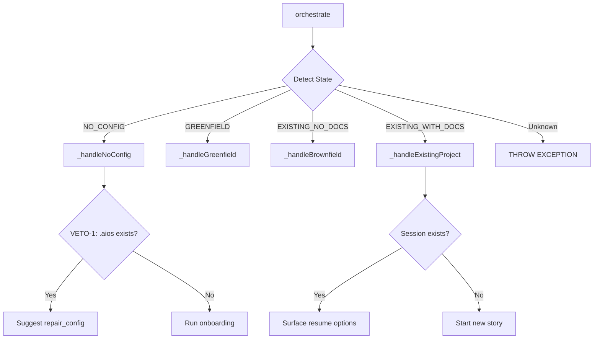
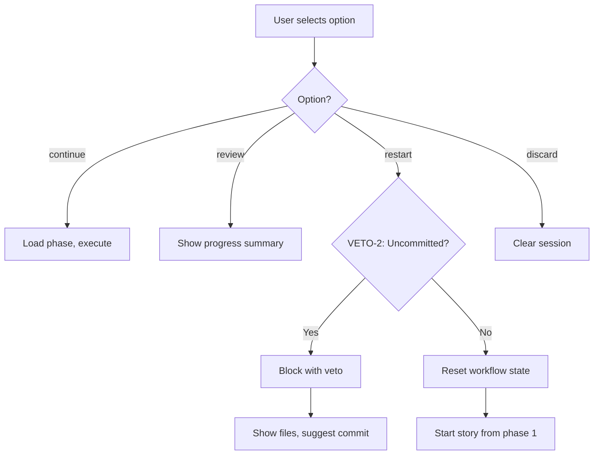
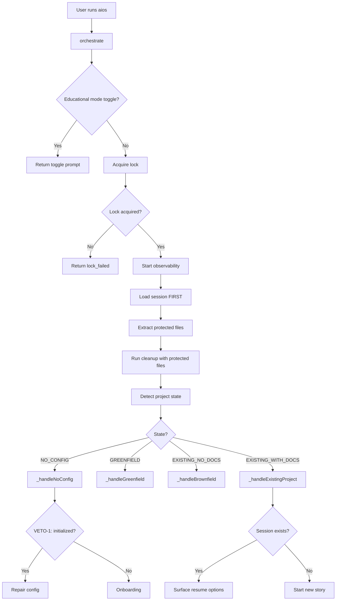
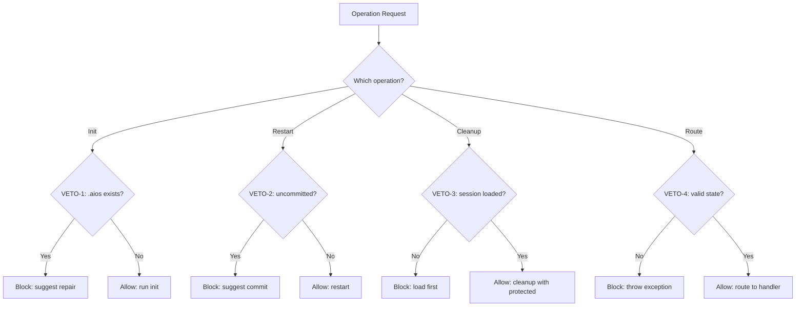

# BOB Decision Heuristics

> **BOB** (aios-master) - PM Agent e Orquestrador de Desenvolvimento

Este documento centraliza toda a lógica de tomada de decisão do BOB, facilitando debugging, extensão e onboarding de novos desenvolvedores.

---

## Table of Contents

1. [Overview](#overview)
2. [Core Philosophy](#core-philosophy)
3. [Project State Detection](#project-state-detection)
4. [Routing Decision Tree](#routing-decision-tree)
5. [Surface Conditions](#surface-conditions)
6. [Veto Conditions](#veto-conditions)
7. [Session Resume Logic](#session-resume-logic)
8. [Decision Flow Diagrams](#decision-flow-diagrams)
9. [Troubleshooting](#troubleshooting)

---

## Overview

### What is BOB?

BOB is the **PM Agent** and **Orchestrator** of the AIOS framework. Acting as a Product Manager, BOB:

- Detects project state (new, existing, configured, etc.)
- Routes execution to appropriate handlers
- Manages session state and recovery
- Decides when to surface decisions to users
- Enforces quality gates (veto conditions)
- Coordinates agent execution and workflows

### Key Responsibilities

| Responsibility | Location | Description |
|----------------|----------|-------------|
| **State Detection** | `detectProjectState()` | Classifies project into 4 states |
| **Routing** | `_routeByState()` | Directs to correct handler |
| **Session Management** | `_checkExistingSession()` | Crash recovery and resume |
| **Surfacing** | `shouldSurface()` | Decide user interaction vs auto-execution |
| **Veto Gates** | Various handlers | Safety checks preventing bad operations |

---

## Core Philosophy

BOB's decision-making follows these principles:

### 1. **Unidirectional Flow**
Once a decision is made, the process flows forward. No backtracking unless explicitly chosen by user.

### 2. **Measure Twice, Cut Once**
Critical decisions surface to user for confirmation. Destructive operations require explicit approval.

### 3. **Fail-Fast**
Invalid states throw exceptions immediately rather than continuing with undefined behavior.

### 4. **User Context First**
When user intent is ambiguous, ask. When clear, auto-execute with confidence.

### 5. **Graceful Degradation**
If checks fail (e.g., git check), fail-safe with sensible defaults rather than crash.

---

## Project State Detection

BOB classifies projects into **4 states** based on file system inspection.

### State Definitions

| State | Condition | Meaning | Handler |
|-------|-----------|---------|---------|
| `NO_CONFIG` | No `.aios/config.yaml` | Fresh project, needs init | `_handleNoConfig()` |
| `GREENFIELD` | Has config, no code | New project, start development | `_handleGreenfield()` |
| `EXISTING_NO_DOCS` | Has code, no AIOS docs | Brownfield discovery needed | `_handleBrownfield()` |
| `EXISTING_WITH_DOCS` | Has code AND docs | Resume existing work | `_handleExistingProject()` |

### Detection Algorithm

**Location:** `detectProjectState()` (bob-orchestrator.js:~400-460)

```javascript
detectProjectState(projectRoot) {
  const configPath = path.join(projectRoot, '.aios', 'config.yaml');
  const docsPath = path.join(projectRoot, 'docs');

  // State 1: No config → NO_CONFIG
  if (!fs.existsSync(configPath)) {
    return ProjectState.NO_CONFIG;
  }

  // State 2: Has config, check for code
  const hasCode = this._hasExistingCode(projectRoot);

  if (!hasCode) {
    // No code → GREENFIELD
    return ProjectState.GREENFIELD;
  }

  // State 3/4: Has code, check for docs
  const hasDocs = fs.existsSync(docsPath) && this._hasAIOSDocs(docsPath);

  if (hasDocs) {
    return ProjectState.EXISTING_WITH_DOCS; // Resume scenario
  } else {
    return ProjectState.EXISTING_NO_DOCS; // Brownfield discovery
  }
}
```

### Edge Cases

| Scenario | State | Rationale |
|----------|-------|-----------|
| `.aios/` exists but config missing | `NO_CONFIG` → **VETO-1** | Triggers repair path instead of init loop |
| Empty project with config | `GREENFIELD` | Config presence indicates intent, treat as greenfield |
| Code without AIOS structure | `EXISTING_NO_DOCS` | Needs brownfield discovery workflow |

---

## Routing Decision Tree

### Primary Router: `_routeByState()`

**Location:** bob-orchestrator.js:~901-921



### Handler Decision Points

#### 1. `_handleNoConfig()` - Onboarding vs Repair

**Veto Gate:** BOB-VETO-1 (Init Loop Prevention)

```javascript
if (this._isAiosInitialized()) {
  // .aios/ exists but config missing → REPAIR
  return {
    action: 'config_repair',
    data: {
      vetoCondition: 'aios_already_initialized',
      nextStep: 'repair_config',
    },
  };
}

// Fresh project → ONBOARDING
return {
  action: 'onboarding',
  data: { nextStep: 'run_aios_init' },
};
```

#### 2. `_handleExistingProject()` - Resume vs New

**Decision:** Session exists? → Surface resume options

```javascript
if (sessionCheck.hasSession) {
  const surfaceResult = this.surfaceChecker.shouldSurface({
    valid_options_count: 4,
    options_with_tradeoffs: sessionCheck.summary,
  });

  if (surfaceResult.should_surface) {
    return {
      action: 'surface',
      data: {
        options: ['continue', 'review', 'restart', 'discard'],
        summary: sessionCheck.formattedMessage,
      },
    };
  }
}
```

#### 3. `_handleBrownfield()` - Discovery Workflow

Delegates to `BrownfieldHandler` for:
1. Code analysis
2. Architecture documentation generation
3. Technical debt report
4. User decision: resolve debts vs add feature

#### 4. `_handleGreenfield()` - New Project Flow

Delegates to `GreenfieldHandler` for:
1. Epic/Story creation
2. Workflow initialization
3. Agent assignment

---

## Surface Conditions

### Philosophy: When to Ask vs Auto-Execute

BOB surfaces decisions when:
- ✅ Multiple valid options exist
- ✅ Trade-offs have meaningful impact
- ✅ User context is missing
- ✅ High-cost operation
- ❌ NOT when: trivial choice, single obvious path

### SurfaceChecker Algorithm

**Location:** `.aios-core/core/orchestration/surface-checker.js`

```javascript
shouldSurface(context) {
  const {
    valid_options_count = 0,
    user_context_missing = false,
    high_cost_operation = false,
    options_with_tradeoffs = null,
  } = context;

  // Rule 1: Multiple valid options → SURFACE
  if (valid_options_count >= 2) {
    return {
      should_surface: true,
      reason: 'multiple_valid_options',
    };
  }

  // Rule 2: Missing user context → SURFACE
  if (user_context_missing) {
    return {
      should_surface: true,
      reason: 'user_context_required',
    };
  }

  // Rule 3: High-cost operation → SURFACE
  if (high_cost_operation) {
    return {
      should_surface: true,
      reason: 'high_cost_confirmation',
    };
  }

  // Rule 4: Explicit trade-offs → SURFACE
  if (options_with_tradeoffs && valid_options_count > 1) {
    return {
      should_surface: true,
      reason: 'tradeoffs_present',
      tradeoffs: options_with_tradeoffs,
    };
  }

  // Default: auto-execute
  return {
    should_surface: false,
    reason: 'single_clear_path',
  };
}
```

### Surface Decision Matrix

| Context | Options | Trade-offs | User Context | Result |
|---------|---------|------------|--------------|--------|
| Resume session | 4 (continue/review/restart/discard) | Time vs clarity | Known | **SURFACE** |
| Init fresh project | 1 (run init) | None | Clear | **AUTO** |
| Delete uncommitted | 2 (proceed/cancel) | Data loss | Unknown | **SURFACE** |
| Retry failed test | 1 (retry) | Time cost | Clear | **AUTO** |

---

## Veto Conditions

**Veto gates** are **hard stops** that prevent invalid or dangerous operations.

### BOB-VETO-1: Init Loop Prevention

**Location:** `_handleNoConfig()` (bob-orchestrator.js:~936-946)

**Problem:** User runs `aios init` → config deleted → BOB suggests init again → infinite loop

**Solution:** Check if `.aios/` directory exists before suggesting init

```javascript
if (this._isAiosInitialized()) {
  return {
    action: 'config_repair',
    data: { vetoCondition: 'aios_already_initialized' },
  };
}
```

**Impact:** Prevents infinite loop, suggests repair instead

---

### BOB-VETO-2: Restart Confirmation Gate

**Location:** `handleSessionResume()` case 'restart' (bob-orchestrator.js:~764-784)

**Problem:** User restarts story → loses uncommitted work → poor UX

**Solution:** Check git status before allowing restart

```javascript
const workStatus = await this._checkUncommittedWork(result.story);

if (workStatus.hasChanges) {
  return {
    success: false,
    action: 'restart_blocked',
    data: {
      vetoCondition: 'uncommitted_changes',
      filesAffected: workStatus.files,
      suggestion: 'Commit ou stash suas mudanças antes de restart.',
    },
  };
}
```

**Impact:** Prevents work loss, guides user to commit first

---

### BOB-VETO-3: Cleanup Order Fix

**Location:** `orchestrate()` (bob-orchestrator.js:~592-609)

**Problem:** Cleanup runs BEFORE session load → race condition → files deleted while referenced in session

**Solution:** Load session FIRST, extract protected files, pass to cleanup

```javascript
// Load session FIRST
const sessionCheck = await this._checkExistingSession();

// Extract protected files
const protectedFiles = sessionCheck.hasSession && sessionCheck.state
  ? this._extractProtectedFiles(sessionCheck.state)
  : [];

// Cleanup WITH protected files
const cleanupResult = await this.dataLifecycleManager.runStartupCleanup({
  protectFiles: protectedFiles,
});
```

**Impact:** Prevents state corruption from cleanup race condition

---

### BOB-VETO-4: Unknown State Exception

**Location:** `_routeByState()` default case (bob-orchestrator.js:~915-920)

**Problem:** Unknown state returns error object → execution continues with invalid state → unpredictable behavior

**Solution:** Throw exception immediately (fail-fast)

```javascript
default:
  const validStates = Object.values(ProjectState).join(', ');
  const errorMsg = `FATAL: Unknown project state '${projectState}'. Valid states: ${validStates}`;
  this._log(errorMsg, 'error');
  throw new Error(errorMsg);
```

**Impact:** Prevents undefined behavior, forces investigation

---

## Session Resume Logic

### Resume Options

When user returns to existing session, 4 options presented:

| Option | Action | Use Case | Veto Check |
|--------|--------|----------|------------|
| `continue` | Resume from last phase | Normal flow continuation | None |
| `review` | Show current progress | User wants visibility | None |
| `restart` | Start story from beginning | Wants fresh start | **VETO-2** |
| `discard` | Delete session, start new | Abandon current work | None |

### Resume Decision Flow



### Code Reference

**Location:** `handleSessionResume()` (bob-orchestrator.js:~749-800)

```javascript
async handleSessionResume(option) {
  const result = await this.sessionState.handleResumeOption(option);

  switch (result.action) {
    case 'continue':
      return {
        success: true,
        action: 'execute_story',
        storyPath: this._resolveStoryPath(result.story),
        resumePhase: result.phase,
      };

    case 'restart':
      // VETO-2 check
      const workStatus = await this._checkUncommittedWork(result.story);
      if (workStatus.hasChanges) {
        return { success: false, action: 'restart_blocked', /* ... */ };
      }
      return { action: 'restart', storyPath: /* ... */ };

    // ... other cases
  }
}
```

---

## Decision Flow Diagrams

### High-Level Orchestration Flow



### Veto Conditions Flow



---

## Troubleshooting

### Common Scenarios

#### 1. "BOB keeps asking me to init even though I already did"

**Symptom:** Infinite loop of init suggestions

**Diagnosis:** VETO-1 not triggering, or `.aios/` doesn't exist

**Fix:**
1. Check if `.aios/` directory exists: `ls -la .aios`
2. If missing, run `aios init` properly
3. If exists but config missing, BOB should suggest repair (VETO-1)

**Code:** `_handleNoConfig()` → `_isAiosInitialized()` check

---

#### 2. "BOB let me restart and I lost my uncommitted work"

**Symptom:** Work loss after restart

**Diagnosis:** VETO-2 not triggering, or git check failed

**Fix:**
1. Check git status: `git status --porcelain`
2. Verify `_checkUncommittedWork()` is being called
3. Check logs for veto block message

**Code:** `handleSessionResume()` case 'restart' → VETO-2 check

---

#### 3. "Session state corrupted after crash"

**Symptom:** Undefined behavior, missing files

**Diagnosis:** VETO-3 race condition, cleanup deleted session files

**Fix:**
1. Check if cleanup ran before session load
2. Verify `_extractProtectedFiles()` includes all session files
3. Check cleanup logs for deleted files

**Code:** `orchestrate()` lines 592-609 → session load order

---

#### 4. "BOB crashed with FATAL: Unknown project state"

**Symptom:** Exception thrown, process exits

**Diagnosis:** VETO-4 triggered, invalid state detected

**Fix:**
1. Check error message for actual state value
2. Verify state detection logic in `detectProjectState()`
3. Ensure file system matches expected structure

**Code:** `_routeByState()` default case → exception throw

---

#### 5. "BOB asks me about trivial decisions"

**Symptom:** Too many user prompts for simple choices

**Diagnosis:** Surface conditions too aggressive

**Fix:**
1. Review `shouldSurface()` logic in surface-checker.js
2. Adjust thresholds for `valid_options_count`
3. Consider trade-off impact (P1: BOB-FLOW-2)

**Code:** `surface-checker.js` → `shouldSurface()` rules

---

### Debug Checklist

When debugging BOB decisions:

- [ ] Check logs for decision points: `this._log()`
- [ ] Verify project state detection: `detectProjectState()`
- [ ] Review surface conditions: `shouldSurface()` result
- [ ] Check veto gates: Search for "veto" in logs
- [ ] Inspect session state: `.aios/session-state.json`
- [ ] Verify lock ownership: `.aios/locks/`

---

### Code Reference Quick Links

| Component | File | Lines | Description |
|-----------|------|-------|-------------|
| State Detection | bob-orchestrator.js | ~400-460 | detectProjectState() |
| Routing | bob-orchestrator.js | ~901-921 | _routeByState() |
| Surface Logic | surface-checker.js | ~32-80 | shouldSurface() |
| VETO-1 | bob-orchestrator.js | ~936-946 | Init loop prevention |
| VETO-2 | bob-orchestrator.js | ~764-784 | Restart confirmation |
| VETO-3 | bob-orchestrator.js | ~592-609 | Cleanup order |
| VETO-4 | bob-orchestrator.js | ~915-920 | Unknown state exception |
| Session Resume | bob-orchestrator.js | ~749-800 | handleSessionResume() |

---

**Document Version:** 1.0
**Last Updated:** 2026-02-15
**Related Stories:** BOB-VETO-1, BOB-VETO-2, BOB-VETO-3, BOB-VETO-4, BOB-DOC-1
**Maintained by:** @dev, @architect
