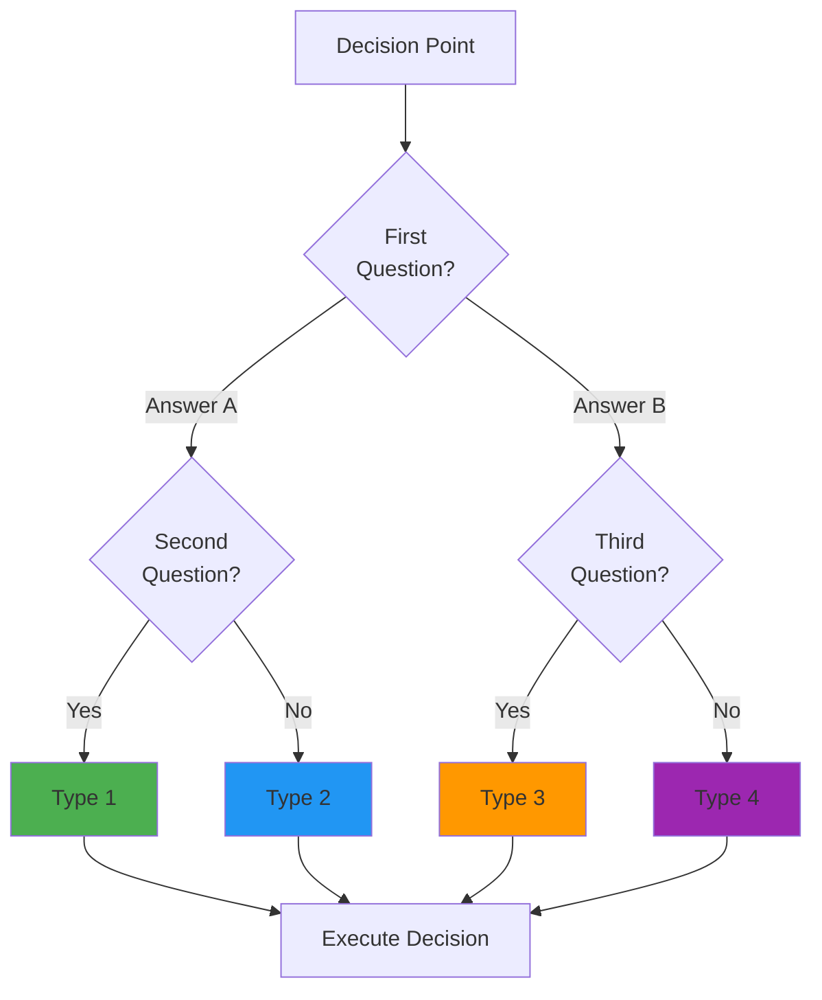

# Decision Tree Output Template

Use this template structure when generating decision tree documentation.
Replace all `[bracketed]` placeholders with actual content.

---

## Markdown Format

````markdown
# [Process Name] Decision Tree

**Date:** [YYYY-MM-DD]
**Version:** 1.0.0
**Status:** Draft | Review | Standard
**Author:** [Name or "AI-Generated"]
**Domain:** [technical | business | operational | creative | etc.]

---

## Purpose

[1-2 paragraph description of what this decision tree helps decide and why it matters]

---

## The [N] Decision Types

### 1. [Type Name]

**Definition:** [Clear, concise definition]

**When to use:**
- [Condition 1]
- [Condition 2]
- [Condition 3]

**Examples:**
- [Concrete example 1]
- [Concrete example 2]
- [Concrete example 3]

**Characteristics:**
| Attribute | Value |
|-----------|-------|
| [Metric 1] | [Value] |
| [Metric 2] | [Value] |
| [Metric 3] | [Value] |

---

[Repeat for each type...]

---

## Decision Tree



---

## Detailed Decision Criteria

### Criterion 1: [Name]

**Question:** [The question to ask]

**Examples:**

| Scenario | Answer | Why? |
|----------|--------|------|
| [Scenario 1] | [Yes/No/Value] | [Explanation] |
| [Scenario 2] | [Yes/No/Value] | [Explanation] |
| [Scenario 3] | [Yes/No/Value] | [Explanation] |

**If YES -> [Path]**
**If NO -> [Path]**

---

[Repeat for each criterion...]

---

## Comparison Matrix

| Attribute | Type 1 | Type 2 | Type 3 | Type N |
|-----------|--------|--------|--------|--------|
| [Attr 1] | [Val] | [Val] | [Val] | [Val] |
| [Attr 2] | [Val] | [Val] | [Val] | [Val] |
| [Attr 3] | [Val] | [Val] | [Val] | [Val] |
| **Best For** | [Use case] | [Use case] | [Use case] | [Use case] |

---

## Cost-Benefit Analysis (if applicable)

### Option Comparison

| Type | Cost | Speed | Quality | Risk | Best When |
|------|------|-------|---------|------|-----------|
| [Type 1] | [$] | [Fast/Slow] | [High/Med/Low] | [High/Med/Low] | [Scenario] |
| [Type 2] | [$] | [Fast/Slow] | [High/Med/Low] | [High/Med/Low] | [Scenario] |

### ROI/Trade-off Examples

**Example 1: [Scenario Name]**

Option A: [Type 1]
  - Cost: [value]
  - Time: [value]
  - Outcome: [description]

Option B: [Type 2]
  - Cost: [value]
  - Time: [value]
  - Outcome: [description]

Decision: [Recommendation with rationale]

---

## Hybrid Strategies (if applicable)

### Strategy 1: [Name]

**Use Case:** [When to combine approaches]

**How it works:**
1. [Step 1]
2. [Step 2]
3. [Step 3]

**Example:**
[Concrete example of hybrid approach]

---

## Real-World Examples

### Example 1: [Scenario Name]

**Context:** [Brief description]

**Decision Process:**
1. [Criterion 1]: [Answer] -> [Path taken]
2. [Criterion 2]: [Answer] -> [Path taken]
3. **Result:** [Final decision type]

**Rationale:** [Why this was the right choice]

---

[Additional examples...]

---

## Quick Reference Checklist

Use this checklist for rapid decision-making:

### Step 1: Quick Filters
- [ ] [First filter question]
  - YES -> [Path]
  - NO -> Continue

- [ ] [Second filter question]
  - YES -> [Path]
  - NO -> Continue

### Step 2: Main Decision
- [ ] [Primary decision question]
  - [Answer A] -> [Type 1]
  - [Answer B] -> [Type 2]
  - [Answer C] -> [Type 3]

### Step 3: Validation
- [ ] [Confirmation question]
  - If uncertain -> [Fallback/escalation path]

---

## Common Mistakes to Avoid

1. **Mistake:** [Description]
   - **Why it happens:** [Explanation]
   - **Correct approach:** [Solution]

2. **Mistake:** [Description]
   - **Why it happens:** [Explanation]
   - **Correct approach:** [Solution]

---

## Version History

| Version | Date | Author | Changes |
|---------|------|--------|---------|
| 1.0.0 | [Date] | [Author] | Initial decision tree |

---

## Related Documents

- [Document 1] - [Brief description]
- [Document 2] - [Brief description]

---

**END OF DECISION TREE**
````

---

## YAML Format

When the user requests YAML output:

```yaml
decision_tree:
  name: "[Process Name]"
  version: "1.0.0"
  domain: "[domain]"

  types:
    - id: "type_1"
      name: "[Name]"
      definition: "[Definition]"
      when_to_use:
        - "[Condition 1]"
        - "[Condition 2]"
      examples:
        - "[Example 1]"
        - "[Example 2]"
      metrics:
        cost: "[value]"
        speed: "[value]"
        quality: "[value]"

  criteria:
    - id: "criterion_1"
      question: "[Question]"
      type: "boolean | multi-choice | numeric"
      paths:
        - answer: "[Answer]"
          next: "[type_id or criterion_id]"

  flowchart:
    start: "criterion_1"
    nodes:
      - id: "criterion_1"
        type: "decision"
        question: "[Question]"
        edges:
          - label: "[Answer]"
            target: "[Next node]"
```

---

## JSON Format

When the user requests JSON output:

```json
{
  "decision_tree": {
    "metadata": {
      "name": "[Process Name]",
      "version": "1.0.0",
      "domain": "[domain]",
      "created": "[date]"
    },
    "types": [
      {
        "id": "type_1",
        "name": "[Name]",
        "definition": "[Definition]",
        "when_to_use": ["[Condition 1]", "[Condition 2]"],
        "examples": ["[Example 1]", "[Example 2]"],
        "metrics": {
          "cost": "[value]",
          "speed": "[value]"
        }
      }
    ],
    "criteria": [
      {
        "id": "criterion_1",
        "question": "[Question]",
        "type": "boolean",
        "paths": {
          "yes": "[next_node]",
          "no": "[next_node]"
        }
      }
    ]
  }
}
```
