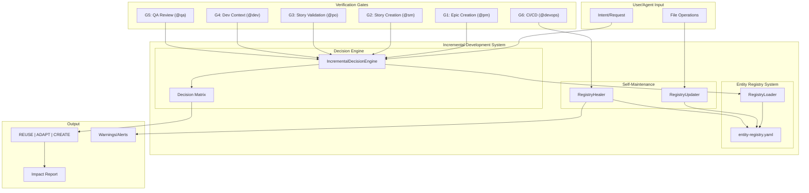
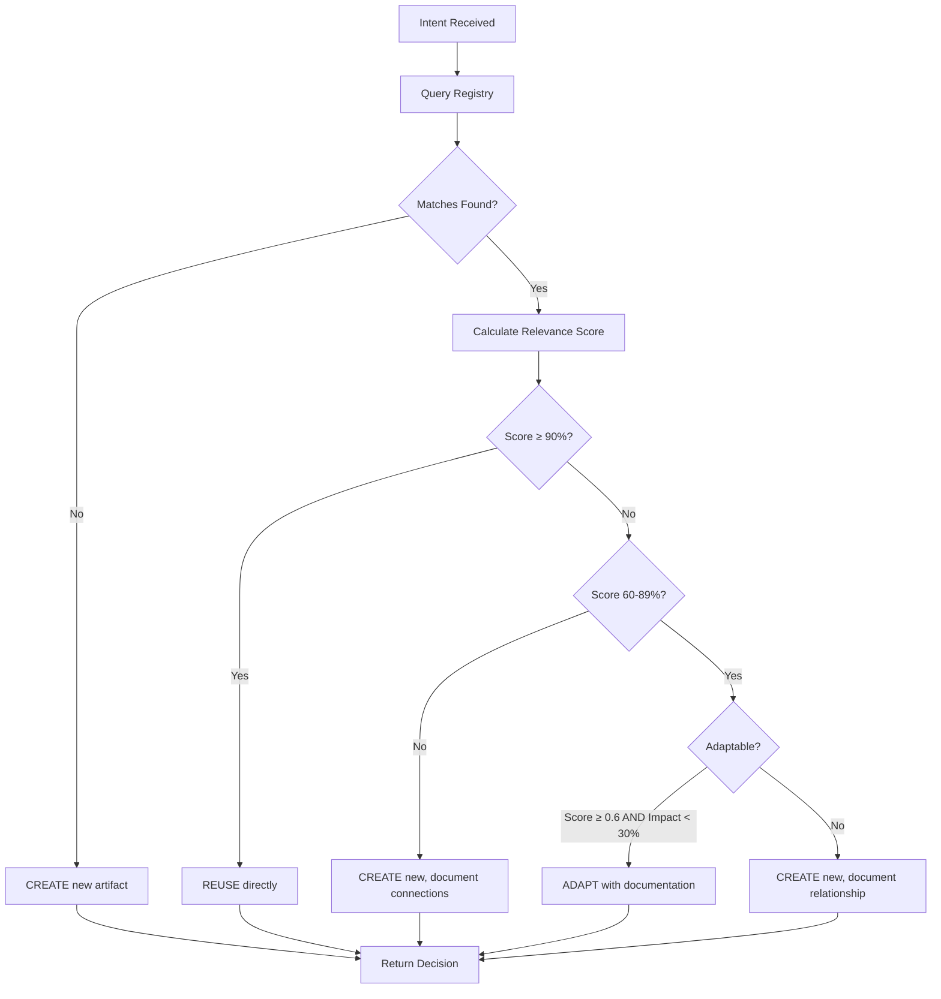
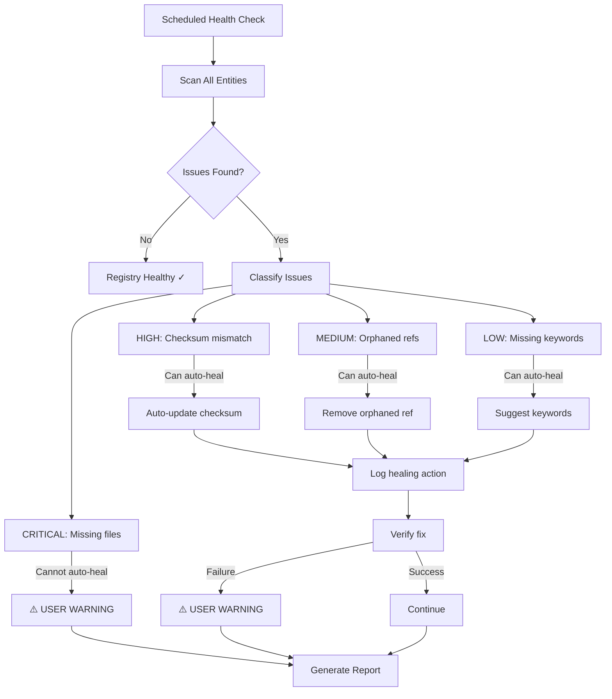

# ADR: Incremental Development System (IDS)

> **EN** | [PT](../../pt/architecture/adr/adr-ids-001-incremental-development-system.md) | [ES](../../es/architecture/adr/adr-ids-001-incremental-development-system.md)

---

**ADR ID:** ADR-IDS-001
**Status:** Accepted
**Created:** 2026-02-05
**Author:** @architect (Aria) via @po (Pax)
**Story:** AIOS-TRACE-001, AIOS-XREF-001
**Deciders:** @architect, @po, @pm, Tech Lead

---

## Context

### Problem Statement

During the development of AIOS framework, a critical observation emerged from the AIOS-TRACE-001 (Agent Execution Traces) and AIOS-XREF-001 (Cross-Reference Analysis) investigations:

> **"Humans develop incrementally; AI agents develop generationally"**

This manifests as:
- **Human developers** start from existing code, often adding just a few lines or adapting existing functions
- **AI agents** tend to generate new code blocks, scripts, and files rather than reusing/adapting existing artifacts

This pattern creates:
1. **Duplication** - Multiple similar scripts/tasks solving the same problem
2. **Drift** - Implementations diverge over time
3. **Maintenance burden** - More code to maintain with less reuse
4. **Inconsistency** - Different patterns for similar problems
5. **Technical debt** - Accumulation of near-duplicate artifacts

### Mapped Artifact Scale

The AIOS-XREF-001 analysis mapped **~881 artifacts** across the framework:

| Category | Count | Examples |
|----------|-------|----------|
| Tasks | ~160 | create-doc.md, execute-checklist.md |
| Templates | 44 | story-tmpl.yaml, prd-tmpl.md |
| Checklists | 16 | qa-master-checklist.md |
| Scripts | ~27 | greeting-builder.js, codebase-mapper.js |
| Core Modules | ~45 | orchestration, memory, health-check |
| Data Files | ~50 | core-config.yaml, agent-config-requirements.yaml |
| Agents | 12 | @dev, @qa, @architect, etc. |
| Workflows | ~80 | multi-step workflow definitions |

Without systematic tracking, new development risks recreating instead of reusing.

### Requirements

1. **Entity Awareness** - System must know all existing artifacts
2. **Incremental Decision Support** - Guide agents toward reuse/adaptation first
3. **Impact Analysis** - Understand how changes affect related artifacts
4. **Self-Updating** - Registry must stay current without manual maintenance
5. **Self-Healing** - Auto-fix simple integrity issues; warn on complex ones
6. **Gate Integration** - Verify incremental thinking at multiple workflow points
7. **Constitution Alignment** - Support Article IV (No Invention) principle

---

## Decision

We will implement an **Incremental Development System (IDS)** with three core components:

### 1. Entity Registry System (ERS)

**Decision:** Create a centralized, queryable registry of all framework entities.

**Structure:**

```yaml
# .aios-core/data/entity-registry.yaml
metadata:
  version: "1.0.0"
  lastUpdated: "2026-02-05T10:30:00Z"
  entityCount: 881
  checksumAlgorithm: "sha256"

entities:
  tasks:
    greeting-preference-manager:
      path: ".aios-core/development/scripts/greeting-preference-manager.js"
      type: script
      purpose: "Manage agent greeting verbosity preferences"
      keywords: ["greeting", "preference", "config", "verbosity"]
      usedBy:
        - greeting-builder.js
        - generate-greeting.js
      dependencies:
        - config-loader.js
        - core-config.yaml
      adaptability:
        score: 0.8  # 0-1 scale
        constraints:
          - "API signature must remain compatible"
          - "Must support all 12 agents"
        extensionPoints:
          - "Add new preference levels"
          - "Support per-command preferences"
      checksum: "sha256:abc123..."
      lastVerified: "2026-02-05T10:30:00Z"

  templates:
    story-tmpl:
      path: ".aios-core/product/templates/story-tmpl.yaml"
      type: template
      purpose: "Standard story document template"
      keywords: ["story", "agile", "user story", "AC"]
      usedBy:
        - create-story.md
        - create-brownfield-story.md
      dependencies: []
      adaptability:
        score: 0.3  # Low - template changes affect all stories
        constraints:
          - "Must maintain backward compatibility"
          - "Requires migration plan for changes"
        extensionPoints:
          - "Add optional sections"
          - "Add new metadata fields"
      checksum: "sha256:def456..."
      lastVerified: "2026-02-05T10:30:00Z"

categories:
  - id: tasks
    description: "Executable task workflows"
    basePath: ".aios-core/development/tasks/"
  - id: templates
    description: "Document and code templates"
    basePath: ".aios-core/product/templates/"
  - id: scripts
    description: "Utility and infrastructure scripts"
    basePaths:
      - ".aios-core/development/scripts/"
      - ".aios-core/infrastructure/scripts/"
  - id: checklists
    description: "Validation and review checklists"
    basePath: ".aios-core/product/checklists/"
  - id: modules
    description: "Core framework modules"
    basePath: ".aios-core/core/"
  - id: agents
    description: "Agent persona definitions"
    basePath: ".aios-core/development/agents/"
```

**Rationale:**
- Centralized truth for all artifacts
- Queryable by keywords, type, purpose
- Tracks relationships (usedBy, dependencies)
- Quantifies adaptability to guide decisions
- Checksums enable integrity verification

**Registry Scalability Strategy:**

The single-file approach works for v1 (up to ~1000 entities), with a migration path to sharded structure:

```yaml
registry_structure:
  v1:
    type: "single-file"
    path: ".aios-core/data/entity-registry.yaml"
    max_entities: 1000
    load_strategy: "full-load-into-memory"

  v2_trigger:
    condition: "entityCount > 1000"
    migration: "automatic"

  v2:
    type: "sharded-by-category"
    paths:
      index: ".aios-core/data/entity-registry/index.yaml"
      tasks: ".aios-core/data/entity-registry/tasks.yaml"
      templates: ".aios-core/data/entity-registry/templates.yaml"
      scripts: ".aios-core/data/entity-registry/scripts.yaml"
      modules: ".aios-core/data/entity-registry/modules.yaml"
    load_strategy: "lazy-load-per-category"
    cache_ttl_seconds: 300
```

**Rationale:**
- v1 simplicity sufficient for current ~881 entities
- Sharding by category enables partial loading
- Lazy loading reduces memory footprint at scale
- Automatic migration prevents manual intervention

### 2. Incremental Decision Engine (IDE)

**Decision:** Implement a decision engine that evaluates reuse vs adapt vs create.

**Algorithm:**

```
INPUT: Intent (what the user/agent wants to accomplish)
OUTPUT: Decision (REUSE | ADAPT | CREATE) + rationale

PROCESS:
1. Parse intent into keywords + purpose
2. Query ERS for matching entities (semantic + keyword search)
3. For each match, calculate:
   - Relevance score (0-1)
   - Direct usability (can use as-is?)
   - Adaptability (can modify within constraints?)
   - Impact scope (what would change affect?)
4. Apply decision matrix
5. Return ranked recommendations with rationale
```

**Decision Matrix:**

| Match Score | Adaptability | Impact Scope | Decision |
|-------------|--------------|--------------|----------|
| ≥90% | Any | Any | **REUSE** directly |
| 60-89% | ≥0.6 | <30%* entities | **ADAPT** with documentation |
| 60-89% | <0.6 | Any | **CREATE** new, document relationship |
| <60% | Any | Any | **CREATE** new, analyze connections |

> **\*30% Threshold Calibration (Roundtable Adjustment #2):**
> The 30% adaptation impact threshold is an **initial empirical value** subject to calibration after 90 days of operation. Validation criteria:
> - **Success rate of ADAPTs:** Adaptations that did NOT require subsequent refactoring
> - **Developer feedback:** Threshold perceived as too low (forcing unnecessary CREATE) or too high (creating Frankenstein adaptations)
> - **Cost comparison:** Actual time spent on ADAPT vs CREATE in borderline cases (25-35% impact)
>
> If data shows 30% is suboptimal, adjust in increments of 5% (to 25% or 35%) and re-evaluate after 30 days.

**Semantic Matching Algorithm:**

The decision engine uses a **TF-IDF keyword-based matching** approach as the primary algorithm, with fuzzy matching as fallback:

```yaml
matching_algorithm:
  version: "1.0"
  primary: "keyword-tf-idf"
  fallback: "fuzzy-match"

  keyword_extraction:
    method: "stop-word-filtered-tokenization"
    min_keyword_length: 3
    max_keywords_per_entity: 15
    stop_words: ["the", "a", "an", "is", "are", "for", "to", "of", "in", "on"]

  scoring:
    keyword_overlap_weight: 0.6
    purpose_similarity_weight: 0.4
    threshold_minimum: 0.4  # Below this, no match returned

  performance:
    cache_ttl_seconds: 300
    max_results: 20
    index_rebuild_trigger: "entityCount change > 10%"
```

**Rationale for TF-IDF over Embeddings:**
- No external API dependency (local execution)
- Predictable and debuggable results
- Sufficient for keyword-based artifact matching
- Low latency (<50ms for 1000 entities)
- Embeddings can be added in v2 if needed

### Performance Requirements (Roundtable Adjustment #1)

Registry and Decision Engine operations must meet strict SLAs to ensure developer adoption:

| Operation | SLA Target | Degradation Action |
|-----------|------------|-------------------|
| Semantic search (TF-IDF) | **< 100ms** | Alert + optimize index |
| Full registry scan | < 500ms | Trigger cleanup job |
| Match score calculation | < 50ms per entity | Cache warm entities |
| Gate verification (G4-G6) | < 2s total | Fallback to warn-only |

**Rationale:** If registry queries exceed 100ms, developers will skip checking and create new artifacts - defeating the purpose of IDS. Performance is not optional; it's a behavioral requirement.

**Self-Healing Integration:** Add performance monitoring to Self-Healing Registry. Trigger auto-optimization when SLA breached 3+ times in 1 hour.

```yaml
performance_monitoring:
  enabled: true
  metrics:
    - name: "query_latency_p95"
      threshold_ms: 100
      alert_after_breaches: 3
      breach_window_minutes: 60
      action: "trigger_index_optimization"

    - name: "cache_hit_rate"
      threshold_percent: 70
      alert_below: true
      action: "expand_cache_analyze_patterns"

    - name: "index_staleness"
      max_age_minutes: 60
      action: "rebuild_tfidf_vectors"
```

**Implementation:**

```javascript
// .aios-core/core/ids/incremental-decision-engine.js
class IncrementalDecisionEngine {
  constructor(registry) {
    this.registry = registry;
  }

  async analyze(intent, context = {}) {
    // 1. Find relevant entities
    const matches = await this.findRelevantEntities(intent);

    // 2. Evaluate each match
    const evaluations = matches.map(entity => ({
      entity,
      relevanceScore: this.calculateRelevance(entity, intent),
      canUseDirectly: this.evaluateDirectUse(entity, context),
      canAdapt: this.evaluateAdaptability(entity, context),
      adaptationImpact: this.calculateImpact(entity),
      recommendation: null // Filled below
    }));

    // 3. Apply decision matrix
    evaluations.forEach(e => {
      e.recommendation = this.applyDecisionMatrix(e);
    });

    // 4. Generate overall decision
    return {
      intent,
      matches: evaluations.sort((a, b) => b.relevanceScore - a.relevanceScore),
      decision: this.generateDecision(evaluations),
      rationale: this.generateRationale(evaluations)
    };
  }

  applyDecisionMatrix(evaluation) {
    const { relevanceScore, canAdapt, adaptationImpact } = evaluation;

    if (relevanceScore >= 0.9) {
      return { action: 'REUSE', confidence: 'high' };
    }

    if (relevanceScore >= 0.6 && canAdapt.score >= 0.6 && adaptationImpact.percentage < 30) {
      return { action: 'ADAPT', confidence: 'medium' };
    }

    return { action: 'CREATE', confidence: relevanceScore >= 0.6 ? 'medium' : 'low' };
  }
}
```

### CREATE Decision Requirements (Roundtable Adjustment #4)

When Decision Engine outputs **CREATE** (match < 60%), additional requirements apply to capture innovation and prevent registry stagnation:

#### 1. Justification Required

Every CREATE decision must include documented justification:

```yaml
create_justification:
  required_fields:
    - evaluated_patterns: ["list of patterns checked"]
    - rejection_reasons: "Why none of the patterns fit"
    - new_capability: "What new capability this provides"
  template: |
    Existing patterns [X, Y, Z] were evaluated. None fits because:
    - Pattern X: [specific reason - e.g., "lacks webhook support"]
    - Pattern Y: [specific reason - e.g., "tied to specific agent"]
    Created entity provides: [new capability description]
```

#### 2. 30-Day Review Trigger

Automated review task created for every CREATE:

```yaml
create_review_workflow:
  trigger: "CREATE decision executed"
  delay_days: 30
  task:
    title: "Review new entity [name] for pattern promotion"
    assignee: "@architect"
    includes:
      - usage_metrics: "How many times referenced in 30 days"
      - reuse_candidates: "Similar entities created after this one"
      - promotion_recommendation: "Promote | Archive | Keep as-is"
```

#### 3. Promotion Pathway

```
CREATE → Track Usage (30 days) → Review
                                   ↓
                         Used 3+ times? → Promote to first-class pattern
                                   ↓
                         Used 1-2 times? → Keep, monitor 30 more days
                                   ↓
                         Never reused? → Archive candidate
```

#### 4. Innovation Capture Metric

Track CREATE quality over time:

| Metric | Target | Interpretation |
|--------|--------|----------------|
| CREATEs promoted to patterns | >30% | Good judgment on what's truly new |
| CREATEs archived (never reused) | <40% | Acceptable exploration rate |
| CREATEs still pending review | <20% | Reviews happening on schedule |

If promotion rate falls below 10%, review CREATE approval process (possibly too permissive).

### 3. Self-Updating & Self-Healing Registry

**Decision:** Implement automated registry maintenance with two mechanisms.

#### Self-Updating (Hooks)

File system hooks automatically update the registry when:
- Files are created, modified, or deleted
- Git commits include relevant paths
- Agents complete tasks affecting artifacts

```javascript
// .aios-core/core/ids/registry-updater.js
class RegistryUpdater {
  constructor(registry) {
    this.registry = registry;
    this.watchPaths = [
      '.aios-core/development/',
      '.aios-core/core/',
      '.aios-core/product/',
      '.aios-core/infrastructure/'
    ];
  }

  async onFileChange(event, path) {
    switch (event) {
      case 'create':
        await this.registerNewEntity(path);
        break;
      case 'modify':
        await this.updateEntityChecksum(path);
        break;
      case 'delete':
        await this.removeEntity(path);
        break;
    }

    await this.updateRelationships(path);
    await this.updateTimestamp();
  }
}
```

**Concurrency & Locking Strategy:**

To prevent race conditions when multiple processes update the registry:

```yaml
concurrency:
  mechanism: "file-locking"
  library: "proper-lockfile"
  config:
    lock_file: ".aios-core/data/.entity-registry.lock"
    timeout_ms: 5000
    retry_count: 3
    retry_delay_ms: 100
    stale_threshold_ms: 10000

  operations:
    read: "shared-lock"      # Multiple readers allowed
    write: "exclusive-lock"  # Single writer
    health_check: "no-lock"  # Read-only snapshot

  conflict_resolution:
    strategy: "last-write-wins"
    audit_log: true
    merge_on_conflict: false  # Too complex for v1
```

**Implementation:**

```javascript
// .aios-core/core/ids/registry-lock.js
const lockfile = require('proper-lockfile');

class RegistryLock {
  constructor(registryPath) {
    this.registryPath = registryPath;
    this.lockOptions = {
      stale: 10000,
      retries: { retries: 3, minTimeout: 100, maxTimeout: 1000 }
    };
  }

  async withLock(operation) {
    const release = await lockfile.lock(this.registryPath, this.lockOptions);
    try {
      return await operation();
    } finally {
      await release();
    }
  }
}
```

**Rationale:**
- `proper-lockfile` is battle-tested for Node.js file locking
- Stale lock detection prevents deadlocks
- Retry mechanism handles transient failures
- Audit log tracks concurrent access patterns

#### Self-Healing (Expanded Scope - Roundtable Adjustment #6)

The Self-Healing Registry handles **three categories** of issues, not just data integrity:

##### A. Data Integrity (Original Scope)
- Checksum validation
- Relationship consistency
- Orphan detection

##### B. Performance Integrity (NEW)
- Query latency monitoring
- Index optimization triggers
- Cache invalidation management
- TF-IDF index rebuild scheduling

| Metric | Threshold | Auto-Action |
|--------|-----------|-------------|
| Avg query time | > 100ms for 5min | Trigger index optimization |
| Cache hit rate | < 70% | Expand cache, analyze access patterns |
| Index staleness | > 1 hour since rebuild | Rebuild TF-IDF vectors |

##### C. Quality Integrity (NEW)
- Duplicate detection (entities with >95% similarity)
- Stale entity detection (not referenced in 90 days)
- Low-value entity detection (created but never reused after 60 days)

| Issue | Detection | Resolution |
|-------|-----------|------------|
| Near-duplicate | TF-IDF similarity > 95% | Alert + suggest merge |
| Stale entity | 0 references in 90 days | Flag as archive candidate |
| False CREATE | Created, never reused, 60 days old | Queue for deprecation review |

Background process validates registry integrity and auto-fixes simple issues:

```javascript
// .aios-core/core/ids/registry-healer.js
class RegistryHealer {
  constructor(registry) {
    this.registry = registry;
    this.healingRules = [
      { id: 'missing-file', severity: 'critical', autoHeal: false },
      { id: 'checksum-mismatch', severity: 'high', autoHeal: true },
      { id: 'orphaned-reference', severity: 'medium', autoHeal: true },
      { id: 'missing-keywords', severity: 'low', autoHeal: true },
      { id: 'outdated-usedBy', severity: 'medium', autoHeal: true }
    ];
  }

  async runHealthCheck() {
    const issues = [];

    for (const [id, entity] of Object.entries(this.registry.entities)) {
      // Check file exists
      if (!await this.fileExists(entity.path)) {
        issues.push({
          entityId: id,
          rule: 'missing-file',
          severity: 'critical',
          autoHealable: false,
          message: `File not found: ${entity.path}`
        });
        continue;
      }

      // Check checksum
      const currentChecksum = await this.calculateChecksum(entity.path);
      if (currentChecksum !== entity.checksum) {
        issues.push({
          entityId: id,
          rule: 'checksum-mismatch',
          severity: 'high',
          autoHealable: true,
          message: `Checksum changed for ${entity.path}`,
          healAction: () => this.updateChecksum(id, currentChecksum)
        });
      }

      // Check usedBy references still valid
      for (const ref of entity.usedBy || []) {
        if (!await this.referenceExists(ref)) {
          issues.push({
            entityId: id,
            rule: 'orphaned-reference',
            severity: 'medium',
            autoHealable: true,
            message: `Orphaned usedBy reference: ${ref}`,
            healAction: () => this.removeReference(id, 'usedBy', ref)
          });
        }
      }
    }

    return issues;
  }

  async heal(issues, options = { autoOnly: true }) {
    const results = { healed: [], skipped: [], failed: [] };

    for (const issue of issues) {
      if (!issue.autoHealable && options.autoOnly) {
        results.skipped.push({
          issue,
          reason: 'Requires manual intervention',
          action: 'USER_WARNING'
        });
        continue;
      }

      try {
        await issue.healAction();
        results.healed.push(issue);
      } catch (error) {
        results.failed.push({ issue, error });
      }
    }

    // Emit warnings for skipped issues
    if (results.skipped.length > 0) {
      this.emitWarnings(results.skipped);
    }

    return results;
  }

  emitWarnings(skippedIssues) {
    // Integrate with AIOS notification system
    for (const { issue, reason } of skippedIssues) {
      console.warn(`[IDS Self-Healing] WARNING: ${issue.message}`);
      console.warn(`  → Reason: ${reason}`);
      console.warn(`  → Action required: Manual verification`);
    }
  }
}
```

### 4. Six Verification Gates

**Decision:** Integrate IDS verification at six workflow points.

| Gate | Trigger | Agent | Verification |
|------|---------|-------|--------------|
| G1 | Epic Creation | @pm | "What existing entities relate to this epic?" |
| G2 | Story Creation | @sm | "Which tasks/templates already exist for this?" |
| G3 | Story Validation | @po | "Do referenced tasks exist? Is there duplication?" |
| G4 | Dev Context | @dev | "Before creating, have you checked the registry?" |
| G5 | QA Review | @qa | "Could created code have reused existing artifacts?" |
| G6 | CI/CD | @devops | Automated registry sync + integrity check |

#### Gate Automation Classification (Roundtable Adjustment #3)

**Critical Requirement:** Gates G4-G6 MUST be fully automated. Manual approval at execution gates creates unacceptable friction and leads to workarounds.

| Gate | Agent | Type | Latency Target | Blocking Behavior |
|------|-------|------|----------------|-------------------|
| G1 | @pm | Human-in-loop | Async (< 24h) | Advisory only |
| G2 | @sm | Human-in-loop | Async (< 24h) | Advisory only |
| G3 | @po | Human-in-loop | Async (< 4h) | Soft block (can override) |
| G4 | @dev | **Automated** | < 2s | **Informational** (no block) |
| G5 | @qa | **Automated** | < 30s | **Blocks merge** if violation |
| G6 | @devops | **Automated** | < 60s (CI/CD) | **Blocks merge** if critical |

**Gate Behavior Details:**

- **G4 (@dev) - Context Injection:** Automated webhook delivers matching patterns when story is assigned. No blocking - informational only, but **logged for metrics**.
- **G5 (@qa) - PR Validation:** Automated check during PR review. Blocks merge if new entity created without registry entry or justification.
- **G6 (@devops) - CI/CD Pipeline:** Validates registry consistency, runs TF-IDF duplicate detection. Fails build only on critical violations; warnings for medium/low.

**Gate Implementation:**

```javascript
// .aios-core/core/ids/verification-gates.js
class VerificationGate {
  constructor(gateId, engine) {
    this.gateId = gateId;
    this.engine = engine;
  }

  async verify(context) {
    const { intent, artifacts, agent } = context;

    // Run IDS analysis
    const analysis = await this.engine.analyze(intent, context);

    // Check for potential reuse opportunities missed
    const missedOpportunities = analysis.matches.filter(m =>
      m.relevanceScore >= 0.7 &&
      m.recommendation.action !== 'CREATE' &&
      !artifacts.includes(m.entity.path)
    );

    if (missedOpportunities.length > 0) {
      return {
        passed: false,
        gateId: this.gateId,
        agent,
        warning: 'Potential reuse opportunities detected',
        opportunities: missedOpportunities,
        recommendation: 'Review before proceeding'
      };
    }

    return { passed: true, gateId: this.gateId };
  }
}
```

### 5. Constitution Amendment

**Decision:** Propose Article IV-A to formalize incremental development.

**Proposed Article IV-A: Incremental Development**

```markdown
## Article IV-A: Incremental Development

**Severity: MUST**

### Principle
Development MUST follow an incremental approach, prioritizing reuse and adaptation
of existing artifacts over creation of new ones.

### Rules

1. **Registry Consultation Required**
   - Before creating new tasks, scripts, or templates
   - Query the Entity Registry for existing solutions
   - Document the query and decision rationale

2. **Decision Hierarchy**
   ```
   REUSE (direct use) > ADAPT (modify existing) > CREATE (new artifact)
   ```

3. **Adaptation Limits**
   - Changes must not exceed 30% of original artifact
   - Must not break existing consumers (usedBy list)
   - Must document impact on related entities

4. **Creation Requirements**
   When creation is necessary:
   - Document why reuse/adaptation was not possible
   - Register new artifact in Entity Registry
   - Establish relationships with existing entities
   - Define adaptability constraints for future reuse

### Enforcement

- G1-G5 gates verify incremental thinking
- G6 (CI) validates registry integrity
- Self-healing corrects minor drift
- Violations logged for review
```

### 6. Graceful Degradation Strategy

**Decision:** Implement circuit breaker pattern and fallback mechanisms for system resilience.

The IDS must continue to function (in degraded mode) when components fail:

```yaml
graceful_degradation:
  registry_unavailable:
    detection: "load timeout > 2000ms OR file not found"
    action: "warn-and-proceed"
    fallback: "Skip IDS verification, log warning"
    recovery: "Retry on next operation"

  registry_corrupt:
    detection: "YAML parse error OR schema validation failure"
    action: "restore_from_backup"
    backup_location: ".aios-core/data/registry-backups/"
    backup_retention: 10
    fallback_if_no_backup: "Regenerate from filesystem scan"

  decision_engine_timeout:
    threshold_ms: 2000
    action: "return-default-create"
    rationale: "Don't block development if analysis slow"

  gate_verification:
    timeout_ms: 2000
    on_timeout: "warn-and-proceed"
    on_error: "log-and-proceed"
    never_block_on: ["network-error", "timeout", "internal-error"]

  circuit_breaker:
    enabled: true
    failure_threshold: 5      # Failures before opening
    success_threshold: 3      # Successes to close
    reset_timeout_ms: 60000   # Time before half-open
    monitored_operations:
      - "registry-load"
      - "registry-save"
      - "decision-engine-analyze"
      - "gate-verify"
```

**Implementation:**

```javascript
// .aios-core/core/ids/circuit-breaker.js
class CircuitBreaker {
  constructor(options = {}) {
    this.failureThreshold = options.failureThreshold || 5;
    this.successThreshold = options.successThreshold || 3;
    this.resetTimeout = options.resetTimeout || 60000;
    this.state = 'CLOSED'; // CLOSED, OPEN, HALF_OPEN
    this.failures = 0;
    this.successes = 0;
    this.lastFailure = null;
  }

  async execute(operation, fallback) {
    if (this.state === 'OPEN') {
      if (Date.now() - this.lastFailure > this.resetTimeout) {
        this.state = 'HALF_OPEN';
      } else {
        console.warn('[IDS] Circuit breaker OPEN, using fallback');
        return fallback();
      }
    }

    try {
      const result = await operation();
      this.onSuccess();
      return result;
    } catch (error) {
      this.onFailure();
      console.warn(`[IDS] Operation failed: ${error.message}, using fallback`);
      return fallback();
    }
  }

  onSuccess() {
    if (this.state === 'HALF_OPEN') {
      this.successes++;
      if (this.successes >= this.successThreshold) {
        this.state = 'CLOSED';
        this.failures = 0;
        this.successes = 0;
      }
    }
  }

  onFailure() {
    this.failures++;
    this.lastFailure = Date.now();
    if (this.failures >= this.failureThreshold) {
      this.state = 'OPEN';
    }
  }
}
```

**Rationale:**
- Development must never be blocked by IDS failures
- Circuit breaker prevents cascading failures
- Fallbacks provide sensible defaults (CREATE)
- Warnings ensure visibility without blocking

### 7. Infrastructure & DevOps Integration

**Decision:** Define concrete infrastructure for hooks, CI/CD, and background processes.

#### G6 CI/CD Gate (GitHub Actions)

```yaml
# .github/workflows/ids-registry-check.yml
name: IDS Registry Check (G6)

on:
  push:
    branches: [main, develop]
  pull_request:
    branches: [main, develop]

jobs:
  registry-integrity:
    runs-on: ubuntu-latest
    timeout-minutes: 2

    steps:
      - uses: actions/checkout@v4

      - name: Setup Node.js
        uses: actions/setup-node@v4
        with:
          node-version: '20'
          cache: 'npm'

      - name: Install dependencies
        run: npm ci

      - name: Validate Registry Schema
        run: node .aios-core/core/ids/registry-loader.js --validate

      - name: Run Health Check
        run: node .aios-core/core/ids/registry-healer.js --check-only
        continue-on-error: true
        id: health-check

      - name: Sync Changed Entities
        if: github.event_name == 'push'
        run: node .aios-core/core/ids/registry-updater.js --sync-changed

      - name: Post PR Comment (if issues)
        if: steps.health-check.outcome == 'failure' && github.event_name == 'pull_request'
        uses: actions/github-script@v7
        with:
          script: |
            github.rest.issues.createComment({
              issue_number: context.issue.number,
              owner: context.repo.owner,
              repo: context.repo.repo,
              body: '⚠️ **IDS Registry Health Check Warning**\n\nRegistry integrity issues detected. Run `aios ids:health` locally for details.'
            })

g6_gate_rules:
  critical_issues: "block-merge"
  high_issues: "warn-in-pr-comment"
  registry_unavailable: "warn-and-proceed"
  performance_budget_seconds: 120
```

#### Git Hook Integration (Husky)

```yaml
git_hooks:
  installation:
    method: "husky"
    config_location: ".husky/"
    rationale: "Already used in AIOS, cross-platform compatible"

  hooks:
    post-commit:
      file: ".husky/post-commit"
      script: |
        #!/usr/bin/env sh
        . "$(dirname -- "$0")/_/husky.sh"
        node .aios-core/hooks/ids-post-commit.js &
      purpose: "Update registry after local commits"
      execution: "async (backgrounded with &)"
      timeout_ms: 5000

    pre-push:
      file: ".husky/pre-push"
      script: |
        #!/usr/bin/env sh
        . "$(dirname -- "$0")/_/husky.sh"
        node .aios-core/hooks/ids-pre-push.js
      purpose: "Validate registry integrity before push"
      execution: "sync (blocks push if critical issues)"
      timeout_ms: 10000

  cross_platform:
    note: "Node.js execution ensures Windows/Linux/macOS compatibility"
    windows_shebang: "Husky handles automatically"
```

#### Background Process Strategy

```yaml
background_processes:
  decision: "CLI-triggered + CI-scheduled, NOT background daemon"
  rationale: "AIOS follows CLI First principle - no unexpected daemons"

  modes:
    primary:
      name: "CLI-triggered"
      command: "aios ids:health"
      frequency: "On-demand by user"
      use_case: "Developer wants to check registry health"

    secondary:
      name: "Git hook triggered"
      trigger: "post-merge, post-commit"
      frequency: "After git operations"
      use_case: "Automatic sync after pulling changes"

    ci:
      name: "GitHub Actions scheduled"
      cron: "0 6 * * *"  # Daily at 6 AM UTC
      use_case: "Automated nightly health check"
      workflow: ".github/workflows/ids-scheduled-health.yml"

  explicitly_rejected:
    - "System service / daemon"
    - "Cron job on user machine"
    - "Always-on watcher process"
    - reason: "Users don't expect hidden background processes"

  file_watcher_lifecycle:
    start: "aios dev (development mode only)"
    stop: "CLI exit, SIGTERM, or idle > 30min"
    mode: "session-based, not persistent daemon"
```

#### CLI Commands

```yaml
cli_commands:
  ids_namespace:
    - command: "aios ids:query {intent}"
      description: "Query registry for matching entities"
      example: "aios ids:query 'greeting system'"

    - command: "aios ids:health"
      description: "Run health check and show issues"
      flags:
        --fix: "Auto-heal fixable issues"
        --json: "Output as JSON"

    - command: "aios ids:backup"
      description: "Create manual registry backup"

    - command: "aios ids:restore {filename}"
      description: "Restore registry from backup"
      validation: "Schema validation before restore"

    - command: "aios ids:sync"
      description: "Force full registry sync from filesystem"
      warning: "May take 30-60 seconds for large codebases"

    - command: "aios ids:stats"
      description: "Show registry statistics"
```

#### Backup Strategy Details

```yaml
backup_strategy:
  location: ".aios-core/data/registry-backups/"
  naming_pattern: "entity-registry.{ISO-8601-timestamp}.yaml"

  retention:
    max_count: 10
    max_age_days: 30
    cleanup_trigger: "After successful backup"
    cleanup_method: "Delete oldest first"

  triggers:
    automatic:
      - "Before any healing operation"
      - "Before registry schema migration"
      - "Before bulk entity updates (>10 entities)"
    manual:
      - "aios ids:backup command"

  gitignore:
    add_to: ".gitignore"
    patterns:
      - ".aios-core/data/registry-backups/"
      - ".aios-core/data/.entity-registry.lock"
    rationale: "Backups are local state, not committed"

  restore_process:
    command: "aios ids:restore --backup {filename}"
    steps:
      - "Validate backup file exists"
      - "Validate YAML schema"
      - "Create backup of current registry"
      - "Replace registry with backup"
      - "Run health check"
```

#### Dependencies

```yaml
npm_dependencies:
  required:
    proper-lockfile:
      version: "^4.1.2"
      purpose: "Cross-platform file locking"
      install: "npm install proper-lockfile --save"

  already_present:
    chokidar: "^3.5.3"  # File watching
    js-yaml: "^4.1.0"   # YAML parsing
    husky: "^8.0.0"     # Git hooks

  node_built_in:
    crypto: "Checksum calculation (sha256)"
    path: "Cross-platform path handling"
    fs: "File system operations"
```

---

## Consequences

### Primary Success Metric: CREATE Rate Decline (Roundtable Adjustment #5)

The most important indicator of IDS success is **declining CREATE rate over time**:

| Period | Expected CREATE Rate | Interpretation |
|--------|---------------------|----------------|
| Month 1-3 | 50-60% | Normal - registry building phase |
| Month 4-6 | 30-40% | Healthy - patterns emerging, reuse increasing |
| Month 7-12 | 15-25% | Mature - system working as designed |
| Month 12+ | <15% | Optimal - strong reuse culture established |

**Warning Signals:**

| Signal | Condition | Action |
|--------|-----------|--------|
| Stagnant CREATE rate | Stable or increasing after month 6 | Registry quality issue - investigate search accuracy |
| Over-constraint | CREATE rate drops below 5% | Innovation may be blocked - review ADAPT thresholds |
| High ADAPT churn | >50% of ADAPTs need refactoring | Threshold miscalibration - adjust 30% value |

**Dashboard Requirement:** Real-time CREATE/ADAPT/REUSE ratio visible to all agents via `aios ids:stats` command.

```yaml
ids_metrics_dashboard:
  refresh: "real-time"
  metrics:
    - name: "decision_distribution"
      display: "pie chart"
      values: [CREATE, ADAPT, REUSE]

    - name: "create_rate_trend"
      display: "line chart"
      period: "weekly"
      alert_threshold: "no decrease for 4 consecutive weeks"

    - name: "registry_health"
      display: "status indicator"
      values: [GREEN, YELLOW, RED]
```

### Positive

1. **Reduced Duplication** - Systematic tracking prevents recreating existing solutions
2. **Better Maintainability** - Fewer artifacts with clear relationships
3. **Consistent Patterns** - Reuse enforces consistency across the framework
4. **Faster Development** - Agents find existing solutions faster
5. **Self-Documenting** - Registry serves as living documentation
6. **Automated Integrity** - Self-healing catches issues before they propagate
7. **Human-AI Alignment** - Guides AI toward human-like incremental approach

### Negative

1. **Initial Effort** - Populating registry with 881 entities requires investment
2. **Learning Curve** - Teams must understand IDS workflow
3. **Performance Overhead** - Gate verification adds latency
4. **Rigidity Risk** - Over-strict rules might block legitimate new creations
5. **Maintenance Burden** - Self-updating hooks need maintenance

### Risks

| Risk | Probability | Impact | Mitigation |
|------|-------------|--------|------------|
| Registry becomes stale | Medium | High | Self-updating hooks + scheduled verification |
| False positives block work | Medium | Medium | Allow gate overrides with documentation |
| Performance degrades | Low | Medium | Caching, incremental updates |
| Over-adaptation breaks existing | Low | High | Impact analysis + backward compatibility checks |

---

## Implementation Plan

### Phase 1: Registry Foundation (IDS-1)

**Estimated Effort:** 8 hours

- Define entity-registry.yaml schema
- Implement RegistryLoader class
- Create initial registry population script
- Populate with ~100 critical entities (tasks, templates, scripts)

### Phase 2: Decision Engine (IDS-2)

**Estimated Effort:** 12 hours

- Implement IncrementalDecisionEngine class
- Build semantic matching algorithm
- Create decision matrix logic
- Add CLI command `*ids-query {intent}`

### Phase 3: Self-Updating (IDS-3)

**Estimated Effort:** 6 hours

- Implement file system watchers
- Create git hook integration
- Build agent task completion hooks
- Test automatic updates

### Phase 4: Self-Healing (IDS-4)

**Estimated Effort:** 8 hours

- Implement RegistryHealer class
- Define healing rules
- Build background verification process
- Create warning notification system
- Integrate with AIOS notification layer

### Phase 5: Gate Integration (IDS-5)

**Estimated Effort:** 10 hours

- Implement VerificationGate class for each gate
- Integrate with @pm, @sm, @po, @dev, @qa agents
- Add CI/CD pipeline integration
- Create gate override mechanism

### Phase 6: Constitution Amendment (IDS-6)

**Estimated Effort:** 2 hours

- Draft Article IV-A
- Review with stakeholders
- Update constitution.md
- Document enforcement rules

---

## Alternatives Considered

### Alternative 1: Documentation-Only Approach

**Description:** Rely on documentation and manual discipline for incremental development.

**Pros:**
- No technical implementation needed
- Zero performance overhead

**Cons:**
- Easy to forget or ignore
- No enforcement mechanism
- Documentation gets stale

**Verdict:** ❌ Rejected - Insufficient for AI agent guidance

### Alternative 2: AI-Powered Semantic Search Only

**Description:** Use LLM embeddings to search for similar code without a registry.

**Pros:**
- No manual registry maintenance
- Powerful semantic understanding

**Cons:**
- Expensive API calls
- Inconsistent results
- No relationship tracking
- No adaptability scoring

**Verdict:** ❌ Rejected - Lacks structured relationships and predictability

### Alternative 3: Git-Based Blame Analysis

**Description:** Use git blame and history to understand code relationships.

**Pros:**
- Uses existing infrastructure
- Historical context

**Cons:**
- Slow for large histories
- Doesn't capture semantic relationships
- No forward-looking adaptability info

**Verdict:** ❌ Rejected - Insufficient relationship modeling

### Alternative 4: Full Plugin Architecture

**Description:** Make every artifact a loadable plugin with manifest.

**Pros:**
- Maximum flexibility
- Self-describing artifacts

**Cons:**
- Over-engineered
- Requires refactoring all existing artifacts
- High migration cost

**Verdict:** ❌ Rejected - Disproportionate effort

---

## References

### Internal References

- [AIOS-TRACE-001](../../stories/active/AIOS-TRACE-001.story.md) - Agent execution trace documentation
- [AIOS-XREF-001](../../guides/agents/traces/README.md) - Cross-reference analysis
- [Constitution](../../.aios-core/constitution.md) - Framework principles
- [ADR-HCS-001](./adr-hcs-health-check-system.md) - Health Check System (similar self-healing patterns)

### External References

1. **Domain-Driven Design - Entity Patterns**
   - Bounded contexts and entity aggregates

2. **Software Composition Analysis**
   - Dependency tracking patterns from npm, Maven

3. **Knowledge Graphs**
   - Entity relationship modeling

4. **Self-Healing Systems**
   - Kubernetes self-healing patterns
   - Circuit breaker patterns

---

## Decision Record

| Date | Decision | Author |
|------|----------|--------|
| 2026-02-05 | Initial architecture proposal | @architect (Aria) via @po (Pax) |
| 2026-02-05 | Architectural review: 4 critical gaps identified | @architect (Aria) |
| 2026-02-05 | Amendments added: Semantic matching (TF-IDF), Registry scalability (sharding), Concurrency (file locking), Graceful degradation (circuit breaker) | @architect (Aria) |
| 2026-02-05 | Status updated to Accepted (Conditionally) - pending @devops review | @architect (Aria) |
| 2026-02-05 | DevOps review: Added Section 7 (Infrastructure & DevOps Integration) - G6 CI/CD workflow, Husky git hooks, CLI commands, backup strategy, dependencies | @devops (Gage) |
| 2026-02-05 | Status updated to Accepted - all reviews complete | @devops (Gage) |
| 2026-02-05 | Roundtable validation: 6 adjustments applied (Performance SLA, 30% threshold calibration, Gate automation classification, CREATE justification loop, CREATE rate metric, Self-Healing expansion) | @architect (Aria) via Mirror debate (pedro_valerio + brad_frost) |

---

## Appendix: Architecture Diagrams

### System Overview



### Decision Flow



### Self-Healing Flow



---

*This ADR was created as part of AIOS-TRACE-001 and AIOS-XREF-001 investigation findings*
