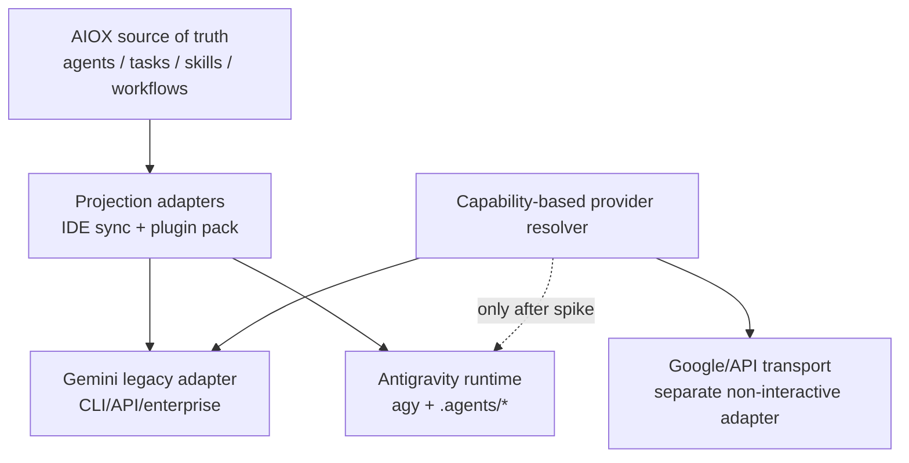

# Plano de resolução — Issue #811

## 1. Decisão executiva

Executar em duas trilhas, com a primeira desbloqueando a instalação imediatamente:

1. **Corrigir o bug de empacotamento/configuração do #811**: o pacote publicado não pode carregar o `core-config.yaml` de contribuidores; a instalação greenfield deve gerar uma configuração nova pelo template e nunca pedir para sobrescrever o arquivo que veio do próprio pacote.
2. **Não substituir `gemini` por `agy` por renomeação**: o AIOX deve adotar uma camada dual de compatibilidade. O Antigravity CLI será tratado como runtime/projeção moderna para usuários Google, enquanto o provider Gemini e a rota por API/enterprise permanecem disponíveis até existir prova de execução não interativa equivalente.

Esta separação evita transformar um defeito de instalação em uma migração de provider sem contrato compatível.

## 2. Evidência confirmada

- O issue [#811](https://github.com/SynkraAI/aiox-core/issues/811) está aberto e descreve o prompt indevido em instalação greenfield.
- O tarball publicado de `@aiox-squads/core@5.3.0` contém `.aiox-core/core-config.yaml`.
- Esse arquivo contém configuração de contribuidor, incluindo `project.type: EXISTING_AIOX` e `boundary.frameworkProtection: false`.
- `packages/installer/src/installer/aiox-core-installer.js:64-72` lista `core-config.yaml` em `ROOT_FILES_TO_COPY`; `:367-383` copia esses arquivos para o projeto-alvo.
- `packages/installer/src/config/configure-environment.js:32-71,244-266` detecta o arquivo existente e abre as opções merge/backup/overwrite/skip.
- O gerador existente em `packages/installer/src/config/templates/core-config-template.js` já é a fonte correta para criar configuração de projeto greenfield.
- Não há PR aberto cobrindo o #811. O issue #57 é contexto arquitetural relacionado, mas está fechado e não substitui a correção executável deste bug.
- O checkout canônico possui alterações não relacionadas de Pro; esta análise não as modifica.

## 3. Decisão Gemini versus Antigravity

### O que pode ser migrado

O Google documenta a transição do Gemini CLI para o Antigravity CLI, mas também informa que não houve paridade 1:1 no lançamento. O Antigravity preserva capacidades importantes como skills, hooks, subagents e extensões convertidas em plugins. Consulte o [anúncio oficial de transição](https://developers.googleblog.com/en/an-important-update-transitioning-gemini-cli-to-antigravity-cli/) e o [guia oficial de migração](https://antigravity.google/docs/gcli-migration).

| Capacidade AIOX | Gemini atual | Antigravity moderno | Estratégia |
|---|---|---|---|
| Contexto do projeto | `.gemini`, `GEMINI.md`, `AGENTS.md` | `AGENTS.md`, regras `.agents/rules` | Manter `AGENTS.md`; gerar projeção AGY |
| Agentes/regras | `.gemini/rules/AIOX/agents` | `.agents/rules` | Novo transformer oficial; manter legado durante migração |
| Skills | extensão/estrutura Gemini | `.agents/skills` | Projetar a partir da fonte canônica AIOX |
| MCP | configurações Gemini legadas | `.agents/mcp_config.json`, `serverUrl` | Migrar schema e validar permissões |
| Extensões | `packages/gemini-aiox-extension` | plugins com `plugin.json` | Empacotar/adaptar, sem apagar o pacote Gemini |
| Hooks | contrato Gemini existente | hooks JSON via stdin/stdout | Adaptador explícito; não copiar arquivos sem conversão |
| Subagents/workflows | dispatcher AIOX + Gemini | subagents/async workflows do AGY | Integrar somente na camada interativa até haver API estável |
| Execução programática | stdin + `--output-format json` | contrato headless ainda não comprovado | Spike obrigatório antes de criar provider AGY |
| Auth/health check | `gemini --version`, `gemini auth status` | OAuth/keyring e `agy` | Capability checks por adapter |
| Model routing | IDs Gemini hardcoded | modelo selecionado pelo runtime Google | Remover dependência de IDs fixos do dispatcher |

### O que não deve ser feito

- Não trocar apenas `command: 'gemini'` por `command: 'agy'`.
- Não remover `packages/gemini-aiox-extension`, `.gemini` ou o provider Gemini antes da migração enterprise/API-key estar coberta.
- Não tratar `.antigravity/rules/agents` como destino oficial sem modo de compatibilidade; a documentação atual aponta `.agents/rules`, `.agents/skills`, `.agents/plugins` e `.agents/mcp_config.json`. Ver [rules](https://antigravity.google/docs/ide-rules), [skills](https://antigravity.google/docs/skills), [MCP](https://antigravity.google/docs/mcp) e [plugins](https://antigravity.google/docs/plugins).
- Não presumir que TUI interativa equivale ao contrato atual de provider JSON.

### Arquitetura recomendada

O ponto importante é separar **projeção de runtime** de **transporte de modelo**. O `agy` pode ser o runtime terminal padrão para pessoas sem que seja, automaticamente, o processo usado pelo `AIProvider` em automações.

## 4. Fases e gates

### Fase 0 — Story e baseline

Criar stories versionadas em `docs/framework/epics/{epic}/` conforme `docs/framework/story-locations.md`, sem executar código fora dos acceptance criteria.

- Story A: `#811` — boundary seguro de configuração e pacote.
- Story B: projeção moderna Antigravity/Gemini.
- Story C: spike de transporte não interativo e capability resolver.
- Story D: documentação, migração e rollout.

**Gate 0:** confirmar branch/PR coverage, manter o checkout canônico preservado e capturar baseline de `npm pack`, installer, ide-sync e providers.

### Fase 1 — Hotfix do #811

Alterações esperadas:

1. Remover o arquivo concreto `.aiox-core/core-config.yaml` de `ROOT_FILES_TO_COPY`.
2. Ajustar o allowlist de publicação (`package.json`/regras npm) para excluir o arquivo concreto, mantendo o template e os arquivos necessários do framework.
3. Manter `core-config-template.js` como única fonte de configuração greenfield.
4. Adicionar uma guarda defensiva no installer: arquivo de configuração oriundo do framework não pode ser tratado como customização do projeto.
5. Preservar o fluxo brownfield: configuração existente do usuário continua podendo ser mesclada, respaldada ou mantida.

**Gate 1 — obrigatório para release:**

- `npm pack --dry-run` não lista `.aiox-core/core-config.yaml`.
- Instalação greenfield limpa não mostra o prompt de overwrite.
- O config gerado contém valores do projeto, `frameworkProtection: true` e apenas IDEs escolhidas.
- Instalação brownfield não perde configuração existente.

### Fase 2 — Projeção Antigravity compatível

1. Atualizar o contrato de `ide-sync` para incluir `.agents/rules`, `.agents/skills` e, quando aplicável, `.agents/plugins`.
2. Criar transformer/pack oficial para Antigravity usando a fonte canônica AIOX.
3. Adaptar o `packages/gemini-aiox-extension` para plugin AGY somente onde o contrato for equivalente; preservar comandos que não tenham mapeamento seguro.
4. Converter hooks para o contrato JSON documentado pelo AGY; hooks Gemini não devem ser copiados como se fossem portáveis.
5. Migrar MCP para `.agents/mcp_config.json` e `serverUrl`, com aviso explícito sobre permissões de escrita. Referência: [MCP oficial](https://antigravity.google/docs/mcp).
6. Manter `.antigravity/rules/agents` apenas como compatibilidade temporária, com flag/notice de depreciação, ou removê-lo após uma janela de migração documentada.
7. Corrigir documentação PT/EN que ainda usa `antigravity auth login`, `antigravity start`, `.antigravity/antigravity.json` ou `.agent/workflows`; o CLI atual é `agy` e a instalação oficial é descrita em [CLI install](https://antigravity.google/docs/cli-install).

**Gate 2:** projeto de teste consegue carregar agentes, skills, MCP, hooks e plugin pelo AGY, e cada capability tem teste de paridade ou é explicitamente marcada como incompatível.

### Fase 3 — Provider e roteamento

1. Fazer spike usando a versão atual do `agy` para verificar: execução sem TUI, stdin, saída machine-readable, exit codes, timeout, auth status, seleção de modelo e execução paralela.
2. Registrar o resultado como contrato, não como inferência da documentação.
3. Se o contrato existir, implementar `AntigravityProvider` atrás de capability flags e manter alias de compatibilidade `gemini` onde ele representa modelos Google.
4. Se não existir, não criar provider AGY para automação; usar o adapter Gemini/API/Vertex adequado e reservar AGY para runtime interativo/projeção.
5. Remover IDs rígidos `gemini-2.0-*` do resolver e do selector; usar capabilities/model aliases com fallback explícito.
6. Atualizar dispatcher, fallback, parallel metadata, health checks e testes; tags legadas `@gemini` devem continuar funcionando durante a transição.

**Gate 3:** nenhum fluxo existente de `AIProvider`, subagent dispatcher, retry, JSON output ou fallback perde comportamento; o caminho AGY só vira default após prova automatizada.

### Fase 4 — Release controlado

- Publicar RC em ambiente descartável antes da versão estável.
- Matriz mínima: macOS/Linux/Windows; Node 18/20/22; greenfield/brownfield; Gemini, Antigravity, ambos e nenhum IDE selecionado.
- Validar instalação interrompida, rerun, backup, rollback e config customizado.
- Rodar: `npm pack --dry-run`, `npm run validate:publish`, `npm run validate:manifest`, `npm run sync:ide:check`, `npm run validate:parity`, testes direcionados e quality gates completos.
- Liberar patch da versão vigente (confirmar versão no momento da execução), com migration note e diagnóstico no `aiox doctor`.

## 5. Arquivos prováveis

### Issue #811

- `packages/installer/src/installer/aiox-core-installer.js`
- `packages/installer/src/config/configure-environment.js`
- `packages/installer/src/config/templates/core-config-template.js`
- `package.json` e regras de publicação
- `tests/installer/configure-environment-brownfield.test.js` e novo teste greenfield
- teste de tarball/publish manifest

### Compatibilidade Google

- `.aiox-core/infrastructure/integrations/ai-providers/ai-provider.js`
- `gemini-provider.js`, `ai-provider-factory.js`
- `subagent-dispatcher.js`, `gemini-model-selector.js`
- `.aiox-core/infrastructure/scripts/ide-sync/index.js`
- `transformers/antigravity.js` e `tests/ide-sync/transformers.test.js`
- `packages/gemini-aiox-extension/`
- `.aiox-core/core-config.yaml`, `.aiox-core/framework-config.yaml`
- `docs/framework/ide-sync-contract.md`
- `docs/pt/ide-integration.md`, `docs/pt/platforms/antigravity.md`, `docs/pt/platforms/gemini-cli.md`

Nenhum desses arquivos deve ser alterado nesta fase de plano; a implementação deve nascer das stories aprovadas.

## 6. Critérios de aceite consolidados

- Um pacote publicado não contém configuração concreta de contribuidor.
- Greenfield gera configuração própria e não abre prompt de overwrite para arquivo do pacote.
- Brownfield conserva o fluxo de proteção de configuração existente.
- AIOX mantém uma fonte canônica independente de Gemini/Antigravity.
- A projeção AGY moderna cobre, ou declara explicitamente a limitação de, agentes, skills, hooks, subagents, MCP, plugins e workflows.
- Usuários enterprise/API-key não perdem a rota Gemini durante a migração.
- Nenhum provider programático passa a depender de uma TUI sem contrato headless comprovado.
- `npm run lint`, `npm run typecheck` e `npm test` passam, além dos gates específicos de publish, manifest, ide-sync e paridade.

## 7. Riscos e rollback

| Risco | Mitigação | Rollback |
|---|---|---|
| Config de contribuidor volta ao tarball | teste de `npm pack` como gate de release | retirar arquivo do pacote e publicar patch |
| AGY sem headless estável | manter Gemini/API adapter | não habilitar AGY no provider resolver |
| perda de funções Gemini | dual lane e testes de capability | manter projeções/extensão Gemini |
| MCP com permissões excessivas | config explícita + review de permissões | desabilitar MCP AGY por default |
| drift entre `.aiox-core` e configs | validar ambos `core-config` e `framework-config` | reverter somente a projeção afetada |
| docs prometem comandos antigos | atualização versionada e smoke tests | restaurar instruções da versão anterior |

## 8. Recomendação final

**Aprovar o hotfix do #811 imediatamente e iniciar a migração Gemini → Antigravity como compatibilidade progressiva, não como substituição direta.** O Antigravity deve ser a nova projeção/runtime Google para interação humana; o transporte programático deve permanecer Gemini/API até o spike comprovar compatibilidade real. Essa abordagem mantém funções existentes, reduz risco de regressão e deixa a migração reversível.
