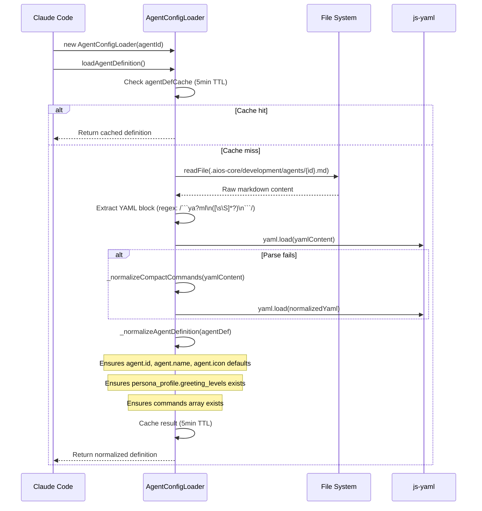
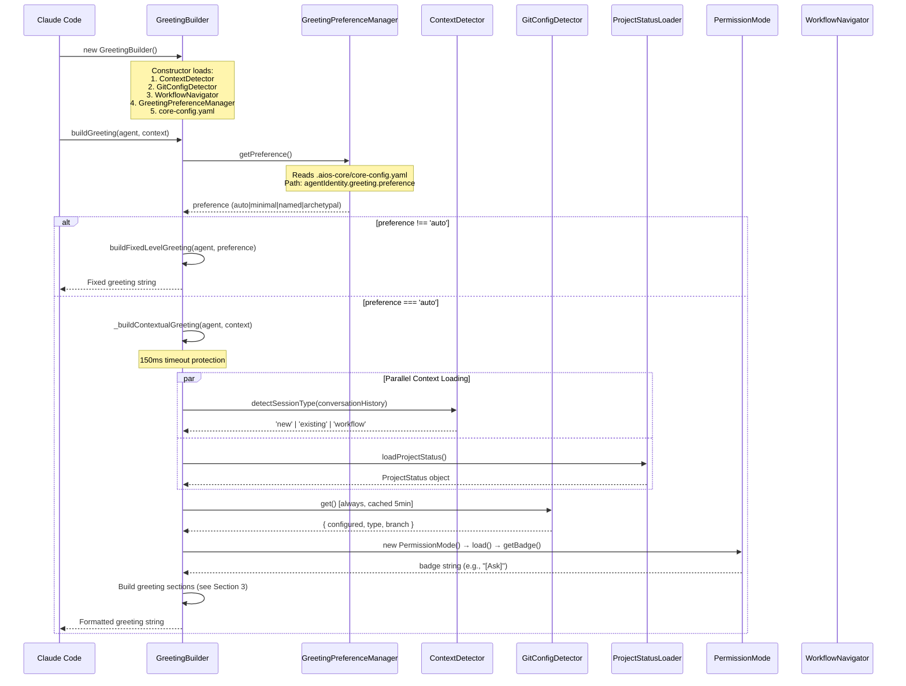
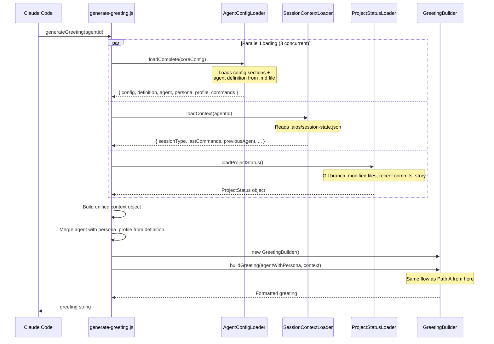
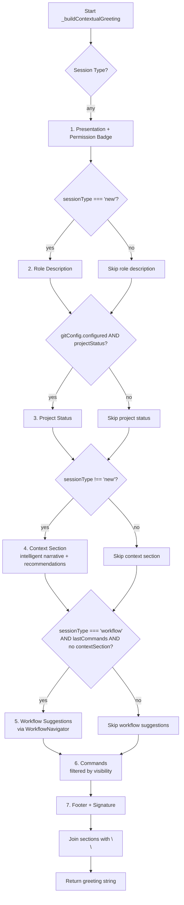
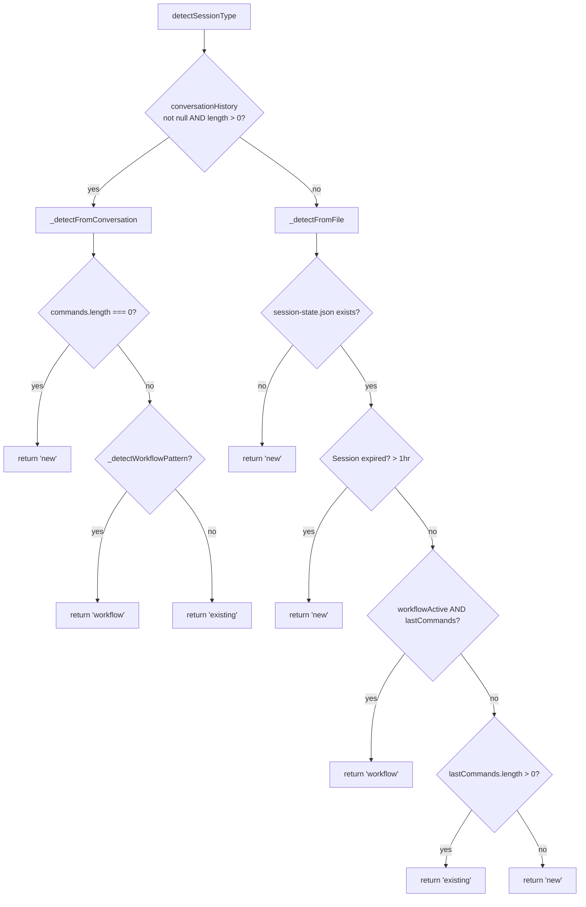
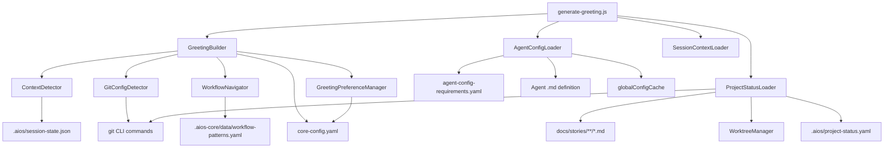

# Shared Activation Pipeline - Common Agent Activation Chain

> Traced from source code, not documentation.
> Source: `.aios-core/development/scripts/greeting-builder.js` (949 lines)

## Overview

Every AIOS agent goes through a common activation pipeline before presenting its greeting. There are **two activation paths** that converge on the same `GreetingBuilder` class:

| Path | Used By | Entry Point |
|------|---------|-------------|
| **Direct invocation** | @architect, @dev, @qa, @aios-master, @po, @pm, @sm, @analyst, @squad-creator | Agent .md STEP 3 calls `GreetingBuilder.buildGreeting()` directly |
| **CLI wrapper** | @devops, @data-engineer, @ux-design-expert | `generate-greeting.js` orchestrates context loading, then calls `GreetingBuilder.buildGreeting()` |

---

## 1. Agent File Loading (STEP 1-2)

Before the activation pipeline begins, Claude Code loads and parses the agent definition file.

### 1.1 File Location

```
.aios-core/development/agents/{agent-id}.md
```

### 1.2 Parsing Flow (via `AgentConfigLoader.loadAgentDefinition()`)

**Source:** `agent-config-loader.js:308-366`



### 1.3 Key Fields Extracted

| Field | Path in YAML | Used For |
|-------|-------------|----------|
| `agent.id` | `agent.id` | Agent identification, config lookup |
| `agent.name` | `agent.name` | Greeting presentation |
| `agent.icon` | `agent.icon` | Greeting prefix |
| `persona_profile.greeting_levels` | `persona_profile.communication.greeting_levels` or `persona_profile.greeting_levels` | Fixed-level greetings |
| `persona_profile.communication.signature_closing` | `persona_profile.communication.signature_closing` | Footer signature |
| `persona.role` | `persona.role` | Role description (new sessions) |
| `commands` | `commands[]` | Command list with visibility metadata |
| `dependencies` | `dependencies.tasks[]`, `.templates[]`, etc. | Task execution references |

---

## 2. Activation Pipeline (STEP 3)

### 2.1 Path A: Direct Invocation (9 agents)

The agent .md instructs Claude Code to call `GreetingBuilder.buildGreeting()` directly.

**Source:** `greeting-builder.js:59-82`



### 2.2 Path B: CLI Wrapper (3 agents: @devops, @data-engineer, @ux-design-expert)

**Source:** `generate-greeting.js:53-113`



---

## 3. Greeting Section Assembly

**Source:** `greeting-builder.js:91-141`

When `preference === 'auto'`, the greeting is assembled from ordered sections:



### 3.1 Section Details

| # | Section | Method | Condition | Data Source |
|---|---------|--------|-----------|-------------|
| 1 | Presentation | `buildPresentation()` | Always | `persona_profile.greeting_levels.archetypal` + PermissionMode badge |
| 2 | Role Description | `buildRoleDescription()` | `sessionType === 'new'` | `persona.role` |
| 3 | Project Status | `buildProjectStatus()` | `gitConfig.configured && projectStatus` | ProjectStatusLoader (branch, files, commits, story) |
| 4 | Context | `buildContextSection()` | `sessionType !== 'new'` | Intelligent narrative from previous agent, modified files, story |
| 5 | Workflow Suggestions | `buildWorkflowSuggestions()` | `sessionType === 'workflow' && lastCommands && !contextSection` | WorkflowNavigator + workflow-patterns.yaml |
| 6 | Commands | `buildCommands()` | Always | `filterCommandsByVisibility()` - max 12 commands |
| 7 | Footer | `buildFooter()` | Always | `persona_profile.communication.signature_closing` |

### 3.2 Command Visibility Filtering

**Source:** `greeting-builder.js:815-857`

| Session Type | Visibility Filter | Shows Commands With |
|-------------|-------------------|---------------------|
| `new` | `full` | `visibility: [full, ...]` |
| `existing` | `quick` | `visibility: [..., quick, ...]` |
| `workflow` | `key` | `visibility: [..., key, ...]` |

If no commands have visibility metadata, falls back to first 12 commands.

---

## 4. Context Detection (Session Type)

**Source:** `context-detector.js:22-101`



**Workflow patterns detected:**
- `story_development`: validate-story-draft, develop, review-qa
- `epic_creation`: create-epic, create-story, validate-story-draft
- `backlog_management`: backlog-review, backlog-prioritize, backlog-schedule

---

## 5. Git Config Detection

**Source:** `git-config-detector.js:19-294`

| Property | Command | Timeout | Cache TTL |
|----------|---------|---------|-----------|
| `configured` | `git rev-parse --is-inside-work-tree` | 1s | 5 min |
| `branch` | `git branch --show-current` | 1s | 5 min |
| `type` | `git config --get remote.origin.url` | 1s | 5 min |

**Returns:** `{ configured: boolean, type: 'github'|'gitlab'|'bitbucket'|'other'|null, branch: string|null }`

---

## 6. Project Status Loading

**Source:** `project-status-loader.js:20-524`

| Data Point | Git Command | Cache TTL |
|------------|-------------|-----------|
| `branch` | `git branch --show-current` | 60s |
| `modifiedFiles` | `git status --porcelain` (max 5) | 60s |
| `modifiedFilesTotalCount` | Count from porcelain output | 60s |
| `recentCommits` | `git log -2 --oneline --no-decorate` | 60s |
| `currentStory` | Scan `docs/stories/` for `Status: InProgress` | 60s |
| `currentEpic` | Extracted from story file metadata | 60s |
| `worktrees` | Via WorktreeManager | 60s |

**Cache file:** `.aios/project-status.yaml`

---

## 7. Greeting Preference

**Source:** `greeting-preference-manager.js:18-146`

Reads from `.aios-core/core-config.yaml` path `agentIdentity.greeting.preference`.

| Value | Behavior |
|-------|----------|
| `auto` (default) | Session-aware contextual greeting |
| `minimal` | Always use `greeting_levels.minimal` |
| `named` | Always use `greeting_levels.named` |
| `archetypal` | Always use `greeting_levels.archetypal` |

---

## 8. Permission Mode Badge

**Source:** `permissions/index.js` + `permissions/permission-mode.js`

Loads permission mode and returns a badge string displayed next to the agent presentation. Examples: `[Ask]`, `[Auto]`, `[Explore]`.

---

## 9. Config Loading Per Agent

**Source:** `agent-config-loader.js:49-160` + `agent-config-requirements.yaml`

Each agent has specific config requirements defined in `.aios-core/data/agent-config-requirements.yaml`:

| Agent | Config Sections | Files Loaded | Performance Target |
|-------|----------------|--------------|-------------------|
| `aios-master` | dataLocation, registry | aios-kb.md (lazy) | <30ms |
| `dev` | devLoadAlwaysFiles, devStoryLocation, dataLocation | coding-standards.md, tech-stack.md, source-tree.md, technical-preferences.md | <50ms |
| `qa` | qaLocation, dataLocation, storyBacklog | technical-preferences.md, test-levels-framework.md, test-priorities-matrix.md | <50ms |
| `devops` | dataLocation, cicdLocation | technical-preferences.md | <50ms |
| `architect` | architecture, dataLocation, templatesLocation | technical-preferences.md | <75ms |
| `po` | devStoryLocation, prd, storyBacklog, templatesLocation | elicitation-methods.md | <75ms |
| `sm` | devStoryLocation, storyBacklog, dataLocation | mode-selection-best-practices.md, workflow-patterns.yaml | <75ms |
| `data-engineer` | dataLocation, etlLocation | technical-preferences.md | <75ms |
| `pm` | devStoryLocation, storyBacklog | (none) | <100ms |
| `analyst` | dataLocation, analyticsLocation | brainstorming-techniques.md | <100ms |
| `ux-design-expert` | dataLocation, uxLocation | (none) | <100ms |
| `squad-creator` | (default) dataLocation | (none) | <150ms |

---

## 10. Files Loaded During Activation (Complete List)

### Always loaded (every agent activation)

| File | Loader | Purpose |
|------|--------|---------|
| `.aios-core/development/agents/{agent-id}.md` | AgentConfigLoader | Agent definition |
| `.aios-core/core-config.yaml` | GreetingBuilder._loadConfig() | Core configuration |
| `.aios-core/data/agent-config-requirements.yaml` | AgentConfigLoader.loadRequirements() | Per-agent config needs |
| `.aios-core/data/workflow-patterns.yaml` | WorkflowNavigator._loadPatterns() | Workflow state detection |

### Loaded conditionally

| File | Condition | Loader |
|------|-----------|--------|
| `.aios/session-state.json` | Path B (CLI wrapper) or file-based session detection | ContextDetector / SessionContextLoader |
| `.aios/project-status.yaml` | Cache check (60s TTL) | ProjectStatusLoader |
| `docs/stories/**/*.md` | When scanning for InProgress story | ProjectStatusLoader.getCurrentStoryInfo() |
| Agent-specific data files | Per agent-config-requirements.yaml | AgentConfigLoader.loadFile() |

---

## 11. Error Handling & Fallbacks

The entire pipeline is protected with multiple fallback layers:

| Component | Fallback | Source |
|-----------|----------|--------|
| GreetingBuilder.buildGreeting() | `buildSimpleGreeting()` | greeting-builder.js:60 |
| _buildContextualGreeting() | 150ms timeout | greeting-builder.js:73-77 |
| ContextDetector.detectSessionType() | Returns `'new'` | greeting-builder.js:869 |
| GitConfigDetector.get() | `{ configured: false }` | greeting-builder.js:883 |
| ProjectStatusLoader | `null` | greeting-builder.js:897 |
| PermissionMode.getBadge() | `''` (empty string) | greeting-builder.js:913 |
| generate-greeting.js | `generateFallbackGreeting()` | generate-greeting.js:143 |

---

## 12. Constructor Dependency Graph



---

*Traced from source on 2026-02-05 | Story AIOS-TRACE-001*
