# Smart Trace - Arquitetura do Sistema v1.0

> Infraestrutura nacional de integridade da cadeia do medicamento.
> Da fabrica ao descarte final - cada unidade, dois destinos auditaveis:
> dispensacao legitima ou recolhimento/descarte seguro.

**Status:** DRAFT v1.1 - Revisado em 2026-02-15
**Autor:** Aria (Architect Agent)
**Data:** 2026-02-15

---

## Sumario

1. [Visao Geral e Decisoes Arquiteturais](#1-visao-geral)
2. [C4 Level 1 - System Context](#2-c4-level-1---system-context)
3. [C4 Level 2 - Container Diagram](#3-c4-level-2---container-diagram)
4. [C4 Level 3 - Component Diagrams](#4-c4-level-3---component-diagrams)
5. [Fluxos Operacionais Chave](#5-fluxos-operacionais-chave)
6. [Modelo de Dados](#6-modelo-de-dados)
7. [Estrategia Ledger/Blockchain](#7-estrategia-ledgerblockchain)
8. [Tech Stack](#8-tech-stack)
9. [Estrutura do Monorepo](#9-estrutura-do-monorepo)
10. [RBAC/ABAC](#10-rbacabac)
11. [Estrategia LGPD](#11-estrategia-lgpd)
12. [NFRs e Estrategia de Infraestrutura](#12-nfrs-e-infraestrutura)
13. [Backlog Priorizado por Fase](#13-backlog-priorizado-por-fase)
14. [Cronograma e Marcos](#14-cronograma-e-marcos)
15. [ADRs - Architecture Decision Records](#15-adrs)

---

## 1. Visao Geral

### 1.1 Problema

O ecossistema farmaceutico brasileiro sofre com:
- Fraudes bilionarias no PFPB (dispensacao fantasma, desvio de medicamentos)
- XMLs editaveis no SNGPC (dados adulteraveis)
- Ausencia de prova do ato de dispensacao (RT nao validado no balcao)
- Vigilancia epidemiologica lenta (semanas/meses ao inves de horas)
- Falta de rastreabilidade fim-a-fim (da fabrica ao descarte)

### 1.2 Solucao

Smart Trace cria uma camada de integridade nacional baseada em **eventos imutaveis**.
Cada unidade de medicamento gera eventos auditaveis ao longo de toda a cadeia,
com destino final obrigatoriamente registrado: **dispensacao ao paciente** ou **descarte certificado**.

### 1.3 Principios Arquiteturais

| # | Principio | Descricao |
|---|-----------|-----------|
| P1 | **Event Sourcing como Fonte da Verdade** | Todos os estados derivam de eventos imutaveis |
| P2 | **Prova Criptografica** | Hashes de eventos ancorados em ledger permissionado |
| P3 | **Privacy by Design** | Dados pessoais pseudonimizados; LGPD nativa |
| P4 | **Cloud-Agnostic com Cloud-Native** | Kubernetes + Terraform; sem vendor lock-in critico |
| P5 | **Escala Nacional Progressiva** | Projetado para milhoes de eventos/dia, deploy por ondas |
| P6 | **Resiliencia por Design** | Filas com retry, idempotencia, circuit breakers, DR ativo |
| P7 | **Observability First** | OpenTelemetry end-to-end, metricas de negocio em tempo real |
| P8 | **API First** | Todos os modulos expostos via APIs, SDKs para integracao |

### 1.4 Decisoes Arquiteturais Chave (Resumo)

| Decisao | Escolha | Justificativa |
|---------|---------|---------------|
| Padrao de dados | Event Sourcing + CQRS | Imutabilidade nativa, audit trail, replay |
| Comunicacao | Event-Driven (Kafka) + REST/gRPC | Desacoplamento, throughput, latencia |
| Blockchain | Hyperledger Fabric (permissionada) | Participantes conhecidos, governanca, LGPD |
| Backend | NestJS (TypeScript); Go Fase 2+ se benchmarks exigirem | Produtividade Fase 1, performance onde necessario |
| Frontend | Next.js 14+ (App Router) | SSR, performance, ecossistema React |
| Mobile | React Native + Expo | Cross-platform, biometria nativa |
| Database | PostgreSQL 16 + TimescaleDB | OLTP + time-series no mesmo engine |
| Analytics | ClickHouse (Fase 2+) | OLAP otimizado para queries analiticas massivas |
| IAM | Keycloak + gov.br OIDC | RBAC/ABAC, federacao governamental |
| Infra | Kubernetes (EKS/AKS) + Terraform | Portabilidade, escala, IaC |

---

## 2. C4 Level 1 - System Context

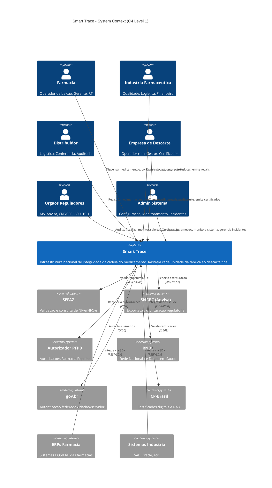

### Atores e Responsabilidades

| Ator | Interacoes Principais | Volume Estimado |
|------|----------------------|-----------------|
| Farmacia (80k+ estabelecimentos) | Dispensacao, estoque, conformidade | ~2M eventos/dia |
| Industria (~500 labs) | Producao, recalls, rastreio lotes | ~200k eventos/dia |
| Distribuidores (~1k) | Recebimento, expedicao, trilha | ~500k eventos/dia |
| Empresas Descarte (~200) | Coleta, transporte, certificacao | ~10k eventos/dia |
| Orgaos Reguladores (~50 usuarios) | Auditoria, alertas, dossies | Consultas sob demanda |
| Admin (~10 usuarios) | Configuracao, monitoramento | Operacoes pontuais |

**Volume total estimado: ~3M eventos/dia (pico ~5M) na operacao nacional plena.**

---

## 3. C4 Level 2 - Container Diagram

```mermaid
C4Container
    title Smart Trace - Container Diagram (C4 Level 2)

    Person(users, "Usuarios", "Todos os perfis")

    Container_Boundary(frontend, "Frontend Layer") {
        Container(portal_farm, "Portal Farmacia", "Next.js 14", "Dispensacao, estoque, conformidade, recolhimento, relatorios")
        Container(portal_ind, "Portal Industria", "Next.js 14", "Rastreio lotes, recalls, remessas SUS, cobranca")
        Container(portal_dist, "Portal Distribuidor", "Next.js 14", "Movimentacoes, recebimento, expedicao, trilha")
        Container(portal_desc, "Portal Descarte", "Next.js 14", "Agendamento coleta, registro etapas, certificados")
        Container(portal_gov, "Portal Governo", "Next.js 14", "Auditoria, alertas, dossies, KPIs, recalls")
        Container(console_admin, "Console Admin", "Next.js 14", "Cadastros, perfis, permissoes, parametros, integracao")
        Container(app_rt, "App Validacao RT", "React Native/Expo", "Biometria + geofence, autorizacao dispensacao")
    }

    Container_Boundary(api_layer, "API Layer") {
        Container(gateway, "API Gateway", "Kong", "Roteamento, rate limiting, auth, WAF, metricas")
        Container(bff, "BFF Service", "NestJS", "Agregacao por portal, GraphQL Federation")
    }

    Container_Boundary(core_services, "Core Services") {
        Container(dispensation_svc, "Dispensation Service", "NestJS", "Prova do ato, validacao RT, vinculo receita/paciente")
        Container(inventory_svc, "Inventory Service", "NestJS", "SNGPC do Fato, estoque, escrituracao fiscal, reconciliacao")
        Container(pfpb_svc, "PFPB-Guard", "NestJS + Go", "Motor antifraude, regras, reconciliacao, dossies, scoring")
        Container(epid_svc, "EPID Service", "Go", "Pipeline epidemiologico, anonimizacao, alertas N1/N2/N3")
        Container(lifecycle_svc, "Lifecycle Service", "NestJS", "Recalls, bloqueios, recolhimento, descarte, certificados")
    }

    Container_Boundary(platform_services, "Platform Services") {
        Container(integration_hub, "Integration Hub", "NestJS", "Conectores SEFAZ/SNGPC/PFPB/RNDS, retry, idempotencia")
        Container(ledger_svc, "Ledger Service", "Go", "Ancoragem hashes, Merkle trees, verificacao, chaincode")
        Container(notification_svc, "Notification Service", "NestJS", "Email, SMS, push, webhooks, filas")
        Container(iam_svc, "IAM", "Keycloak 24", "RBAC/ABAC, gov.br OIDC, MFA, ICP-Brasil")
        Container(audit_svc, "Audit Service", "NestJS", "Logs imutaveis, trilha completa, retencao")
        Container(analytics_svc, "Analytics Service", "Go", "Aggregacoes, KPIs, dashboards real-time")
    }

    Container_Boundary(data_layer, "Data Layer") {
        ContainerDb(postgres, "PostgreSQL 16", "RDBMS", "Dados transacionais, cadastros, permissoes")
        ContainerDb(timescale, "TimescaleDB", "Time-Series", "Event store, metricas operacionais")
        ContainerDb(clickhouse, "ClickHouse", "OLAP", "Analytics, EPID, PFPB-Guard queries")
        ContainerDb(redis, "Redis Cluster", "Cache", "Sessoes, rate limiting, geofence cache")
        ContainerDb(s3, "Object Storage", "S3/MinIO", "Evidencias biometricas, dossies, certificados, XMLs")
        ContainerDb(opensearch, "OpenSearch", "Search/Log", "Auditoria full-text, busca eventos complexa")
    }

    Container_Boundary(infra_layer, "Infrastructure") {
        ContainerQueue(kafka, "Apache Kafka", "Event Streaming", "Event bus central, topics por dominio")
        Container(blockchain, "Hyperledger Fabric", "Blockchain", "Ledger permissionado, hashes imutaveis")
        Container(vault, "HashiCorp Vault", "Secrets", "KMS, HSM bridge, certificados, rotacao")
        Container(otel, "OpenTelemetry Collector", "Observability", "Metricas, logs, traces distribuidos")
    }

    Rel(users, gateway, "HTTPS")
    Rel(users, app_rt, "Mobile")
    Rel(gateway, bff, "gRPC/REST")
    Rel(bff, dispensation_svc, "gRPC")
    Rel(bff, inventory_svc, "gRPC")
    Rel(bff, lifecycle_svc, "gRPC")
    Rel(bff, analytics_svc, "gRPC")

    Rel(dispensation_svc, kafka, "Publica eventos")
    Rel(inventory_svc, kafka, "Publica/Consome eventos")
    Rel(pfpb_svc, kafka, "Consome eventos dispensacao")
    Rel(epid_svc, kafka, "Consome eventos anonimizados")
    Rel(lifecycle_svc, kafka, "Publica/Consome recalls")
    Rel(ledger_svc, kafka, "Consome eventos para ancoragem")

    Rel(dispensation_svc, postgres, "R/W")
    Rel(dispensation_svc, timescale, "Write events")
    Rel(pfpb_svc, clickhouse, "Read analytics")
    Rel(epid_svc, clickhouse, "Read/Write analytics")
    Rel(ledger_svc, blockchain, "Anchor hashes")
    Rel(integration_hub, sefaz, "NF-e")
    Rel(integration_hub, pfpb_auth, "PFPB")
    Rel(integration_hub, sngpc_ext, "SNGPC")
    Rel(integration_hub, rnds_ext, "RNDS")
```

### Comunicacao entre Containers

| De | Para | Protocolo | Padrao |
|----|------|-----------|--------|
| Frontend → API Gateway | HTTPS | Request/Response |
| API Gateway → BFF | gRPC/REST | Request/Response |
| BFF → Core Services | gRPC | Request/Response (sync) |
| Core Services → Kafka | Kafka Protocol | Event Publishing (async) |
| Kafka → Core Services | Kafka Protocol | Event Consumption (async) |
| Core Services → PostgreSQL | TCP/SQL | CRUD |
| Core Services → TimescaleDB | TCP/SQL | Event Write (append-only) |
| Analytics → ClickHouse | TCP/Native | OLAP Queries |
| Ledger Service → HLF | gRPC | Hash Anchoring |
| Integration Hub → External | HTTPS/SOAP | Connectors |

---

## 4. C4 Level 3 - Component Diagrams

### 4.1 Dispensation Service (Prova do Ato)

```mermaid
C4Component
    title Dispensation Service - Components (C4 Level 3)

    Container_Boundary(dispensation, "Dispensation Service") {
        Component(api_ctrl, "API Controller", "NestJS Controller", "REST/gRPC endpoints para dispensacao")
        Component(rt_validator, "RT Validator", "Service", "Valida presenca RT: biometria + geofence + certificado digital")
        Component(prescription_linker, "Prescription Linker", "Service", "Vincula dispensacao a receita e paciente pseudonimizado")
        Component(policy_engine, "Policy Engine", "Service", "Regras por classe terapeutica: controlados, antimicrobianos, etc.")
        Component(event_publisher, "Event Publisher", "Service", "Gera evento imutavel e publica no Kafka")
        Component(status_manager, "Status Manager", "Service", "Gerencia aprovacao/bloqueio/pendencia da dispensacao")
        Component(evidence_store, "Evidence Store", "Service", "Armazena provas biometricas e geofence em Object Storage")
        Component(compliance_dashboard, "Compliance API", "Service", "Dados real-time para tela de conformidade")
    }

    Rel(api_ctrl, rt_validator, "Valida RT")
    Rel(api_ctrl, prescription_linker, "Vincula receita")
    Rel(api_ctrl, policy_engine, "Aplica regras")
    Rel(api_ctrl, status_manager, "Decide status")
    Rel(rt_validator, evidence_store, "Armazena provas")
    Rel(status_manager, event_publisher, "Publica evento")
    Rel(event_publisher, kafka, "Kafka topic: dispensation.events")
    Rel(compliance_dashboard, timescale, "Query eventos")
```

### 4.2 PFPB-Guard (Antifraude)

```mermaid
C4Component
    title PFPB-Guard Service - Components (C4 Level 3)

    Container_Boundary(pfpb, "PFPB-Guard Service") {
        Component(event_consumer, "Event Consumer", "Kafka Consumer", "Consome eventos de dispensacao PFPB")
        Component(rules_engine, "Rules Engine", "Go", "Motor de regras configuraveis, deteccao anomalias")
        Component(reconciliation, "Reconciliation Engine", "Service", "Autorizador PFPB x NF-e x Evento dispensacao")
        Component(anomaly_detector, "Anomaly Detector", "Go/ML", "Deteccao temporal, geografica, comportamental")
        Component(risk_scorer, "Risk Scorer", "Service", "Score de risco por farmacia/operador/regiao")
        Component(dossier_gen, "Dossier Generator", "Service", "Gera dossies probatorios automaticos")
        Component(fiscal_queue, "Fiscal Queue Manager", "Service", "Fila de fiscalizacao por score de risco")
        Component(evidence_repo, "Evidence Repository", "Service", "Storage probatorio, retencao min 5 anos")
        Component(kpi_tracker, "KPI Tracker", "Service", "Metricas: RT validado, reconciliacao, lastro fiscal")
    }

    Rel(event_consumer, rules_engine, "Aplica regras")
    Rel(event_consumer, reconciliation, "Reconcilia")
    Rel(rules_engine, anomaly_detector, "Anomalias detectadas")
    Rel(anomaly_detector, risk_scorer, "Calcula score")
    Rel(risk_scorer, fiscal_queue, "Enfileira fiscalizacao")
    Rel(risk_scorer, dossier_gen, "Score alto -> dossie")
    Rel(dossier_gen, evidence_repo, "Armazena dossie")
    Rel(reconciliation, clickhouse, "Query analitica")
```

### 4.3 EPID Service (Epidemiologia <48h)

```mermaid
C4Component
    title EPID Service - Components (C4 Level 3)

    Container_Boundary(epid, "EPID Service") {
        Component(ingestion, "Event Ingestion", "Kafka Consumer", "Pipeline continuo de ingestao de eventos")
        Component(anonymizer, "Anonymizer", "Go", "Pseudonimizacao/anonimizacao LGPD")
        Component(pattern_detector, "Pattern Detector", "Go", "Deteccao por tempo, territorio, classe terapeutica")
        Component(alert_engine, "Alert Engine", "Service", "Alertas N1/N2/N3 em ate 48h")
        Component(geo_aggregator, "Geo Aggregator", "Service", "Agregacao por UF, municipio, regiao")
        Component(rnds_connector, "RNDS Connector", "Service", "Integracao com Rede Nacional de Dados em Saude")
        Component(dashboard_api, "Dashboard API", "Service", "Dados para dashboards por UF/municipio/periodo")
    }

    Rel(ingestion, anonymizer, "Eventos brutos")
    Rel(anonymizer, pattern_detector, "Eventos anonimizados")
    Rel(anonymizer, clickhouse, "Write analitico")
    Rel(pattern_detector, alert_engine, "Padroes detectados")
    Rel(pattern_detector, geo_aggregator, "Dados territoriais")
    Rel(alert_engine, notification_svc, "Dispara alertas")
    Rel(dashboard_api, clickhouse, "Query OLAP")
    Rel(rnds_connector, rnds, "FHIR/REST")
```

### 4.4 Lifecycle Service (Recalls/Descarte)

```mermaid
C4Component
    title Lifecycle Service - Components (C4 Level 3)

    Container_Boundary(lifecycle, "Lifecycle Service") {
        Component(recall_mgr, "Recall Manager", "Service", "Gestao recalls, bloqueios, comunicados")
        Component(block_engine, "Block Engine", "Service", "Bloqueio imediato de lotes em < 2h")
        Component(collection_scheduler, "Collection Scheduler", "Service", "Agendamento coleta com empresa licenciada")
        Component(tracking, "Tracking Engine", "Service", "Registro: coleta, transporte, chegada destino")
        Component(cert_generator, "Certificate Generator", "Service", "Certificado descarte com hash no ledger")
        Component(compliance_reporter, "Compliance Reporter", "Service", "Relatorios conformidade ambiental")
        Component(notification_dispatcher, "Notification Dispatcher", "Service", "Notifica farmacias/distribuidores afetados")
    }

    Rel(recall_mgr, block_engine, "Inicia bloqueio")
    Rel(block_engine, kafka, "Publica evento recall.block")
    Rel(block_engine, notification_dispatcher, "Notifica afetados")
    Rel(recall_mgr, collection_scheduler, "Agenda coleta")
    Rel(collection_scheduler, tracking, "Inicia rastreio")
    Rel(tracking, cert_generator, "Descarte concluido")
    Rel(cert_generator, ledger_svc, "Ancora hash certificado")
    Rel(compliance_reporter, clickhouse, "Query conformidade")
```

### 4.5 Integration Hub

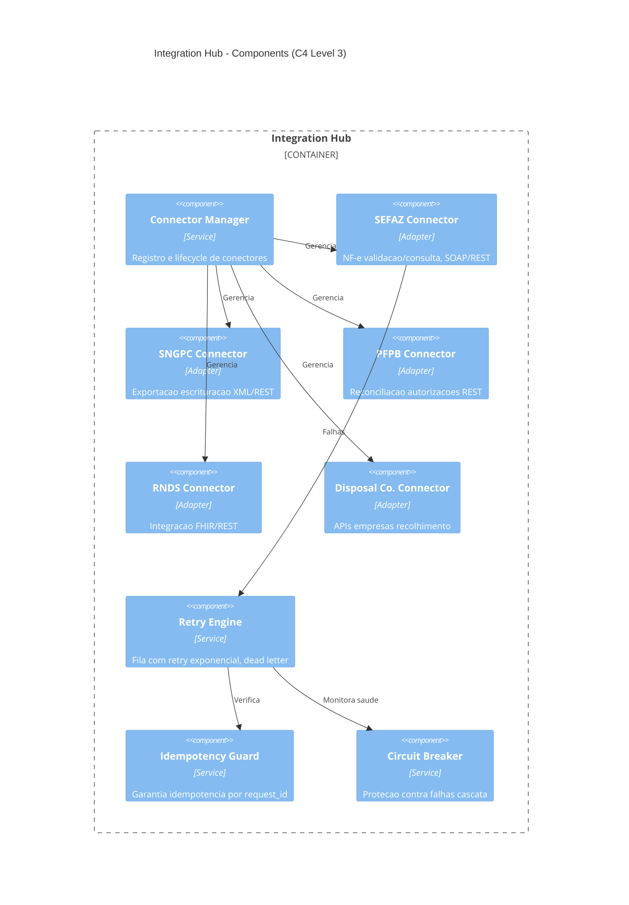

---

## 5. Fluxos Operacionais Chave

### 5.1 Dispensacao com Validacao RT (Fluxo Principal)

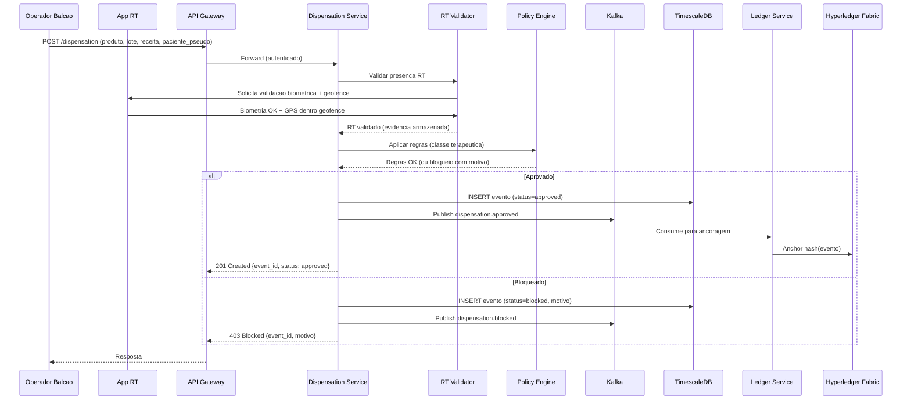

### 5.2 Reconciliacao PFPB-Guard

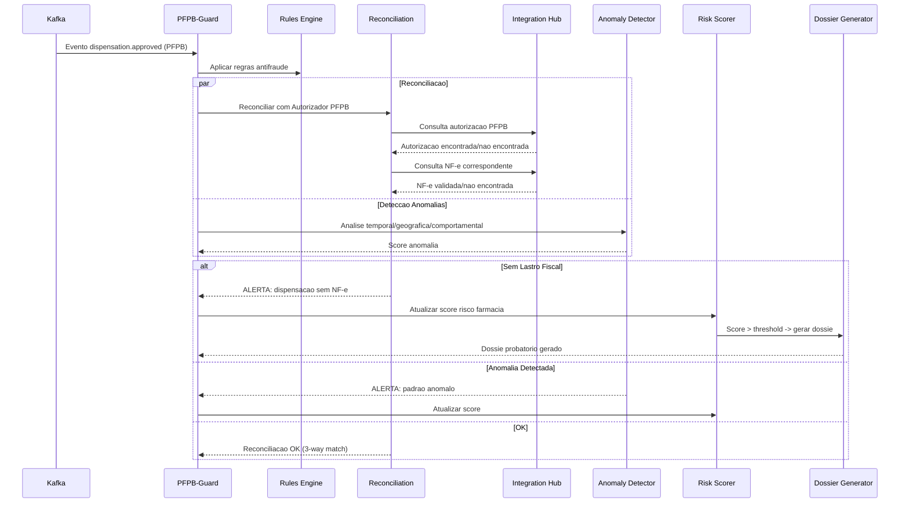

### 5.3 Bloqueio por Recall (<2h)

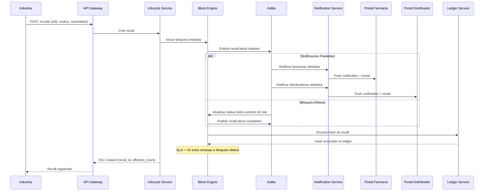

### 5.4 Fluxo de Descarte Certificado

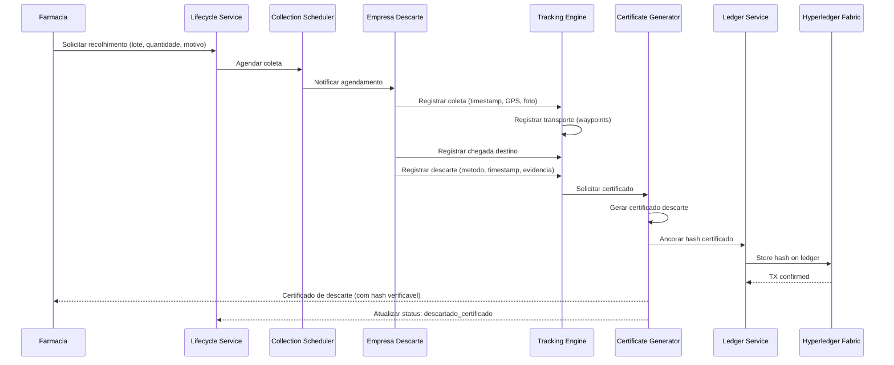

### 5.5 Pipeline EPID <48h

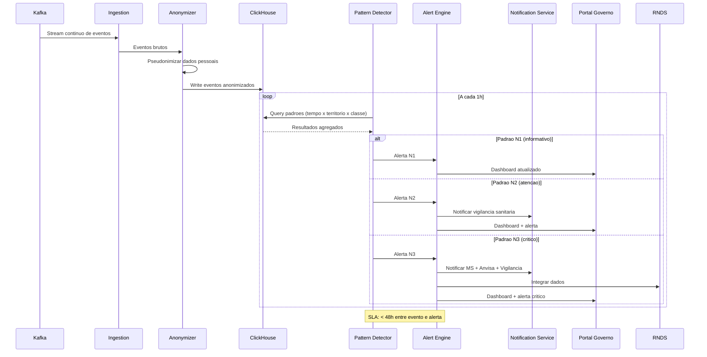

### 5.6 Fluxo de Recebimento com NF-e (Farmacia/Distribuidor)

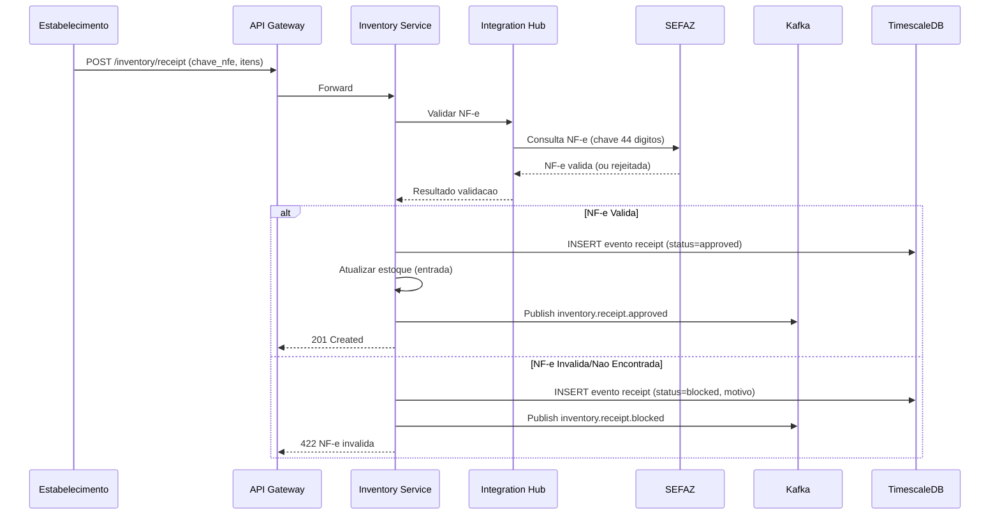

---

## 6. Modelo de Dados

### 6.1 Diagrama ER (Entidades Principais)

```mermaid
erDiagram
    ESTABLISHMENT ||--o{ EVENT : generates
    ESTABLISHMENT ||--o{ ACTOR : employs
    ESTABLISHMENT ||--o{ INVENTORY : holds
    ACTOR ||--o{ EVENT : performs
    PRODUCT ||--o{ BATCH : "produced in"
    BATCH ||--o{ EVENT : tracked_in
    BATCH ||--o{ RECALL : "subject of"
    PRESCRIPTION ||--o{ EVENT : "dispensed via"
    NFE_REFERENCE ||--o{ EVENT : "fiscal proof"
    RECALL ||--o{ DISPOSAL_CERTIFICATE : "results in"
    DISPOSAL_COMPANY ||--o{ DISPOSAL_CERTIFICATE : issues
    EVENT ||--o{ LEDGER_ANCHOR : "hashed in"
    EVENT ||--o{ PFPB_RECONCILIATION : "reconciled in"
    EPID_ALERT }|--o{ EVENT : "derived from"
    POLICY ||--o{ PRODUCT : "governs"
    ESTABLISHMENT ||--o{ DEVICE : operates
    PRESCRIPTION ||--|{ PRESCRIPTION_ITEM : contains

    ESTABLISHMENT {
        uuid id PK
        varchar type "pharmacy|industry|distributor|disposal|government"
        varchar cnpj UK
        varchar name
        varchar cnes
        varchar license_number
        polygon geofence
        point address_geo
        varchar uf
        varchar municipality_code
        jsonb metadata
        boolean active
        timestamptz created_at
        timestamptz updated_at
    }

    ACTOR {
        uuid id PK
        uuid establishment_id FK
        varchar role "operator|manager|rt|quality|logistics|auditor|admin"
        varchar cpf_hash "SHA-256"
        varchar govbr_sub "gov.br subject"
        varchar name
        varchar professional_registration "CRF number for RT"
        varchar certificate_serial "ICP-Brasil"
        boolean active
        timestamptz created_at
    }

    PRODUCT {
        uuid id PK
        varchar code UK "EAN/GTIN"
        varchar name
        varchar active_ingredient
        varchar therapeutic_class
        varchar controlled_class "null|C1|C2|C3|C4|C5|AM"
        varchar manufacturer_id FK
        boolean requires_prescription
        boolean requires_rt_validation
        jsonb regulatory_data
    }

    POLICY {
        uuid id PK
        varchar therapeutic_class
        varchar controlled_class "null|C1|C2|C3|C4|C5|AM"
        boolean rt_validation_required
        boolean prescription_required
        integer max_quantity_per_dispensation
        integer prescription_validity_days
        jsonb additional_rules
        timestamptz effective_from
        timestamptz effective_to
        boolean active
    }

    BATCH {
        uuid id PK
        varchar product_code FK
        uuid manufacturer_id FK
        varchar batch_number
        date manufacture_date
        date expiry_date
        integer total_units
        varchar status "active|recalled|expired|disposed"
        timestamptz created_at
    }

    EVENT {
        uuid event_id PK
        varchar event_type "dispensation|receipt|shipment|return|recall_block|disposal|adjustment"
        timestamptz timestamp
        uuid establishment_id FK
        uuid actor_id FK
        uuid device_id
        varchar product_code FK
        varchar batch_number
        varchar serial_number
        integer quantity
        date expiry_date
        varchar nfe_key "44 chars"
        varchar prescription_ref
        varchar patient_pseudo_id "SHA-256"
        point geolocation
        varchar geofence_status "inside|outside|unknown"
        boolean rt_validated
        jsonb rt_evidence
        varchar status "approved|blocked|pending"
        text reason
        jsonb decision_log
        varchar ledger_hash "SHA-256"
        timestamptz created_at
    }

    NFE_REFERENCE {
        varchar nfe_key PK "44 chars"
        uuid establishment_id FK
        varchar type "entrada|saida"
        date emission_date
        decimal total_value
        jsonb items
        boolean validated
        timestamptz validated_at
        timestamptz created_at
    }

    PRESCRIPTION {
        uuid id PK
        varchar prescriber_id
        varchar prescriber_registration
        varchar patient_pseudo_id "SHA-256"
        date issued_at
        date valid_until
        varchar type "simples|controle_especial|antimicrobiano"
        integer total_dispensations
        varchar status "active|fulfilled|expired|cancelled"
    }

    PRESCRIPTION_ITEM {
        uuid id PK
        uuid prescription_id FK
        varchar product_code FK
        integer quantity_prescribed
        integer quantity_dispensed
        varchar dosage_instructions
    }

    INVENTORY {
        uuid id PK
        uuid establishment_id FK
        varchar product_code FK
        varchar batch_number
        integer quantity_available
        integer quantity_reserved
        integer quantity_blocked
        timestamptz last_movement_at
        timestamptz updated_at
    }

    RECALL {
        uuid id PK
        uuid batch_id FK
        uuid issuer_id FK "industry actor"
        varchar severity "critical|high|medium|low"
        varchar reason
        varchar status "initiated|blocking|blocked|collecting|disposed|closed"
        integer affected_units
        integer blocked_units
        integer collected_units
        integer disposed_units
        timestamptz issued_at
        timestamptz blocked_at
        timestamptz closed_at
        varchar ledger_hash
    }

    DISPOSAL_CERTIFICATE {
        uuid id PK
        uuid recall_id FK
        uuid disposal_company_id FK
        varchar batch_number
        integer quantity
        varchar disposal_method
        varchar environmental_license
        jsonb evidence "fotos, laudos"
        varchar certificate_hash "SHA-256, ancorado no ledger"
        timestamptz disposed_at
        timestamptz certified_at
    }

    DISPOSAL_COMPANY {
        uuid id PK
        varchar cnpj UK
        varchar name
        varchar environmental_license
        date license_expiry
        point address_geo "for nearest-routing"
        varchar uf "state for regional allocation"
        boolean active
    }

    DEVICE {
        uuid id PK
        uuid establishment_id FK
        varchar device_type "POS|KIOSK|MOBILE|SCANNER"
        varchar serial_number UK
        varchar status "active|inactive|maintenance"
        timestamptz last_seen_at
        timestamptz registered_at
    }

    PFPB_RECONCILIATION {
        uuid id PK
        uuid event_id FK
        varchar pfpb_authorization_id
        varchar nfe_key
        varchar reconciliation_status "matched|nfe_missing|auth_missing|mismatch"
        jsonb details
        decimal risk_score
        timestamptz reconciled_at
    }

    LEDGER_ANCHOR {
        uuid id PK
        varchar batch_id "batch de ancoragem, nao lote medicamento"
        varchar merkle_root "SHA-256"
        integer event_count
        varchar hlf_transaction_id
        varchar hlf_block_number
        timestamptz anchored_at
    }

    EPID_ALERT {
        uuid id PK
        varchar level "N1|N2|N3"
        varchar territory_type "uf|municipality|region"
        varchar territory_code
        varchar therapeutic_class
        varchar pattern_description
        jsonb pattern_data
        varchar status "active|investigating|resolved|false_positive"
        timestamptz detected_at
        timestamptz resolved_at
    }

    AUDIT_LOG {
        uuid id PK
        uuid actor_id FK
        varchar action
        varchar resource_type
        varchar resource_id
        jsonb details
        varchar ip_address
        varchar user_agent
        timestamptz timestamp
    }
```

### 6.2 Estrategia de Particionamento

| Tabela | Estrategia | Chave | Retencao |
|--------|------------|-------|----------|
| `events` | Time-based (TimescaleDB hypertable) | `timestamp` (mensal) | 7 anos (regulatorio) |
| `audit_log` | Time-based | `timestamp` (mensal) | 5 anos |
| `pfpb_reconciliation` | Time-based | `reconciled_at` (mensal) | 5 anos |
| `inventory` | Hash by establishment_id | `establishment_id` | Ativo (sem retencao) |
| `ledger_anchor` | Time-based | `anchored_at` | Permanente |

### 6.3 Indices Criticos

```sql
-- Events: queries mais frequentes
CREATE INDEX idx_events_establishment_ts ON events (establishment_id, timestamp DESC);
CREATE INDEX idx_events_product_batch ON events (product_code, batch_number);
CREATE INDEX idx_events_status ON events (status) WHERE status != 'approved';
CREATE INDEX idx_events_nfe ON events (nfe_key) WHERE nfe_key IS NOT NULL;
CREATE INDEX idx_events_type_ts ON events (event_type, timestamp DESC);

-- Inventory: consulta estoque por farmacia
CREATE INDEX idx_inventory_est_product ON inventory (establishment_id, product_code);
CREATE INDEX idx_inventory_batch ON inventory (batch_number);

-- Recalls: lotes ativos em recall
CREATE INDEX idx_recall_batch_status ON recall (batch_id, status) WHERE status != 'closed';

-- PFPB Reconciliation: pendentes
CREATE INDEX idx_pfpb_recon_status ON pfpb_reconciliation (reconciliation_status)
    WHERE reconciliation_status != 'matched';

-- Audit: consulta por ator e recurso
CREATE INDEX idx_audit_actor_ts ON audit_log (actor_id, timestamp DESC);
CREATE INDEX idx_audit_resource ON audit_log (resource_type, resource_id);
```

---

## 7. Estrategia Ledger/Blockchain

### 7.1 Abordagem: Merkle Tree Anchoring

**NAO armazenamos dados completos on-chain.** A estrategia e:

```
Evento → SHA-256(evento) → Batch de hashes → Merkle Root → Hyperledger Fabric
```

1. Cada evento gera um hash SHA-256 do seu conteudo completo
2. Hashes sao agrupados em batches (a cada N eventos ou T tempo)
3. Um Merkle Root e computado do batch
4. O Merkle Root e ancorado no Hyperledger Fabric
5. Qualquer parte pode verificar a integridade recomputando o hash

### 7.2 Vantagens

| Aspecto | Beneficio |
|---------|-----------|
| LGPD | Zero dados pessoais on-chain |
| Performance | Apenas 1 TX on-chain por batch (nao por evento) |
| Custo | Baixo storage on-chain |
| Verificabilidade | Qualquer auditor recomputa e verifica |
| Imutabilidade | Hash anchored = prova de que o dado existia naquele momento |

### 7.3 Rede Hyperledger Fabric

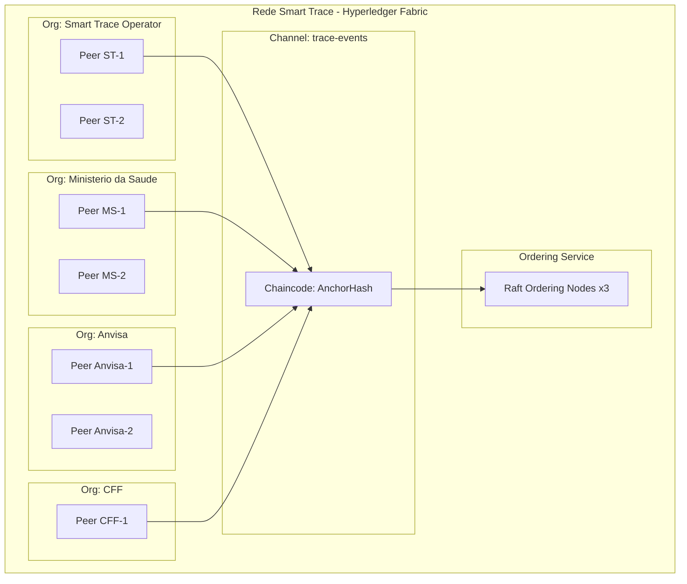

### 7.4 Chaincode (Smart Contract)

```
AnchorHash Chaincode:
  - anchorBatch(batch_id, merkle_root, event_count, timestamp)
  - verifyEvent(event_hash, batch_id, merkle_proof)
  - getBatch(batch_id) → {merkle_root, event_count, timestamp, tx_id}
  - getBatchesByRange(start_ts, end_ts) → [{batch_id, merkle_root, ...}]
```

### 7.5 Politica de Endorsement

- **Minimo 2 de 4 organizacoes** devem endossar cada transacao
- MS + pelo menos 1 outro org (Anvisa ou CFF)
- Garante que nenhuma organizacao sozinha pode adulterar o ledger

---

## 7A. Estrategia de Versionamento de API

### Abordagem

**Path-based versioning:** `/api/v1/`, `/api/v2/`

| Aspecto | Estrategia |
|---------|-----------|
| Estrutura URL | `/api/{version}/{resource}` |
| Formato versao | Major version only (v1, v2) |
| Header resposta | `X-API-Version: 1` |
| Deprecation header | `Sunset: <date>` |

### Politica de Deprecacao

1. **Suporte ativo:** Novas features, bug fixes, security patches
2. **Deprecado:** Apenas security patches, sunset date anunciado
3. **Periodo minimo de sunset:** 18 meses apos anuncio de deprecacao
4. **Notificacao:** Header `Sunset` em todas as respostas do endpoint deprecado

### Breaking vs Non-Breaking Changes

| Tipo de Mudanca | Requer Nova Versao? |
|-----------------|-------------------|
| Remover endpoint | Sim (v2) |
| Remover campo de response | Sim (v2) |
| Mudar tipo de campo | Sim (v2) |
| Tornar campo opcional obrigatorio | Sim (v2) |
| Adicionar novo endpoint | Nao |
| Adicionar campo opcional em request | Nao |
| Adicionar campo em response | Nao |
| Correcao de bug | Nao |

---

## 7B. Estrategia de Idempotencia

### Idempotency-Key Header

Todas as operacoes mutantes (POST, PUT, DELETE) em recursos criticos suportam idempotencia via header `Idempotency-Key`.

```http
POST /api/v1/dispensations
Idempotency-Key: a1b2c3d4-e5f6-4789-a0b1-c2d3e4f5g6h7
Content-Type: application/json
```

### Implementacao

| Aspecto | Especificacao |
|---------|--------------|
| Header | `Idempotency-Key: <UUID v4>` |
| Scope | Por endpoint + establishment_id |
| TTL | 24 horas |
| Storage | Redis (`idempotency:{endpoint}:{establishment_id}:{key}`) |
| Resposta | Resposta original cacheada e retornada |
| Header resposta | `X-Idempotent-Replayed: true/false` |

### Endpoints Criticos (Obrigatorio)

- `POST /dispensations`
- `POST /recalls`
- `POST /disposals`
- `POST /inventory/receipts`

### Deteccao de Conflito

Se `Idempotency-Key` existe mas body difere do original: retorna `409 Conflict`.

---

## 7C. Estrategia de Graceful Degradation

### Falhas de Sistemas Externos

Smart Trace mantem funcionalidade core mesmo quando sistemas externos estao indisponiveis.

| Sistema Externo | Impacto | Comportamento Degradado | HTTP |
|----------------|---------|------------------------|------|
| **SEFAZ** | Nao valida NF-e | Aceita dispensacao, marca `pending_nfe_validation`, retry async 48h | 201 (warning flag) |
| **Autorizador PFPB** | Nao reconcilia | Aceita dispensacao, fila para reconciliacao, revisao manual se nao resolvido em 7d | 201 (warning flag) |
| **Hyperledger Fabric** | Nao ancora hashes | Eventos escritos no TimescaleDB, hashes enfileirados, retry ate sucesso | 201 (warning flag) |
| **Keycloak** | Nao autentica | Circuit breaker abre, rejeita novos logins, tokens existentes validos ate expirar | 503 |

### Headers de Degradacao

```http
HTTP/1.1 201 Created
X-Degraded-Mode: true
X-Degraded-Reason: SEFAZ unavailable, NF-e validation queued
X-Degraded-Services: sefaz,pfpb-autorizador
```

### Circuit Breaker Thresholds

| Sistema | Failures / Janela | Timeout | Half-Open |
|---------|------------------|---------|-----------|
| SEFAZ | 5 / 1min | 30s | 1 req / 10s |
| PFPB | 10 / 1min | 60s | 1 req / 30s |
| HLF | 20 / 5min | 120s | 1 req / 60s |

### Status Endpoint

`GET /api/v1/status` — retorna saude de todos os servicos internos e externos.

---

## 7D. Estrategia de Migracao de Dados

### Onboarding de Farmacias Existentes

Farmacias possuem dados historicos em sistemas legados (ERP, Excel, XMLs SNGPC). Necessario caminho de migracao sem interromper operacoes.

### Abordagens por Tipo de Dado

| Tipo de Dado | Estrategia | Timeline | Validacao |
|--------------|----------|----------|-----------|
| **Dados cadastrais** | Cadastro manual + CSV bulk upload | Pre-onboarding (semana -2) | Validacao CNPJ, verificacao geofence |
| **Registro de RTs** | CSV upload com verificacao CRF | Pre-onboarding (semana -1) | Validacao registro profissional |
| **Catalogo de produtos** | Auto-sync do registro publico Anvisa | Automatizado | Match EAN/GTIN |
| **Estoque atual** | Snapshot upload (CSV/Excel) com lote/validade | D-day (go-live) | Relatorio de reconciliacao |
| **Historico (90 dias)** | Opcional: importacao XML SNGPC convertido em eventos | Pos-onboarding (mes 1) | Read-only, apenas audit trail |

### Periodo de Graca

**Primeiros 30 dias apos onboarding:**
- Discrepancias entre snapshot e movimentacoes reais: sinalizadas mas nao bloqueantes
- Farmacias podem submeter correcoes via Admin Console
- Apos 30 dias: enforcement estrito ativado

### Retencao de Dados Legados

- **XMLs SNGPC:** Retidos em Object Storage (read-only) por 7 anos (regulatorio)
- **Eventos migrados:** Marcados com `metadata.source: "migration"` para distinguir de eventos live
- **Log de migracao:** Retido indefinidamente

---

## 8. Tech Stack

### 8.1 Stack Completo

| Camada | Tecnologia | Versao | Justificativa |
|--------|-----------|--------|---------------|
| **Frontend** | Next.js (App Router) | 14+ | SSR, performance, RSC |
| **UI Library** | shadcn/ui + Tailwind | latest | Componentes acessiveis, customizaveis |
| **Mobile** | React Native + Expo | latest | Cross-platform, biometria nativa |
| **BFF** | NestJS + REST (Fase 1) / GraphQL Federation (Fase 2+) | 10+ | REST-only no MVP; GraphQL Federation quando houver multiplos portais |
| **Core Services** | NestJS (TypeScript) | 10+ | Produtividade, decorators, DI |
| **High-Perf Services** | Go (Fase 2+ se benchmarks exigirem) | 1.22+ | PFPB-Guard engine, EPID pipeline. Fase 1: NestJS-only (exceto chaincode Go) |
| **API Gateway** | Kong | 3.x | Rate limiting, auth, plugins |
| **Message Broker** | Apache Kafka | 3.7+ | Event sourcing, streaming, exactly-once |
| **OLTP Database** | PostgreSQL | 16 | Relacional, RLS, extensoes |
| **Event Store** | TimescaleDB | 2.x | Hypertables, compressao, retencao |
| **OLAP Database** | ClickHouse (Fase 2+) | 24.x | Analytics massivas, EPID, PFPB. Fase 1: TimescaleDB cobre OLTP+time-series |
| **Cache** | Redis Cluster | 7.x | Sessoes, rate limiting, geofence |
| **Search** | OpenSearch | 2.x | Auditoria full-text, logs |
| **Object Storage** | S3/MinIO | - | Evidencias, dossies, certificados |
| **Blockchain** | Hyperledger Fabric | 2.5 | Ledger permissionado |
| **IAM** | Keycloak | 24+ | OIDC, RBAC/ABAC, gov.br |
| **Secrets** | HashiCorp Vault | 1.x | KMS, HSM bridge, rotacao |
| **Container Orch** | Kubernetes (EKS/AKS) | 1.29+ | Orquestracao, escala, HA |
| **IaC** | Terraform + Helm | 1.7+ | Multi-cloud, modular |
| **CI/CD** | GitHub Actions + ArgoCD | - | GitOps, deploy progressivo |
| **Observability** | OpenTelemetry + Grafana Stack | - | Metricas/Logs/Traces unificados |
| **Monorepo** | pnpm + Turborepo | 2.x | Workspaces, cache, parallel |
| **Testing** | Vitest + Playwright + k6 | - | Unit/E2E/Load |

### 8.1A Preferencia por Managed Services (Fase 1)

Na Fase 1, para reduzir carga operacional sobre o time de DevOps (2 pessoas para 12+ componentes), priorizar servicos gerenciados:

| Componente | Self-Managed | Managed (Preferido Fase 1) |
|-----------|-------------|---------------------------|
| PostgreSQL/TimescaleDB | Manual K8s | **AWS RDS + TimescaleDB extension** |
| Kafka | K8s (Strimzi) | **AWS MSK** |
| Redis | K8s | **AWS ElastiCache** |
| OpenSearch | K8s | **AWS OpenSearch Service** |
| Kubernetes | Self-managed | **AWS EKS** |
| Vault | Self-managed | **AWS Secrets Manager** (Fase 1) / Vault (Fase 2+) |
| Object Storage | MinIO | **AWS S3** |

> **Principio:** Self-managed somente quando managed nao atende requisito especifico (ex: HLF, Kong plugins customizados).

### 8.2 Grafana Stack (Observabilidade)

| Componente | Funcao |
|-----------|--------|
| Grafana | Dashboards, alertas |
| Mimir | Metricas (Prometheus-compatible) |
| Loki | Logs agregados |
| Tempo | Traces distribuidos |
| OnCall | Incident management |

---

## 9. Estrutura do Monorepo

```
smart-trace/
├── .github/
│   ├── workflows/
│   │   ├── ci.yml                    # CI: lint, test, typecheck
│   │   ├── cd-staging.yml            # CD: deploy staging
│   │   ├── cd-production.yml         # CD: deploy production (manual)
│   │   └── security-scan.yml         # SAST, dependency audit
│   └── CODEOWNERS
│
├── apps/
│   ├── portal-farmacia/              # Next.js - Pharmacy Portal
│   │   ├── src/
│   │   │   ├── app/                  # App Router pages
│   │   │   ├── components/           # Portal-specific components
│   │   │   ├── hooks/                # Portal-specific hooks
│   │   │   └── lib/                  # Portal utilities
│   │   ├── next.config.ts
│   │   ├── package.json
│   │   └── tsconfig.json
│   │
│   ├── portal-industria/             # Next.js - Industry Portal
│   ├── portal-distribuidor/          # Next.js - Distributor Portal
│   ├── portal-descarte/              # Next.js - Disposal Portal
│   ├── portal-governo/               # Next.js - Government Portal
│   ├── console-admin/                # Next.js - Admin Console
│   │
│   └── app-rt/                       # React Native/Expo - RT Validation
│       ├── src/
│       │   ├── screens/
│       │   ├── components/
│       │   ├── services/
│       │   └── biometrics/           # Biometric + geofence modules
│       ├── app.json
│       └── package.json
│
├── services/
│   ├── gateway/                      # Kong configuration
│   │   ├── kong.yml
│   │   ├── plugins/
│   │   └── Dockerfile
│   │
│   ├── bff/                          # NestJS - Backend for Frontend
│   │   ├── src/
│   │   │   ├── modules/
│   │   │   │   ├── pharmacy/         # Pharmacy BFF module
│   │   │   │   ├── industry/         # Industry BFF module
│   │   │   │   ├── government/       # Government BFF module
│   │   │   │   └── admin/            # Admin BFF module
│   │   │   ├── graphql/              # GraphQL Federation
│   │   │   └── main.ts
│   │   ├── package.json
│   │   └── Dockerfile
│   │
│   ├── dispensation/                 # NestJS - Dispensation Service
│   │   ├── src/
│   │   │   ├── modules/
│   │   │   │   ├── dispensation/     # Core dispensation logic
│   │   │   │   ├── rt-validation/    # RT validation (biometric + geofence)
│   │   │   │   ├── prescription/     # Prescription linking
│   │   │   │   ├── policy/           # Policy engine (controlled substances)
│   │   │   │   └── compliance/       # Compliance dashboard data
│   │   │   ├── events/               # Event publishers
│   │   │   └── main.ts
│   │   ├── test/
│   │   ├── package.json
│   │   └── Dockerfile
│   │
│   ├── inventory/                    # NestJS - Inventory/SNGPC Service
│   │   ├── src/
│   │   │   ├── modules/
│   │   │   │   ├── inventory/        # Stock management
│   │   │   │   ├── fiscal/           # NF-e validation, fiscal integrity
│   │   │   │   ├── sngpc/            # SNGPC exports
│   │   │   │   └── reconciliation/   # Stock vs events reconciliation
│   │   │   └── main.ts
│   │   ├── package.json
│   │   └── Dockerfile
│   │
│   ├── pfpb-guard/                   # NestJS + Go - Anti-fraud Service
│   │   ├── cmd/                      # Go entrypoints
│   │   │   ├── rules-engine/         # Go rules engine
│   │   │   └── anomaly-detector/     # Go anomaly detection
│   │   ├── src/                      # NestJS orchestration
│   │   │   ├── modules/
│   │   │   │   ├── reconciliation/   # PFPB reconciliation
│   │   │   │   ├── risk-scoring/     # Risk scoring
│   │   │   │   ├── dossier/          # Dossier generation
│   │   │   │   └── fiscal-queue/     # Fiscal queue management
│   │   │   └── main.ts
│   │   ├── package.json
│   │   ├── go.mod
│   │   └── Dockerfile
│   │
│   ├── epid/                         # Go - Epidemiological Service
│   │   ├── cmd/
│   │   │   └── epid-service/
│   │   ├── internal/
│   │   │   ├── ingestion/            # Event ingestion pipeline
│   │   │   ├── anonymizer/           # LGPD anonymization
│   │   │   ├── patterns/             # Pattern detection
│   │   │   ├── alerts/               # Alert engine (N1/N2/N3)
│   │   │   ├── geo/                  # Geo aggregation
│   │   │   └── rnds/                 # RNDS integration
│   │   ├── go.mod
│   │   └── Dockerfile
│   │
│   ├── lifecycle/                    # NestJS - Recalls/Disposal Service
│   │   ├── src/
│   │   │   ├── modules/
│   │   │   │   ├── recall/           # Recall management
│   │   │   │   ├── blocking/         # Lot blocking engine
│   │   │   │   ├── collection/       # Collection scheduling
│   │   │   │   ├── tracking/         # Disposal tracking
│   │   │   │   ├── certificate/      # Certificate generation
│   │   │   │   └── compliance/       # Environmental compliance
│   │   │   └── main.ts
│   │   ├── package.json
│   │   └── Dockerfile
│   │
│   ├── integration-hub/              # NestJS - External Integrations
│   │   ├── src/
│   │   │   ├── connectors/
│   │   │   │   ├── sefaz/            # NF-e connector
│   │   │   │   ├── sngpc/            # SNGPC connector
│   │   │   │   ├── pfpb/             # PFPB Autorizador connector
│   │   │   │   ├── rnds/             # RNDS FHIR connector
│   │   │   │   └── disposal/         # Disposal companies connector
│   │   │   ├── resilience/           # Retry, circuit breaker, idempotency
│   │   │   └── main.ts
│   │   ├── package.json
│   │   └── Dockerfile
│   │
│   ├── ledger/                       # Go - Ledger/Blockchain Service
│   │   ├── cmd/
│   │   │   └── ledger-service/
│   │   ├── internal/
│   │   │   ├── hasher/               # Event hashing
│   │   │   ├── merkle/               # Merkle tree computation
│   │   │   ├── anchor/               # HLF anchoring
│   │   │   └── verify/               # Verification API
│   │   ├── chaincode/                # Hyperledger Fabric chaincode
│   │   │   └── anchor-hash/
│   │   ├── go.mod
│   │   └── Dockerfile
│   │
│   ├── notification/                 # NestJS - Notification Service
│   │   ├── src/
│   │   │   ├── channels/             # Email, SMS, push, webhook
│   │   │   ├── templates/            # Notification templates
│   │   │   └── main.ts
│   │   ├── package.json
│   │   └── Dockerfile
│   │
│   ├── audit/                        # NestJS - Audit Service
│   │   ├── src/
│   │   │   ├── modules/
│   │   │   │   ├── logger/           # Immutable audit logging
│   │   │   │   └── query/            # Audit trail queries
│   │   │   └── main.ts
│   │   ├── package.json
│   │   └── Dockerfile
│   │
│   └── analytics/                    # Go - Analytics Service
│       ├── cmd/
│       │   └── analytics-service/
│       ├── internal/
│       │   ├── aggregation/          # Real-time aggregations
│       │   ├── kpi/                  # KPI computation
│       │   └── dashboard/            # Dashboard data API
│       ├── go.mod
│       └── Dockerfile
│
├── packages/
│   ├── shared-types/                 # TypeScript shared types
│   │   ├── src/
│   │   │   ├── events.ts             # Event types
│   │   │   ├── entities.ts           # Entity types
│   │   │   ├── api.ts                # API request/response types
│   │   │   └── index.ts
│   │   └── package.json
│   │
│   ├── shared-utils/                 # Common utilities
│   │   ├── src/
│   │   │   ├── crypto.ts             # Hashing, pseudonymization
│   │   │   ├── validation.ts         # Input validation schemas (Zod)
│   │   │   ├── geofence.ts           # Geofence utilities
│   │   │   └── index.ts
│   │   └── package.json
│   │
│   ├── ui-components/                # Shared UI component library
│   │   ├── src/
│   │   │   ├── components/           # shadcn/ui based components
│   │   │   ├── layouts/              # Shared layouts
│   │   │   └── index.ts
│   │   └── package.json
│   │
│   ├── sdk-pharmacy/                 # SDK for Pharmacy ERP integration
│   │   ├── src/
│   │   │   ├── client.ts             # REST client
│   │   │   ├── events.ts             # Event submission
│   │   │   ├── inventory.ts          # Inventory operations
│   │   │   └── index.ts
│   │   ├── package.json
│   │   └── README.md
│   │
│   ├── sdk-industry/                 # SDK for Industry systems
│   │   ├── src/
│   │   │   ├── client.ts
│   │   │   ├── tracking.ts
│   │   │   ├── recalls.ts
│   │   │   └── index.ts
│   │   └── package.json
│   │
│   ├── sdk-distributor/              # SDK for Distributor systems
│   │   └── package.json
│   │
│   ├── event-schema/                 # Event schema validation (Avro/JSON Schema)
│   │   ├── schemas/
│   │   │   ├── dispensation.avsc
│   │   │   ├── receipt.avsc
│   │   │   ├── recall.avsc
│   │   │   └── disposal.avsc
│   │   └── package.json
│   │
│   ├── kafka-client/                 # Shared Kafka producer/consumer
│   │   ├── src/
│   │   │   ├── producer.ts
│   │   │   ├── consumer.ts
│   │   │   └── config.ts
│   │   └── package.json
│   │
│   └── db-migrations/                # Database migrations
│       ├── migrations/
│       │   ├── 001_initial_schema.sql
│       │   ├── 002_timescale_hypertables.sql
│       │   └── 003_indexes.sql
│       └── package.json
│
├── infra/
│   ├── terraform/
│   │   ├── modules/
│   │   │   ├── networking/           # VPC, subnets, security groups
│   │   │   ├── kubernetes/           # EKS/AKS cluster
│   │   │   ├── databases/            # RDS PostgreSQL, ElastiCache
│   │   │   ├── kafka/                # MSK/Confluent
│   │   │   ├── storage/              # S3, MinIO config
│   │   │   ├── monitoring/           # Grafana stack
│   │   │   ├── security/             # WAF, KMS, Vault
│   │   │   └── blockchain/           # HLF network infra
│   │   ├── environments/
│   │   │   ├── dev/
│   │   │   ├── staging/
│   │   │   └── production/
│   │   └── main.tf
│   │
│   ├── kubernetes/
│   │   ├── base/                     # Kustomize base
│   │   │   ├── namespaces.yml
│   │   │   ├── network-policies.yml
│   │   │   └── resource-quotas.yml
│   │   ├── overlays/
│   │   │   ├── dev/
│   │   │   ├── staging/
│   │   │   └── production/
│   │   └── helm/
│   │       ├── smart-trace/          # Umbrella Helm chart
│   │       └── charts/
│   │           ├── dispensation/
│   │           ├── inventory/
│   │           ├── pfpb-guard/
│   │           ├── epid/
│   │           └── lifecycle/
│   │
│   ├── docker/
│   │   ├── docker-compose.dev.yml    # Local development
│   │   ├── docker-compose.test.yml   # Integration tests
│   │   └── Dockerfile.base           # Base image
│   │
│   └── scripts/
│       ├── setup-dev.sh              # Dev environment setup
│       ├── seed-data.sh              # Seed test data
│       └── hlf-network.sh            # HLF network setup
│
├── docs/
│   ├── architecture/
│   │   ├── c4-diagrams.md            # This document
│   │   ├── adrs/                     # Architecture Decision Records
│   │   └── data-model.md
│   ├── api/
│   │   ├── openapi/                  # OpenAPI specs
│   │   │   ├── dispensation.yaml
│   │   │   ├── inventory.yaml
│   │   │   ├── pfpb-guard.yaml
│   │   │   ├── lifecycle.yaml
│   │   │   └── public-sdk.yaml
│   │   └── graphql/                  # GraphQL schemas
│   ├── operations/
│   │   ├── runbooks/                 # Operational runbooks
│   │   ├── sre-handbook.md
│   │   └── dr-plan.md
│   ├── security/
│   │   ├── threat-model.md
│   │   ├── dpia.md                   # LGPD DPIA
│   │   └── pentest-plan.md
│   └── user-guides/
│       ├── pharmacy/
│       ├── industry/
│       ├── government/
│       └── admin/
│
├── tests/
│   ├── integration/                  # Integration tests
│   │   ├── dispensation.test.ts
│   │   ├── pfpb-guard.test.ts
│   │   └── lifecycle.test.ts
│   ├── e2e/                          # End-to-end tests (Playwright)
│   │   ├── pharmacy-portal.spec.ts
│   │   └── government-portal.spec.ts
│   ├── load/                         # Load tests (k6)
│   │   ├── dispensation-load.js
│   │   ├── epid-pipeline-load.js
│   │   └── scenarios/
│   └── contracts/                    # Contract tests (Pact)
│       └── sdk-pharmacy.pact.ts
│
├── turbo.json                        # Turborepo configuration
├── pnpm-workspace.yaml               # pnpm workspace definition
├── package.json                      # Root package.json
├── tsconfig.base.json                # Base TypeScript config
├── .env.example                      # Environment variables template
├── .gitignore
└── README.md
```

---

## 10. RBAC/ABAC

### 10.1 Modelo de Permissoes

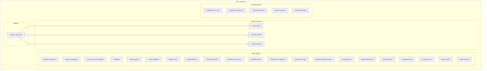

### 10.2 Matriz de Permissoes por Perfil

| Recurso | pharmacy:operator | pharmacy:manager | rt:validator | industry:quality | government:anvisa | admin:system |
|---------|:-:|:-:|:-:|:-:|:-:|:-:|
| Dispensar medicamento | W | W | - | - | - | - |
| Validar presenca RT | - | - | W | - | - | - |
| Ver estoque proprio | R | R/W | - | - | - | - |
| Ver estoque rede | - | R | - | - | R | R |
| Emitir recall | - | - | - | W | W | - |
| Ver dossie PFPB | - | - | - | - | R | R |
| Configurar regras | - | - | - | - | - | W |
| Ver alertas EPID | - | - | - | - | R | R |
| Auditoria completa | - | - | - | - | R | R |
| Gestao usuarios | - | - | - | - | - | W |

### 10.3 Principios de Seguranca

- **Menor privilegio:** Cada perfil acessa apenas o minimo necessario
- **Segregacao de funcoes:** Quem dispensa != quem audita
- **Scope por estabelecimento:** Operadores veem apenas seu estabelecimento
- **Scope geografico:** Orgaos regionais (CRFs) veem apenas sua UF
- **MFA obrigatorio:** Para perfis governamentais e admin
- **Certificado digital:** Obrigatorio para RT (ICP-Brasil A1/A3)
- **Audit trail completo:** Toda acao gera log imutavel
- **Multi-tenant nativo:** Isolamento por establishment_id em todas as queries

---

## 11. Estrategia LGPD

### 11.1 Classificacao de Dados

| Dado | Classificacao | Tratamento |
|------|--------------|------------|
| CPF paciente | Sensivel | Pseudonimizado (SHA-256 + salt rotativo) |
| Biometria RT | Sensivel | Armazenado em Object Storage criptografado, retencao limitada |
| Geolocalizacao | Pessoal | Armazenado com consentimento, anonimizado para EPID |
| CNPJ estabelecimento | Publico | Sem restricao |
| Dados medicamento | Regulatorio | Retencao longa (7 anos) |
| Eventos dispensacao | Regulatorio + Pessoal | Pseudonimizado para analytics |

### 11.2 Pseudonimizacao

```
patient_pseudo_id = SHA-256(CPF + rotating_salt)

- Salt rotacionado mensalmente
- Tabela de mapeamento (pseudo_id ↔ CPF) armazenada separadamente
- Acesso a tabela de mapeamento: apenas com autorizacao judicial ou MS
- Destruicao do salt antigo apos periodo de retencao
```

### 11.2A Salt Rotation Reconciliation

A rotacao mensal do salt de pseudonimizacao cria um desafio: registros antigos possuem `patient_pseudo_id` gerados com salt anterior, quebrando joins e consultas.

**Estrategia de Reconciliacao:**

```
1. Shadow Period (7 dias antes da rotacao):
   - Gerar AMBOS pseudo_ids (salt atual + salt novo)
   - Armazenar ambos na tabela de mapeamento
   - Novos registros ja incluem dual pseudo_id

2. Rotacao:
   - Ativar salt novo como primario
   - Manter salt antigo como readonly por 30 dias

3. Reconciliacao (D+1 a D+7 pos-rotacao):
   - Job batch atualiza read models com novo pseudo_id
   - Tabela pseudo_id_mapping (old_pseudo_id, new_pseudo_id, salt_version, migrated_at)
   - Validacao: count(unmigrated) = 0

4. Cleanup (D+30):
   - Destruir salt antigo
   - Remover old_pseudo_id da tabela de mapeamento
```

### 11.3 Requisitos LGPD

| Requisito | Implementacao |
|-----------|--------------|
| DPIA | **MUST antes da Fase 2** - documento obrigatorio antes de pilotos com dados reais |
| Consentimento | Termos no cadastro do paciente (via farmacia) |
| Direito ao esquecimento | Anonimizacao irreversivel (destruicao do salt/mapping) |
| Portabilidade | API de exportacao dados pessoais |
| Minimizacao | Apenas dados necessarios por modulo |
| Retencao | Politicas por tipo de dado, eliminacao automatica |
| Encarregado (DPO) | Definido no MS, contato publico |

### 11.4 Tratamento de Expiracao de Certificados ICP-Brasil

Certificados digitais A1/A3 do ICP-Brasil possuem validade e podem expirar durante operacao critica.

| Cenario | Tratamento |
|---------|-----------|
| Certificado expira durante horario comercial | Grace period de **48h** para renovacao, operacoes continuam com flag `cert_grace_period=true` |
| Certificado expirado > 48h | Bloquear operacoes que exigem assinatura digital, notificar RT e gerente |
| Renovacao | Re-validar certificado via OCSP/CRL, atualizar vault, emitir evento `CERT_RENEWED` |
| Fallback | Se CRL/OCSP indisponivel, aceitar certificado com `cert_validation=cached` (ultimo check < 24h) |

**Monitoramento:**
- Alerta 30 dias antes da expiracao (email + push)
- Alerta 7 dias antes (critico, bloqueia novas dispensacoes em 48h)
- Dashboard de certificados proximos a expirar por UF/estabelecimento

---

## 12. NFRs e Infraestrutura

### 12.1 SLA e Performance

| Metrica | Target Fase 1 | Target Fase 2+ | Medicao |
|---------|--------------|----------------|---------|
| Disponibilidade servicos criticos | >= **99.5%** (43.8h downtime/ano) | >= 99.9% (8.76h/ano) | Uptime monitoring |
| Latencia validacao RT | < 500ms p95 **(backend-only, nao E2E)** | < 500ms p95 E2E | OpenTelemetry |
| Latencia bloqueio recall | < 2h (end-to-end) | < 2h | Business metric |
| Throughput eventos | **Design 100k/dia, stress test 1M/dia** | 5M eventos/dia (pico) | Kafka metrics |
| Latencia API (read) | < 200ms p95 | < 200ms p95 | API Gateway metrics |
| Latencia API (write) | < 500ms p95 | < 500ms p95 | API Gateway metrics |
| Alerta EPID | N/A (Fase 2) | < 48h | Business metric |
| Projecao read model (dispensacao) | < 2s | < 2s | Event Store metrics |

> **Nota:** Targets Fase 1 sao para ambiente de piloto controlado (~100 farmacias). Fase 2+ reflete pilotos ampliados e operacao nacional.

### 12.2 Estrategia de DR

| Componente | RPO | RTO | Estrategia |
|-----------|-----|-----|------------|
| PostgreSQL | 5 min | 30 min | Multi-AZ, streaming replication |
| TimescaleDB | 5 min | 30 min | Multi-AZ, continuous archiving |
| Kafka | 0 (sync replication) | 5 min | Multi-AZ, min.insync.replicas=2 |
| ClickHouse | 1h | 2h | Replicacao assincrona, rebuild from Kafka |
| Redis | 15 min | 5 min | Redis Cluster, AOF |
| Object Storage | 0 | 0 | S3 11-nines durability |
| HLF | 0 | 1h | Multi-org peers em DCs diferentes |

### 12.3 Observabilidade

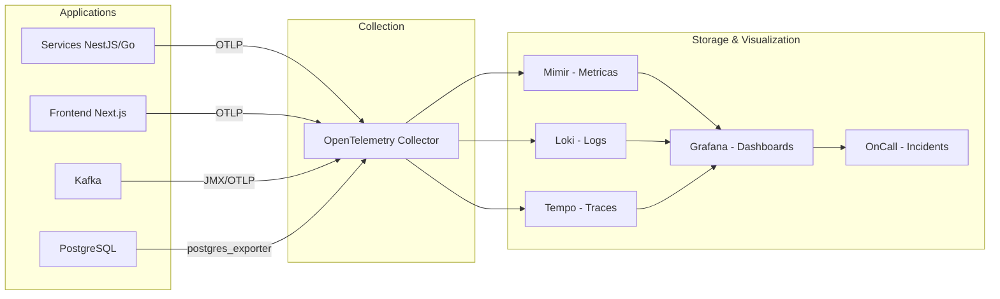

### 12.4 Seguranca Infraestrutura

| Camada | Controle |
|--------|---------|
| Network | VPC isolada, subnets privadas, security groups, NACLs |
| API | WAF, rate limiting, DDoS protection, mTLS inter-service |
| Data in transit | TLS 1.3 obrigatorio, mTLS entre servicos |
| Data at rest | AES-256 (KMS managed), transparent encryption |
| Secrets | Vault com HSM backend, rotacao automatica |
| Access | Zero trust, service mesh (Istio/Linkerd) |
| Monitoring | SIEM (CloudWatch/Sentinel), alertas anomalia |
| Compliance | SOC 2, ISO 27001 (roadmap), LGPD |

### 12.5 FinOps

| Estrategia | Descricao |
|-----------|-----------|
| Right-sizing | Auto-scaling baseado em metricas de negocio |
| Reserved instances | Workloads previsveis (databases, Kafka) |
| Spot instances | Workloads tolerantes a interrupcao (analytics batch) |
| Data lifecycle | Tiering automatico (hot → warm → cold → archive) |
| Cost allocation | Tags por modulo/ambiente, dashboards de custo |
| Budget alerts | Alertas por threshold percentual |

---

## 13. Backlog Priorizado por Fase

### Staffing Risk (Fase 1)

| Risco | Impacto | Mitigacao |
|-------|---------|----------|
| 1 DevOps para 12+ componentes infra | Bottleneck critico, single point of failure | **Minimo 2 DevOps/SRE** no time Fase 1 |
| NestJS + Go dual stack Fase 1 | Complexidade de tooling, recrutamento | NestJS-only Fase 1 (exceto chaincode Go) |
| HLF sem equipe especializada | Atraso na integracao blockchain | Fallback PostgreSQL, contratar HLF specialist Fase 1B |
| TimescaleDB + PostgreSQL + Kafka + Redis + OpenSearch | 5 datastores para operar | Managed services (RDS, MSK, ElastiCache) |

### Fase 1A: Foundation + Core MVP (6 semanas)

**Objetivo:** Infraestrutura base, event sourcing funcional, dispensacao com RT mock, portal farmacia basico.

| Epic | Descricao | Estimativa | Prioridade |
|------|-----------|-----------|------------|
| **E1 - Foundation** | Monorepo, CI/CD, IaC base, IAM | 3 semanas | P0 |
| E1.1 | Setup monorepo (Turborepo, pnpm, configs) | 3d | |
| E1.2 | CI pipeline (lint, test, typecheck, build) | 2d | |
| E1.3 | Terraform base (VPC, EKS dev, RDS, Redis) | 5d | |
| E1.4 | Keycloak + gov.br OIDC integration | 3d | |
| E1.5 | Kong API Gateway setup | 2d | |
| **E2 - Event Core** | Schema, Event Store, Kafka | 2 semanas | P0 |
| E2.1 | Event schema (Avro/JSON Schema) | 3d | |
| E2.2 | TimescaleDB hypertable + migrations | 3d | |
| E2.3 | Kafka cluster + topics setup | 2d | |
| E2.4 | Shared Kafka client package | 2d | |
| **E3 - Dispensation Service** | Core do MVP | 3 semanas | P0 |
| E3.1 | API REST - dispensation CRUD | 4d | |
| E3.2 | RT validation (**mock mode**: flag `RT_VALIDATION_MODE=mock`) | 5d | |
| E3.3 | Prescription linking | 3d | |
| E3.4 | Policy engine (controlados basic) | 3d | |
| **E5 - Portal Farmacia MVP** | UI dispensacao | 2 semanas | P1 |
| E5.1 | Auth flow (Keycloak) | 2d | |
| E5.2 | Tela de dispensacao | 4d | |
| E5.3 | Dashboard conformidade basico | 3d | |
| E5.4 | Consulta eventos | 1d | |
| **E8 - Observability Base** | Monitoring foundation | 1 semana | P0 |
| E8.1 | OpenTelemetry instrumentation | 3d | |
| E8.2 | Grafana dashboards (infra + business) | 2d | |

**Total Fase 1A: ~6 semanas**

#### Decision Point: Fim da Fase 1A

Antes de iniciar Fase 1B, avaliar:

| Criterio | Decisao |
|----------|---------|
| Consorcio HLF (MS/Anvisa/CFF) formado? | **Sim** → E4 com HLF / **Nao** → E4 com PostgreSQL fallback |
| NestJS atende SLAs de dispensacao? | **Sim** → Manter NestJS-only / **Nao** → Planejar Go para Fase 2 |
| Managed services adequados? | **Sim** → Manter / **Nao** → Planejar self-managed para servico especifico |

---

### Fase 1B: Ledger + Mobile + SDK + Demo (6 semanas)

**Objetivo:** Integracao ledger (HLF ou fallback), app RT com biometria real, SDK farmacia, proof of value.

| Epic | Descricao | Estimativa | Prioridade |
|------|-----------|-----------|------------|
| **E4 - Ledger Integration** | Blockchain anchoring (ou PostgreSQL fallback) | 2 semanas | P0 |
| E4.1 | HLF network setup (dev, 2 orgs) OU PostgreSQL immutable setup | 5d | |
| E4.2 | AnchorHash chaincode OU hash anchoring service | 3d | |
| E4.3 | Merkle tree + hash batching | 2d | |
| **E6 - App RT MVP** | Mobile validation | 2 semanas | P1 |
| E6.1 | Expo project setup + auth | 2d | |
| E6.2 | Biometric capture (fingerprint/face) | 4d | |
| E6.3 | Geofence validation | 3d | |
| E6.4 | Dispensation authorization flow | 1d | |
| **E7 - SDK Pharmacy v1** | ERP integration | 1 semana | P1 |
| E7.1 | REST client library (com Idempotency-Key support) | 3d | |
| E7.2 | Event submission API | 2d | |
| **E9 - Proof of Value** | Documentacao e demo | 1 semana | P0 |
| E9.1 | Relatorio tecnico de viabilidade | 3d | |
| E9.2 | Demo environment + dados de teste | 2d | |

**Total Fase 1B: ~6 semanas**

**Total Fase 1 (1A + 1B): ~12 semanas de desenvolvimento (time de 7-8 pessoas incluindo 2 DevOps)**

---

### Fase 2: Pilotos Ampliados (M4-M9)

**Objetivo:** PFPB-Guard operacional, recalls funcionando, pilotos em UFs selecionadas.

| Epic | Descricao | Estimativa | Prioridade |
|------|-----------|-----------|------------|
| **E10 - Inventory/SNGPC** | Estoque e fiscal | 4 semanas | P0 |
| E10.1 | Inventory management API | 5d | |
| E10.2 | NF-e validation (SEFAZ connector) | 5d | |
| E10.3 | SNGPC export | 4d | |
| E10.4 | Reconciliacao estoque vs eventos | 3d | |
| E10.5 | Painel divergencias | 3d | |
| **E11 - PFPB-Guard** | Motor antifraude | 6 semanas | P0 |
| E11.1 | Kafka consumer + event processing | 3d | |
| E11.2 | Rules engine (Go) | 8d | |
| E11.3 | PFPB reconciliation connector | 5d | |
| E11.4 | Anomaly detection (temporal/geo/behavioral) | 8d | |
| E11.5 | Risk scoring engine | 3d | |
| E11.6 | Dossier generator | 3d | |
| E11.7 | Fiscal queue management | 2d | |
| E11.8 | Evidence repository (5yr retention) | 2d | |
| **E12 - Lifecycle** | Recalls e descarte | 4 semanas | P0 |
| E12.1 | Recall management API | 4d | |
| E12.2 | Lot blocking engine (<2h SLA) | 5d | |
| E12.3 | Collection scheduling | 3d | |
| E12.4 | Disposal tracking | 3d | |
| E12.5 | Certificate generation + ledger | 3d | |
| E12.6 | Environmental compliance reports | 2d | |
| **E13 - Integration Hub** | Conectores externos | 3 semanas | P0 |
| E13.1 | Connector framework (retry, idempotency, circuit breaker) | 5d | |
| E13.2 | SEFAZ connector (NF-e full) | 4d | |
| E13.3 | SNGPC connector | 3d | |
| E13.4 | PFPB Autorizador connector | 3d | |
| **E14 - Portal Industria** | UI industria | 3 semanas | P1 |
| E14.1 | Rastreio lotes e producao | 4d | |
| E14.2 | Gestao recalls | 4d | |
| E14.3 | Remessas SUS | 3d | |
| E14.4 | Relatorios e dashboards | 3d | |
| **E15 - Portal Distribuidor** | UI distribuidor | 2 semanas | P1 |
| E15.1 | Movimentacoes (recebimento/expedicao) | 4d | |
| E15.2 | Trilha logistica | 3d | |
| E15.3 | Conferencia | 3d | |
| **E16 - Portal Descarte** | UI descarte | 2 semanas | P1 |
| E16.1 | Agendamento coleta | 3d | |
| E16.2 | Tracking e registro etapas | 3d | |
| E16.3 | Emissao certificados | 2d | |
| **E17 - Portal Governo (Basic)** | UI governo | 3 semanas | P1 |
| E17.1 | Dashboard KPIs nacionais | 4d | |
| E17.2 | Fila fiscalizacao PFPB | 3d | |
| E17.3 | Consulta dossies | 3d | |
| E17.4 | Alertas recalls | 2d | |
| **E18 - EPID Basic** | Pipeline basico | 3 semanas | P1 |
| E18.1 | Event ingestion pipeline | 3d | |
| E18.2 | Anonymizer (LGPD) | 3d | |
| E18.3 | ClickHouse setup + data ingestion | 4d | |
| E18.4 | Basic pattern detection | 3d | |
| E18.5 | Alert N1/N2 | 2d | |
| **E19 - Multi-tenant & Scale** | Preparacao piloto | 2 semanas | P0 |
| E19.1 | Multi-tenant enforcement (RLS) | 5d | |
| E19.2 | Load testing (k6) | 3d | |
| E19.3 | Performance tuning | 2d | |
| **E20 - Notification Service** | Notificacoes completas | 2 semanas | P1 |
| E20.1 | Email + SMS channels | 3d | |
| E20.2 | Push notifications | 3d | |
| E20.3 | Webhook delivery | 2d | |
| E20.4 | Templates management | 2d | |

**Total Fase 2: ~34 semanas de desenvolvimento (time de 8-12 devs = ~6 meses)**

---

### Fase 3: Expansao Nacional (M9-M18)

| Epic | Descricao | Estimativa |
|------|-----------|-----------|
| **E21 - EPID Full** | Pipeline completo <48h | 5 semanas |
| E21.1 | Advanced pattern detection (ML-assisted) | 8d |
| E21.2 | Geo aggregation (UF/municipio) | 5d |
| E21.3 | Alert N3 (critico) | 3d |
| E21.4 | RNDS integration (FHIR) | 5d |
| E21.5 | Dashboards epidemiologicos | 4d |
| **E22 - Portal Governo Full** | Auditoria completa | 4 semanas |
| E22.1 | Investigacoes e workflows | 5d |
| E22.2 | Gestao recalls pela Anvisa | 4d |
| E22.3 | Relatorios CGU/TCU | 4d |
| E22.4 | Dashboards por UF/municipio | 3d |
| E22.5 | Exportacao dados | 2d |
| **E23 - Console Admin** | Administracao completa | 3 semanas |
| E23.1 | Gestao cadastros e parametros | 4d |
| E23.2 | Gestao perfis e permissoes | 4d |
| E23.3 | Chaves e certificados | 3d |
| E23.4 | Monitoramento integracao | 2d |
| E23.5 | Gestao incidentes | 2d |
| **E24 - SDK v2** | SDKs industria/distribuidor | 3 semanas |
| E24.1 | SDK Industry (tracking, recalls) | 5d |
| E24.2 | SDK Distributor (movements) | 4d |
| E24.3 | SDK documentation + sandbox | 3d |
| E24.4 | Contract tests (Pact) | 3d |
| **E25 - HA/DR Production** | Producao nacional | 4 semanas |
| E25.1 | Multi-AZ deployment | 5d |
| E25.2 | DR site (passive) | 5d |
| E25.3 | DR testing + runbooks | 4d |
| E25.4 | HLF production network (4 orgs) | 3d |
| E25.5 | Backup/restore validation | 3d |
| **E26 - Security Hardening** | Seguranca producao | 3 semanas |
| E26.1 | Pentest (external) | 5d |
| E26.2 | SIEM integration | 4d |
| E26.3 | WAF tuning | 2d |
| E26.4 | mTLS service mesh | 3d |
| E26.5 | Security incident runbooks | 2d |
| **E27 - Performance National** | Escala nacional | 3 semanas |
| E27.1 | CDN optimization | 3d |
| E27.2 | Database sharding strategy | 5d |
| E27.3 | Kafka partitioning optimization | 3d |
| E27.4 | Caching strategy review | 2d |
| E27.5 | Load test (national scale) | 2d |
| **E28 - Observability Full** | Obs completa | 2 semanas |
| E28.1 | Business metrics dashboards | 4d |
| E28.2 | SLO/SLI definitions | 3d |
| E28.3 | OnCall integration | 3d |

**Total Fase 3: ~27 semanas (time de 10-15 devs = ~9 meses com overlap)**

---

### Fase 4: Operacao Nacional (Continuo)

| Area | Atividades |
|------|-----------|
| SRE | Operacao 24x7, incident response, postmortems, SLO tracking |
| FinOps | Cost optimization, right-sizing, reserved instances review |
| Feature Evolution | Novos conectores, melhorias UX, ML-assisted detection |
| Compliance | Auditorias periodicas, LGPD compliance reviews, updates regulatorios |
| API Versioning | Backward compatibility, deprecation cycles, SDK updates |
| Capacity Planning | Growth projections, scaling decisions, infrastructure review |

---

## 14. Cronograma e Marcos

```mermaid
gantt
    title Smart Trace - Cronograma por Fase
    dateFormat YYYY-MM-DD
    axisFormat %b %Y

    section Fase 1A - Foundation + Core
    E1 Foundation           :f1, 2026-03-01, 3w
    E2 Event Core           :f2, after f1, 2w
    E8 Observability Base   :f8, after f1, 1w
    E3 Dispensation (RT mock) :f3, after f2, 3w
    E5 Portal Farmacia MVP  :f5, after f3, 2w
    Decision Point 1A       :milestone, dp1, after f5, 0d

    section Fase 1B - Ledger + Mobile + SDK
    E4 Ledger Integration   :f4, after dp1, 2w
    E6 App RT MVP           :f6, after dp1, 2w
    E7 SDK Pharmacy v1      :f7, after f4, 1w
    E9 Proof of Value       :f9, after f6, 1w
    Marco: MVP Demo         :milestone, m1, after f9, 0d

    section Fase 2 - Pilotos
    E10 Inventory/SNGPC     :p10, 2026-06-01, 4w
    E13 Integration Hub     :p13, 2026-06-01, 3w
    E11 PFPB-Guard          :p11, after p13, 6w
    E12 Lifecycle           :p12, after p10, 4w
    E18 EPID Basic          :p18, after p10, 3w
    E14 Portal Industria    :p14, after p12, 3w
    E15 Portal Distribuidor :p15, after p12, 2w
    E16 Portal Descarte     :p16, after p12, 2w
    E17 Portal Governo Basic :p17, after p11, 3w
    E19 Multi-tenant Scale  :p19, after p11, 2w
    E20 Notification        :p20, after p13, 2w
    Marco: Piloto UF1       :milestone, m2, 2026-09-01, 0d
    Marco: Piloto Ampliado  :milestone, m3, 2026-11-30, 0d

    section Fase 3 - Nacional
    E21 EPID Full           :n21, 2026-12-01, 5w
    E22 Portal Governo Full :n22, 2027-01-01, 4w
    E23 Console Admin       :n23, 2027-01-01, 3w
    E24 SDK v2              :n24, 2027-02-01, 3w
    E25 HA/DR Production    :n25, 2027-02-01, 4w
    E26 Security Hardening  :n26, after n25, 3w
    E27 Performance Natl    :n27, after n25, 3w
    E28 Observability Full  :n28, after n26, 2w
    Marco: Go-Live Nacional :milestone, m4, 2027-07-01, 0d
```

### Marcos Chave

| Marco | Data Target | Criterio de Aceitacao |
|-------|------------|----------------------|
| **DP1 - Decision Point 1A** | D+42 (~Abr 2026) | Infra funcional, dispensacao com RT mock, portal farmacia. Decisao HLF vs fallback |
| **M1 - MVP Demo** | D+84 (~Jun 2026) | Fluxo dispensacao E2E com RT real, ledger anchoring (HLF ou fallback), portal basico |
| **M2 - Piloto UF1** | M6 (~Set 2026) | PFPB-Guard + SNGPC do Fato + Recalls em 1 UF piloto |
| **M3 - Piloto Ampliado** | M9 (~Dez 2026) | 3+ UFs, todos portais, EPID basic, metricas de fraude |
| **M4 - Go-Live Nacional** | M18 (~Jul 2027) | Operacao nacional, HA/DR testado, SLA 99.5% (Fase 1) → 99.9% (Fase 3) |

---

## 15. ADRs - Architecture Decision Records

### ADR-001: Event Sourcing como Fonte da Verdade

**Status:** Proposto
**Contexto:** O sistema precisa de trilha de auditoria imutavel e replay de eventos.
**Decisao:** Adotar Event Sourcing com CQRS. Eventos sao append-only em TimescaleDB. Read models projetados em PostgreSQL e ClickHouse.
**Consequencias:** (+) Imutabilidade nativa, replay, auditoria. (-) Complexidade de eventual consistency, necessidade de projecoes.
**Requisitos de Performance de Projecao:**
- Portal Farmacia read model: projecao em < 2s apos write
- Projecao sincrona obrigatoria para feedback de dispensacao (operador precisa de resposta imediata)
- Demais projecoes (compliance dashboard, analytics): eventual consistency aceitavel (< 30s)

### ADR-002: Merkle Tree Anchoring vs Full On-Chain

**Status:** Proposto
**Contexto:** Requisito de imutabilidade com conformidade LGPD.
**Decisao:** Ancorar apenas Merkle roots on-chain (Hyperledger Fabric). Dados completos off-chain em TimescaleDB.
**Consequencias:** (+) LGPD compliance, performance, custo. (-) Verificacao requer acesso ao off-chain store.

### ADR-003: Hyperledger Fabric vs Alternativas

**Status:** Proposto com fallback
**Contexto:** Necessidade de blockchain permissionada com governanca definida.
**Alternativas:** Hyperledger Fabric, Hyperledger Besu, Polygon PoS (L2), Avalanche Subnets.
**Decisao:** Hyperledger Fabric 2.5 - participantes conhecidos (MS, Anvisa, CFF), governanca por consorcio, sem criptomoeda, chaincode em Go.
**Consequencias:** (+) Governanca, privacidade, performance. (-) Complexidade operacional, equipe especializada.
**Fallback Strategy (ausencia de consorcio institucional):**
- **Status atual:** Nao existe acordo formal entre MS/Anvisa/CFF para participacao na rede.
- **Fallback:** PostgreSQL immutable append-only table com WAL archiving.
  - Tabela `ledger_anchors_fallback (id, batch_id, merkle_root, event_count, timestamp, wal_position)`
  - WAL configurado para retencao minima de 7 anos (regulatorio)
  - Assinaturas criptograficas simulando multi-org attestation
  - Migracao para HLF permanece viavel se consorcio se formar
- **Decision Point:** M6 (fim da Fase 1) — avaliar status do consorcio e decidir entre HLF ou fallback.

### ADR-004: NestJS + Go Dual Stack

**Status:** Proposto
**Contexto:** Necessidade de produtividade (CRUD) e performance (engines).
**Decisao:** NestJS para servicos CRUD/BFF. Go para engines de alta performance (PFPB-Guard rules, EPID pipeline, Ledger service).
**Consequencias:** (+) Melhor de dois mundos. (-) Duas stacks, recrutamento, tooling.
**Recomendacao por Fase:**
- **Fase 1:** NestJS-only para todos os servicos. Go APENAS para chaincode HLF (obrigatorio).
- **Fase 2:** Introduzir Go para PFPB-Guard Rules Engine e EPID Service SOMENTE se benchmarks demonstrarem que NestJS nao atende SLAs.
- **Thresholds para Go:** PFPB-Guard > 100ms p95 para avaliacao de regras; EPID < 10k eventos/s ingestao.

### ADR-005: ClickHouse para OLAP

**Status:** Postergado para Fase 2
**Contexto:** EPID e PFPB-Guard precisam de queries analiticas sobre milhoes de eventos.
**Decisao:** ClickHouse como data warehouse OLAP, alimentado via Kafka (CDC/streaming).
**Alternativas:** TimescaleDB (OLTP+OLAP), BigQuery (managed), Druid.
**Consequencias:** (+) Performance OLAP excepcional, compressao. (-) Mais um componente infra, desnecessario no MVP.
**Fase 1:** TimescaleDB para TODAS as queries (OLTP + time-series). ClickHouse introduzido na Fase 2 quando PFPB-Guard e EPID precisam de OLAP real.
**Migration Path:** Kafka CDC de TimescaleDB → ClickHouse. Dados historicos migrados via batch ETL.

### ADR-006: Kafka como Event Bus Central

**Status:** Proposto
**Contexto:** Multiplos servicos precisam reagir a eventos de forma assincrona e resiliente.
**Decisao:** Apache Kafka como backbone de eventos. Topics por dominio. Exactly-once semantics onde necessario.
**Alternativas:** RabbitMQ, AWS EventBridge, Pulsar.
**Consequencias:** (+) Throughput, durabilidade, replay. (-) Complexidade operacional, custo.
**Ambiente de Desenvolvimento:** Considerar RedPanda como alternativa Kafka-compatible mais leve (sem JVM, sem Zookeeper, startup rapido). Producao permanece Apache Kafka (MSK).

### ADR-007: Multi-Tenant via Row-Level Security

**Status:** Proposto
**Contexto:** Isolamento de dados entre estabelecimentos.
**Decisao:** PostgreSQL RLS (Row-Level Security) com establishment_id em todas as tabelas. Keycloak injeta establishment_id no JWT.
**Consequencias:** (+) Isolamento nativo no DB. (-) Performance overhead (marginal), complexidade em migrations.

---

## Decisoes Confirmadas

| # | Questao | Decisao | Justificativa |
|---|---------|---------|---------------|
| D1 | Cloud provider primario | **AWS** (EKS, RDS, MSK) | Maior maturidade gov.br, regiao SA (Sao Paulo), compliance |
| D2 | Protocolo BFF-Frontend | **REST Fase 1 / GraphQL Federation Fase 2+** | REST-only para 1 portal MVP; Federation quando multiplos portais |
| D3 | Service mesh | **Fase 1: mTLS simples, Fase 3: Istio** | Reduz complexidade MVP, seguranca full na expansao |
| D4 | Biometria RT | **FIDO2/WebAuthn + device biometrics** | Custo zero, padrao aberto, amplo suporte devices |
| D5 | ML no PFPB-Guard | **Fase 2: rules + basic anomaly, Fase 3: ML full** | Dados de treino suficientes apos piloto |
| D6 | Deploy por ondas | **Por UF** (1 → 3 → nacional) | Controle regulatorio por UF, CRFs estaduais |
| D7 | Stack Fase 1 | **NestJS-only (exceto chaincode Go)** | Reduz complexidade, dual stack apenas se benchmarks exigirem |
| D8 | OLAP Fase 1 | **TimescaleDB (ClickHouse Fase 2+)** | Menos componentes infra no MVP |
| D9 | BFF Fase 1 | **REST-only (GraphQL Federation Fase 2+)** | Complexidade prematura para 1 portal |
| D10 | DevOps Fase 1 | **2 DevOps/SRE minimo** | 12+ componentes infra requerem redundancia |
| D11 | HLF Fallback | **PostgreSQL immutable se consorcio nao formado** | Viabilidade institucional nao confirmada |

---

*Documento gerado por Aria (Architect Agent) - Smart Trace Architecture v1.0*
*Aguardando validacao antes de prosseguir com implementacao.*
