# Smart Trace - 30 Fluxos Operacionais

> Diagramas BPMN/Sequence dos fluxos operacionais completos do sistema.

**Status:** DRAFT
**Referencia:** architecture-v1.md

---

## Indice por Modulo

| # | Modulo | Fluxos |
|---|--------|--------|
| 1-6 | Prova do Ato no Balcao | Dispensacao controlados, simples, PFPB, rejeicao, antimicrobianos, conformidade |
| 7-12 | SNGPC do Fato | Recebimento NF-e, escrituracao, bloqueio lastro, reconciliacao, export, ajuste |
| 13-18 | PFPB-Guard | Reconciliacao triplice, anomalia temporal/geo/comportamental, dossie, fila fiscal |
| 19-24 | EPID <48h | Ingestao, deteccao padrao, alertas N1/N2/N3, RNDS |
| 25-30 | Ciclo de Vida | Recall, bloqueio lote, agendamento, rastreio, certificado descarte, conformidade |

---

## Modulo 1: Prova do Ato no Balcao

### Fluxo 1 - Dispensacao com Validacao RT (Controlados)

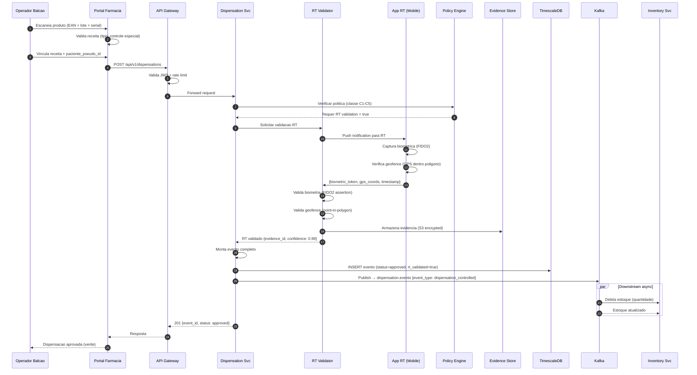
```mermaid
sequenceDiagram
    autonumber
    participant OP as Operador Balcao
    participant PF as Portal Farmacia
    participant GW as API Gateway
    participant DS as Dispensation Svc
    participant RT as RT Validator
    participant APP as App RT (Mobile)
    participant PE as Policy Engine
    participant ES as Evidence Store
    participant TS as TimescaleDB
    participant K as Kafka
    participant INV as Inventory Svc

    OP->>PF: Escaneia produto (EAN + lote + serial)
    PF->>PF: Valida receita (tipo: controle especial)
    OP->>PF: Vincula receita + paciente_pseudo_id
    PF->>GW: POST /api/v1/dispensations

    GW->>GW: Valida JWT + rate limit
    GW->>DS: Forward request

    DS->>PE: Verificar politica (classe C1-C5)
    PE-->>DS: Requer RT validation = true

    DS->>RT: Solicitar validacao RT
    RT->>APP: Push notification para RT
    APP->>APP: Captura biometrica (FIDO2)
    APP->>APP: Verifica geofence (GPS dentro poligono)
    APP->>RT: {biometric_token, gps_coords, timestamp}

    RT->>RT: Valida biometria (FIDO2 assertion)
    RT->>RT: Valida geofence (point-in-polygon)
    RT->>ES: Armazena evidencia (S3 encrypted)
    RT-->>DS: RT validado {evidence_id, confidence: 0.99}

    DS->>DS: Monta evento completo
    DS->>TS: INSERT evento (status=approved, rt_validated=true)
    DS->>K: Publish → dispensation.events {event_type: dispensation_controlled}

    par Downstream async
        K->>INV: Debita estoque (quantidade)
        K-->>INV: Estoque atualizado
    end

    DS-->>GW: 201 {event_id, status: approved}
    GW-->>PF: Resposta
    PF-->>OP: Dispensacao aprovada (verde)
```

### Fluxo 2 - Dispensacao Simples (Nao Controlados)

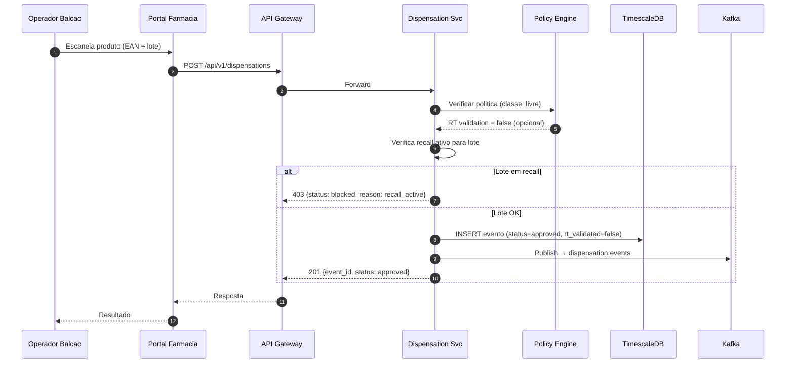
```mermaid
sequenceDiagram
    autonumber
    participant OP as Operador Balcao
    participant PF as Portal Farmacia
    participant GW as API Gateway
    participant DS as Dispensation Svc
    participant PE as Policy Engine
    participant TS as TimescaleDB
    participant K as Kafka

    OP->>PF: Escaneia produto (EAN + lote)
    PF->>GW: POST /api/v1/dispensations

    GW->>DS: Forward
    DS->>PE: Verificar politica (classe: livre)
    PE-->>DS: RT validation = false (opcional)

    DS->>DS: Verifica recall ativo para lote
    alt Lote em recall
        DS-->>GW: 403 {status: blocked, reason: recall_active}
    else Lote OK
        DS->>TS: INSERT evento (status=approved, rt_validated=false)
        DS->>K: Publish → dispensation.events
        DS-->>GW: 201 {event_id, status: approved}
    end

    GW-->>PF: Resposta
    PF-->>OP: Resultado
```

### Fluxo 3 - Dispensacao PFPB (Farmacia Popular)

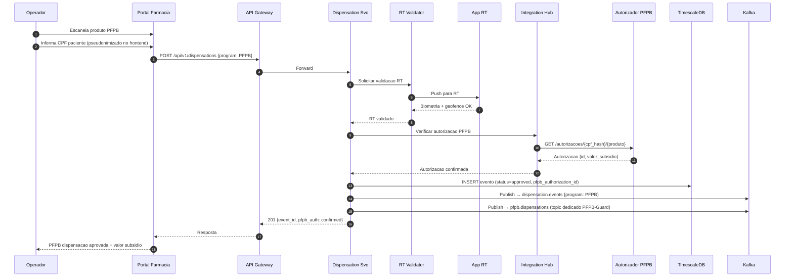
```mermaid
sequenceDiagram
    autonumber
    participant OP as Operador
    participant PF as Portal Farmacia
    participant GW as API Gateway
    participant DS as Dispensation Svc
    participant RT as RT Validator
    participant APP as App RT
    participant IH as Integration Hub
    participant PFPB as Autorizador PFPB
    participant TS as TimescaleDB
    participant K as Kafka

    OP->>PF: Escaneia produto PFPB
    OP->>PF: Informa CPF paciente (pseudonimizado no frontend)
    PF->>GW: POST /api/v1/dispensations {program: PFPB}

    GW->>DS: Forward
    DS->>RT: Solicitar validacao RT
    RT->>APP: Push para RT
    APP-->>RT: Biometria + geofence OK
    RT-->>DS: RT validado

    DS->>IH: Verificar autorizacao PFPB
    IH->>PFPB: GET /autorizacoes/{cpf_hash}/{produto}
    PFPB-->>IH: Autorizacao {id, valor_subsidio}
    IH-->>DS: Autorizacao confirmada

    DS->>TS: INSERT evento (status=approved, pfpb_authorization_id)
    DS->>K: Publish → dispensation.events {program: PFPB}
    DS->>K: Publish → pfpb.dispensations (topic dedicado PFPB-Guard)

    DS-->>GW: 201 {event_id, pfpb_auth: confirmed}
    GW-->>PF: Resposta
    PF-->>OP: PFPB dispensacao aprovada + valor subsidio
```

### Fluxo 4 - Rejeicao de Dispensacao (RT Ausente/Fora Geofence)

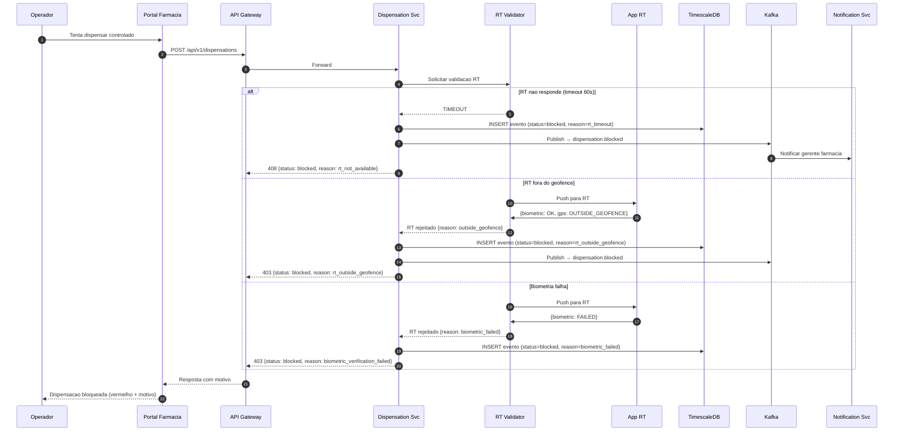
```mermaid
sequenceDiagram
    autonumber
    participant OP as Operador
    participant PF as Portal Farmacia
    participant GW as API Gateway
    participant DS as Dispensation Svc
    participant RT as RT Validator
    participant APP as App RT
    participant TS as TimescaleDB
    participant K as Kafka
    participant NS as Notification Svc

    OP->>PF: Tenta dispensar controlado
    PF->>GW: POST /api/v1/dispensations

    GW->>DS: Forward
    DS->>RT: Solicitar validacao RT

    alt RT nao responde (timeout 60s)
        RT-->>DS: TIMEOUT
        DS->>TS: INSERT evento (status=blocked, reason=rt_timeout)
        DS->>K: Publish → dispensation.blocked
        K->>NS: Notificar gerente farmacia
        DS-->>GW: 408 {status: blocked, reason: rt_not_available}
    else RT fora do geofence
        RT->>APP: Push para RT
        APP->>RT: {biometric: OK, gps: OUTSIDE_GEOFENCE}
        RT-->>DS: RT rejeitado {reason: outside_geofence}
        DS->>TS: INSERT evento (status=blocked, reason=rt_outside_geofence)
        DS->>K: Publish → dispensation.blocked
        DS-->>GW: 403 {status: blocked, reason: rt_outside_geofence}
    else Biometria falha
        RT->>APP: Push para RT
        APP->>RT: {biometric: FAILED}
        RT-->>DS: RT rejeitado {reason: biometric_failed}
        DS->>TS: INSERT evento (status=blocked, reason=biometric_failed)
        DS-->>GW: 403 {status: blocked, reason: biometric_verification_failed}
    end

    GW-->>PF: Resposta com motivo
    PF-->>OP: Dispensacao bloqueada (vermelho + motivo)
```

### Fluxo 5 - Dispensacao de Antimicrobianos

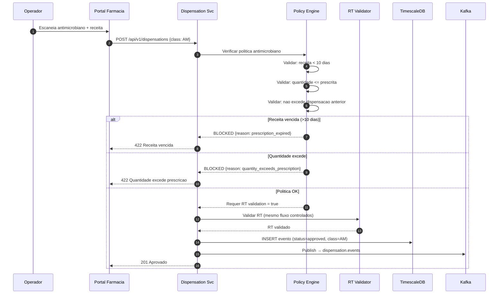
```mermaid
sequenceDiagram
    autonumber
    participant OP as Operador
    participant PF as Portal Farmacia
    participant DS as Dispensation Svc
    participant PE as Policy Engine
    participant RT as RT Validator
    participant TS as TimescaleDB
    participant K as Kafka

    OP->>PF: Escaneia antimicrobiano + receita
    PF->>DS: POST /api/v1/dispensations {class: AM}

    DS->>PE: Verificar politica antimicrobiano
    PE->>PE: Validar: receita < 10 dias
    PE->>PE: Validar: quantidade <= prescrita
    PE->>PE: Validar: nao excede dispensacao anterior

    alt Receita vencida (>10 dias)
        PE-->>DS: BLOCKED {reason: prescription_expired}
        DS-->>PF: 422 Receita vencida
    else Quantidade excede
        PE-->>DS: BLOCKED {reason: quantity_exceeds_prescription}
        DS-->>PF: 422 Quantidade excede prescricao
    else Politica OK
        PE-->>DS: Requer RT validation = true
        DS->>RT: Validar RT (mesmo fluxo controlados)
        RT-->>DS: RT validado
        DS->>TS: INSERT evento (status=approved, class=AM)
        DS->>K: Publish → dispensation.events
        DS-->>PF: 201 Aprovado
    end
```

### Fluxo 6 - Consulta de Conformidade Tempo Real

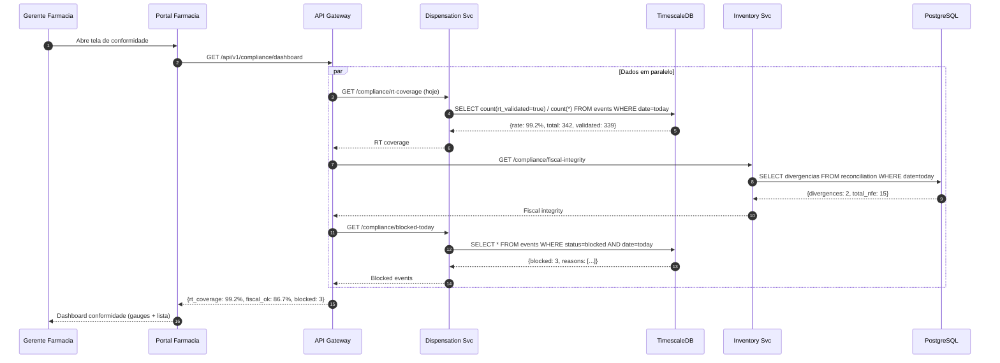
```mermaid
sequenceDiagram
    autonumber
    participant GER as Gerente Farmacia
    participant PF as Portal Farmacia
    participant GW as API Gateway
    participant DS as Dispensation Svc
    participant TS as TimescaleDB
    participant INV as Inventory Svc
    participant PG as PostgreSQL

    GER->>PF: Abre tela de conformidade
    PF->>GW: GET /api/v1/compliance/dashboard

    par Dados em paralelo
        GW->>DS: GET /compliance/rt-coverage (hoje)
        DS->>TS: SELECT count(rt_validated=true) / count(*) FROM events WHERE date=today
        TS-->>DS: {rate: 99.2%, total: 342, validated: 339}
        DS-->>GW: RT coverage

        GW->>INV: GET /compliance/fiscal-integrity
        INV->>PG: SELECT divergencias FROM reconciliation WHERE date=today
        PG-->>INV: {divergences: 2, total_nfe: 15}
        INV-->>GW: Fiscal integrity

        GW->>DS: GET /compliance/blocked-today
        DS->>TS: SELECT * FROM events WHERE status=blocked AND date=today
        TS-->>DS: {blocked: 3, reasons: [...]}
        DS-->>GW: Blocked events
    end

    GW-->>PF: {rt_coverage: 99.2%, fiscal_ok: 86.7%, blocked: 3}
    PF-->>GER: Dashboard conformidade (gauges + lista)
```

---

## Modulo 2: SNGPC do Fato

### Fluxo 7 - Recebimento de Mercadoria com NF-e

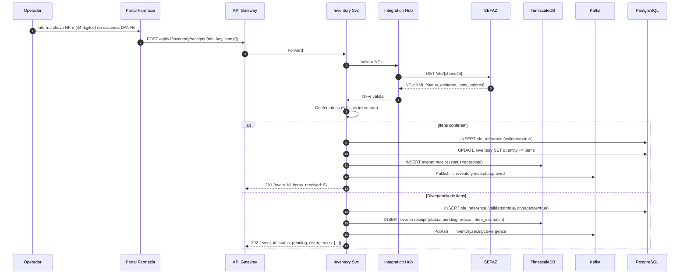
```mermaid
sequenceDiagram
    autonumber
    participant OP as Operador
    participant PF as Portal Farmacia
    participant GW as API Gateway
    participant INV as Inventory Svc
    participant IH as Integration Hub
    participant SEFAZ as SEFAZ
    participant TS as TimescaleDB
    participant K as Kafka
    participant PG as PostgreSQL

    OP->>PF: Informa chave NF-e (44 digitos) ou escaneia DANFE
    PF->>GW: POST /api/v1/inventory/receipts {nfe_key, items[]}

    GW->>INV: Forward
    INV->>IH: Validar NF-e
    IH->>SEFAZ: GET /nfe/{chave44}
    SEFAZ-->>IH: NF-e XML {status, emitente, itens, valores}
    IH-->>INV: NF-e valida

    INV->>INV: Conferir itens (NF-e vs informado)
    alt Itens conferem
        INV->>PG: INSERT nfe_reference (validated=true)
        INV->>PG: UPDATE inventory SET quantity += items
        INV->>TS: INSERT evento receipt (status=approved)
        INV->>K: Publish → inventory.receipt.approved
        INV-->>GW: 201 {event_id, items_received: 5}
    else Divergencia de itens
        INV->>PG: INSERT nfe_reference (validated=true, divergence=true)
        INV->>TS: INSERT evento receipt (status=pending, reason=item_mismatch)
        INV->>K: Publish → inventory.receipt.divergence
        INV-->>GW: 202 {event_id, status: pending, divergences: [...]}
    end
```

### Fluxo 8 - Escrituracao Automatica (SNGPC do Fato)

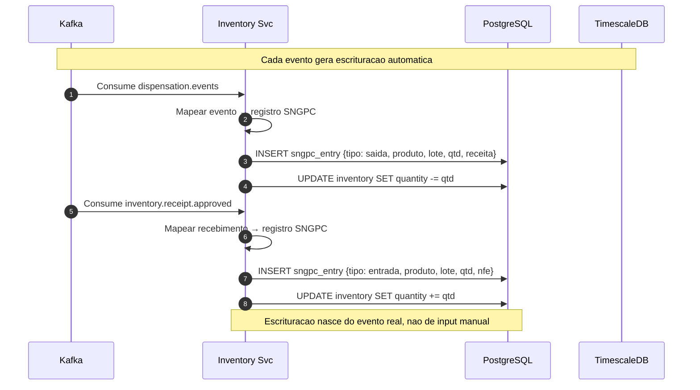
```mermaid
sequenceDiagram
    autonumber
    participant K as Kafka
    participant INV as Inventory Svc
    participant PG as PostgreSQL
    participant TS as TimescaleDB

    Note over K,TS: Cada evento gera escrituracao automatica

    K->>INV: Consume dispensation.events
    INV->>INV: Mapear evento → registro SNGPC
    INV->>PG: INSERT sngpc_entry {tipo: saida, produto, lote, qtd, receita}
    INV->>PG: UPDATE inventory SET quantity -= qtd

    K->>INV: Consume inventory.receipt.approved
    INV->>INV: Mapear recebimento → registro SNGPC
    INV->>PG: INSERT sngpc_entry {tipo: entrada, produto, lote, qtd, nfe}
    INV->>PG: UPDATE inventory SET quantity += qtd

    Note over INV,PG: Escrituracao nasce do evento real, nao de input manual
```

### Fluxo 9 - Bloqueio por Falta de Lastro Fiscal

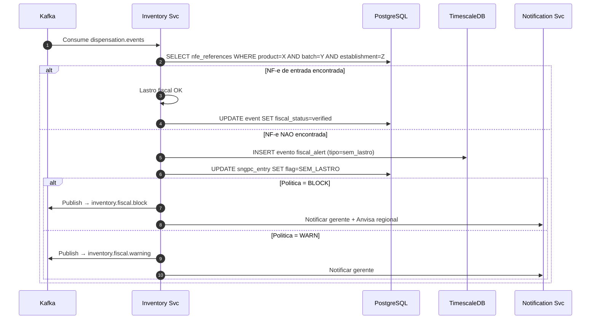
```mermaid
sequenceDiagram
    autonumber
    participant K as Kafka
    participant INV as Inventory Svc
    participant PG as PostgreSQL
    participant TS as TimescaleDB
    participant NS as Notification Svc

    K->>INV: Consume dispensation.events
    INV->>PG: SELECT nfe_references WHERE product=X AND batch=Y AND establishment=Z

    alt NF-e de entrada encontrada
        INV->>INV: Lastro fiscal OK
        INV->>PG: UPDATE event SET fiscal_status=verified
    else NF-e NAO encontrada
        INV->>TS: INSERT evento fiscal_alert (tipo=sem_lastro)
        INV->>PG: UPDATE sngpc_entry SET flag=SEM_LASTRO

        alt Politica = BLOCK
            INV->>K: Publish → inventory.fiscal.block
            INV->>NS: Notificar gerente + Anvisa regional
        else Politica = WARN
            INV->>K: Publish → inventory.fiscal.warning
            INV->>NS: Notificar gerente
        end
    end
```

### Fluxo 10 - Reconciliacao Estoque vs Eventos

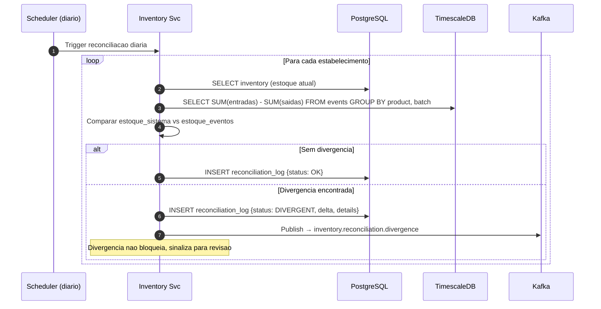
```mermaid
sequenceDiagram
    autonumber
    participant CRON as Scheduler (diario)
    participant INV as Inventory Svc
    participant PG as PostgreSQL
    participant TS as TimescaleDB
    participant K as Kafka

    CRON->>INV: Trigger reconciliacao diaria

    loop Para cada estabelecimento
        INV->>PG: SELECT inventory (estoque atual)
        INV->>TS: SELECT SUM(entradas) - SUM(saidas) FROM events GROUP BY product, batch

        INV->>INV: Comparar estoque_sistema vs estoque_eventos

        alt Sem divergencia
            INV->>PG: INSERT reconciliation_log {status: OK}
        else Divergencia encontrada
            INV->>PG: INSERT reconciliation_log {status: DIVERGENT, delta, details}
            INV->>K: Publish → inventory.reconciliation.divergence
            Note over INV: Divergencia nao bloqueia, sinaliza para revisao
        end
    end
```

### Fluxo 11 - Exportacao Regulatoria SNGPC

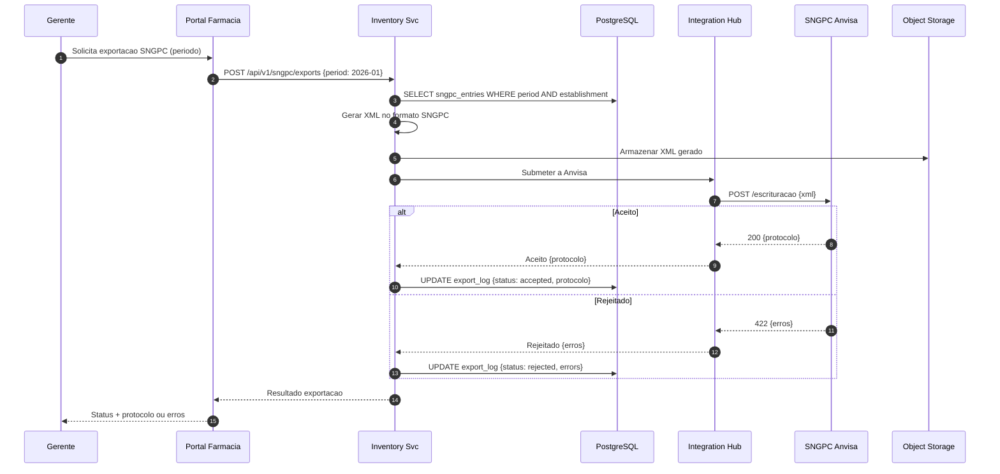
```mermaid
sequenceDiagram
    autonumber
    participant GER as Gerente
    participant PF as Portal Farmacia
    participant INV as Inventory Svc
    participant PG as PostgreSQL
    participant IH as Integration Hub
    participant SNGPC as SNGPC Anvisa
    participant S3 as Object Storage

    GER->>PF: Solicita exportacao SNGPC (periodo)
    PF->>INV: POST /api/v1/sngpc/exports {period: 2026-01}

    INV->>PG: SELECT sngpc_entries WHERE period AND establishment
    INV->>INV: Gerar XML no formato SNGPC
    INV->>S3: Armazenar XML gerado
    INV->>IH: Submeter a Anvisa

    IH->>SNGPC: POST /escrituracao {xml}

    alt Aceito
        SNGPC-->>IH: 200 {protocolo}
        IH-->>INV: Aceito {protocolo}
        INV->>PG: UPDATE export_log {status: accepted, protocolo}
    else Rejeitado
        SNGPC-->>IH: 422 {erros}
        IH-->>INV: Rejeitado {erros}
        INV->>PG: UPDATE export_log {status: rejected, errors}
    end

    INV-->>PF: Resultado exportacao
    PF-->>GER: Status + protocolo ou erros
```

### Fluxo 12 - Ajuste de Estoque (Quebra/Avaria)

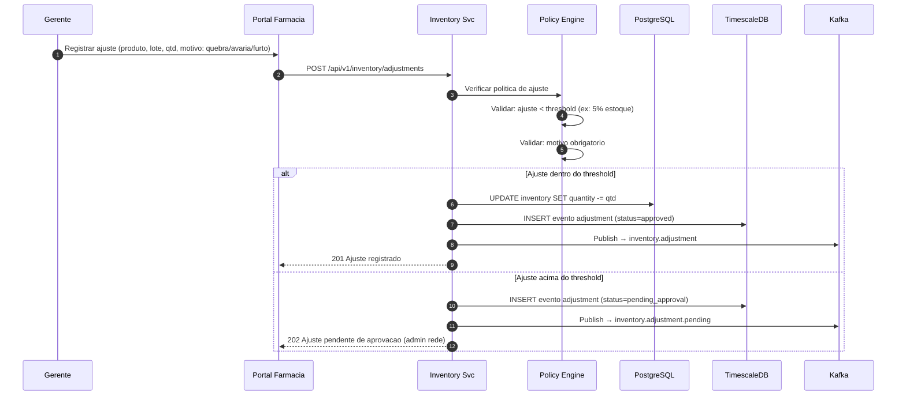
```mermaid
sequenceDiagram
    autonumber
    participant GER as Gerente
    participant PF as Portal Farmacia
    participant INV as Inventory Svc
    participant PE as Policy Engine
    participant PG as PostgreSQL
    participant TS as TimescaleDB
    participant K as Kafka

    GER->>PF: Registrar ajuste (produto, lote, qtd, motivo: quebra/avaria/furto)
    PF->>INV: POST /api/v1/inventory/adjustments

    INV->>PE: Verificar politica de ajuste
    PE->>PE: Validar: ajuste < threshold (ex: 5% estoque)
    PE->>PE: Validar: motivo obrigatorio

    alt Ajuste dentro do threshold
        INV->>PG: UPDATE inventory SET quantity -= qtd
        INV->>TS: INSERT evento adjustment (status=approved)
        INV->>K: Publish → inventory.adjustment
        INV-->>PF: 201 Ajuste registrado
    else Ajuste acima do threshold
        INV->>TS: INSERT evento adjustment (status=pending_approval)
        INV->>K: Publish → inventory.adjustment.pending
        INV-->>PF: 202 Ajuste pendente de aprovacao (admin rede)
    end
```

---

## Modulo 3: PFPB-Guard

### Fluxo 13 - Reconciliacao Triplice (Autorizador x NF-e x Evento)

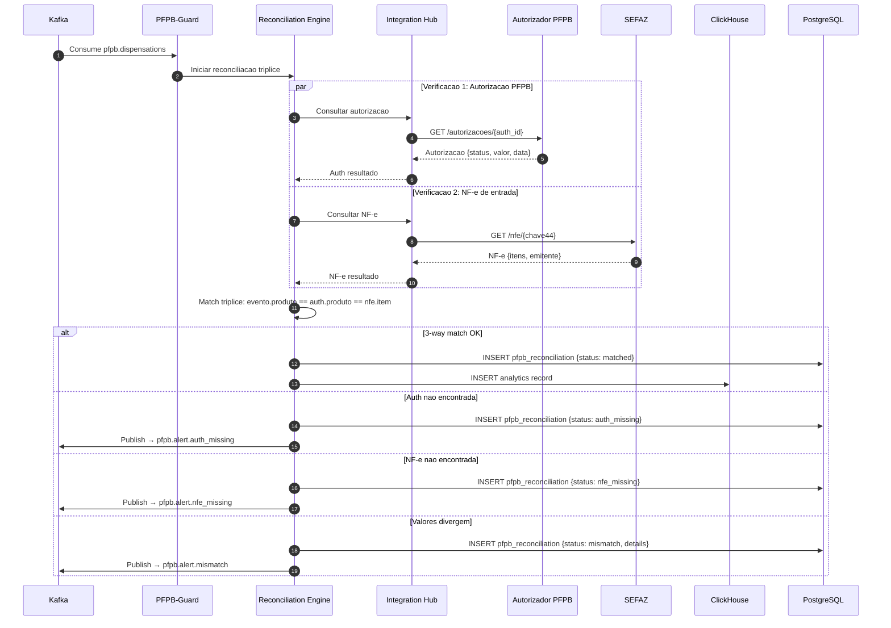
```mermaid
sequenceDiagram
    autonumber
    participant K as Kafka
    participant PG as PFPB-Guard
    participant RC as Reconciliation Engine
    participant IH as Integration Hub
    participant PFPB as Autorizador PFPB
    participant SEFAZ as SEFAZ
    participant CH as ClickHouse
    participant PGdb as PostgreSQL

    K->>PG: Consume pfpb.dispensations
    PG->>RC: Iniciar reconciliacao triplice

    par Verificacao 1: Autorizacao PFPB
        RC->>IH: Consultar autorizacao
        IH->>PFPB: GET /autorizacoes/{auth_id}
        PFPB-->>IH: Autorizacao {status, valor, data}
        IH-->>RC: Auth resultado
    and Verificacao 2: NF-e de entrada
        RC->>IH: Consultar NF-e
        IH->>SEFAZ: GET /nfe/{chave44}
        SEFAZ-->>IH: NF-e {itens, emitente}
        IH-->>RC: NF-e resultado
    end

    RC->>RC: Match triplice: evento.produto == auth.produto == nfe.item

    alt 3-way match OK
        RC->>PGdb: INSERT pfpb_reconciliation {status: matched}
        RC->>CH: INSERT analytics record
    else Auth nao encontrada
        RC->>PGdb: INSERT pfpb_reconciliation {status: auth_missing}
        RC->>K: Publish → pfpb.alert.auth_missing
    else NF-e nao encontrada
        RC->>PGdb: INSERT pfpb_reconciliation {status: nfe_missing}
        RC->>K: Publish → pfpb.alert.nfe_missing
    else Valores divergem
        RC->>PGdb: INSERT pfpb_reconciliation {status: mismatch, details}
        RC->>K: Publish → pfpb.alert.mismatch
    end
```

### Fluxo 14 - Deteccao de Anomalia Temporal

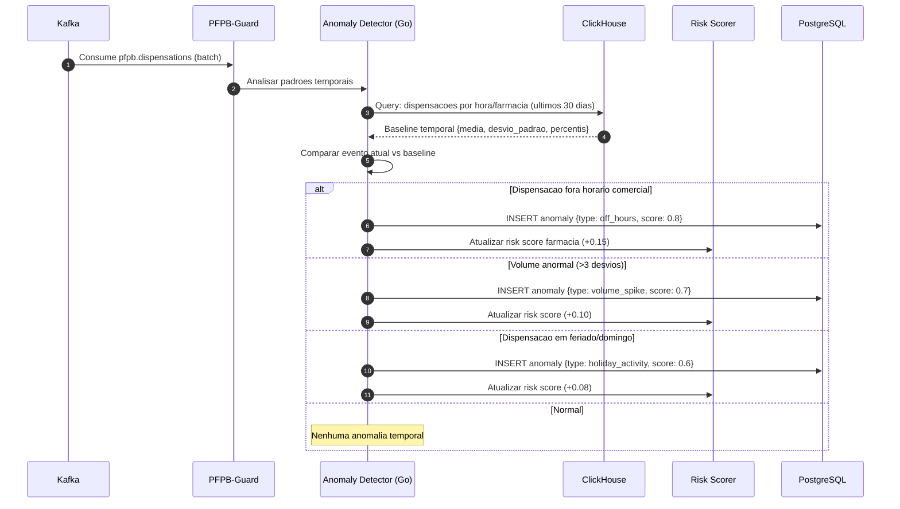
```mermaid
sequenceDiagram
    autonumber
    participant K as Kafka
    participant PG as PFPB-Guard
    participant AD as Anomaly Detector (Go)
    participant CH as ClickHouse
    participant RS as Risk Scorer
    participant PGdb as PostgreSQL

    K->>PG: Consume pfpb.dispensations (batch)
    PG->>AD: Analisar padroes temporais

    AD->>CH: Query: dispensacoes por hora/farmacia (ultimos 30 dias)
    CH-->>AD: Baseline temporal {media, desvio_padrao, percentis}

    AD->>AD: Comparar evento atual vs baseline

    alt Dispensacao fora horario comercial
        AD->>PGdb: INSERT anomaly {type: off_hours, score: 0.8}
        AD->>RS: Atualizar risk score farmacia (+0.15)
    else Volume anormal (>3 desvios)
        AD->>PGdb: INSERT anomaly {type: volume_spike, score: 0.7}
        AD->>RS: Atualizar risk score (+0.10)
    else Dispensacao em feriado/domingo
        AD->>PGdb: INSERT anomaly {type: holiday_activity, score: 0.6}
        AD->>RS: Atualizar risk score (+0.08)
    else Normal
        Note over AD: Nenhuma anomalia temporal
    end
```

### Fluxo 15 - Deteccao de Anomalia Geografica

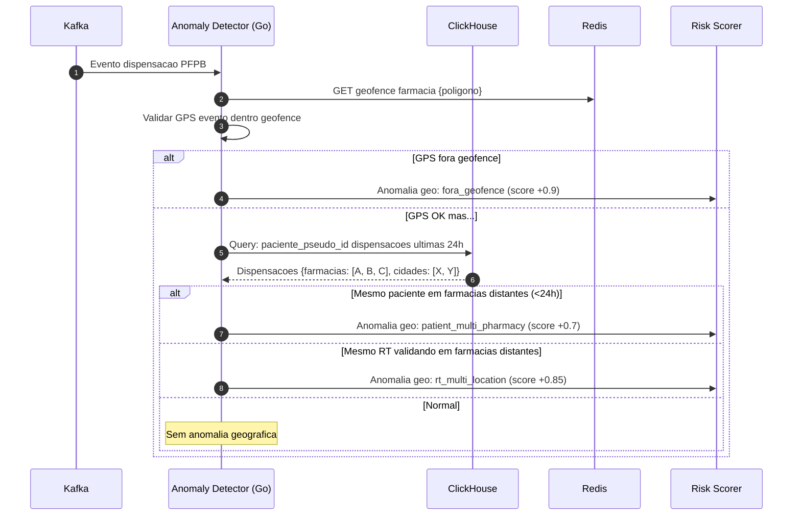
```mermaid
sequenceDiagram
    autonumber
    participant K as Kafka
    participant AD as Anomaly Detector (Go)
    participant CH as ClickHouse
    participant Redis as Redis
    participant RS as Risk Scorer

    K->>AD: Evento dispensacao PFPB

    AD->>Redis: GET geofence farmacia {poligono}
    AD->>AD: Validar GPS evento dentro geofence

    alt GPS fora geofence
        AD->>RS: Anomalia geo: fora_geofence (score +0.9)
    else GPS OK mas...
        AD->>CH: Query: paciente_pseudo_id dispensacoes ultimas 24h
        CH-->>AD: Dispensacoes {farmacias: [A, B, C], cidades: [X, Y]}

        alt Mesmo paciente em farmacias distantes (<24h)
            AD->>RS: Anomalia geo: patient_multi_pharmacy (score +0.7)
        else Mesmo RT validando em farmacias distantes
            AD->>RS: Anomalia geo: rt_multi_location (score +0.85)
        else Normal
            Note over AD: Sem anomalia geografica
        end
    end
```

### Fluxo 16 - Deteccao de Anomalia Comportamental

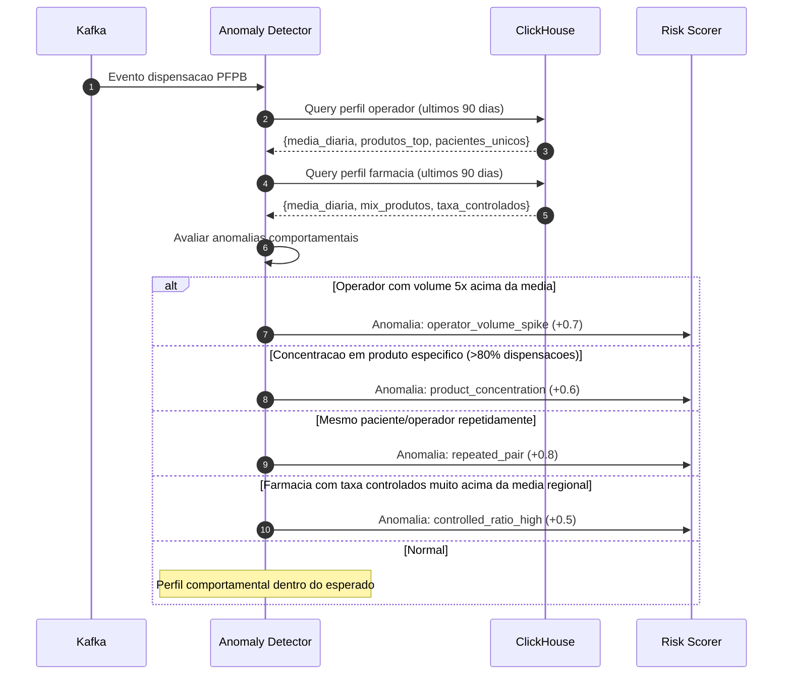
```mermaid
sequenceDiagram
    autonumber
    participant K as Kafka
    participant AD as Anomaly Detector
    participant CH as ClickHouse
    participant RS as Risk Scorer

    K->>AD: Evento dispensacao PFPB

    AD->>CH: Query perfil operador (ultimos 90 dias)
    CH-->>AD: {media_diaria, produtos_top, pacientes_unicos}

    AD->>CH: Query perfil farmacia (ultimos 90 dias)
    CH-->>AD: {media_diaria, mix_produtos, taxa_controlados}

    AD->>AD: Avaliar anomalias comportamentais

    alt Operador com volume 5x acima da media
        AD->>RS: Anomalia: operator_volume_spike (+0.7)
    else Concentracao em produto especifico (>80% dispensacoes)
        AD->>RS: Anomalia: product_concentration (+0.6)
    else Mesmo paciente/operador repetidamente
        AD->>RS: Anomalia: repeated_pair (+0.8)
    else Farmacia com taxa controlados muito acima da media regional
        AD->>RS: Anomalia: controlled_ratio_high (+0.5)
    else Normal
        Note over AD: Perfil comportamental dentro do esperado
    end
```

### Fluxo 17 - Geracao Automatica de Dossie Probatorio

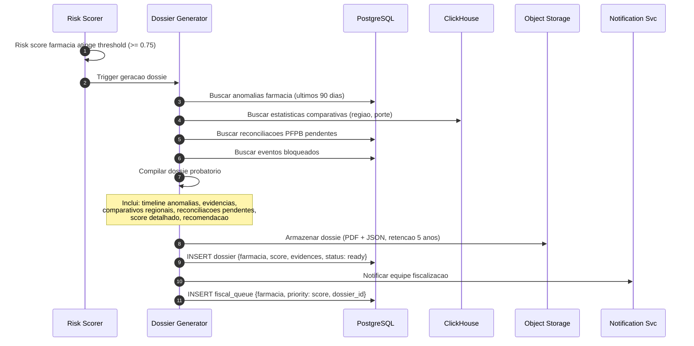
```mermaid
sequenceDiagram
    autonumber
    participant RS as Risk Scorer
    participant DG as Dossier Generator
    participant PGdb as PostgreSQL
    participant CH as ClickHouse
    participant S3 as Object Storage
    participant NS as Notification Svc

    RS->>RS: Risk score farmacia atinge threshold (>= 0.75)
    RS->>DG: Trigger geracao dossie

    DG->>PGdb: Buscar anomalias farmacia (ultimos 90 dias)
    DG->>CH: Buscar estatisticas comparativas (regiao, porte)
    DG->>PGdb: Buscar reconciliacoes PFPB pendentes
    DG->>PGdb: Buscar eventos bloqueados

    DG->>DG: Compilar dossie probatorio
    Note over DG: Inclui: timeline anomalias, evidencias,<br/>comparativos regionais, reconciliacoes pendentes,<br/>score detalhado, recomendacao

    DG->>S3: Armazenar dossie (PDF + JSON, retencao 5 anos)
    DG->>PGdb: INSERT dossier {farmacia, score, evidences, status: ready}
    DG->>NS: Notificar equipe fiscalizacao
    DG->>PGdb: INSERT fiscal_queue {farmacia, priority: score, dossier_id}
```

### Fluxo 18 - Fila de Fiscalizacao por Score de Risco

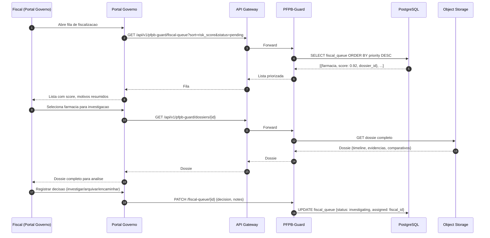
```mermaid
sequenceDiagram
    autonumber
    participant FISC as Fiscal (Portal Governo)
    participant PG as Portal Governo
    participant GW as API Gateway
    participant PFG as PFPB-Guard
    participant PGdb as PostgreSQL
    participant S3 as Object Storage

    FISC->>PG: Abre fila de fiscalizacao
    PG->>GW: GET /api/v1/pfpb-guard/fiscal-queue?sort=risk_score&status=pending

    GW->>PFG: Forward
    PFG->>PGdb: SELECT fiscal_queue ORDER BY priority DESC
    PGdb-->>PFG: [{farmacia, score: 0.92, dossier_id}, ...]
    PFG-->>GW: Lista priorizada
    GW-->>PG: Fila
    PG-->>FISC: Lista com score, motivos resumidos

    FISC->>PG: Seleciona farmacia para investigacao
    PG->>GW: GET /api/v1/pfpb-guard/dossiers/{id}
    GW->>PFG: Forward
    PFG->>S3: GET dossie completo
    S3-->>PFG: Dossie {timeline, evidencias, comparativos}
    PFG-->>GW: Dossie
    GW-->>PG: Dossie
    PG-->>FISC: Dossie completo para analise

    FISC->>PG: Registrar decisao (investigar/arquivar/encaminhar)
    PG->>PFG: PATCH /fiscal-queue/{id} {decision, notes}
    PFG->>PGdb: UPDATE fiscal_queue {status: investigating, assigned: fiscal_id}
```

---

## Modulo 4: EPID <48h

### Fluxo 19 - Ingestao e Anonimizacao de Eventos

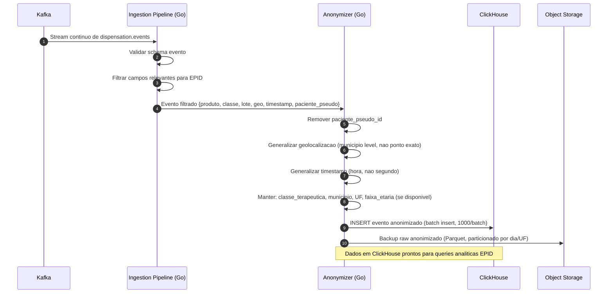
```mermaid
sequenceDiagram
    autonumber
    participant K as Kafka
    participant IN as Ingestion Pipeline (Go)
    participant AN as Anonymizer (Go)
    participant CH as ClickHouse
    participant S3 as Object Storage

    K->>IN: Stream continuo de dispensation.events
    IN->>IN: Validar schema evento
    IN->>IN: Filtrar campos relevantes para EPID

    IN->>AN: Evento filtrado {produto, classe, lote, geo, timestamp, paciente_pseudo}

    AN->>AN: Remover paciente_pseudo_id
    AN->>AN: Generalizar geolocalizacao (municipio level, nao ponto exato)
    AN->>AN: Generalizar timestamp (hora, nao segundo)
    AN->>AN: Manter: classe_terapeutica, municipio, UF, faixa_etaria (se disponivel)

    AN->>CH: INSERT evento anonimizado (batch insert, 1000/batch)
    AN->>S3: Backup raw anonimizado (Parquet, particionado por dia/UF)

    Note over AN,CH: Dados em ClickHouse prontos para queries analiticas EPID
```

### Fluxo 20 - Deteccao de Padrao Epidemiologico

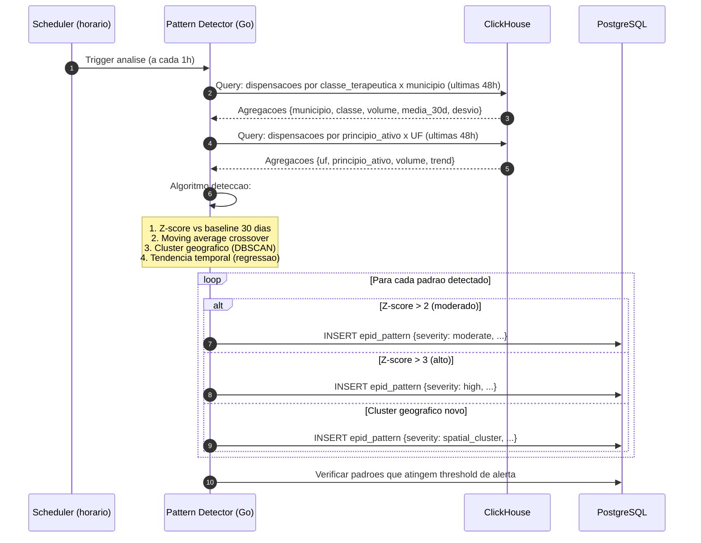
```mermaid
sequenceDiagram
    autonumber
    participant CRON as Scheduler (horario)
    participant PD as Pattern Detector (Go)
    participant CH as ClickHouse
    participant PGdb as PostgreSQL

    CRON->>PD: Trigger analise (a cada 1h)

    PD->>CH: Query: dispensacoes por classe_terapeutica x municipio (ultimas 48h)
    CH-->>PD: Agregacoes {municipio, classe, volume, media_30d, desvio}

    PD->>CH: Query: dispensacoes por principio_ativo x UF (ultimas 48h)
    CH-->>PD: Agregacoes {uf, principio_ativo, volume, trend}

    PD->>PD: Algoritmo deteccao:
    Note over PD: 1. Z-score vs baseline 30 dias<br/>2. Moving average crossover<br/>3. Cluster geografico (DBSCAN)<br/>4. Tendencia temporal (regressao)

    loop Para cada padrao detectado
        alt Z-score > 2 (moderado)
            PD->>PGdb: INSERT epid_pattern {severity: moderate, ...}
        else Z-score > 3 (alto)
            PD->>PGdb: INSERT epid_pattern {severity: high, ...}
        else Cluster geografico novo
            PD->>PGdb: INSERT epid_pattern {severity: spatial_cluster, ...}
        end
    end

    PD->>PGdb: Verificar padroes que atingem threshold de alerta
```

### Fluxo 21 - Emissao de Alerta N1 (Informativo)

```mermaid
sequenceDiagram
    autonumber
    participant PD as Pattern Detector
    participant AE as Alert Engine
    participant PGdb as PostgreSQL
    participant GOV as Portal Governo

    PD->>AE: Padrao detectado {severity: moderate, classe: analgesicos, municipio: SP-Capital}
    AE->>AE: Classificar: N1 (informativo)
    Note over AE: Criterio N1: Z-score 2-3,<br/>sem cluster geografico,<br/>tendencia estavel

    AE->>PGdb: INSERT epid_alert {level: N1, territory: SP-Capital, class: analgesicos}
    AE->>GOV: WebSocket → atualizar dashboard em tempo real
    Note over GOV: Alerta aparece no dashboard,<br/>nao gera notificacao push
```

### Fluxo 22 - Emissao de Alerta N2 (Atencao)

```mermaid
sequenceDiagram
    autonumber
    participant PD as Pattern Detector
    participant AE as Alert Engine
    participant PGdb as PostgreSQL
    participant NS as Notification Svc
    participant GOV as Portal Governo

    PD->>AE: Padrao detectado {severity: high, classe: antibioticos, UF: MG, trend: rising}
    AE->>AE: Classificar: N2 (atencao)
    Note over AE: Criterio N2: Z-score >3,<br/>OU cluster geografico ativo,<br/>OU tendencia ascendente >7 dias

    AE->>PGdb: INSERT epid_alert {level: N2, territory: MG, class: antibioticos}
    AE->>NS: Notificar vigilancia sanitaria estadual (email + push)
    AE->>GOV: WebSocket → alerta N2 no dashboard (destaque amarelo)
    NS-->>AE: Notificacao enviada (log de entrega)
```

### Fluxo 23 - Emissao de Alerta N3 (Critico)

```mermaid
sequenceDiagram
    autonumber
    participant PD as Pattern Detector
    participant AE as Alert Engine
    participant PGdb as PostgreSQL
    participant NS as Notification Svc
    participant GOV as Portal Governo
    participant RNDS as RNDS

    PD->>AE: Padrao detectado {severity: critical, classe: antivirais, multi_UF: true}
    AE->>AE: Classificar: N3 (critico)
    Note over AE: Criterio N3: Padrao multi-UF,<br/>OU Z-score >5,<br/>OU correlacao com doenca notificavel

    AE->>PGdb: INSERT epid_alert {level: N3, territory: NATIONAL, class: antivirais}

    par Notificacoes criticas paralelas
        AE->>NS: Notificar Ministerio da Saude (email + SMS + push)
        AE->>NS: Notificar Anvisa (email + SMS + push)
        AE->>NS: Notificar Vigilancias estaduais afetadas
    end

    AE->>RNDS: POST /epid-alert {dados anonimizados, padrao, territorio}
    AE->>GOV: WebSocket → alerta N3 (destaque vermelho + som)

    Note over AE: SLA: < 48h entre primeiro evento e alerta
```

### Fluxo 24 - Integracao com RNDS

```mermaid
sequenceDiagram
    autonumber
    participant AE as Alert Engine
    participant IH as Integration Hub
    participant RNDS as RNDS (MS)
    participant PGdb as PostgreSQL

    AE->>IH: Enviar dados epidemiologicos

    IH->>IH: Formatar payload FHIR R4
    Note over IH: Bundle FHIR com:<br/>- Observation (padrao detectado)<br/>- Location (territorio)<br/>- Substance (classe terapeutica)

    IH->>RNDS: POST /fhir/Bundle {type: transaction}

    alt Aceito
        RNDS-->>IH: 200 {bundle_id}
        IH-->>AE: Integrado com sucesso
        IH->>PGdb: UPDATE epid_alert SET rnds_synced=true
    else Erro
        IH->>IH: Enfileirar para retry (max 3 tentativas)
        IH->>PGdb: UPDATE epid_alert SET rnds_sync_error=details
    end
```

---

## Modulo 5: Ciclo de Vida Completo

### Fluxo 25 - Emissao de Recall pela Industria

```mermaid
sequenceDiagram
    autonumber
    participant IND as Operador Qualidade (Industria)
    participant PI as Portal Industria
    participant GW as API Gateway
    participant LS as Lifecycle Svc
    participant PGdb as PostgreSQL
    participant K as Kafka
    participant NS as Notification Svc

    IND->>PI: Iniciar recall (lote, motivo, severidade, comunicado)
    PI->>GW: POST /api/v1/recalls

    GW->>LS: Forward
    LS->>LS: Validar dados recall
    LS->>PGdb: SELECT affected = establishments com estoque do lote
    PGdb-->>LS: {affected_count: 342, affected_units: 15000}

    LS->>PGdb: INSERT recall {status: initiated, severity, affected}
    LS->>K: Publish → lifecycle.recall.initiated

    par Notificacoes
        K->>NS: Notificar farmacias afetadas (342)
        K->>NS: Notificar distribuidores que movimentaram o lote
        K->>NS: Notificar Anvisa
    end

    LS-->>GW: 201 {recall_id, affected_establishments: 342, affected_units: 15000}
    GW-->>PI: Recall criado
    PI-->>IND: Recall iniciado - 342 estabelecimentos notificados
```

### Fluxo 26 - Bloqueio de Lote (<2h SLA)

```mermaid
sequenceDiagram
    autonumber
    participant K as Kafka
    participant BE as Block Engine
    participant PGdb as PostgreSQL
    participant Redis as Redis
    participant TS as TimescaleDB
    participant LG as Ledger Svc
    participant HLF as Hyperledger

    K->>BE: Consume lifecycle.recall.initiated

    BE->>BE: Iniciar cronometro SLA (<2h)

    BE->>PGdb: SELECT all inventory WHERE batch=recalled_batch
    PGdb-->>BE: {establishments: [...], total_units: 15000}

    par Bloqueio massivo
        BE->>PGdb: UPDATE inventory SET quantity_blocked += quantity_available, quantity_available = 0 WHERE batch=X
        BE->>Redis: SET block:batch:X = {recall_id, timestamp} (cache para validacao rapida)
        BE->>TS: INSERT evento recall_block para cada establishment
    end

    BE->>PGdb: UPDATE recall SET status=blocked, blocked_at=NOW()
    BE->>K: Publish → lifecycle.recall.blocked

    BE->>LG: Ancorar hash do bloqueio
    LG->>HLF: Anchor {recall_id, batch, blocked_count, merkle_root}
    HLF-->>LG: TX confirmed

    BE->>BE: Verificar SLA: blocked_at - initiated_at < 2h
    Note over BE: Metrica: tempo medio de bloqueio
```

### Fluxo 27 - Agendamento de Coleta

```mermaid
sequenceDiagram
    autonumber
    participant FARM as Gerente Farmacia
    participant PF as Portal Farmacia
    participant GW as API Gateway
    participant LS as Lifecycle Svc
    participant CS as Collection Scheduler
    participant PGdb as PostgreSQL
    participant NS as Notification Svc
    participant ED as Empresa Descarte

    FARM->>PF: Solicitar recolhimento (recall_id, itens em estoque bloqueado)
    PF->>GW: POST /api/v1/collections/schedule

    GW->>LS: Forward
    LS->>CS: Agendar coleta

    CS->>PGdb: SELECT empresa_descarte licenciada mais proxima
    PGdb-->>CS: {empresa: EcoFarma, distancia: 12km}

    CS->>PGdb: INSERT collection_schedule {farmacia, empresa, recall, items, status: scheduled}
    CS->>NS: Notificar empresa de descarte
    NS->>ED: Email + Push: nova coleta agendada

    CS-->>LS: Agendamento criado {collection_id, empresa, estimated_date}
    LS-->>GW: 201 {collection_id}
    GW-->>PF: Coleta agendada
    PF-->>FARM: Coleta agendada com EcoFarma - data estimada: DD/MM
```

### Fluxo 28 - Rastreio de Coleta/Transporte

```mermaid
sequenceDiagram
    autonumber
    participant ED as Operador Rota (Empresa Descarte)
    participant PD as Portal Descarte / App Mobile
    participant GW as API Gateway
    participant LS as Lifecycle Svc
    participant TK as Tracking Engine
    participant TS as TimescaleDB
    participant K as Kafka

    ED->>PD: Check-in na farmacia (GPS + foto)
    PD->>GW: POST /api/v1/collections/{id}/checkin {gps, photo, timestamp}
    GW->>TK: Forward
    TK->>TS: INSERT tracking_event {stage: pickup, gps, evidence}
    TK->>K: Publish → lifecycle.collection.pickup
    TK-->>GW: 200 Checkin registrado

    ED->>PD: Conferencia itens coletados
    PD->>GW: POST /api/v1/collections/{id}/items {items_collected[]}
    GW->>TK: Forward
    TK->>TS: INSERT tracking_event {stage: items_verified}

    Note over ED: Em transito - GPS tracking periodico

    ED->>PD: Waypoint em transito (automatico a cada 15min)
    PD->>GW: POST /api/v1/collections/{id}/waypoint {gps, timestamp}
    GW->>TK: Forward
    TK->>TS: INSERT tracking_event {stage: in_transit, gps}

    ED->>PD: Chegada no destino (centro de descarte)
    PD->>GW: POST /api/v1/collections/{id}/arrival {gps, photo}
    GW->>TK: Forward
    TK->>TS: INSERT tracking_event {stage: arrived, gps}
    TK->>K: Publish → lifecycle.collection.arrived
```

### Fluxo 29 - Certificacao de Descarte com Hash no Ledger

```mermaid
sequenceDiagram
    autonumber
    participant CERT as Emissor Certificado (Empresa)
    participant PD as Portal Descarte
    participant GW as API Gateway
    participant LS as Lifecycle Svc
    participant CG as Certificate Generator
    participant S3 as Object Storage
    participant LG as Ledger Svc
    participant HLF as Hyperledger
    participant PGdb as PostgreSQL
    participant K as Kafka

    CERT->>PD: Registrar descarte (metodo, quantidade, evidencias, laudo)
    PD->>GW: POST /api/v1/disposals {collection_id, method, quantity, evidence_files[], laudo}

    GW->>LS: Forward
    LS->>S3: Upload evidencias (fotos, laudos)
    LS->>CG: Gerar certificado

    CG->>CG: Compilar certificado descarte
    Note over CG: Conteudo: recall, lote, quantidade,<br/>metodo descarte, licenca ambiental,<br/>evidencias, laudo tecnico

    CG->>CG: Calcular hash SHA-256 do certificado
    CG->>S3: Armazenar certificado (PDF + JSON)

    CG->>LG: Ancorar hash certificado
    LG->>HLF: Anchor {disposal_cert_id, hash, recall_id, batch}
    HLF-->>LG: TX confirmed {tx_id, block_number}
    LG-->>CG: Ancoragem confirmada

    CG->>PGdb: INSERT disposal_certificate {hash, hlf_tx_id, hlf_block}
    CG->>K: Publish → lifecycle.disposal.certified

    par Atualizacoes
        K->>LS: Atualizar recall (disposed_units += quantity)
        K->>PGdb: UPDATE recall SET disposed_units += qty
    end

    CG-->>GW: 201 {certificate_id, hash, hlf_tx_id}
    GW-->>PD: Certificado gerado
    PD-->>CERT: Certificado com hash verificavel no blockchain
```

### Fluxo 30 - Relatorio de Conformidade Ambiental

```mermaid
sequenceDiagram
    autonumber
    participant GOV as Fiscal Ambiental (Portal Governo)
    participant PG as Portal Governo
    participant GW as API Gateway
    participant LS as Lifecycle Svc
    participant CH as ClickHouse
    participant PGdb as PostgreSQL
    participant S3 as Object Storage

    GOV->>PG: Solicitar relatorio conformidade (periodo, UF)
    PG->>GW: GET /api/v1/compliance/environmental?period=2026-Q1&uf=SP

    par Dados agregados
        GW->>LS: Estatisticas recalls
        LS->>PGdb: SELECT recalls, blocked, collected, disposed WHERE period AND uf
        PGdb-->>LS: {total_recalls: 12, fully_disposed: 8, pending: 4}
        LS-->>GW: Recall stats

        GW->>LS: Estatisticas descarte
        LS->>CH: SELECT disposal by method, company, month WHERE uf=SP
        CH-->>LS: Agregacoes descarte
        LS-->>GW: Disposal stats

        GW->>LS: Certificados emitidos
        LS->>PGdb: SELECT certificates WHERE period AND uf
        PGdb-->>LS: {total_certs: 45, verified_on_ledger: 45}
        LS-->>GW: Certificates
    end

    GW-->>PG: Relatorio consolidado
    PG-->>GOV: Relatorio com:
    Note over GOV: - KPIs: taxa descarte, tempo medio recall→descarte<br/>- Lista recalls abertos/fechados<br/>- Certificados por empresa<br/>- Metodos de descarte utilizados<br/>- Verificacao ledger (100% integro)
```

---

## Resumo dos 30 Fluxos

| # | Fluxo | Modulo | Criticidade | Fase |
|---|-------|--------|------------|------|
| 1 | Dispensacao controlados (RT) | Prova do Ato | Critico | 1 |
| 2 | Dispensacao simples | Prova do Ato | Alto | 1 |
| 3 | Dispensacao PFPB | Prova do Ato | Critico | 1 |
| 4 | Rejeicao dispensacao | Prova do Ato | Critico | 1 |
| 5 | Antimicrobianos | Prova do Ato | Alto | 1 |
| 6 | Conformidade tempo real | Prova do Ato | Medio | 1 |
| 7 | Recebimento NF-e | SNGPC | Critico | 2 |
| 8 | Escrituracao automatica | SNGPC | Critico | 2 |
| 9 | Bloqueio sem lastro | SNGPC | Alto | 2 |
| 10 | Reconciliacao estoque | SNGPC | Alto | 2 |
| 11 | Exportacao SNGPC | SNGPC | Alto | 2 |
| 12 | Ajuste estoque | SNGPC | Medio | 2 |
| 13 | Reconciliacao triplice | PFPB-Guard | Critico | 2 |
| 14 | Anomalia temporal | PFPB-Guard | Alto | 2 |
| 15 | Anomalia geografica | PFPB-Guard | Alto | 2 |
| 16 | Anomalia comportamental | PFPB-Guard | Alto | 2 |
| 17 | Dossie probatorio | PFPB-Guard | Alto | 2 |
| 18 | Fila fiscalizacao | PFPB-Guard | Medio | 2 |
| 19 | Ingestao/anonimizacao | EPID | Critico | 2 |
| 20 | Deteccao padrao | EPID | Critico | 3 |
| 21 | Alerta N1 | EPID | Medio | 2 |
| 22 | Alerta N2 | EPID | Alto | 2 |
| 23 | Alerta N3 | EPID | Critico | 3 |
| 24 | Integracao RNDS | EPID | Alto | 3 |
| 25 | Emissao recall | Ciclo Vida | Critico | 2 |
| 26 | Bloqueio lote <2h | Ciclo Vida | Critico | 2 |
| 27 | Agendamento coleta | Ciclo Vida | Alto | 2 |
| 28 | Rastreio coleta | Ciclo Vida | Alto | 2 |
| 29 | Certificado descarte | Ciclo Vida | Critico | 2 |
| 30 | Conformidade ambiental | Ciclo Vida | Medio | 3 |

---

*Smart Trace - 30 Fluxos Operacionais v1.0*
