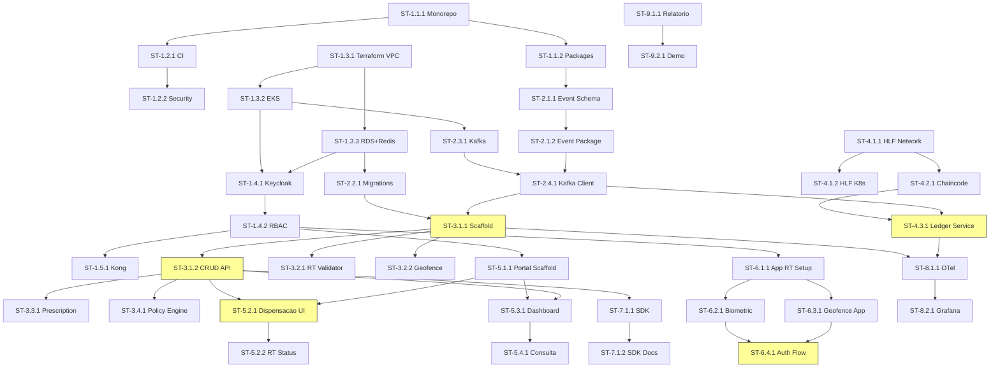

# Smart Trace - Backlog Detalhado Fase 1 (MVP D+90)

> Stories detalhadas com acceptance criteria para o MVP / Vitrine Tecnica.

**Status:** DRAFT v1.1 - Revisado em 2026-02-15
**Referencia:** architecture-v1.md (v1.1)
**Timeline:** D+90 (~12 semanas, time 7-8 pessoas incluindo 2 DevOps)

---

## Visao Geral Fase 1

**Objetivo:** Demonstrar viabilidade tecnica com fluxo completo:
`Farmacia dispensa medicamento → RT valida (biometria + geofence) → Evento gravado → Hash ancorado no ledger → Portal exibe conformidade`

**Abordagem:** Dividido em **Fase 1A (Foundation)** e **Fase 1B (Integration)** para reduzir risco de entrega.

### Fase 1A - Foundation & Core MVP (Semanas 1-6)
**Entregaveis:**
- Dispensation Service operacional (RT com mock biometrico)
- Portal Farmacia (dispensacao + conformidade, projecao < 2s)
- Event Store (TimescaleDB) + Kafka
- Ambiente dev/test com CI/CD
- Observability base (OpenTelemetry + Grafana)

### Fase 1B - Real Biometrics & Ledger (Semanas 7-12)
**Entregaveis:**
- App RT com biometria REAL (FIDO2) + geofence
- Ledger anchoring (Hyperledger Fabric dev OU PostgreSQL fallback)
- SDK Pharmacy v1 (com Idempotency-Key)
- Relatorio de proof of value + demo environment

### Decision Point (Fim da Fase 1A)
Avaliar status do consorcio institucional (MS/Anvisa/CFF) para Hyperledger Fabric.
Se sem acordo: prosseguir com fallback PostgreSQL immutable na Fase 1B.

---

---

# FASE 1A — FOUNDATION & CORE MVP (Semanas 1-6)

---

## Epic E1 - Foundation (3 semanas)

### E1.1 - Setup Monorepo

**Story ST-1.1.1: Inicializar monorepo com Turborepo + pnpm**
- **Descricao:** Criar estrutura base do monorepo com workspaces configurados para apps, services, packages e infra.
- **Acceptance Criteria:**
  - [ ] Monorepo inicializado com pnpm workspaces
  - [ ] turbo.json configurado com pipelines: build, test, lint, typecheck
  - [ ] tsconfig.base.json com path aliases (@smart-trace/*)
  - [ ] .gitignore, .editorconfig, .prettierrc configurados
  - [ ] pnpm-workspace.yaml com todos os workspaces
  - [ ] `pnpm install` executa sem erros
  - [ ] `pnpm turbo build` executa (mesmo que vazio)
- **Estimativa:** 2d
- **Dependencias:** Nenhuma

**Story ST-1.1.2: Configurar packages compartilhados base**
- **Descricao:** Criar packages shared-types, shared-utils e event-schema com estrutura inicial.
- **Acceptance Criteria:**
  - [ ] packages/shared-types com tipos base (Event, Establishment, Actor)
  - [ ] packages/shared-utils com crypto.ts (hash SHA-256), validation.ts (Zod schemas base)
  - [ ] packages/event-schema com JSON Schema para evento de dispensacao
  - [ ] Todos os packages buildaveis e importaveis entre si
  - [ ] Testes unitarios para shared-utils (>80% coverage)
- **Estimativa:** 1d
- **Dependencias:** ST-1.1.1

### E1.2 - CI Pipeline

**Story ST-1.2.1: GitHub Actions CI pipeline**
- **Descricao:** Pipeline CI que roda lint, typecheck, test e build em todo PR.
- **Acceptance Criteria:**
  - [ ] Workflow `.github/workflows/ci.yml` funcional
  - [ ] Roda em todo PR para main
  - [ ] Steps: install → lint → typecheck → test → build
  - [ ] Turborepo cache habilitado (remote caching)
  - [ ] Matrix build: Node 20, pnpm 9+
  - [ ] Falha em qualquer step bloqueia merge
  - [ ] Tempo total < 10 minutos
- **Estimativa:** 1d
- **Dependencias:** ST-1.1.1

**Story ST-1.2.2: Security scanning pipeline**
- **Descricao:** Scan de dependencias e SAST automatico.
- **Acceptance Criteria:**
  - [ ] npm audit / pnpm audit integrado
  - [ ] Trivy ou Snyk para scan de vulnerabilidades
  - [ ] Executa semanalmente + em todo PR
  - [ ] Bloqueia merge em vulnerabilidades criticas
- **Estimativa:** 1d
- **Dependencias:** ST-1.2.1

### E1.3 - Infraestrutura Base (Terraform)

**Story ST-1.3.1: Terraform modules base (networking)**
- **Descricao:** Modulos Terraform para VPC, subnets, security groups na AWS.
- **Acceptance Criteria:**
  - [ ] Module `networking`: VPC com 3 AZs, public/private subnets
  - [ ] Security groups para: EKS, RDS, ElastiCache, Kafka
  - [ ] NAT Gateway para subnets privadas
  - [ ] Outputs exportados para outros modules
  - [ ] `terraform plan` executa sem erros
- **Estimativa:** 2d
- **Dependencias:** Nenhuma

**Story ST-1.3.2: EKS cluster dev**
- **Descricao:** Cluster Kubernetes EKS para ambiente de desenvolvimento.
- **Acceptance Criteria:**
  - [ ] Module `kubernetes`: EKS cluster com managed node group
  - [ ] Node group: 3 nodes t3.large (auto-scaling 2-5)
  - [ ] kubectl configurado e funcional
  - [ ] Namespaces: smart-trace-dev, monitoring
  - [ ] Network policies base aplicadas
  - [ ] Ingress controller (nginx) instalado
- **Estimativa:** 2d
- **Dependencias:** ST-1.3.1

**Story ST-1.3.3: RDS PostgreSQL + ElastiCache Redis**
- **Descricao:** Databases managed para desenvolvimento.
- **Acceptance Criteria:**
  - [ ] RDS PostgreSQL 16 (db.t3.medium, multi-AZ desabilitado em dev)
  - [ ] TimescaleDB extension instalada
  - [ ] ElastiCache Redis 7 (cache.t3.small)
  - [ ] Security groups permitem acesso apenas do EKS
  - [ ] Credenciais em AWS Secrets Manager
  - [ ] Backup automatico configurado
- **Estimativa:** 1d
- **Dependencias:** ST-1.3.1

### E1.4 - IAM (Keycloak + gov.br)

**Story ST-1.4.1: Deploy Keycloak no EKS**
- **Descricao:** Instalar e configurar Keycloak como identity provider.
- **Acceptance Criteria:**
  - [ ] Keycloak 24+ deployed via Helm chart no EKS
  - [ ] Realm "smart-trace" criado
  - [ ] PostgreSQL como database backend
  - [ ] HTTPS habilitado (cert-manager + Let's Encrypt)
  - [ ] Admin console acessivel
- **Estimativa:** 1d
- **Dependencias:** ST-1.3.2, ST-1.3.3

**Story ST-1.4.2: Configurar RBAC base e Identity Providers**
- **Descricao:** Configurar roles, groups e identity providers base.
- **Acceptance Criteria:**
  - [ ] Roles criados: pharmacy:operator, pharmacy:manager, rt:validator, admin:system
  - [ ] Client "portal-farmacia" configurado (OIDC)
  - [ ] Client "app-rt" configurado (OIDC + PKCE)
  - [ ] Client "dispensation-service" configurado (service account)
  - [ ] gov.br identity provider configurado (OIDC) - pode ser mock em dev
  - [ ] JWT inclui: sub, roles, establishment_id, actor_id
  - [ ] Token lifetime: access=15min, refresh=8h
- **Estimativa:** 2d
- **Dependencias:** ST-1.4.1

### E1.5 - API Gateway

**Story ST-1.5.1: Kong API Gateway setup**
- **Descricao:** Deploy e configuracao do Kong como API Gateway.
- **Acceptance Criteria:**
  - [ ] Kong 3.x deployed via Helm no EKS
  - [ ] Plugin JWT validation configurado (Keycloak)
  - [ ] Plugin rate limiting: 100 req/s por client (dev)
  - [ ] Plugin CORS configurado para portais
  - [ ] Plugin request-size-limiting: 10MB
  - [ ] Routes base configuradas (/api/v1/*)
  - [ ] Health check endpoint funcional
  - [ ] Metricas Prometheus expostas
- **Estimativa:** 2d
- **Dependencias:** ST-1.4.2

---

## Epic E2 - Event Core (2 semanas)

### E2.1 - Event Schema

**Story ST-2.1.1: Definir event schema (JSON Schema + Avro)**
- **Descricao:** Schema formal para todos os tipos de evento Phase 1.
- **Acceptance Criteria:**
  - [ ] JSON Schema para: dispensation, dispensation_controlled, dispensation_pfpb
  - [ ] Avro schema equivalente (para Kafka Schema Registry)
  - [ ] Campos obrigatorios conforme modelo de dados (architecture-v1.md secao 6)
  - [ ] Validacao Zod gerada a partir do JSON Schema
  - [ ] Testes de validacao com payloads validos e invalidos
  - [ ] Documentacao de cada campo com exemplos
- **Estimativa:** 2d
- **Dependencias:** ST-1.1.2

**Story ST-2.1.2: Package event-schema com validacao**
- **Descricao:** Package compartilhado para validacao de eventos.
- **Acceptance Criteria:**
  - [ ] `@smart-trace/event-schema` package publicavel
  - [ ] Funcao `validateEvent(type, payload)` → {valid, errors}
  - [ ] Funcao `hashEvent(event)` → SHA-256 hex string
  - [ ] Type guards TypeScript para cada tipo de evento
  - [ ] 100% test coverage
- **Estimativa:** 1d
- **Dependencias:** ST-2.1.1

### E2.2 - TimescaleDB Event Store

**Story ST-2.2.1: Database migrations iniciais**
- **Descricao:** Migrations SQL para schema completo Phase 1.
- **Acceptance Criteria:**
  - [ ] Migration 001: establishments, actors, products (uuid PK + code UK), batches
  - [ ] Migration 002: policies (regras por classe terapeutica)
  - [ ] Migration 003: devices (POS/terminais por estabelecimento)
  - [ ] Migration 004: events (TimescaleDB hypertable, particionada por mes)
  - [ ] Migration 005: prescriptions + prescription_items (normalizado)
  - [ ] Migration 006: nfe_references, inventory
  - [ ] Migration 007: disposal_companies (com address_geo e uf)
  - [ ] Migration 008: audit_log
  - [ ] Migration 009: indexes criticos (conforme architecture-v1.md secao 6.3)
  - [ ] Migration tool configurado (node-pg-migrate ou similar)
  - [ ] Seed data para desenvolvimento (10 farmacias, 100 produtos, 50 lotes)
  - [ ] Rollback funcional para cada migration
- **Estimativa:** 3d
- **Dependencias:** ST-1.3.3

### E2.3 - Kafka Cluster

**Story ST-2.3.1: Setup Kafka (MSK ou self-hosted dev)**
- **Descricao:** Cluster Kafka para event streaming.
- **Acceptance Criteria:**
  - [ ] Kafka cluster operacional (3 brokers dev)
  - [ ] Schema Registry (Confluent) configurado
  - [ ] Topics criados: dispensation.events, dispensation.blocked, inventory.events, lifecycle.events, audit.events
  - [ ] Retencao: 7 dias (dev), compaction para topics de estado
  - [ ] Replication factor: 2 (dev)
  - [ ] Monitoramento basico (JMX → Prometheus)
- **Estimativa:** 2d
- **Dependencias:** ST-1.3.2

### E2.4 - Kafka Client Package

**Story ST-2.4.1: Package kafka-client compartilhado**
- **Descricao:** Client Kafka reutilizavel por todos os services.
- **Acceptance Criteria:**
  - [ ] `@smart-trace/kafka-client` package
  - [ ] Producer com: serialization (Avro), idempotency, retry
  - [ ] Consumer com: deserialization, auto-commit config, error handling
  - [ ] Config centralizada via environment variables
  - [ ] Dead letter queue (DLQ) pattern implementado
  - [ ] Testes com Kafka container (testcontainers)
- **Estimativa:** 2d
- **Dependencias:** ST-2.3.1, ST-2.1.2

---

## Epic E3 - Dispensation Service (3 semanas)

### E3.1 - API REST/gRPC

**Story ST-3.1.1: Scaffold Dispensation Service (NestJS)**
- **Descricao:** Criar o service NestJS base com estrutura de modulos.
- **Acceptance Criteria:**
  - [ ] NestJS project em services/dispensation
  - [ ] Dockerfile multi-stage (build + runtime)
  - [ ] Health check endpoint (/health)
  - [ ] OpenTelemetry instrumentacao base
  - [ ] Conexao PostgreSQL + TimescaleDB configurada
  - [ ] Conexao Redis configurada
  - [ ] Conexao Kafka (producer) configurada
  - [ ] Jest configurado com coverage report
  - [ ] Swagger/OpenAPI auto-gerado
- **Estimativa:** 2d
- **Dependencias:** ST-2.2.1, ST-2.4.1

**Story ST-3.1.2: Dispensation CRUD API**
- **Descricao:** Endpoints REST para criacao e consulta de dispensacoes.
- **Acceptance Criteria:**
  - [ ] POST /api/v1/dispensations - Criar dispensacao
  - [ ] GET /api/v1/dispensations/:id - Buscar por ID
  - [ ] GET /api/v1/dispensations - Listar (paginacao, filtros: date, status, product)
  - [ ] GET /api/v1/dispensations/stats - Estatisticas (count por status, dia)
  - [ ] Validacao de input com Zod (via event-schema)
  - [ ] JWT authentication (establishment_id do token)
  - [ ] RLS: operador ve apenas dispensacoes do seu estabelecimento
  - [ ] Testes unitarios + integration tests
  - [ ] OpenAPI spec atualizada
- **Estimativa:** 2d
- **Dependencias:** ST-3.1.1

### E3.2 - RT Validation

**Story ST-3.2.1: RT Validator module (MOCK biometric em Fase 1A)**
- **Descricao:** Modulo que orquestra a validacao de presenca do RT. Em Fase 1A usa mock biometrico; biometria real implementada em Fase 1B (Epic E6).
- **Acceptance Criteria:**
  - [ ] Endpoint interno: POST /rt-validation/request {dispensation_id, establishment_id}
  - [ ] Envia push notification para App RT via webhook/FCM
  - [ ] Aguarda resposta com timeout configuravel (default 60s)
  - [ ] Recebe callback: POST /rt-validation/response {biometric_token, gps, timestamp}
  - [ ] Valida biometria (FIDO2 assertion verification)
  - [ ] Valida geofence (point-in-polygon com poligono do estabelecimento)
  - [ ] Retorna: {validated: true/false, evidence_id, reason}
  - [ ] Armazena evidencia em S3 (encrypted, retention policy)
  - [ ] Testes com mocks de biometria e geofence
  - [ ] Flag: `RT_VALIDATION_MODE=mock` (Fase 1A) vs `real` (Fase 1B)
  - [ ] Mock mode: aceita qualquer biometric_hash como valido, valida apenas geofence
- **Estimativa:** 3d
- **Dependencias:** ST-3.1.1

**Story ST-3.2.2: Geofence engine**
- **Descricao:** Engine de validacao geofence (point-in-polygon).
- **Acceptance Criteria:**
  - [ ] Package ou modulo: geofence validator
  - [ ] Input: GPS coords (lat, lng) + polygon do estabelecimento
  - [ ] Output: inside/outside/unknown + distancia ao centro
  - [ ] Suporte a poligonos complexos (turf.js ou equivalente)
  - [ ] Cache do poligono em Redis (TTL 1h)
  - [ ] Tolerancia configuravel (buffer em metros)
  - [ ] Testes com cenarios: dentro, fora, borda, GPS impreciso
- **Estimativa:** 2d
- **Dependencias:** ST-3.1.1

### E3.3 - Prescription Linking

**Story ST-3.3.1: Prescription module**
- **Descricao:** Modulo para vincular dispensacao a receita e paciente.
- **Acceptance Criteria:**
  - [ ] POST /api/v1/prescriptions - Registrar receita
  - [ ] GET /api/v1/prescriptions/:id - Consultar receita
  - [ ] Vinculo dispensacao → receita (referencia_receita no evento)
  - [ ] Pseudonimizacao do paciente: SHA-256(CPF + salt)
  - [ ] Validacao: receita nao vencida, quantidade disponivel
  - [ ] Controle: nao dispensar mais que prescrito (soma dispensacoes)
  - [ ] Testes com cenarios: receita valida, vencida, quantidade excedida
- **Estimativa:** 3d
- **Dependencias:** ST-3.1.2

### E3.4 - Policy Engine

**Story ST-3.4.1: Policy engine (regras por classe)**
- **Descricao:** Engine de politicas configuraveis por classe terapeutica.
- **Acceptance Criteria:**
  - [ ] Regras por classe: C1-C5 (controlados), AM (antimicrobianos), livre
  - [ ] Politicas: rt_required, prescription_required, max_quantity, validity_days
  - [ ] Configuracao via database (nao hardcoded)
  - [ ] Seed com politicas default da legislacao brasileira
  - [ ] Funcao: evaluatePolicy(product, dispensation) → {allowed, requirements[]}
  - [ ] Cache de politicas em Redis (TTL 5min)
  - [ ] Testes para cada classe terapeutica
  - [ ] Admin API para atualizar politicas
- **Estimativa:** 3d
- **Dependencias:** ST-3.1.2

---

---

# FASE 1B — REAL BIOMETRICS & LEDGER (Semanas 7-12)

---

## Epic E4 - Ledger Integration (2 semanas)

### E4.1 - Hyperledger Fabric Network

**Story ST-4.1.1: Ledger setup (HLF ou PostgreSQL fallback)**
- **Descricao:** Deploy da solucao de ledger conforme Decision Point da Fase 1A. Se consorcio formado: HLF dev network. Se nao: PostgreSQL immutable fallback.
- **Acceptance Criteria (Path HLF):**
  - [ ] Network com 2 orgs: SmartTrace, MockAnvisa
  - [ ] 1 peer por org, 1 orderer (Raft single node)
  - [ ] Channel "trace-events" criado e joined
  - [ ] CAs (Certificate Authorities) por org
  - [ ] Docker Compose para dev local
  - [ ] Script de setup automatizado (hlf-network.sh)
  - [ ] Documentacao de setup
- **Acceptance Criteria (Path PostgreSQL Fallback):**
  - [ ] Tabela `ledger_anchors_fallback` append-only com WAL archiving
  - [ ] Politica de retencao WAL: 7 anos minimo
  - [ ] Assinatura criptografica simulando multi-org attestation
  - [ ] API de verificacao: GET /ledger/verify/{batch_id}
  - [ ] Documentacao de migracao futura para HLF
- **Estimativa:** 5d (HLF) ou 2d (PostgreSQL fallback)
- **Dependencias:** Nenhuma

**Story ST-4.1.2: HLF no Kubernetes (dev)**
- **Descricao:** Deploy da rede HLF no EKS para testes integrados.
- **Acceptance Criteria:**
  - [ ] Helm charts para peers, orderer, CAs
  - [ ] Persistent volumes para ledger data
  - [ ] Network policies para comunicacao inter-pod
  - [ ] Health checks funcionais
- **Estimativa:** 2d
- **Dependencias:** ST-4.1.1, ST-1.3.2

### E4.2 - AnchorHash Chaincode

**Story ST-4.2.1: Chaincode AnchorHash (Go)**
- **Descricao:** Smart contract para ancoragem de Merkle roots.
- **Acceptance Criteria:**
  - [ ] Chaincode em Go
  - [ ] Funcao: AnchorBatch(batch_id, merkle_root, event_count, timestamp)
  - [ ] Funcao: VerifyEvent(event_hash, batch_id, merkle_proof[])
  - [ ] Funcao: GetBatch(batch_id) → {merkle_root, event_count, timestamp, tx_id}
  - [ ] Funcao: GetBatchesByRange(start_ts, end_ts) → batches[]
  - [ ] Endorsement policy: 2 de 2 orgs (dev)
  - [ ] Testes unitarios com mock shim
  - [ ] Chaincode deployed e funcional no channel
- **Estimativa:** 3d
- **Dependencias:** ST-4.1.1

### E4.3 - Ledger Service

**Story ST-4.3.1: Ledger Service (Go)**
- **Descricao:** Service que consome eventos do Kafka, computa hashes e ancora no HLF.
- **Acceptance Criteria:**
  - [ ] Service Go em services/ledger
  - [ ] Kafka consumer: dispensation.events (batch consumption)
  - [ ] Hash computation: SHA-256 de cada evento
  - [ ] Merkle tree: agrupa hashes em batches (configurable: 100 events ou 5 min)
  - [ ] Ancora Merkle root no HLF via chaincode AnchorBatch
  - [ ] Grava ledger_anchor em PostgreSQL (batch_id, merkle_root, hlf_tx_id)
  - [ ] Atualiza evento com ledger_hash
  - [ ] API de verificacao: GET /verify/{event_id} → {verified: true/false, proof}
  - [ ] Metricas: batches/min, events/batch, anchor_latency
  - [ ] Testes integration com HLF test network
- **Estimativa:** 2d
- **Dependencias:** ST-4.2.1, ST-2.4.1

---

## Epic E5 - Portal Farmacia MVP (2 semanas)

### E5.1 - Auth Flow

**Story ST-5.1.1: Scaffold Portal Farmacia (Next.js)**
- **Descricao:** Criar app Next.js com autenticacao Keycloak.
- **Acceptance Criteria:**
  - [ ] Next.js 14+ (App Router) em apps/portal-farmacia
  - [ ] Tailwind CSS + shadcn/ui configurados
  - [ ] @smart-trace/ui-components package referenciado
  - [ ] Auth via Keycloak (next-auth ou keycloak-js)
  - [ ] Protected routes (middleware)
  - [ ] Layout base: sidebar, header com usuario/establishment, main content
  - [ ] Tema Smart Trace (cores, logo, tipografia)
  - [ ] Build funcional (next build sem erros)
- **Estimativa:** 2d
- **Dependencias:** ST-1.4.2

### E5.2 - Tela de Dispensacao

**Story ST-5.2.1: Formulario de dispensacao**
- **Descricao:** Tela principal para registrar dispensacao de medicamento.
- **Acceptance Criteria:**
  - [ ] Campo: escaneamento EAN/GTIN (input ou camera)
  - [ ] Auto-fill: nome produto, classe, lote (via API)
  - [ ] Campo: numero da receita (quando requerido)
  - [ ] Campo: paciente (CPF pseudonimizado no frontend antes de enviar)
  - [ ] Campo: quantidade
  - [ ] Indicador visual: RT necessario (sim/nao baseado na classe)
  - [ ] Botao "Dispensar" → chama API POST /dispensations
  - [ ] Feedback visual: aprovado (verde), bloqueado (vermelho + motivo), pendente RT (amarelo)
  - [ ] Historico ultimas 20 dispensacoes na mesma tela (side panel)
  - [ ] Responsivo (funciona em tablet)
- **Estimativa:** 3d
- **Dependencias:** ST-5.1.1, ST-3.1.2

**Story ST-5.2.2: Status de validacao RT em tempo real**
- **Descricao:** Indicador que mostra status da validacao RT enquanto aguarda.
- **Acceptance Criteria:**
  - [ ] Polling ou WebSocket para status da validacao RT
  - [ ] Estados visuais: aguardando RT, RT validando, RT aprovado, RT rejeitado, timeout
  - [ ] Timer visual mostrando tempo de espera
  - [ ] Opcao de cancelar dispensacao enquanto aguarda
  - [ ] Notificacao sonora quando RT responde
- **Estimativa:** 1d
- **Dependencias:** ST-5.2.1

### E5.3 - Dashboard Conformidade

**Story ST-5.3.1: Dashboard de conformidade**
- **Descricao:** Tela com indicadores de conformidade da farmacia.
- **Acceptance Criteria:**
  - [ ] Gauge: % dispensacoes com RT validado (hoje/semana/mes)
  - [ ] Gauge: % dispensacoes com lastro fiscal (placeholder Fase 2)
  - [ ] Lista: ultimas dispensacoes bloqueadas (motivo, produto, hora)
  - [ ] Contador: dispensacoes aprovadas hoje
  - [ ] Filtros: periodo, tipo (controlados, PFPB, todos)
  - [ ] Auto-refresh a cada 30 segundos
  - [ ] KPI target visual: >= 99.5% RT validado (controlados)
- **Estimativa:** 2d
- **Dependencias:** ST-5.1.1, ST-3.1.2

### E5.4 - Consulta Eventos

**Story ST-5.4.1: Tela de consulta de eventos**
- **Descricao:** Tela para buscar e visualizar eventos historicos.
- **Acceptance Criteria:**
  - [ ] Busca por: produto, lote, data, status, tipo
  - [ ] Tabela paginada com: data/hora, produto, lote, status, RT, evento_id
  - [ ] Detalhe do evento (modal): todos os campos, evidence link, ledger hash
  - [ ] Verificacao de integridade: botao "Verificar no Ledger" → chama API verify
  - [ ] Exportacao CSV (ultimos 30 dias)
- **Estimativa:** 1d
- **Dependencias:** ST-5.3.1

---

## Epic E6 - App RT MVP (2 semanas)

### E6.1 - Setup App RT

**Story ST-6.1.1: Scaffold App RT (React Native + Expo)**
- **Descricao:** Criar app mobile para validacao do Responsavel Tecnico.
- **Acceptance Criteria:**
  - [ ] React Native + Expo project em apps/app-rt
  - [ ] Auth via Keycloak (expo-auth-session)
  - [ ] Perfil obrigatorio: rt:validator
  - [ ] Tela inicial: status do RT (online/offline, dentro/fora geofence)
  - [ ] Push notifications configuradas (Expo Notifications)
  - [ ] Build funcional: iOS Simulator + Android Emulator
- **Estimativa:** 2d
- **Dependencias:** ST-1.4.2

### E6.2 - Biometric Capture

**Story ST-6.2.1: Captura biometrica FIDO2/WebAuthn**
- **Descricao:** Implementar autenticacao biometrica via FIDO2.
- **Acceptance Criteria:**
  - [ ] Registro de credencial FIDO2 (enrollment do RT)
  - [ ] Verificacao biometrica: fingerprint ou face (device-native)
  - [ ] Fallback: PIN de 6 digitos (quando biometria indisponivel)
  - [ ] Timeout: 30 segundos para completar biometria
  - [ ] Retentativas: max 3 antes de bloquear
  - [ ] Log de tentativas (sucesso/falha) enviado ao backend
  - [ ] Funciona offline-first (cache da credencial local)
- **Estimativa:** 3d
- **Dependencias:** ST-6.1.1

### E6.3 - Geofence Validation

**Story ST-6.3.1: Validacao de geofence no app**
- **Descricao:** Validar que o RT esta dentro do perimetro da farmacia.
- **Acceptance Criteria:**
  - [ ] Obtem GPS do device (foreground permission)
  - [ ] Carrega poligono geofence do estabelecimento (cache local)
  - [ ] Validacao point-in-polygon local (sem rede)
  - [ ] Indicador visual: dentro (verde), fora (vermelho), GPS indisponivel (cinza)
  - [ ] Precisao GPS mostrada ao usuario
  - [ ] Buffer de tolerancia: 50 metros (configuravel)
  - [ ] Atualiza posicao a cada 30 segundos quando app em foreground
- **Estimativa:** 2d
- **Dependencias:** ST-6.1.1

### E6.4 - Dispensation Authorization Flow

**Story ST-6.4.1: Fluxo de autorizacao de dispensacao**
- **Descricao:** Fluxo completo quando o operador solicita validacao RT.
- **Acceptance Criteria:**
  - [ ] RT recebe push notification com detalhes (produto, classe, farmacia)
  - [ ] Tela de autorizacao: produto, quantidade, classe, operador que solicitou
  - [ ] RT realiza biometria + confirma presenca (geofence automatico)
  - [ ] Botao "Autorizar" envia: {biometric_assertion, gps, timestamp, dispensation_id}
  - [ ] Botao "Rejeitar" com campo obrigatorio de motivo
  - [ ] Timeout visual: 60 segundos para responder
  - [ ] Historico de autorizacoes (ultimas 50)
  - [ ] Funciona com conexao lenta (retry automatico)
- **Estimativa:** 3d
- **Dependencias:** ST-6.2.1, ST-6.3.1

---

## Epic E7 - SDK Pharmacy v1 (1 semana)

**Story ST-7.1.1: REST client library**
- **Descricao:** SDK TypeScript para integracao de ERPs de farmacia.
- **Acceptance Criteria:**
  - [ ] Package `@smart-trace/sdk-pharmacy` em packages/sdk-pharmacy
  - [ ] Client com auth (API key ou OAuth2 client credentials)
  - [ ] Idempotency-Key automatico (UUID v4) em todos os POST
  - [ ] Metodos: createDispensation(), getDispensation(), listDispensations()
  - [ ] Metodos: getInventory(), createReceipt()
  - [ ] Metodos: verifyLedger(), getComplianceStats()
  - [ ] Retry automatico com backoff exponencial
  - [ ] Tipos TypeScript completos (generados do OpenAPI)
  - [ ] Funciona em Node.js 18+ e browser
  - [ ] README com exemplos de uso
  - [ ] Testes com mock server
- **Estimativa:** 2d
- **Dependencias:** ST-3.1.2

**Story ST-7.1.2: SDK documentation + sandbox**
- **Descricao:** Documentacao do SDK e ambiente sandbox.
- **Acceptance Criteria:**
  - [ ] README completo com: install, configuracao, exemplos por caso de uso
  - [ ] Sandbox endpoint (dev environment) para testes de integracao
  - [ ] Postman collection exportada
  - [ ] Changelog initial (v0.1.0)
- **Estimativa:** 1d
- **Dependencias:** ST-7.1.1

---

## Epic E8 - Observability Base (1 semana)

**Story ST-8.1.1: OpenTelemetry instrumentation**
- **Descricao:** Instrumentacao OTel em todos os services Phase 1.
- **Acceptance Criteria:**
  - [ ] OTel SDK configurado: traces, metrics, logs
  - [ ] Auto-instrumentation: HTTP, gRPC, PostgreSQL, Redis, Kafka
  - [ ] Custom spans: dispensation flow, RT validation, ledger anchoring
  - [ ] Trace context propagation entre services (W3C TraceContext)
  - [ ] OTel Collector deployed no EKS
  - [ ] Exporters configurados (otlp → Grafana stack)
- **Estimativa:** 2d
- **Dependencias:** ST-3.1.1, ST-4.3.1

**Story ST-8.2.1: Grafana dashboards**
- **Descricao:** Dashboards operacionais e de negocio.
- **Acceptance Criteria:**
  - [ ] Grafana deployed no EKS (namespace monitoring)
  - [ ] Dashboard: Infraestrutura (CPU, memory, pods, network)
  - [ ] Dashboard: Kafka (messages/s, consumer lag, partitions)
  - [ ] Dashboard: Business Metrics (dispensacoes/min, RT validation rate, bloqueios)
  - [ ] Dashboard: Latency (p50, p95, p99 por endpoint)
  - [ ] Alertas basicos: service down, consumer lag > threshold, error rate > 1%
- **Estimativa:** 1d
- **Dependencias:** ST-8.1.1

---

## Epic E9 - Proof of Value (1 semana)

**Story ST-9.1.1: Relatorio tecnico de viabilidade**
- **Descricao:** Documento demonstrando viabilidade tecnica do MVP.
- **Acceptance Criteria:**
  - [ ] Descricao da arquitetura implementada
  - [ ] Metricas de performance: latencia dispensacao, throughput, uptime
  - [ ] Demonstracao de imutabilidade: evento → hash → ledger → verificacao
  - [ ] Demonstracao de RT validation: biometria + geofence E2E
  - [ ] Analise de cobertura de testes
  - [ ] Roadmap Phase 2 detalhado
  - [ ] Riscos identificados e mitigacoes
- **Estimativa:** 2d
- **Dependencias:** Todos os epics anteriores

**Story ST-9.2.1: Demo environment + dados de teste**
- **Descricao:** Ambiente de demonstracao com dados realistas.
- **Acceptance Criteria:**
  - [ ] Script de seed com dados realistas: 10 farmacias, 5 RTs, 200 produtos, 500 lotes
  - [ ] 1000 eventos de dispensacao pre-gerados (mix: aprovados, bloqueados)
  - [ ] Usuarios de demonstracao pre-criados (operador, gerente, RT, admin)
  - [ ] Guia de demonstracao passo-a-passo
  - [ ] Gravacao de video demo (5 minutos)
- **Estimativa:** 1d
- **Dependencias:** ST-9.1.1

---

## Dependencias entre Stories (Grafo Critico)

**Caminho critico (amarelo):** Monorepo → Infra → Databases → Event Core → Dispensation Service → Portal + App RT + Ledger

---

## Estimativa de Equipe (Phase 1)

| Role | Qtd | Foco |
|------|-----|------|
| Tech Lead / Architect | 1 | Decisoes tecnicas, code review, HLF/fallback |
| Backend Senior (NestJS) | 2 | Dispensation Service, Event Core (NestJS-only Fase 1) |
| Backend (Go) | 1 | Ledger Service, chaincode (Fase 1B apenas) |
| Frontend Senior (Next.js) | 1 | Portal Farmacia |
| Mobile (React Native) | 1 | App RT (Fase 1B apenas) |
| DevOps/SRE | **2** | **12+ componentes infra requerem redundancia** |
| **Total** | **8** | |

**Sprints (2 semanas cada):**

**FASE 1A (Sprints 1-3):**
- Sprint 1: E1 (Foundation) - Monorepo, CI, Terraform
- Sprint 2: E1 (IAM, Gateway) + E2 (Event Core)
- Sprint 3: E3 (Dispensation Service com RT mock) + E5 (Portal) + E8 (Observability)

**Decision Point: Avaliar consorcio HLF**

**FASE 1B (Sprints 4-6):**
- Sprint 4: E4 (Ledger: HLF ou PostgreSQL fallback)
- Sprint 5: E6 (App RT real) + E7 (SDK)
- Sprint 6: E9 (Proof of Value) + Buffer + Integracao E2E

---

## Definition of Done (Phase 1)

- [ ] Codigo em TypeScript strict mode (no any) — NestJS-only (exceto chaincode Go)
- [ ] Testes unitarios >= 80% coverage
- [ ] Testes de integracao para fluxos criticos
- [ ] OpenAPI spec atualizada
- [ ] Docker image buildavel e executavel
- [ ] Deploy funcional no EKS dev
- [ ] OpenTelemetry traces visveis no Grafana
- [ ] Code review aprovado por 1+ dev
- [ ] Sem vulnerabilidades criticas (security scan)
- [ ] Documentacao de API atualizada
- [ ] Projecao de dispensacao visivel no Portal em < 2s
- [ ] Idempotency-Key suportado em todos os POST endpoints criticos

---

*Smart Trace - Phase 1 Backlog v1.1*
*Total: 9 Epics, 30+ Stories, ~90 dias (Fase 1A: 6 semanas + Fase 1B: 6 semanas)*
