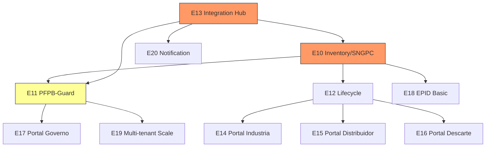

# Smart Trace - Backlog Detalhado Fase 2 (Pilotos Ampliados M4-M9)

> Stories detalhadas com acceptance criteria para pilotos em UFs selecionadas.

**Status:** DRAFT
**Referencia:** architecture-v1.md, phase1-backlog.md
**Timeline:** M4-M9 (~26 semanas, time 8-12 devs)
**Pre-requisito:** Fase 1 concluida (MVP operacional)

---

## Visao Geral Fase 2

**Objetivo:** PFPB-Guard antifraude operacional, SNGPC do Fato com integridade fiscal,
recalls/recolhimento/descarte funcionando, pilotos em 1-3 UFs.

**Entregaveis:**
- SNGPC do Fato (escrituracao baseada em eventos reais)
- PFPB-Guard (motor antifraude com reconciliacao triplice)
- Lifecycle completo (recalls, bloqueio <2h, coleta, descarte certificado)
- Integration Hub (SEFAZ, SNGPC, PFPB, Descarte)
- Portais: Industria, Distribuidor, Descarte, Governo (basico)
- EPID basico (ingestao, anonimizacao, alertas N1/N2)
- Multi-tenant + escala para piloto
- Notification Service completo

---

## Epic E10 - Inventory / SNGPC do Fato (4 semanas)

### E10.1 - Inventory Management API

**Story ST-10.1.1: Scaffold Inventory Service (NestJS)**
- **Acceptance Criteria:**
  - [ ] NestJS project em services/inventory com mesma estrutura base do Dispensation
  - [ ] Modulos: inventory, fiscal, sngpc, reconciliation
  - [ ] Conexoes: PostgreSQL, TimescaleDB, Redis, Kafka (producer + consumer)
  - [ ] Kafka consumer: dispensation.events (para debitar estoque automatico)
  - [ ] Health check, OTel instrumentation, Swagger
  - [ ] Dockerfile + Helm chart
- **Estimativa:** 2d

**Story ST-10.1.2: CRUD de estoque**
- **Acceptance Criteria:**
  - [ ] GET /inventory - Listar estoque (paginado, filtros: produto, lote, low_stock)
  - [ ] GET /inventory/summary - Resumo (total SKUs, valor, proximos a vencer)
  - [ ] Debito automatico ao consumir dispensation.events
  - [ ] Credito automatico ao consumir inventory.receipt.approved
  - [ ] Quantidade bloqueada separada (para recalls)
  - [ ] Alerta automatico estoque baixo (threshold configuravel por produto)
  - [ ] Testes unitarios + integracao
- **Estimativa:** 3d

### E10.2 - NF-e Validation (SEFAZ Connector)

**Story ST-10.2.1: SEFAZ connector no Integration Hub**
- **Acceptance Criteria:**
  - [ ] Connector SEFAZ em services/integration-hub/connectors/sefaz
  - [ ] Consulta NF-e por chave de 44 digitos
  - [ ] Parse XML da NF-e (emitente, destinatario, itens, valores)
  - [ ] Cache da consulta em Redis (TTL 24h - NF-e nao muda)
  - [ ] Retry com backoff exponencial (SEFAZ instavel)
  - [ ] Circuit breaker (threshold 5 falhas em 30s)
  - [ ] Idempotency guard por nfe_key
  - [ ] Mock SEFAZ para testes (WireMock)
- **Estimativa:** 3d

**Story ST-10.2.2: Fluxo de recebimento com validacao NF-e**
- **Acceptance Criteria:**
  - [ ] POST /inventory/receipts valida NF-e automaticamente
  - [ ] Conferencia de itens: NF-e itens vs informados pelo operador
  - [ ] Status: approved (match), pending (divergencia), rejected (NF-e invalida)
  - [ ] Grava nfe_reference no PostgreSQL
  - [ ] Grava evento receipt no TimescaleDB
  - [ ] Publica inventory.receipt.approved ou inventory.receipt.divergence no Kafka
  - [ ] Testes: NF-e valida, NF-e invalida, NF-e nao encontrada, divergencia itens
- **Estimativa:** 2d

### E10.3 - SNGPC Export

**Story ST-10.3.1: Escrituracao automatica a partir de eventos**
- **Acceptance Criteria:**
  - [ ] Consumer Kafka: dispensation.events → gera registro SNGPC (tipo: saida)
  - [ ] Consumer Kafka: inventory.receipt.approved → gera registro SNGPC (tipo: entrada)
  - [ ] Tabela sngpc_entries com todos os campos regulatorios
  - [ ] Mapeamento automatico: evento → formato SNGPC (produto, lote, qtd, receita)
  - [ ] Log de escrituracao com rastreabilidade ao evento original
- **Estimativa:** 2d

**Story ST-10.3.2: Exportacao XML para Anvisa**
- **Acceptance Criteria:**
  - [ ] POST /sngpc/exports gera XML no formato oficial SNGPC
  - [ ] SNGPC connector no Integration Hub
  - [ ] Submissao automatica a Anvisa
  - [ ] Status tracking: accepted (com protocolo), rejected (com erros)
  - [ ] Armazena XML gerado no S3
  - [ ] Historico de exportacoes consultavel
  - [ ] Mock SNGPC para testes
- **Estimativa:** 2d

### E10.4 - Reconciliacao Estoque vs Eventos

**Story ST-10.4.1: Engine de reconciliacao**
- **Acceptance Criteria:**
  - [ ] Job agendado (diario, configuravel) por estabelecimento
  - [ ] Compara: estoque_sistema vs SUM(entradas) - SUM(saidas) dos eventos
  - [ ] Detecta divergencias por produto/lote
  - [ ] Grava resultado em reconciliation_log (status: OK ou DIVERGENT)
  - [ ] Publica inventory.reconciliation.divergence no Kafka
  - [ ] GET /inventory/reconciliation?date= retorna resultado
- **Estimativa:** 2d

### E10.5 - Painel de Divergencias

**Story ST-10.5.1: UI de divergencias no Portal Farmacia**
- **Acceptance Criteria:**
  - [ ] Tela de divergencias com: data, produto, lote, delta, status
  - [ ] Filtros: data, apenas divergentes
  - [ ] Acao: resolver divergencia (ajuste manual com motivo)
  - [ ] Indicador no sidebar: badge com count de divergencias pendentes
  - [ ] Historico de resolucoes
- **Estimativa:** 1d

**Story ST-10.5.2: Bloqueio/sinalizacao sem lastro fiscal**
- **Acceptance Criteria:**
  - [ ] Ao consumir dispensation.events: verifica existencia de NF-e de entrada para o produto/lote
  - [ ] Se nao encontra: INSERT evento fiscal_alert (tipo=sem_lastro)
  - [ ] Politica configuravel: BLOCK (impede dispensacao) ou WARN (sinaliza)
  - [ ] Notificacao para gerente + sinaliza na tela de conformidade
  - [ ] Metrica: % dispensacoes sem lastro fiscal
- **Estimativa:** 2d

---

## Epic E11 - PFPB-Guard (6 semanas)

### E11.1 - Event Processing

**Story ST-11.1.1: PFPB-Guard service scaffold**
- **Acceptance Criteria:**
  - [ ] NestJS + Go hybrid em services/pfpb-guard
  - [ ] Kafka consumer: pfpb.dispensations (filtered from dispensation.events where program=PFPB)
  - [ ] Consumer processa em batch (configuravel: 100 eventos ou 5s)
  - [ ] Conexao ClickHouse para queries analiticas
  - [ ] PostgreSQL para estado (reconciliations, anomalies, dossiers, fiscal_queue)
  - [ ] Metricas: events_processed/s, anomalies_detected, reconciliation_rate
- **Estimativa:** 3d

### E11.2 - Rules Engine

**Story ST-11.2.1: Motor de regras configuraveis (Go)**
- **Acceptance Criteria:**
  - [ ] Rules engine em Go (services/pfpb-guard/cmd/rules-engine)
  - [ ] Regras definidas em YAML/JSON (nao hardcoded)
  - [ ] Regras base:
    - Dispensacao sem autorizacao PFPB
    - Dispensacao sem NF-e de entrada
    - Dispensacao fora do horario cadastrado
    - Volume acima do threshold por farmacia/dia
    - RT nao validado em dispensacao PFPB
    - Mesmo paciente em multiplas farmacias no mesmo dia
  - [ ] Hot-reload de regras (sem restart)
  - [ ] Cada regra retorna: triggered (bool), severity, score_impact, details
  - [ ] API interna gRPC para NestJS chamar Go engine
  - [ ] Testes para cada regra com cenarios positivos e negativos
  - [ ] Benchmark: processar 1000 eventos em < 1s
- **Estimativa:** 5d

**Story ST-11.2.2: Admin API para gestao de regras**
- **Acceptance Criteria:**
  - [ ] GET /pfpb-guard/rules - Listar regras ativas
  - [ ] PUT /pfpb-guard/rules/{id} - Atualizar parametros (threshold, severity)
  - [ ] POST /pfpb-guard/rules/{id}/enable - Habilitar regra
  - [ ] POST /pfpb-guard/rules/{id}/disable - Desabilitar regra
  - [ ] Audit trail de mudancas em regras
  - [ ] Apenas role admin:system pode alterar regras
- **Estimativa:** 3d

### E11.3 - PFPB Reconciliation

**Story ST-11.3.1: PFPB Autorizador connector**
- **Acceptance Criteria:**
  - [ ] Connector no Integration Hub para API do Autorizador PFPB (MS)
  - [ ] Consulta autorizacao por: CPF hash + produto + data
  - [ ] Cache em Redis (TTL 1h)
  - [ ] Retry + circuit breaker
  - [ ] Mock para desenvolvimento
- **Estimativa:** 2d

**Story ST-11.3.2: Reconciliacao triplice**
- **Acceptance Criteria:**
  - [ ] Para cada dispensacao PFPB:
    - Verificacao 1: Autorizacao PFPB existe e confere (produto, valor, data)
    - Verificacao 2: NF-e de entrada existe (lastro fiscal)
    - Match triplice: evento.produto == auth.produto == nfe.item
  - [ ] Status: matched, auth_missing, nfe_missing, mismatch
  - [ ] Grava pfpb_reconciliation no PostgreSQL
  - [ ] Grava record analitico no ClickHouse
  - [ ] Publica alertas no Kafka: pfpb.alert.{tipo}
  - [ ] Metricas: reconciliation_rate, match_rate, alert_rate
  - [ ] KPI target: >= 90% reconciliacao automatica
- **Estimativa:** 3d

### E11.4 - Anomaly Detection

**Story ST-11.4.1: Detector de anomalias temporais (Go)**
- **Acceptance Criteria:**
  - [ ] Modulo Go em cmd/anomaly-detector
  - [ ] Query baseline 30 dias por farmacia no ClickHouse
  - [ ] Deteccao: dispensacao fora horario, volume spike (Z-score >3), atividade feriado
  - [ ] Cada anomalia gera: {type, score, details, farmacia, timestamp}
  - [ ] Grava anomalias no PostgreSQL
  - [ ] Benchmark: analisar 1000 eventos em < 2s
- **Estimativa:** 3d

**Story ST-11.4.2: Detector de anomalias geograficas**
- **Acceptance Criteria:**
  - [ ] Validacao GPS vs geofence para cada dispensacao PFPB
  - [ ] Deteccao: mesmo paciente em farmacias distantes (<24h)
  - [ ] Deteccao: mesmo RT validando em farmacias distantes
  - [ ] Query ClickHouse para historico paciente/RT
  - [ ] Score proporcional a distancia e frequencia
- **Estimativa:** 2d

**Story ST-11.4.3: Detector de anomalias comportamentais**
- **Acceptance Criteria:**
  - [ ] Perfil operador: media diaria, produtos top, pacientes unicos (90 dias)
  - [ ] Perfil farmacia: media diaria, mix produtos, taxa controlados (90 dias)
  - [ ] Deteccao: operador volume 5x acima media
  - [ ] Deteccao: concentracao >80% em produto especifico
  - [ ] Deteccao: par operador-paciente repetitivo
  - [ ] Deteccao: taxa controlados acima media regional
- **Estimativa:** 3d

### E11.5 - Risk Scoring

**Story ST-11.5.1: Engine de scoring de risco**
- **Acceptance Criteria:**
  - [ ] Score composto por farmacia: soma ponderada de anomalias (90 dias rolling)
  - [ ] Score por operador: individual
  - [ ] Pesos configuraveis por tipo de anomalia
  - [ ] Decay temporal: anomalias antigas pesam menos
  - [ ] Threshold para trigger dossie: >= 0.75 (configuravel)
  - [ ] API: GET /pfpb-guard/risk-scores?establishment_id= ou ?top=N
  - [ ] Historico de evolucao do score
- **Estimativa:** 3d

### E11.6 - Dossier Generator

**Story ST-11.6.1: Geracao automatica de dossies probatorios**
- **Acceptance Criteria:**
  - [ ] Trigger: score >= threshold
  - [ ] Conteudo: timeline anomalias, evidencias, comparativos regionais, reconciliacoes pendentes
  - [ ] Formato: JSON estruturado + PDF renderizado
  - [ ] Armazena em S3 (retencao minima 5 anos)
  - [ ] Metadata: farmacia, score, data geracao, anomalias inclusas
  - [ ] Notificacao para equipe fiscalizacao
- **Estimativa:** 3d

### E11.7 - Fiscal Queue

**Story ST-11.7.1: Fila de fiscalizacao por score**
- **Acceptance Criteria:**
  - [ ] Tabela fiscal_queue: farmacia, score, dossier_id, status, assigned_to
  - [ ] GET /pfpb-guard/fiscal-queue?sort=risk_score&status=pending
  - [ ] PATCH /pfpb-guard/fiscal-queue/{id} - atualizar decisao (investigar/arquivar/encaminhar)
  - [ ] Apenas roles government:* podem acessar
  - [ ] Audit trail de decisoes
- **Estimativa:** 2d

### E11.8 - Evidence Repository

**Story ST-11.8.1: Storage probatorio com retencao**
- **Acceptance Criteria:**
  - [ ] Bucket S3 dedicado: smart-trace-evidence-pfpb
  - [ ] Lifecycle policy: Standard 1 ano → IA 3 anos → Glacier 5 anos → Delete
  - [ ] Criptografia server-side (KMS)
  - [ ] Access logging habilitado
  - [ ] Immutable (Object Lock) para evidencias
  - [ ] API interna para upload/download com presigned URLs
- **Estimativa:** 2d

---

## Epic E12 - Lifecycle (Recalls/Descarte) (4 semanas)

### E12.1 - Recall Management

**Story ST-12.1.1: Scaffold Lifecycle Service**
- **Acceptance Criteria:**
  - [ ] NestJS project com modulos: recall, blocking, collection, tracking, certificate, compliance
  - [ ] Conexoes: PostgreSQL, TimescaleDB, Kafka, S3
  - [ ] POST /recalls - Criar recall (role: industry:quality ou government:anvisa)
  - [ ] GET /recalls - Listar recalls (filtros: status, severity, batch)
  - [ ] GET /recalls/{id} - Detalhe com affected_count, blocked/collected/disposed units
  - [ ] PATCH /recalls/{id}/close - Fechar recall (quando 100% descartado)
- **Estimativa:** 3d

### E12.2 - Lot Blocking Engine

**Story ST-12.2.1: Bloqueio de lote em <2h**
- **Acceptance Criteria:**
  - [ ] Consumer Kafka: lifecycle.recall.initiated
  - [ ] Identifica todos os estabelecimentos com estoque do lote
  - [ ] UPDATE inventory SET quantity_blocked += available, quantity_available = 0
  - [ ] SET Redis key block:batch:{batch} para validacao rapida na dispensacao
  - [ ] INSERT evento recall_block para cada estabelecimento no TimescaleDB
  - [ ] Publica lifecycle.recall.blocked no Kafka
  - [ ] Ancora hash do bloqueio no ledger
  - [ ] SLA metrica: blocked_at - initiated_at < 2h
  - [ ] Testes de carga: bloquear 500 farmacias em paralelo
- **Estimativa:** 3d

**Story ST-12.2.2: Integracao bloqueio na dispensacao**
- **Acceptance Criteria:**
  - [ ] Dispensation Service verifica Redis block:batch:{batch} antes de aprovar
  - [ ] Se lote bloqueado: status=blocked, reason=recall_active
  - [ ] Latencia adicional < 5ms (Redis check)
  - [ ] Testes: dispensar lote normal, dispensar lote em recall
- **Estimativa:** 2d

### E12.3 - Collection Scheduling

**Story ST-12.3.1: Agendamento de coleta**
- **Acceptance Criteria:**
  - [ ] POST /collections/schedule - Farmacia solicita recolhimento
  - [ ] Selecao automatica de empresa de descarte mais proxima (por UF)
  - [ ] Notificacao para empresa de descarte
  - [ ] GET /collections?establishment_id= - Listar coletas da farmacia
  - [ ] GET /collections?disposal_company_id= - Listar coletas da empresa
  - [ ] Status: scheduled, in_progress, completed, cancelled
- **Estimativa:** 3d

### E12.4 - Disposal Tracking

**Story ST-12.4.1: Rastreio de coleta/transporte**
- **Acceptance Criteria:**
  - [ ] POST /collections/{id}/checkin - Check-in na farmacia (GPS + foto)
  - [ ] POST /collections/{id}/items - Conferencia itens coletados
  - [ ] POST /collections/{id}/waypoint - Waypoints em transito (automatico a cada 15min)
  - [ ] POST /collections/{id}/arrival - Chegada no destino
  - [ ] Todos os tracking events gravados no TimescaleDB
  - [ ] Timeline visual consultavel por API
- **Estimativa:** 3d

### E12.5 - Certificate Generation + Ledger

**Story ST-12.5.1: Certificado de descarte com hash no ledger**
- **Acceptance Criteria:**
  - [ ] POST /disposals - Registra descarte (metodo, quantidade, evidencias, laudo)
  - [ ] Gera certificado: recall, lote, quantidade, metodo, licenca, evidencias
  - [ ] Calcula SHA-256 do certificado
  - [ ] Ancora hash no Hyperledger Fabric
  - [ ] Armazena certificado (PDF + JSON) no S3
  - [ ] GET /disposals/{id}/certificate?format=json|pdf
  - [ ] Atualiza recall: disposed_units += quantity
  - [ ] Notificacao para farmacia: certificado disponivel
- **Estimativa:** 3d

### E12.6 - Environmental Compliance Reports

**Story ST-12.6.1: Relatorios de conformidade ambiental**
- **Acceptance Criteria:**
  - [ ] GET /compliance/environmental?period=&uf= - Relatorio consolidado
  - [ ] Conteudo: recalls, taxa descarte, tempo medio recall→descarte, certificados, metodos
  - [ ] Verificacao ledger (% certificados com hash verificado)
  - [ ] Exportacao PDF
  - [ ] Apenas roles government:* podem acessar
- **Estimativa:** 2d

---

## Epic E13 - Integration Hub (3 semanas)

### E13.1 - Connector Framework

**Story ST-13.1.1: Framework de conectores resilientes**
- **Acceptance Criteria:**
  - [ ] Base class/interface para conectores: connect(), execute(), healthCheck()
  - [ ] Retry engine: backoff exponencial, max retries, dead letter
  - [ ] Circuit breaker: threshold, timeout, half-open state
  - [ ] Idempotency guard: request_id → resultado cacheado (Redis, TTL 24h)
  - [ ] Metricas por conector: latency, success_rate, circuit_state
  - [ ] Log estruturado: request/response (sanitizado), errors, retries
  - [ ] Testes com cenarios: sucesso, falha transitoria, falha permanente, timeout
- **Estimativa:** 3d

### E13.2 - SEFAZ Connector (Full)

**Story ST-13.2.1: SEFAZ NF-e connector completo**
- **Acceptance Criteria:**
  - [ ] Consulta NF-e por chave 44 digitos (REST + SOAP fallback)
  - [ ] Parse completo XML NF-e (emitente, itens, ICMS, IPI)
  - [ ] Validacao de CNPJ destinatario vs establishment
  - [ ] Status: autorizada, cancelada, denegada
  - [ ] Suporte multi-UF (webservices por estado)
  - [ ] Cache inteligente (NF-e autorizada = permanent, outros = 1h)
- **Estimativa:** 2d

### E13.3 - SNGPC Connector

**Story ST-13.3.1: SNGPC connector para submissao**
- **Acceptance Criteria:**
  - [ ] Gera XML formato SNGPC (version 2.0)
  - [ ] POST submissao para webservice Anvisa
  - [ ] Tracking protocolo de recebimento
  - [ ] Parse resposta (aceito/rejeitado com erros)
  - [ ] Retry em falha de comunicacao
  - [ ] Mock webservice para testes
- **Estimativa:** 2d

### E13.4 - PFPB Autorizador Connector

**Story ST-13.4.1: Connector Autorizador PFPB**
- **Acceptance Criteria:**
  - [ ] Consulta autorizacao por parametros (CPF hash, produto, data, farmacia)
  - [ ] Retorna: authorization_id, status, valor_subsidio, data
  - [ ] Cache em Redis (TTL 1h - autorizacoes podem ser canceladas)
  - [ ] Tratamento: autorizacao nao encontrada, expirada, ja utilizada
  - [ ] Mock para testes
- **Estimativa:** 2d

---

## Epic E14 - Portal Industria (3 semanas)

**Story ST-14.1.1: Scaffold Portal Industria**
- **Acceptance Criteria:**
  - [ ] Next.js app em apps/portal-industria com auth Keycloak (roles industry:*)
  - [ ] Layout: sidebar com secoes (Rastreio, Recalls, Remessas, Relatorios)
  - [ ] Dashboard home com KPIs: lotes ativos, recalls, unidades rastreadas
- **Estimativa:** 2d

**Story ST-14.1.2: Rastreio de lotes e producao**
- **Acceptance Criteria:**
  - [ ] Listagem de lotes com filtros (produto, status, data fabricacao)
  - [ ] Detalhe do lote: timeline de eventos (producao → distribuicao → farmacias → dispensacao)
  - [ ] Mapa de distribuicao: quais farmacias receberam o lote
  - [ ] Quantidade: produzida, distribuida, dispensada, em estoque, bloqueada
- **Estimativa:** 3d

**Story ST-14.1.3: Gestao de recalls**
- **Acceptance Criteria:**
  - [ ] Tela de criacao de recall (lote, motivo, severidade, comunicado)
  - [ ] Dashboard de recalls ativos: status, progress bar (bloqueado/coletado/descartado)
  - [ ] Detalhe: farmacias afetadas, timeline do recall, certificados de descarte
  - [ ] Notificacoes enviadas (historico)
- **Estimativa:** 3d

**Story ST-14.1.4: Remessas SUS e relatorios**
- **Acceptance Criteria:**
  - [ ] Listagem de remessas para farmacias publicas/SUS
  - [ ] Rastreio: expedido, em transito, recebido
  - [ ] Relatorios: unidades dispensadas por regiao, conformidade, validade
  - [ ] Exportacao CSV/PDF
- **Estimativa:** 2d

---

## Epic E15 - Portal Distribuidor (2 semanas)

**Story ST-15.1.1: Portal Distribuidor completo**
- **Acceptance Criteria:**
  - [ ] Next.js app com auth (roles distributor:*)
  - [ ] Tela recebimento: registrar NF-e recebida, conferencia
  - [ ] Tela expedicao: registrar envio para farmacias, NF-e saida
  - [ ] Trilha logistica: timeline por lote (recebido → estocado → expedido)
  - [ ] Dashboard: estoque, movimentacoes dia, divergencias
  - [ ] Alertas: recalls ativos para lotes em estoque
- **Estimativa:** 5d

**Story ST-15.1.2: Conferencia de mercadoria**
- **Acceptance Criteria:**
  - [ ] Tela de conferencia: NF-e vs itens recebidos
  - [ ] Registro de divergencias (falta, sobra, avaria)
  - [ ] Workflow de resolucao de divergencias
- **Estimativa:** 3d

---

## Epic E16 - Portal Descarte (2 semanas)

**Story ST-16.1.1: Portal Descarte completo**
- **Acceptance Criteria:**
  - [ ] Next.js app com auth (roles disposal:*)
  - [ ] Dashboard: coletas agendadas, em andamento, concluidas
  - [ ] Tela de agendamento: ver coletas pendentes, aceitar/recusar
  - [ ] Tela de execucao: registrar etapas (checkin, coleta, transporte, chegada, descarte)
  - [ ] Upload de evidencias (fotos, laudos) com preview
  - [ ] Emissao de certificado de descarte
  - [ ] Verificacao de hash no ledger (selo de integridade)
- **Estimativa:** 5d

**Story ST-16.1.2: Gestao de rotas e operadores**
- **Acceptance Criteria:**
  - [ ] Cadastro de operadores de rota
  - [ ] Atribuicao de coletas a operadores
  - [ ] Visualizacao de rota no mapa
  - [ ] Status em tempo real (via waypoints)
- **Estimativa:** 3d

---

## Epic E17 - Portal Governo Basico (3 semanas)

**Story ST-17.1.1: Scaffold Portal Governo**
- **Acceptance Criteria:**
  - [ ] Next.js app com auth (roles government:*)
  - [ ] MFA obrigatorio (Keycloak policy)
  - [ ] Layout com secoes: Dashboard, PFPB, Recalls, EPID, Auditoria
  - [ ] Scope por UF (CRFs veem apenas sua UF, MS/Anvisa veem tudo)
- **Estimativa:** 2d

**Story ST-17.1.2: Dashboard KPIs nacionais**
- **Acceptance Criteria:**
  - [ ] KPIs: dispensacoes/dia, RT coverage, reconciliacao PFPB, recalls ativos
  - [ ] Filtros: UF, municipio, periodo
  - [ ] Graficos: tendencia 30 dias, comparativo UFs, top farmacias por volume
  - [ ] Real-time updates (polling 1min)
- **Estimativa:** 3d

**Story ST-17.1.3: Fila de fiscalizacao PFPB**
- **Acceptance Criteria:**
  - [ ] Lista de farmacias por risk score (descendente)
  - [ ] Detalhe: score breakdown, anomalias, dossie download
  - [ ] Acoes: investigar, arquivar, encaminhar para CGU
  - [ ] Historico de decisoes
- **Estimativa:** 2d

**Story ST-17.1.4: Painel de recalls e alertas**
- **Acceptance Criteria:**
  - [ ] Recalls ativos com progresso (blocked/collected/disposed)
  - [ ] Alertas EPID basicos (N1/N2) com mapa
  - [ ] Timeline de eventos por recall
  - [ ] Notificacoes nao lidas (badge)
- **Estimativa:** 2d

---

## Epic E18 - EPID Basico (3 semanas)

**Story ST-18.1.1: Scaffold EPID Service (Go)**
- **Acceptance Criteria:**
  - [ ] Service Go em services/epid
  - [ ] Kafka consumer: dispensation.events (all)
  - [ ] Conexao ClickHouse para write analitico
  - [ ] Metricas: events_ingested/s, anonymization_latency
- **Estimativa:** 2d

**Story ST-18.1.2: Anonymizer (LGPD)**
- **Acceptance Criteria:**
  - [ ] Remove patient_pseudo_id completamente
  - [ ] Generaliza geolocalizacao: ponto GPS → codigo municipio
  - [ ] Generaliza timestamp: segundo → hora
  - [ ] Mantem: classe_terapeutica, municipio, UF, produto, lote, quantidade
  - [ ] Output: evento anonimizado para ClickHouse
  - [ ] Benchmark: 10k eventos/segundo
  - [ ] Testes: validar que nenhum dado pessoal persiste
- **Estimativa:** 2d

**Story ST-18.1.3: ClickHouse setup + data ingestion**
- **Acceptance Criteria:**
  - [ ] ClickHouse cluster (1 node dev, 3 nodes staging)
  - [ ] Tabela epid_events: particionada por dia, ORDER BY (uf, municipio, classe, timestamp)
  - [ ] Materialized views: agregacoes por UF/dia, municipio/dia, classe/dia
  - [ ] Ingestao batch do Go service (INSERT batch 1000 rows)
  - [ ] Retencao: 3 anos
  - [ ] Testes de query performance (< 1s para 30 dias)
- **Estimativa:** 3d

**Story ST-18.1.4: Deteccao basica de padroes**
- **Acceptance Criteria:**
  - [ ] Job horario (Go cron)
  - [ ] Query: volume por classe x municipio, compara com baseline 30 dias
  - [ ] Z-score calculation
  - [ ] Detecta: spike volume (Z > 2), tendencia ascendente (7 dias consecutivos)
  - [ ] Grava padroes detectados em PostgreSQL (epid_patterns)
- **Estimativa:** 2d

**Story ST-18.1.5: Alertas N1/N2**
- **Acceptance Criteria:**
  - [ ] N1 (informativo): Z-score 2-3, sem cluster, tendencia estavel → dashboard only
  - [ ] N2 (atencao): Z-score >3, OU cluster, OU tendencia >7d → notificacao vigilancia
  - [ ] INSERT epid_alert com level, territory, class, details
  - [ ] Integracao com Notification Service
  - [ ] Dashboard API para Portal Governo
- **Estimativa:** 2d

---

## Epic E19 - Multi-tenant & Scale (2 semanas)

**Story ST-19.1.1: Row-Level Security (RLS) enforcement**
- **Acceptance Criteria:**
  - [ ] PostgreSQL RLS policies em todas as tabelas com establishment_id
  - [ ] Keycloak JWT → set_config('app.establishment_id', ...) em cada conexao
  - [ ] Testes: usuario A nao ve dados de usuario B
  - [ ] Testes: admin ve dados de todos (bypass RLS)
  - [ ] Performance: overhead < 5% em queries tipicas
- **Estimativa:** 3d

**Story ST-19.1.2: Load testing**
- **Acceptance Criteria:**
  - [ ] Scripts k6 para: dispensacao (write), consulta (read), reconciliacao PFPB
  - [ ] Cenario: 100 farmacias simultaneas, 10 dispensacoes/min cada = 1000/min
  - [ ] Metricas: p95 latency, error rate, throughput
  - [ ] Report com bottlenecks identificados
  - [ ] Baseline para Fase 3 (escala nacional)
- **Estimativa:** 3d

**Story ST-19.1.3: Performance tuning**
- **Acceptance Criteria:**
  - [ ] Resolver bottlenecks do load test
  - [ ] Connection pooling otimizado (pgBouncer se necessario)
  - [ ] Kafka partitioning review (partitions por establishment_id range)
  - [ ] Redis caching strategy review
  - [ ] Query optimization (EXPLAIN ANALYZE dos top 10 queries)
- **Estimativa:** 2d

---

## Epic E20 - Notification Service (2 semanas)

**Story ST-20.1.1: Scaffold Notification Service**
- **Acceptance Criteria:**
  - [ ] NestJS service com modulos: channels, templates, delivery
  - [ ] Kafka consumer: notification.requests
  - [ ] Suporte a prioridades: urgent, high, normal, low
  - [ ] Deduplication por recipient + notification_type (janela 5min)
  - [ ] Delivery tracking: sent, delivered, failed, bounced
- **Estimativa:** 2d

**Story ST-20.1.2: Email + SMS channels**
- **Acceptance Criteria:**
  - [ ] Email via AWS SES (template HTML)
  - [ ] SMS via AWS SNS (mensagens curtas)
  - [ ] Templates por tipo: recall_alert, fiscal_alert, epid_alert, collection_scheduled
  - [ ] Variáveis dinamicas nos templates (farmacia, produto, data, etc.)
  - [ ] Fallback: se email falha, tenta SMS
- **Estimativa:** 2d

**Story ST-20.1.3: Push notifications**
- **Acceptance Criteria:**
  - [ ] FCM (Android) + APNs (iOS) via Expo Push Service
  - [ ] Registro de device tokens (App RT + futuros apps)
  - [ ] Push para RT: solicitacao validacao, recall em farmacia
  - [ ] Push para gerente: divergencia, bloqueio, alerta
  - [ ] Delivery receipt tracking
- **Estimativa:** 2d

**Story ST-20.1.4: Webhook delivery**
- **Acceptance Criteria:**
  - [ ] Cadastro de webhooks por establishment (URL + secret + eventos)
  - [ ] Assinatura HMAC-SHA256 do payload
  - [ ] Retry: 3 tentativas com backoff (1min, 5min, 30min)
  - [ ] Dashboard de webhooks: delivery status, latency, failures
  - [ ] Usado por: SDK integracao ERP
- **Estimativa:** 2d

---

## Dependencias entre Epics (Fase 2)

**Caminho critico:** Integration Hub → Inventory/SNGPC → PFPB-Guard → Portal Governo

---

## Equipe Fase 2

| Role | Qtd | Foco |
|------|-----|------|
| Tech Lead | 1 | Coord tecnica, PFPB-Guard design, code review |
| Backend Senior (NestJS) | 3 | Inventory, Lifecycle, Integration Hub, Notification |
| Backend (Go) | 2 | PFPB-Guard engines (rules, anomaly), EPID |
| Frontend Senior | 2 | Portais Industria, Distribuidor, Descarte, Governo |
| Mobile (React Native) | 1 | Melhorias App RT + App Descarte (rota) |
| DevOps/SRE | 1 | ClickHouse, scaling, monitoring, load tests |
| QA | 1 | Test plans, automation, load testing |
| **Total** | **11** | |

---

## KPIs de Sucesso Fase 2

| KPI | Target | Medicao |
|-----|--------|---------|
| RT validado (controlados) | >= 99.5% | Dispensation stats |
| Reconciliacao PFPB automatica | >= 90% | PFPB-Guard metrics |
| Dispensacao sem lastro fiscal (reducao) | >= 30% | Inventory metrics |
| Bloqueio recall | < 2h | Lifecycle metrics |
| Alerta EPID | < 48h | EPID metrics |
| Uptime servicos criticos | >= 99.5% | Grafana |
| Latencia dispensacao p95 | < 500ms | OTel |

---

*Smart Trace - Phase 2 Backlog v1.0*
*Total: 11 Epics, ~60 Stories, ~26 semanas*
