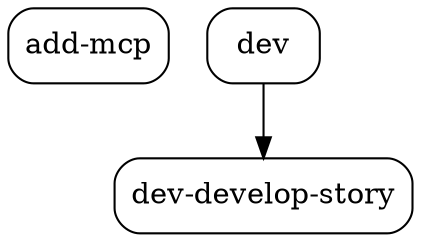
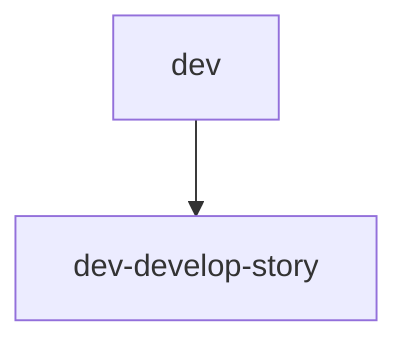

# Story GD-3: Provider Status e Output Formats

## Status

Draft

## Executor Assignment

```yaml
executor: "@dev"
quality_gate: "@qa"
quality_gate_tools: ["jest", "eslint", "coderabbit"]
```

## Story

**As a** developer using AIOS,
**I want** to see provider status and export graph data in different formats,
**so that** I can integrate with other tools and monitor system health.

## Acceptance Criteria

1. Sem flags adicionais, `aios graph` mostra summary view combinando: dependency tree (compacto) + entity stats + provider status
2. Provider status mostra: Code Graph MCP (ACTIVE/OFFLINE com bullet colorido), Circuit Breaker state (CLOSED/OPEN/HALF-OPEN), failure count, cache entries
3. Flag `--format=json` output JSON estruturado do dependency graph (pipe-friendly)
4. Flag `--format=dot` output formato DOT válido para Graphviz (`digraph G { ... }`)
5. Flag `--format=mermaid` output formato Mermaid válido para documentação (`graph TD ...`)
6. Todos os formatters funcionam com pipe (`aios graph --deps --format=json | jq .`)
7. Testes unitários cobrem: summary view, provider status rendering, cada formato de output (json/dot/mermaid), non-TTY mode

## CodeRabbit Integration

### Story Type Analysis

**Primary Type**: Architecture
**Secondary Type(s)**: N/A (CLI module, no DB/frontend)
**Complexity**: Medium (multiple formatters, well-defined scope per formatter)

### Specialized Agent Assignment

**Primary Agents**:
- @dev (implementation + pre-commit reviews)

**Supporting Agents**:
- @architect (output format validation)

### Quality Gate Tasks

- [ ] Pre-Commit (@dev): Run `coderabbit --prompt-only -t uncommitted` before marking story complete
- [ ] Pre-PR (@devops): Run `coderabbit --prompt-only --base main` before creating pull request

### Self-Healing Configuration

**Expected Self-Healing**:
- Primary Agent: @dev (light mode)
- Max Iterations: 2
- Timeout: 15 minutes
- Severity Filter: CRITICAL

**Predicted Behavior**:
- CRITICAL issues: auto_fix (up to 2 iterations)
- HIGH issues: document_only (noted in Dev Notes)

### CodeRabbit Focus Areas

**Primary Focus**:
- Output correctness: JSON deve ser parseable, DOT deve ser válido para `dot -Tpng`, Mermaid deve ser válido
- Pipe safety: Nenhum ANSI escape em output de formatters

**Secondary Focus**:
- Error handling: Provider offline não deve crashar summary view
- Code patterns: Seguir padrão existente de code-intel module

## Tasks / Subtasks

- [ ] **Task 1: Implementar status-renderer.js (renderers/status-renderer.js)** (AC: 1, 2)
  - [ ] 1.1 Criar função `renderStatus(metricsData, options)` que retorna string multiline
  - [ ] 1.2 Mostrar provider status: `● ACTIVE` (verde TTY) ou `○ OFFLINE` (vermelho TTY)
  - [ ] 1.3 Mostrar Circuit Breaker state: CLOSED / OPEN / HALF-OPEN
  - [ ] 1.4 Mostrar failure count: `Failures: 0/3` (threshold do circuit breaker)
  - [ ] 1.5 Mostrar cache entries count
  - [ ] 1.6 Non-TTY: usar `[ACTIVE]`/`[OFFLINE]` em vez de bullets coloridos

- [ ] **Task 2: Implementar json-formatter.js (formatters/json-formatter.js)** (AC: 3)
  - [ ] 2.1 Criar função `formatAsJson(graphData)` que retorna JSON string indentado
  - [ ] 2.2 Usar `JSON.stringify(graphData, null, 2)` — zero transformação extra
  - [ ] 2.3 Output deve ser parseable por `jq` sem erros

- [ ] **Task 3: Implementar dot-formatter.js (formatters/dot-formatter.js)** (AC: 4)
  - [ ] 3.1 Criar função `formatAsDot(graphData)` que retorna DOT string
  - [ ] 3.2 Header: `digraph G {`, `rankdir=TB;`, `node [shape=box, style=rounded];`
  - [ ] 3.3 Iterar nodes: `"node-id" [label="node-label"];`
  - [ ] 3.4 Iterar edges: `"from-id" -> "to-id";`
  - [ ] 3.5 Footer: `}`
  - [ ] 3.6 Escapar aspas em labels

- [ ] **Task 4: Implementar mermaid-formatter.js (formatters/mermaid-formatter.js)** (AC: 5)
  - [ ] 4.1 Criar função `formatAsMermaid(graphData)` que retorna Mermaid string
  - [ ] 4.2 Header: `graph TD`
  - [ ] 4.3 Iterar edges: `from["fromLabel"] --> to["toLabel"]`
  - [ ] 4.4 Incluir nodes sem edges como isolated nodes
  - [ ] 4.5 Escapar caracteres especiais em labels (quotes, brackets)

- [ ] **Task 5: Implementar handleSummary no CLI router** (AC: 1)
  - [ ] 5.1 Criar `handleSummary(args)` no cli.js
  - [ ] 5.2 Instanciar todos os 3 data sources em paralelo: `Promise.all([codeIntelSource.getData(), registrySource.getData(), metricsSource.getData()])`
  - [ ] 5.3 Renderizar sequencialmente: tree (compacto, max 5 per category) → stats → status
  - [ ] 5.4 Separar secções com linhas em branco para legibilidade
  - [ ] 5.5 Detectar `process.stdout.isTTY` e passar como opção aos renderers

- [ ] **Task 6: Integrar --format no CLI router** (AC: 3, 4, 5, 6)
  - [ ] 6.1 Modificar `handleDeps(args)` para verificar `args.format`
  - [ ] 6.2 Se `args.format !== 'ascii'`, usar formatter correspondente em vez de tree-renderer
  - [ ] 6.3 Criar mapa de formatters: `{ json: jsonFormatter, dot: dotFormatter, mermaid: mermaidFormatter }`
  - [ ] 6.4 Validar formato solicitado e mostrar erro útil se inválido

- [ ] **Task 7: Escrever testes unitários** (AC: 7)
  - [ ] 7.1 `tests/graph-dashboard/status-renderer.test.js` — test ACTIVE/OFFLINE, CB states, non-TTY, all zeros
  - [ ] 7.2 `tests/graph-dashboard/json-formatter.test.js` — test valid JSON output, empty graph
  - [ ] 7.3 `tests/graph-dashboard/dot-formatter.test.js` — test valid DOT syntax, special chars, empty graph
  - [ ] 7.4 `tests/graph-dashboard/mermaid-formatter.test.js` — test valid Mermaid syntax, special chars, empty graph
  - [ ] 7.5 `tests/graph-dashboard/cli-summary.test.js` — test summary view composition, offline scenario
  - [ ] 7.6 Garantir todos os testes passam com `npx jest tests/graph-dashboard/`

- [ ] **Task 8: Validação e cleanup**
  - [ ] 8.1 Executar `npm run lint` — zero erros
  - [ ] 8.2 Executar `npm test` — zero regressões
  - [ ] 8.3 Verificar que `node bin/aios-graph.js` (sem flags) mostra summary view
  - [ ] 8.4 Verificar `node bin/aios-graph.js --deps --format=json | node -e "JSON.parse(require('fs').readFileSync('/dev/stdin','utf8'))"` parseia sem erro
  - [ ] 8.5 Verificar `node bin/aios-graph.js --deps --format=dot` output começa com `digraph G {`
  - [ ] 8.6 Verificar `node bin/aios-graph.js --deps --format=mermaid` output começa com `graph TD`

## Dev Notes

### Dependências de GD-1 e GD-2

Esta story depende de:
- **GD-1:** `bin/aios-graph.js`, `cli.js` (router), `CodeIntelSource`, `tree-renderer.js`
- **GD-2:** `RegistrySource`, `MetricsSource`, `stats-renderer.js`

### Provider Status Output Format

[Source: docs/architecture/cli-graph-dashboard-architecture.md#4.3]

```
Provider Status
───────────────────────────
 Code Graph MCP: ● ACTIVE     (ou ○ OFFLINE)
 Circuit Breaker: CLOSED      (CLOSED / OPEN / HALF-OPEN)
 Failures: 0/3
 Cache Entries: 24
 Uptime: session
```

### Summary View — Composição

`aios graph` (sem flags) combina os 3 renderers numa vista compacta:

```
AIOS Graph Dashboard
═══════════════════════════════════

[Dependency Tree — compacto, max 5 per category]

[Entity Statistics — tabela completa]

[Provider Status — status line]

Last updated: 2s ago | Source: code-intel (live)
```

### Formatters — DOT Syntax

[Source: docs/architecture/cli-graph-dashboard-architecture.md#5.2]



### Formatters — Mermaid Syntax

[Source: docs/architecture/cli-graph-dashboard-architecture.md#5.3]



### ANSI Color Codes (TTY only)

```javascript
const COLORS = {
  green: '\x1b[32m',
  red: '\x1b[31m',
  yellow: '\x1b[33m',
  reset: '\x1b[0m',
};
// Usar apenas quando options.isTTY === true
```

### Coding Standards

[Source: docs/framework/coding-standards.md]

- CommonJS (`require`/`module.exports`)
- ES2022 standard
- `'use strict';` no topo de cada ficheiro
- JSDoc para todas as funções públicas
- ESLint + Prettier enforcement

### Testing

[Source: docs/framework/tech-stack.md, coding-standards.md]

- **Framework:** Jest
- **Location:** `tests/graph-dashboard/`
- **Pattern:** Mock code-intel module igual aos testes existentes em `tests/code-intel/`
- **Naming:** `{module-name}.test.js`
- **Run:** `npx jest tests/graph-dashboard/ --verbose`

## Change Log

| Date | Version | Description | Author |
|------|---------|-------------|--------|
| 2026-02-21 | 1.0 | Story draft created | River (@sm) |

## Dev Agent Record

### Agent Model Used

_(To be filled by @dev)_

### Debug Log References

_(To be filled by @dev)_

### Completion Notes List

_(To be filled by @dev)_

### File List

_(To be filled by @dev)_

## QA Results

_(To be filled by @qa)_
