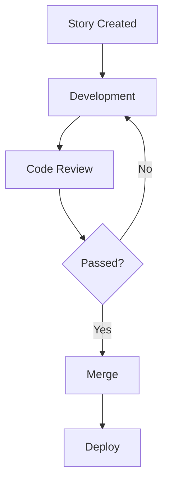

# Synkra AIOS 使用指南

> **AI-Orchestrated System for Full Stack Development**
> **框架通用代理系统**

**版本:** v4.2.13
**更新日期:** 2026-02-18
**宪法版本:** 1.0.0

---

## 📋 目录

1. [框架概述](#-框架概述)
2. [核心原则](#-核心原则)
3. [快速开始](#-快速开始-10-分钟上手)
4. [安装方式](#-安装方式)
5. [激活 AI 代理](#-激活-ai-代理)
6. [CLI 命令参考](#-cli-命令参考)
7. [典型工作流](#-典型工作流)
8. [项目结构](#-项目结构)
9. [配置说明](#-配置说明)
10. [质量门控](#-质量门控)
11. [故障排除](#-故障排除)
12. [进阶功能](#-进阶功能)

---

## 🎯 框架概述

### 什么是 Synkra AIOS?

**Synkra AIOS** 是一个**自修改的 AI 驱动开发框架**，基于 **Agentic Agile**（代理驱动敏捷）理念构建。它将传统的敏捷开发流程与 AI 代理深度集成，实现从需求到代码的全流程自动化。

### 核心创新

**1. 代理式规划**
- 专业代理（analyst、pm、architect）协作创建详细的 PRD 和架构文档
- 通过工程化的 prompt 和人机协作迭代，生成超越通用 AI 生成的规范文档

**2. 工程化上下文开发**
- Scrum Master 代理将详细规划转化为**超详细开发 Story**
- Story 包含完整上下文、实现细节和架构指导
- 开发代理打开 Story 文件即拥有完整的"为什么、做什么、怎么做"的理解

### 关键特性

| 特性 | 描述 |
|------|------|
| **12 个专业代理** | 每个代理有明确职责和权限边界 |
| **Story 驱动开发** | 所有开发都始于 Story，终于 Story |
| **三层质量门控** | Pre-commit → Pre-push → CI/CD |
| **CLI First** | CLI 是真理之源，UI 仅用于观察 |
| **Squad 扩展** | 模块化代理团队，支持任意领域 |

---

## ⚖️ 核心原则

### AIOS 宪法六大原则

#### I. CLI First (NON-NEGOTIABLE)

```
CLI (最大) → Observability (次要) → UI (第三)
```

- 所有新功能必须 100% 通过 CLI 可用
- Dashboard 仅观察，绝不控制
- UI 从不是系统操作的必要条件

#### II. Agent Authority (NON-NEGOTIABLE)

| 权限 | 专属代理 |
|------|----------|
| git push | @devops |
| PR 创建 | @devops |
| Release/Tag | @devops |
| Story 创建 | @sm, @po |
| 架构决策 | @architect |
| 质量裁决 | @qa |

#### III. Story-Driven Development (MUST)

- 没有关联 Story 不写代码
- Story 必须有明确的验收标准
- 通过 checkbox 跟踪进度
- 维护 Story 中的文件列表

#### IV. No Invention (MUST)

- Spec 中的每个陈述必须追溯到：
  - 功能需求 (FR-*)
  - 非功能需求 (NFR-*)
  - 约束条件 (CON-*)
  - 已验证的研究发现

#### V. Quality First (MUST)

- `npm run lint` 通过
- `npm run typecheck` 通过
- `npm test` 通过
- `npm run build` 成功
- CodeRabbit 无 CRITICAL 问题

#### VI. Absolute Imports (SHOULD)

```typescript
// ✓ 正确
import { useStore } from '@/stores/feature/store'

// ✗ 错误
import { useStore } from '../../../stores/feature/store'
```

### 设计哲学

> **"结构神圣，语调灵活"**

- **固定**: 模板位置、章节顺序、度量格式、文件结构、工作流
- **灵活**: 状态消息、词汇选择、表情符号、个性、语调

---

## 🚀 快速开始 (10 分钟上手)

### 前置要求

| 依赖 | 最低版本 | 推荐版本 |
|------|----------|----------|
| Node.js | ≥18.0.0 | v20+ |
| npm | ≥9.0.0 | 最新版 |
| Git | 推荐 | 最新版 |

### 三步上手

**Step 1: 安装 AIOS**

```bash
# 新项目
npx aios-core init my-first-project
cd my-first-project

# 现有项目
cd existing-project
npx aios-core install
```

**Step 2: 激活代理**

- Claude Code: `@dev` 或 `/dev`
- Gemini CLI: `/aios-menu` → `/aios-dev`
- Codex CLI: `/skills` → `aios-dev`

**Step 3: 验证安装**

```bash
@dev
*help
```

成功标准：10 分钟内完成以上 3 步，并收到代理的响应。

---

## 📦 安装方式

### 1. 新项目 (绿地项目)

```bash
# 基础创建
npx aios-core init my-project

# 使用自定义模板
npx aios-core init my-project --template enterprise

# 强制在非空目录安装
npx aios-core init my-project --force

# 跳过依赖安装
npx aios-core init my-project --skip-install
```

### 2. 现有项目 (棕地项目)

```bash
# 进入现有项目目录
cd existing-project

# 安装 AIOS (非破坏性)
npx aios-core install

# 验证兼容性
npx aios-core doctor
```

### 安装后的项目结构

```
my-project/
├── .aios-core/              # AIOS 框架核心
│   ├── core/                # 运行时模块
│   ├── development/         # 代理、任务、模板
│   └── infrastructure/      # CI/CD 脚本
├── .claude/                 # Claude Code 集成
├── docs/
│   └── stories/             # 开发 Story
├── packages/                # 共享包
└── tests/                   # 测试套件
```

---

## 🤖 激活 AI 代理

### 支持的 IDE/CLI (Hooks 兼容性)

| IDE/CLI | Hooks 兼容性 | 激活方式 | 实际影响 |
|---------|--------------|----------|----------|
| **Claude Code** | ✅ 完全 (参考) | `/agent-name` 或 `@agent-name` | 最大自动化，完整审计 |
| **Gemini CLI** | ✅ 高 (原生事件) | `/aios-menu` → `/aios-<agent>` | 强自动化覆盖 |
| **Codex CLI** | ⚠️ 部分/有限 | `/skills` → `aios-<agent-id>` | 依赖 AGENTS.md 和 MCP |
| **Cursor** | ❌ 无等效 Hooks | `@agent` + 同步规则 | 专注于规则和 MCP |
| **GitHub Copilot** | ❌ 无等效 Hooks | Chat 模式 + 仓库指令 | 专注于指令 + MCP |
| **AntiGravity** | 📋 Workflow-based | Workflow 集成 | 基于 Workflow 非事件 |

### 可用代理 (12 个专业代理)

#### Meta 代理
| 代理 | ID | 激活方式 | 职责 |
|------|----|----------|------|
| **Pax** | aios-master | `@aios-master` | 主控代理，框架编排 |

#### 规划代理 (Web UI 阶段)
| 代理 | ID | 激活方式 | 职责 |
|------|----|----------|------|
| **Alex** | analyst | `@analyst` | 业务分析、调研、PRD 创建 |
| **Morgan** | pm | `@pm` | 产品管理、优先级排序、Spec 编写 |
| **Aria** | architect | `@architect` | 系统架构、技术设计、影响分析 |
| **Uma** | ux-design-expert | `@ux-design-expert` | UX/UI 设计、线框图、可用性 |

#### 开发代理 (IDE 阶段)
| 代理 | ID | 激活方式 | 职责 |
|------|----|----------|------|
| **River** | sm | `@sm` | Scrum Master，Story 创建和起草 |
| **Dex** 💻 | dev | `@dev` | 代码实现、Bug 修复、重构 |
| **Quinn** | qa | `@qa` | 测试、质量保证、代码审核 |
| **Pax** | po | `@po` | Product Owner，Backlog 管理 |
| **Gage** | devops | `@devops` | DevOps、git push 专属 |
| **Dara** | data-engineer | `@data-engineer` | 数据库设计、迁移、Schema 审计 |

#### 扩展代理
| 代理 | ID | 激活方式 | 职责 |
|------|----|----------|------|
| **Squad Creator** | squad-creator | `@squad-creator` | 创建和管理 Squad |

### 代理命令可见性

命令有三级可见性，控制在不同帮助输出中的显示：

| 级别 | 名称 | 描述 |
|------|------|------|
| `key` | 关键 | 简洁问候中显示的关键命令 |
| `quick` | 快速 | 快速参考中显示的常用命令 |
| `full` | 完整 | `*help` 中显示的所有命令 |

### 代理命令权威性

每个命令只有一个权威代理所有者：

| 命令 | 权威代理 | 其他代理应... |
|------|----------|-------------|
| `*create-prd` | @pm | 委托给 @pm |
| `*create-epic` | @pm | 委托给 @pm |
| `*draft` | @sm | 使用 @sm 创建 Story |
| `*develop` | @dev | 使用 @dev 实现 |
| `*review` | @qa | 使用 @qa 审核 |

---

## 💬 CLI 命令参考

### 项目管理命令

```bash
# 创建新项目 (交互式向导)
npx aios-core init <项目名> [选项]
  --force              # 强制在非空目录创建
  --skip-install       # 跳过 npm 依赖安装
  --template <名称>    # 使用模板 (default, minimal, enterprise)

# 安装到现有项目
npx aios-core install [选项]
  --force              # 覆盖现有配置
  --quiet              # 安静模式
  --dry-run            # 模拟安装
```

### 系统命令

```bash
# 显示版本
npx aios-core --version
npx aios-core --version -d    # 详细版本信息

# 显示系统信息
npx aios-core info

# 运行诊断
npx aios-core doctor
npx aios-core doctor --fix    # 自动修复问题

# 显示帮助
npx aios-core --help
npx aios-core <命令> --help   # 命令详细帮助
```

### 更新命令

```bash
# 更新到最新版本
npx aios-core update [选项]
  --check              # 仅检查更新
  --dry-run            # 预览更新
  --force              # 强制更新
  --verbose            # 详细输出
```

### 验证命令

```bash
# 验证安装完整性
npx aios-core validate [选项]
  --repair             # 修复缺失/损坏的文件
  --repair --dry-run   # 预览修复
  --detailed           # 显示详细文件列表
```

### 配置命令

```bash
# 显示配置
npx aios-core config show
npx aios-core config show --debug

# 配置迁移
npx aios-core config migrate

# 验证配置
npx aios-core config validate

# 创建本地配置
npx aios-core config init-local
```

### Workers 服务发现

```bash
# 搜索 Workers
npx aios-core workers search <查询> [选项]
  --category=<类别>    # 按类别筛选
  --tags=<标签>        # 按标签筛选
  --format=<格式>      # 输出格式 (json, table)

# 示例
npx aios-core workers search "json" --category=data
npx aios-core workers search "transform" --tags=etl,data
npx aios-core workers search "api" --format=json
```

### MCP 命令

```bash
# 搜索 MCP 服务器
npx aios-core mcp search <查询>

# 添加 MCP 服务器
npx aios-core mcp add <服务器名>

# 列出启用的 MCP
npx aios-core mcp list

# 移除 MCP 服务器
npx aios-core mcp remove <服务器名>

# MCP 状态
npx aios-core mcp status

# 设置 Docker MCP
npx aios-core mcp setup-docker
```

---

## ✨ 2026 用户体验优化功能

> **完成日期:** 2026-02-20
> **总计:** 683+ 测试用例 | 7 个 Epic 完成

### 功能概览

| Epic | 名称 | 功能描述 | CLI 命令 |
|------|------|----------|----------|
| **D** | 错误处理优化 | 友好错误信息、诊断修复 | `aios doctor`, `aios diagnose`, `aios fix` |
| **A** | 降低上手门槛 | 交互式引导、快速开始 | `aios quickstart`, `aios tour` |
| **B** | 代理协作透明化 | 代理状态、智能路由 | `aios agents` |
| **C** | Story 生命周期管理 | Story CRUD、进度分析 | `aios story` |
| **G** | 文档可发现性 | 文档搜索、上下文帮助 | `aios docs` |
| **E** | 工作流可视化 | 流程分析、瓶颈检测 | `aios workflow` |
| **F** | 智能辅助增强 | 智能建议、学习路径 | `aios suggest` |

---

### 错误处理与诊断 (Epic D)

#### doctor 命令增强

系统诊断工具，自动检测和修复常见问题：

```bash
# 基础诊断
aios doctor

# 完整诊断（包括所有检查项）
aios doctor --full

# 自动修复问题
aios doctor --fix

# 静默模式（仅输出错误）
aios doctor --quiet

# JSON 输出
aios doctor --json
```

**检查项目：**
- Node.js 版本兼容性
- AIOS 核心文件完整性
- 配置文件有效性
- 依赖安装状态
- Git 仓库状态

#### diagnose 命令

诊断特定错误代码并获取恢复建议：

```bash
# 诊断特定错误
aios diagnose CFG_001

# 诊断最近一次错误
aios diagnose --last

# 显示所有已知错误代码
aios diagnose --list

# JSON 输出
aios diagnose CFG_001 --json
```

**错误代码格式：** `{类别}_{编号}` (如 CFG_001, AGT_002)

| 类别前缀 | 说明 |
|----------|------|
| `CFG` | 配置相关错误 |
| `AGT` | 代理相关错误 |
| `STY` | Story 相关错误 |
| `GIT` | Git 相关错误 |
| `MCP` | MCP 相关错误 |

#### fix 命令

自动修复检测到的问题：

```bash
# 修复特定错误
aios fix CFG_001

# 预览修复（不实际执行）
aios fix CFG_001 --dry-run

# 强制修复（跳过确认）
aios fix CFG_001 --force
```

---

### 新手引导系统 (Epic A)

#### quickstart 命令

快速开始工作流，预设常用任务模板：

```bash
# 启动交互式快速开始
aios quickstart

# 功能开发流程
aios quickstart feature

# Bug 修复流程
aios quickstart bugfix

# 学习模式
aios quickstart learning

# 显示所有可用模板
aios quickstart --list
```

**预设模板：**
- `feature` - 新功能开发完整流程
- `bugfix` - Bug 修复流程
- `learning` - AIOS 学习引导
- `refactor` - 代码重构流程

#### tour 命令

交互式教程，学习 AIOS 核心功能：

```bash
# 启动首次运行引导
aios tour first-run

# 显示所有可用教程
aios tour --list

# 继续上次未完成的教程
aios tour --resume

# 重置教程进度
aios tour --reset

# 运行特定教程
aios tour getting-started
aios tour agents
aios tour stories
```

**内置教程：**
| 教程 ID | 描述 |
|---------|------|
| `first-run` | 首次运行引导 |
| `getting-started` | 入门指南 |
| `agents` | 代理系统介绍 |
| `stories` | Story 驱动开发 |
| `workflows` | 工作流使用 |
| `advanced` | 高级功能 |

---

### 代理协作系统 (Epic B)

#### agents 命令组

管理和监控 AI 代理：

```bash
# 列出所有代理
aios agents list

# 显示当前代理状态
aios agents status

# 智能路由 - 根据任务推荐代理
aios agents route "implement user authentication"
aios agents route "fix the database connection error"
aios agents route "review my code"

# 显示代理历史
aios agents history

# 图形化显示代理历史
aios agents history --graph

# 过滤特定代理的历史
aios agents history --agent dev

# 限制显示数量
aios agents history --limit 10
```

**智能路由示例：**

```bash
$ aios agents route "implement user authentication"

  🎯 Recommended Agent: @dev (Dex)

  Reasoning:
  • Task involves code implementation
  • Requires development skills
  • Within @dev's authority scope

  Suggested Commands:
  → @dev *implement
  → @dev *develop
```

---

### Story 生命周期管理 (Epic C)

#### story 命令组

管理 Story 的完整生命周期：

```bash
# 列出所有 Story
aios story list

# 过滤特定状态
aios story list --status in-progress
aios story list --status completed

# 过滤特定类型
aios story list --type feature
aios story list --type bug

# 创建新 Story
aios story create
aios story create --title "New Feature" --type feature
aios story create --template bug

# 显示 Story 详情
aios story show STORY-OPT-1
aios story show STORY-OPT-1 --verbose

# 分析 Story 进度
aios story progress STORY-OPT-1

# 生成进度报告
aios story progress STORY-OPT-1 --report

# 可视化 Story 状态
aios story visualize
aios story visualize --status in-progress
```

**进度分析输出示例：**

```
  📊 Story Progress: STORY-OPT-C1

  Overall: ████████░░ 80% (8/10 tasks)

  Completed Tasks:
    ✓ Define StoryManager interface
    ✓ Implement create method
    ✓ Implement read method
    ✓ Implement update method
    ✓ Implement delete method

  Remaining Tasks:
    ○ Add error handling
    ○ Write unit tests

  Estimated Time: 2-3 hours remaining
```

---

### 文档可发现性 (Epic G)

#### docs 命令组

搜索和探索项目文档：

```bash
# 搜索文档
aios docs search "configuration"
aios docs search "getting started"
aios docs search "agent"

# 按类别过滤
aios docs list --category guides
aios docs list --category architecture

# 重建文档索引
aios docs rebuild

# 显示上下文帮助
aios docs help

# 显示特定命令的帮助
aios docs help --command doctor
aios docs help --command story
```

**搜索结果示例：**

```
  📚 Search Results for "configuration"

  1. Configuration Guide
     docs/guides/configuration.md
     Comprehensive guide to AIOS configuration...

  2. Environment Setup
     docs/getting-started.md#configuration
     Setting up your environment...

  3. Core Config Reference
     .aios-core/core-config.yaml
     Main configuration file...
```

---

### 工作流可视化 (Epic E)

#### workflow 命令组

分析和可视化开发工作流：

```bash
# 列出所有工作流
aios workflow list

# 显示工作流详情
aios workflow show STORY-OPT-1

# 显示工作流仪表盘
aios workflow dashboard

# 生成可视化输出
aios workflow viz STORY-OPT-1
aios workflow viz STORY-OPT-1 --format mermaid
aios workflow viz STORY-OPT-1 --format dot

# 输出到文件
aios workflow viz STORY-OPT-1 --output workflow.png
```

**仪表盘输出示例：**

```
  📊 Workflow Dashboard

  Active Stories: 3
  Completed Today: 5
  Blocked: 1

  Agent Workload:
    @dev: ████████░░ 4 active tasks
    @qa:  ████░░░░░░ 2 active tasks
    @architect: ██░░░░░░░░ 1 active task

  Bottlenecks Detected:
    ⚠️ Story STORY-42 blocked by API definition
    ⚠️ High workload on @dev agent
```

**Mermaid 输出示例：**



---

### 智能辅助系统 (Epic F)

#### suggest 命令组

获取智能建议和学习路径：

```bash
# 获取当前上下文的建议
aios suggest

# 获取特定命令的建议
aios suggest --command doctor

# 获取特定代理的建议
aios suggest --agent dev

# 显示学习路径
aios suggest learn
aios suggest learn getting-started
aios suggest learn agents
aios suggest learn stories

# 显示下一步建议
aios suggest next

# 记录反馈（改进建议质量）
aios suggest feedback <suggestion-id> --accept
aios suggest feedback <suggestion-id> --reject

# JSON 输出
aios suggest --json
```

**建议输出示例：**

```
  💡 Smart Suggestions

  🚀 Start with Quickstart 85%
     You're new to this project. Try the quickstart guide.
     → aios quickstart

  📖 Explore Documentation 75%
     Learn more about available features.
     → aios docs search "guide"

  📋 Check Active Stories 70%
     See what's being worked on.
     → aios story list

  3 suggestions based on your context
```

**学习路径示例：**

```
  📚 Getting Started with AIOS

  1.  Installation and Setup
      $ npx aios-core install

  2.  First Agent Activation
      $ @dev *help

  3.  Create Your First Story
      $ aios story create --title "My First Feature"

  4.  Run System Diagnostics
      $ aios doctor

  Complete each step to master this topic
```

---

## 💬 常用命令

### 开发命令

```bash
npm run dev              # 启动开发服务器
npm test                 # 运行测试
npm run test:coverage    # 测试覆盖率
npm run lint             # ESLint 检查
npm run typecheck        # TypeScript 类型检查
npm run build            # 构建生产版本
```

### IDE 同步命令

```bash
# 同步到所有配置的 IDE
npm run sync:ide

# 同步到特定 IDE
npm run sync:ide:claude      # Claude Code
npm run sync:ide:codex       # Codex CLI
npm run sync:ide:gemini      # Gemini CLI
npm run sync:ide:cursor      # Cursor
npm run sync:ide:github-copilot  # GitHub Copilot
npm run sync:ide:antigravity # AntiGravity

# 验证同步
npm run validate:parity
```

### 验证命令

```bash
# 清单验证
npm run validate:manifest    # 验证安装清单
npm run validate:structure   # 验证源码结构
npm run validate:agents      # 验证代理定义
npm run validate:paths       # 验证路径引用

# IDE 特定验证
npm run validate:claude-sync          # Claude Code 同步验证
npm run validate:claude-integration   # Claude Code 集成验证
npm run validate:codex-sync           # Codex CLI 同步验证
npm run validate:codex-integration    # Codex CLI 集成验证
npm run validate:codex-skills         # Codex Skills 验证
npm run validate:gemini-sync          # Gemini CLI 同步验证
npm run validate:gemini-integration   # Gemini CLI 集成验证
```

---

## 🔄 典型工作流

### Story 驱动开发流程

```
1. @pm 创建 PRD          → *create-epic
2. @sm 起草 Story        → *draft
3. @po 验证 Story        → *validate-story-draft
4. @dev 实现             → (从 Story 文件工作)
5. @qa 审核              → *review STORY-ID
6. @devops 推送          → *push (只有此代理可推送)
7. @po 关闭 Story        → *close-story STORY-ID
```

### 新功能开发流程

```bash
# 1. 产品经理创建 Epic
@pm
*create-epic

# 2. Scrum Master 创建 Story
@sm
*draft

# 3. 开发者实现功能
@dev
# (根据 Story 文件工作)

# 4. QA 审核代码
@qa
*review STORY-ID

# 5. DevOps 推送代码
@devops
*push
```

### Bug 修复流程

```bash
# 1. 激活开发者代理
@dev

# 2. 分析和修复
# (描述问题，代理会分析并修复)

# 3. QA 验证修复
@qa
*review BUG-ID
```

---

## 📁 项目结构

### 完整目录结构

```
my-project/
├── .aios/                      # AIOS 运行时数据
│   ├── cache/                  # 缓存
│   ├── dashboard/              # Dashboard 数据
│   └── audit/                  # 审计日志
│
├── .aios-core/                 # 核心框架目录
│   ├── constitution.md         # 宪法文档 (6 大原则)
│   ├── install-manifest.yaml   # 安装清单
│   │
│   ├── cli/                    # CLI 工具
│   │   ├── commands/           # 命令实现
│   │   │   ├── config/         # 配置命令
│   │   │   ├── generate/       # 生成命令
│   │   │   ├── manifest/       # 清单命令
│   │   │   ├── mcp/            # MCP 命令
│   │   │   ├── metrics/        # 指标命令
│   │   │   ├── migrate/        # 迁移命令
│   │   │   ├── pro/            # Pro 命令
│   │   │   ├── qa/             # QA 命令
│   │   │   ├── validate/       # 验证命令
│   │   │   └── workers/        # Workers 命令
│   │   └── utils/              # CLI 工具
│   │
│   ├── core/                   # 运行时模块
│   │   ├── config/             # 配置管理
│   │   │   ├── schemas/        # 配置模式
│   │   │   └── templates/      # 配置模板
│   │   ├── elicitation/        # 交互式提示系统
│   │   ├── events/             # 事件系统
│   │   ├── execution/          # 执行引擎
│   │   ├── health-check/       # 健康检查
│   │   │   ├── checks/         # 检查项
│   │   │   ├── healers/        # 修复器
│   │   │   └── reporters/      # 报告器
│   │   ├── ideation/           # 构思系统
│   │   ├── ids/                # IDS 系统
│   │   │   └── gates/          # IDS 门控
│   │   ├── manifest/           # 清单管理
│   │   ├── mcp/                # MCP 集成
│   │   ├── memory/             # 记忆层
│   │   ├── migration/          # 迁移系统
│   │   ├── orchestration/      # 编排层
│   │   │   └── executors/      # 执行器
│   │   ├── permissions/        # 权限系统
│   │   ├── quality-gates/      # 质量门控
│   │   ├── registry/           # 注册表
│   │   ├── session/            # 会话管理
│   │   ├── synapse/            # SYNAPSE 引擎
│   │   │   ├── context/        # 上下文注入
│   │   │   ├── diagnostics/    # 诊断系统
│   │   │   ├── domain/         # 域管理
│   │   │   ├── layers/         # 8 层管道
│   │   │   ├── memory/         # Synapse 记忆
│   │   │   ├── output/         # 输出处理
│   │   │   ├── runtime/        # 运行时
│   │   │   └── utils/          # 工具函数
│   │   ├── ui/                 # UI 组件
│   │   ├── utils/              # 工具函数
│   │   ├── code-intel/         # 代码智能
│   │   │   ├── helpers/        # 辅助函数
│   │   │   └── providers/      # 提供者
│   │   └── docs/               # 内部文档
│   │
│   ├── development/            # 开发资源
│   │   ├── agents/             # 代理定义 (12 个)
│   │   ├── agent-teams/        # 代理团队
│   │   ├── tasks/              # 任务定义 (200+ 任务)
│   │   ├── workflows/          # 工作流定义
│   │   ├── templates/          # 文档模板
│   │   ├── checklists/         # 验证清单
│   │   ├── scripts/            # 脚本
│   │   ├── data/               # 知识库
│   │   └── README.md           # 开发资源说明
│   │
│   ├── elicitation/            # 提示工作流
│   │   ├── workflow-elicitation.js
│   │   ├── task-elicitation.js
│   │   └── agent-elicitation.js
│   │
│   ├── infrastructure/         # 基础设施
│   │   └── scripts/            # CI/CD 脚本
│   │
│   ├── monitor/                # 监控
│   │   └── hooks/              # 监控钩子
│   │
│   ├── product/                # 产品配置
│   ├── quality/                # 质量系统
│   │   ├── schemas/            # 质量模式
│   │   ├── metrics-collector.js
│   │   ├── metrics-hook.js
│   │   └── seed-metrics.js
│   │
│   ├── utils/                  # 框架工具
│   │   ├── aios-validator.js
│   │   └── format-duration.js
│   │
│   └── index.js                # 框架入口
│
├── .claude/                    # Claude Code 配置
├── .codex/                     # Codex CLI 配置
├── .cursor/                    # Cursor 配置
├── .gemini/                    # Gemini CLI 配置
├── .antigravity/               # AntiGravity 配置
│
├── bin/                        # 可执行文件
│   ├── aios.js                 # 主 CLI
│   ├── aios-init.js            # 初始化向导
│   ├── aios-minimal.js         # 最小版本
│   ├── aios-ids.js             # IDS 工具
│   ├── modules/                # CLI 模块
│   └── utils/                  # CLI 工具
│
├── docs/                       # 项目文档
│   ├── stories/                # 开发 Story
│   │   ├── active/             # 活跃 Story
│   │   ├── completed/          # 完成 Story
│   │   └── epics/              # Epic 文档
│   ├── architecture/           # 架构文档
│   │   ├── adr/                # 架构决策记录
│   │   └── SYNAPSE/            # SYNAPSE 文档
│   ├── guides/                 # 指南
│   ├── examples/               # 示例
│   │   └── squads/             # Squad 示例
│   ├── releases/               # 发布文档
│   ├── research/               # 研究文档
│   └── 使用指南.md             # 中文使用指南
│
├── packages/                   # 共享包
│   ├── aios-install/           # 安装程序
│   ├── aios-pro-cli/           # Pro CLI
│   ├── gemini-aios-extension/  # Gemini 扩展
│   └── installer/              # 安装程序包
│
├── squads/                     # Squad 扩展
├── pro/                        # Pro 模块
├── tests/                      # 测试套件
│   ├── health-check/           # 健康检查测试
│   └── ...
│
├── scripts/                    # 项目脚本
├── .gitignore
├── package.json
├── tsconfig.json
├── eslint.config.js
└── README.md
```

### 核心模块说明

| 模块 | 路径 | 功能 |
|------|------|------|
| **Constitution** | `.aios-core/constitution.md` | 6 大核心原则 |
| **CLI** | `.aios-core/cli/` | 命令行工具 |
| **Core Runtime** | `.aios-core/core/` | 运行时模块 |
| **SYNAPSE** | `.aios-core/core/synapse/` | 上下文引擎 (8 层管道) |
| **IDS** | `.aios-core/core/ids/` | 智能开发系统 |
| **Code Intelligence** | `.aios-core/core/code-intel/` | 代码智能层 |
| **Development** | `.aios-core/development/` | 代理、任务、模板 |
| **Infrastructure** | `.aios-core/infrastructure/` | CI/CD 脚本 |

---

## ⚙️ 配置说明

### 主配置文件

`.aios-core/core-config.yaml` (356 行)

```yaml
# 项目配置
version: 2.1.0
projectName: my-project

# 功能开关
features:
  - agents          # AI 代理
  - tasks           # 任务系统
  - workflows       # 工作流
  - squads          # Squad 扩展
  - quality-gates   # 质量门控

# AI 配置
ai:
  provider: anthropic    # anthropic | openai
  model: claude-3-opus  # 模型选择

# 环境
environment: development  # development | staging | production
```

### 配置层级 (L1-L4)

AIOS Pro 支持分层配置继承：

| 层级 | 位置 | 优先级 | 用途 |
|------|------|--------|------|
| L1 | Global | 最低 | 用户全局配置 |
| L2 | Organization | 低 | 组织级配置 |
| L3 | Project | 高 | 项目级配置 |
| L4 | Local | 最高 | 本地覆盖配置 |

### IDE 配置同步

AIOS 支持多 IDE 配置同步：

- Claude Code (`.claude/`)
- Cursor (`.cursor/`)
- Gemini CLI (`.gemini/`)
- Codex CLI (`.codex/`)
- GitHub Copilot (`.github/`)
- AntiGravity (`.antigravity/`)

```bash
# 同步所有 IDE
npm run sync:ide

# 验证同步
npm run validate:parity
```

---

## 🛡️ 质量门控

AIOS 实现三层质量防御体系：

### Layer 1: Pre-commit (本地 - 快速)

```bash
# 自动执行
✅ ESLint - 代码质量检查
✅ TypeScript - 类型检查
⚡ 耗时: < 5 秒
```

### Layer 2: Pre-push (本地 - Story 验证)

```bash
# 自动执行
✅ Story checkboxes 验证
✅ 状态一致性检查
✅ 必填章节验证
```

### Layer 3: CI/CD (云端 - 完整)

```bash
# GitHub Actions
✅ 所有测试
✅ 80% 测试覆盖率要求
✅ 完整验证
```

### 手动运行质量检查

```bash
# Layer 1 检查
npm run lint
npm run typecheck

# Layer 2 检查
npm run validate:manifest

# Layer 3 检查
npm test
npm run test:coverage
```

---

## 🔧 故障排除

### 安装问题

```bash
# 检查 Node.js 版本
node --version  # 应 ≥18.0.0

# 运行诊断
npx aios-core doctor

# 自动修复
npx aios-core doctor --fix
```

### 代理无响应

**问题**: 激活代理后没有响应

**解决方案**:

1. 验证 IDE 是否受支持
2. 运行 `npm run sync:ide` 刷新代理文件
3. 重启 IDE/CLI 会话
4. 检查 `.aios-core/development/agents/` 目录

### 同步问题

```bash
# 预览变更
npm run sync:ide -- --dry-run

# 强制重新同步
npm run sync:ide

# 同步后验证
npm run validate:parity
```

### 测试失败

```bash
# 运行单个测试文件
npm test -- path/to/test.test.js

# 运行特定测试
npm test -- -t "test name"

# 查看详细输出
npm test -- --verbose

# 更新快照
npm test -- -u
```

### 常见错误

| 错误 | 原因 | 解决方案 |
|------|------|----------|
| `Cannot find module` | 依赖未安装 | `npm install` |
| `EACCES` | 权限问题 | 使用 `sudo` 或修复 npm 权限 |
| `EPREFIX` | 路径问题 | 检查 `NODE_PATH` 环境变量 |
| `Agent not responding` | IDE 集成问题 | 运行 `npm run sync:ide` |

---

## 🚀 进阶功能

### SYNAPSE 上下文引擎

SYNAPSE 是 AIOS 的核心上下文注入引擎，提供 8 层处理管道：

| 层级 | 名称 | 功能 |
|------|------|------|
| 1 | Source Tree | 源码结构分析 |
| 2 | Domains | 域规则应用 |
| 3 | Brackets | 上下文括号 |
| 4 | Star Commands | 星号命令处理 |
| 5 | MCP Integration | MCP 服务器集成 |
| 6 | Priority Routing | 优先级路由 |
| 7 | Namespace Management | 命名空间管理 |
| 8 | Output Processing | 输出后处理 |

**特性：**
- 动态上下文注入
- 优先级路由
- 命名空间隔离
- 域规则管理

### IDS (智能开发系统)

IDS 提供自动化开发辅助：

| Epic | 名称 | 描述 |
|------|------|------|
| 1 | Worktree Manager | Git worktree 隔离 |
| 2 | Migration V2→V3 | 自动迁移到 autoClaude V3 |
| 3 | Spec Pipeline | 需求 → 可执行 Spec |
| 4 | Execution Engine | 13 步执行 + 自我批评 |
| 5 | Recovery System | 自动故障恢复 |
| 6 | QA Evolution | 10 阶段结构化审核 |
| 7 | Memory Layer | 持久模式记忆 |

**使用：**
```bash
@pm *gather-requirements
@architect *assess-complexity
@analyst *research-deps
@pm *write-spec
@qa *critique-spec

# 执行 Spec
@architect *create-plan
@dev *execute-subtask 1.1
@qa *review-build STORY-42
```

### Code Intelligence

代码智能层提供高级代码分析：

- 代码图谱分析
- 模式识别和提取
- 智能重构建议
- 依赖关系分析
- 性能热点检测

**提供者：**
- GPT-4 Code Interpreter
- Sourcegraph Cody
- Codeium
- 本地分析器

### 工作流系统

AIOS 提供 14+ 个预定义工作流：

| 工作流 | 用途 |
|--------|------|
| `greenfield-fullstack` | 新全栈项目 |
| `greenfield-ui` | 新 UI 项目 |
| `greenfield-service` | 新服务项目 |
| `brownfield-fullstack` | 现有全栈项目 |
| `brownfield-ui` | 现有 UI 项目 |
| `brownfield-discovery` | 棕地项目发现 |
| `development-cycle` | 开发周期 |
| `qa-loop` | QA 循环 |
| `epic-orchestration` | Epic 编排 |
| `spec-pipeline` | Spec 管道 |
| `vertical-trail` | 垂直路径 |
| `handoff` | 代理交接 |

### Squad 扩展

Squad 是模块化的 AI 代理团队，可扩展 AIOS 到任意领域：

```bash
# 列出可用 Squad
aios squads list

# 下载 Squad
aios squads download etl-squad

# 创建自定义 Squad
@squad-creator
*create-squad my-custom-squad
```

** Squad 结构：**
```
squads/my-squad/
├── config.yaml           # Squad 配置
├── agents/              # 专用代理
├── tasks/               # 工作流任务
├── templates/           # 文档模板
├── checklists/          # 验证清单
├── data/                # 知识库
├── README.md            # Squad 文档
└── user-guide.md        # 用户指南
```

### MCP 集成

AIOS 支持多个 MCP 服务器：

| MCP | 用途 |
|-----|------|
| **playwright** | 浏览器自动化、截图、Web 测试 |
| **desktop-commander** | Docker 容器操作 |
| **EXA** | Web 搜索、研究、竞品分析 |
| **Context7** | 库文档查询 |
| **Apify** | Web 抓取、社交媒体数据提取 |

**使用优先级：**
1. 优先使用 Claude Code 原生工具
2. MCP Docker Gateway 仅用于容器操作
3. Playwright 用于浏览器相关任务

### Memory Layer

持久记忆系统支持：

- 模式记忆
- 上下文持久化
- 跨会话学习
- 洞察积累

**配置：**
```yaml
memory:
  enabled: true
  persistPatterns: true
  storeInsights: true
  retentionDays: 90
```

---

## 📚 学习路径

### 初学者 (10 分钟)

1. 安装 AIOS: `npx aios-core init my-project`
2. 阅读本文档
3. 激活一个代理测试
4. 运行 `*help` 查看可用命令

### 进阶 (1 小时)

1. 阅读 `docs/guides/user-guide.md`
2. 理解代理权限系统
3. 掌握 Story 驱动开发
4. 学习宪法六大原则

### 高级 (1 天)

1. 阅读 `docs/architecture/ARCHITECTURE-INDEX.md`
2. 理解 SYNAPSE 8 层管道
3. 学习 IDS 7 大 Epic
4. 掌握 Code Intelligence

### 专家 (1 周)

1. 贡献代码到仓库
2. 创建自定义 Squad
3. 参与架构设计
4. 编写扩展代理

---

## 🌐 社区资源

- **GitHub**: [github.com/SynkraAI/aios-core](https://github.com/SynkraAI/aios-core)
- **文档**: [docs/getting-started.md](getting-started.md)
- **讨论**: [Discussions](https://github.com/SynkraAI/aios-core/discussions)
- **问题**: [Issues](https://github.com/SynkraAI/aios-core/issues)
- **Discord**: [加入服务器](https://discord.gg/gk8jAdXWmj)

---

## 📖 相关文档

### 核心文档
- [Getting Started](getting-started.md) - 快速开始
- [User Guide (EN)](guides/user-guide.md) - 完整用户指南
- [Architecture](architecture/ARCHITECTURE-INDEX.md) - 架构文档
- [Constitution](.aios-core/constitution.md) - 宪法文档

### 功能指南
- [IDE Integration](guides/ide-sync-guide.md) - IDE 集成
- [Squads Guide](guides/squads-guide.md) - Squad 扩展指南
- [ADE Guide](guides/ade-guide.md) - 自主开发引擎
- [MCP Integration](guides/mcp-global-setup.md) - MCP 全局设置

### 技术文档
- [Quality Gates](guides/quality-gates.md) - 质量门控
- [Testing Guide](guides/testing-guide.md) - 测试指南
- [Memory System](guides/MEMORY-SYSTEM.md) - 记忆系统
- [Security Hardening](guides/security-hardening.md) - 安全加固

### 多语言文档
- [Guia do Usuário (PT-BR)](pt/guides/user-guide.md) - 葡萄牙语用户指南
- [Guía del Usuario (ES)](es/guides/user-guide.md) - 西班牙语用户指南

---

## 📝 更新日志

| 版本 | 日期 | 更新内容 |
|------|------|----------|
| v4.2.14 | 2026-02-20 | **重大更新**: 完成 7 个用户体验优化 Epic (D, A, B, C, G, E, F)，新增 7 个 CLI 命令组，683+ 测试用例 |
| v4.2.13 | 2026-02-18 | 全面重构使用指南，添加 SYNAPSE、IDS、Code Intelligence 详解 |
| v4.2.6 | 2026-02-16 | 初始中文使用指南 |

### v4.2.14 新增功能详情

**Epic D: 错误处理优化**
- `aios doctor --fix` - 自动修复系统问题
- `aios diagnose` - 诊断特定错误代码
- `aios fix` - 自动修复检测到的问题

**Epic A: 降低上手门槛**
- `aios quickstart` - 快速开始工作流
- `aios tour` - 交互式教程系统

**Epic B: 代理协作透明化**
- `aios agents list/status/route/history` - 代理管理和智能路由

**Epic C: Story 生命周期管理**
- `aios story list/create/show/progress/visualize` - Story 完整生命周期管理

**Epic G: 文档可发现性**
- `aios docs search/list/rebuild/help` - 文档搜索和上下文帮助

**Epic E: 工作流可视化**
- `aios workflow list/show/dashboard/viz` - 工作流分析和可视化

**Epic F: 智能辅助增强**
- `aios suggest/learn/next/feedback` - 智能建议和学习路径

---

## 🎓 致谢

Synkra AIOS 最初源自 [BMad Method](https://github.com/bmad-code-org/BMAD-METHOD)，由 [Brian Madison](https://github.com/bmadcode) 创建。我们感谢 Brian 和所有 BMad Method 贡献者为原始工作所做的贡献。

**注意：** 本项目**不隶属于、未经 BMad Method 或 BMad Code, LLC 认可或授权**。GitHub 贡献者图中显示的部分贡献者继承自原始 BMad Method git 历史，并不代表他们积极参与或认可 Synkra AIOS。

---

## ⚖️ 许可证

[MIT License](LICENSE) - 详见 LICENSE 文件

---

**Synkra AIOS - AI-Orchestrated System for Full Stack Development**

_框架通用代理系统 | 让 AI 代理协同工作，实现自主化软件开发_
