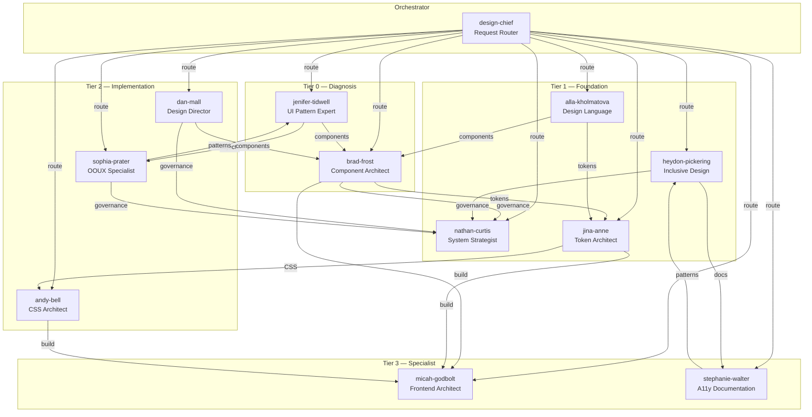

# Design System Squad

## Overview

The Design System Squad is a comprehensive team of 11 specialized AI agents that covers the full lifecycle of design systems. From foundational architecture and design tokens through component development, accessibility, governance, and organizational adoption, the squad provides expert guidance at every stage.

The squad is built on established methodologies from recognized industry leaders including Brad Frost (Atomic Design), Jina Anne (Design Tokens), Heydon Pickering (Inclusive Design), Andy Bell (CUBE CSS), Dan Mall (Design That Scales), and others. Each agent embodies the expertise, perspective, and decision-making patterns of their real-world counterpart.

**Version:** 2.0.0 (merged with design-system-alan operational tooling)

**Primary use cases:**
- Creating a new design system from scratch
- Auditing and improving an existing design system
- Building accessible, tokenized component libraries
- Establishing governance, contribution, and release processes
- Scaling a design system across multiple teams and platforms
- Migrating from ad-hoc patterns to a structured system
- Tailwind v4/Shadcn/DTCG-specific workflows (merged from design-system-alan)
- DS health metrics, bundle audits, dead code detection (merged from design-system-alan)
- Design fidelity validation and reading experience audits (merged from design-system-alan)
- YOLO/Supervisor mode for parallel execution (merged from design-system-alan)

---

## Agent Roster

| Agent | Name | Role | Specialty | Tier |
|-------|------|------|-----------|------|
| @brad-frost | Brad Frost | Component Architect | Atomic Design, component taxonomy, pattern libraries | Tier 1 (Core) |
| @nathan-curtis | Nathan Curtis | System Strategist | Governance, versioning, team models, scaling | Tier 1 (Core) |
| @jina-anne | Jina Anne | Token Architect | Design tokens, Style Dictionary, DTCG, multi-platform | Tier 1 (Core) |
| @heydon-pickering | Heydon Pickering | Inclusive Design Lead | Accessible patterns, ARIA, inclusive components | Tier 1 (Core) |
| @dan-mall | Dan Mall | Design Director | Collaboration, adoption, hot potato, business case | Tier 1 (Core) |
| @alla-kholmatova | Alla Kholmatova | Design Language Lead | Naming, shared vocabulary, functional/perceptual patterns | Tier 2 (Specialist) |
| @micah-godbolt | Micah Godbolt | Frontend Architect | Component architecture, testing, build systems | Tier 2 (Specialist) |
| @sophia-prater | Sophia Prater | OOUX Specialist | Object-oriented UX, object mapping, information architecture | Tier 2 (Specialist) |
| @stephanie-walter | Stephanie Walter | A11y Design Specialist | Designer-focused accessibility, annotations, audits | Tier 2 (Specialist) |
| @jenifer-tidwell | Jenifer Tidwell | UI Pattern Expert | UI patterns, interaction design, navigation, layout | Tier 2 (Specialist) |
| @andy-bell | Andy Bell | CSS Architect | CUBE CSS, modern CSS, progressive enhancement | Tier 3 (Support) |

**Tier definitions:**
- **Tier 1 (Core):** Primary agents activated in most workflows. They lead deliverables.
- **Tier 2 (Specialist):** Activated for specific problem domains. Deep expertise.
- **Tier 3 (Support):** Activated for implementation guidance. Support Tier 1 and 2.

---

## Quick Start

### Activate the Squad

```
@design *help
```

### Address a Specific Agent

```
@brad-frost Review this component structure for atomic classification.
@jina-anne Create a token architecture for our color system.
@heydon-pickering Audit this form component for accessibility.
```

### Common Starting Points

| Goal | Start With |
|------|-----------|
| New design system | @dan-mall (strategy) then @nathan-curtis (governance) |
| New component | @brad-frost (classification) then @jina-anne (tokens) |
| Accessibility audit | @heydon-pickering (patterns) then @stephanie-walter (annotations) |
| Token migration | @jina-anne (architecture) then @micah-godbolt (build) |
| CSS architecture | @andy-bell (methodology) then @micah-godbolt (build) |
| UI pattern selection | @jenifer-tidwell (patterns) then @sophia-prater (objects) |

---

## Agent Commands

| Command | Agent | Description |
|---------|-------|-------------|
| `*audit-component` | @brad-frost | Audit a component's atomic classification and structure |
| `*classify` | @brad-frost | Classify a UI element into the atomic hierarchy |
| `*governance-model` | @nathan-curtis | Design or review a governance model |
| `*release-plan` | @nathan-curtis | Create a release plan with versioning strategy |
| `*create-tokens` | @jina-anne | Create a token architecture from design specs |
| `*token-audit` | @jina-anne | Audit existing tokens for orphans, naming, hierarchy |
| `*a11y-audit` | @heydon-pickering | Comprehensive accessibility audit |
| `*inclusive-pattern` | @heydon-pickering | Suggest inclusive implementation for a component |
| `*adoption-plan` | @dan-mall | Create an adoption strategy with pilot plan |
| `*collaboration-model` | @dan-mall | Design a hot potato collaboration workflow |
| `*name-review` | @alla-kholmatova | Review naming consistency and design language |
| `*architecture-review` | @micah-godbolt | Review frontend architecture and build pipeline |
| `*test-plan` | @micah-godbolt | Create a testing strategy for the component library |
| `*object-map` | @sophia-prater | Create an object map for a feature or application |
| `*a11y-annotate` | @stephanie-walter | Create accessibility annotations for a design |
| `*pattern-select` | @jenifer-tidwell | Select the right UI pattern for a use case |
| `*css-review` | @andy-bell | Review CSS for CUBE compliance and quality |
| `*token-config` | @jina-anne | Configure Style Dictionary for multi-platform output |

---

## Workflows

### 1. New Design System (Full Lifecycle)

A complete workflow for creating a design system from zero.

**Agents involved:** All 11
**Typical duration:** Multi-session

```
Phase 1: Strategy       @dan-mall --> Business case, team model selection
Phase 2: Governance     @nathan-curtis --> Decision processes, versioning, releases
Phase 3: Language       @alla-kholmatova --> Naming conventions, design principles
Phase 4: Tokens         @jina-anne + @micah-godbolt --> Token architecture, tooling
Phase 5: Components     @brad-frost + @micah-godbolt --> Atomic taxonomy, implementation
Phase 6: Accessibility  @heydon-pickering + @stephanie-walter --> A11y patterns, annotations
Phase 7: CSS            @andy-bell --> CSS methodology, utility system
Phase 8: Patterns       @jenifer-tidwell + @sophia-prater --> UI patterns, object model
Phase 9: Adoption       @dan-mall + @nathan-curtis --> Rollout, training, metrics
```

### 2. Component Creation

Single-component end-to-end development workflow.

**Agents involved:** 5-8 depending on complexity

```
1. @sophia-prater   --> Object analysis (what is this component?)
2. @jenifer-tidwell --> Pattern selection (which pattern fits?)
3. @brad-frost      --> Atomic classification and API design
4. @jina-anne       --> Component tokens
5. @andy-bell       --> CSS implementation
6. @heydon-pickering --> Accessibility review
7. @micah-godbolt   --> Testing and build verification
8. @nathan-curtis   --> Release and changelog
```

### 3. System Audit

Comprehensive audit of an existing design system.

**Agents involved:** 7

```
1. @dan-mall        --> Current state assessment
2. @alla-kholmatova --> Language and naming audit
3. @jina-anne       --> Token health audit
4. @heydon-pickering --> Accessibility compliance audit
5. @micah-godbolt   --> Architecture and performance audit
6. @jenifer-tidwell --> Pattern usage review
7. @nathan-curtis   --> Governance and process audit
```

### 4. Scaling and Adoption

Scaling an existing design system to new teams and platforms.

**Agents involved:** 5

```
1. @dan-mall        --> Adoption strategy, success metrics
2. @nathan-curtis   --> Team model evolution, governance scaling
3. @jina-anne       --> Multi-platform token distribution
4. @stephanie-walter --> Accessibility training for designers
5. @alla-kholmatova --> Cross-team vocabulary alignment
```

---

## Directory Structure

```
squads/design/
├── README.md                          # This file
├── squad.yaml                         # Squad manifest and configuration
├── config.yaml                        # Agent configuration and dependencies
│
├── agents/                            # Agent persona definitions
│   ├── brad-frost.md                  # Component Architect
│   ├── nathan-curtis.md               # System Strategist
│   ├── jina-anne.md                    # Token Architect
│   ├── heydon-pickering.md            # Inclusive Design Lead
│   ├── dan-mall.md                    # Design Director
│   ├── alla-kholmatova.md             # Design Language Lead
│   ├── micah-godbolt.md               # Frontend Architect
│   ├── sophia-prater.md               # OOUX Specialist
│   ├── stephanie-walter.md            # A11y Design Specialist
│   ├── jenifer-tidwell.md             # UI Pattern Expert
│   └── andy-bell.md                   # CSS Architect
│
├── checklists/                        # Quality gate checklists
│   ├── component-review.md            # Component quality (BLOCKING)
│   ├── governance-review.md           # Governance model (BLOCKING)
│   ├── release-checklist.md           # Pre-release validation (BLOCKING)
│   ├── a11y-review.md                 # Accessibility review (BLOCKING)
│   ├── architecture-review.md         # Frontend architecture (BLOCKING)
│   ├── testing-checklist.md           # Testing completeness (BLOCKING)
│   ├── language-review.md             # Design language (WARNING)
│   ├── token-review.md               # Token quality (BLOCKING)
│   ├── migration-checklist.md         # Token migration (BLOCKING)
│   ├── object-consistency-review.md   # Object consistency (WARNING)
│   ├── a11y-component-checklist.md    # Per-component a11y (BLOCKING)
│   ├── pattern-review.md             # UI pattern review (WARNING)
│   ├── navigation-review.md          # Navigation review (WARNING)
│   ├── layout-review.md              # Layout review (WARNING)
│   ├── css-review.md                 # CSS quality (WARNING)
│   ├── collaboration-review.md       # Collaboration review (WARNING)
│   └── adoption-checklist.md         # Adoption readiness (WARNING)
│
├── data/                              # Reference data files
│   ├── benchmarks.md                  # Industry benchmarks
│   ├── team-model-benchmarks.md       # Team model comparison
│   ├── wcag-quick-ref.md             # WCAG 2.2 quick reference
│   ├── wcag-designer-criteria.md     # WCAG for designers
│   ├── naming-examples.md            # Token naming examples (CTI)
│   ├── platform-formats.md           # Multi-platform token formats
│   ├── pattern-catalog.md            # UI pattern catalog index
│   ├── token-scales.md               # Spacing, type, color scales
│   └── design-kb.md                  # Squad knowledge base
│
├── tasks/                             # Executable task definitions
│   └── (task YAML files)
│
└── workflows/                         # Multi-step workflow definitions
    └── (workflow YAML files)
```

---

## Quality Gates

The squad enforces quality through checklists at two severity levels:

### BLOCKING (must pass before proceeding)

| Checklist | Agent | Minimum Score |
|-----------|-------|--------------|
| Component Review | @brad-frost | 85% |
| Governance Review | @nathan-curtis | 80% |
| Release Checklist | @nathan-curtis | 90% |
| Accessibility Review | @heydon-pickering | 90% |
| Architecture Review | @micah-godbolt | 85% |
| Testing Checklist | @micah-godbolt | 80% |
| Token Review | @jina-anne | 85% |
| Migration Checklist | @jina-anne | 85% |
| A11y Component Checklist | @stephanie-walter | 90% |

### WARNING (should pass, flagged for review)

| Checklist | Agent | Minimum Score |
|-----------|-------|--------------|
| Language Review | @alla-kholmatova | 75% |
| Object Consistency Review | @sophia-prater | 75% |
| Pattern Review | @jenifer-tidwell | 80% |
| Navigation Review | @jenifer-tidwell | 80% |
| Layout Review | @jenifer-tidwell | 80% |
| CSS Review | @andy-bell | 80% |
| Collaboration Review | @dan-mall | 75% |
| Adoption Checklist | @dan-mall | 75% |

---

## Operational Commands (merged from design-system-alan)

These commands are available via `@brad-frost` or routed from `@design-chief`:

| Command | Description |
|---------|-------------|
| `*audit-tailwind-config` | Audit Tailwind CSS configuration for DS alignment |
| `*bootstrap-shadcn` | Bootstrap Shadcn/UI component library with tokens |
| `*tailwind-upgrade` | Upgrade Tailwind CSS to v4 with token migration |
| `*validate-fidelity` | Validate design fidelity between design and code |
| `*ds-health` | DS health metrics dashboard |
| `*bundle-audit` | Audit CSS bundle size and optimization |
| `*token-usage` | Analyze token usage across codebase |
| `*dead-code` | Detect dead CSS/component code |
| `*reading-audit` | Audit reading experience (typography, spacing) |
| `*export-dtcg` | Export tokens in W3C DTCG format |
| `*contrast-matrix` | Generate contrast ratio matrix |
| `*focus-order` | Audit keyboard focus order |
| `*refactor-plan` | Generate atomic refactoring plan |
| `*refactor-execute` | Execute atomic refactoring plan |
| `*ds-scan` | Scan DS artifact for issues |
| `*ds-rebuild` | Rebuild DS artifact from state |
| `*design-compare` | Compare two design implementations |
| `*shock-report` | Shock therapy report for stakeholders |
| `*yolo` | Toggle YOLO/Supervisor parallel execution mode |

---

## Merged Components (from design-system-alan)

The following were merged from the `design-system-alan` squad:

- **33 tasks** — Tailwind v4, Shadcn, DTCG tokens, fidelity validation, health metrics, bundle audit, dead code detection, reading experience, refactoring, and ds-prefixed operational variants
- **10 templates** — health report, artifact analysis, visual spec, fidelity report, state persistence, tokens schema
- **7 checklists** — fidelity, reading a11y, WCAG, migration readiness, pattern audit
- **9 data files** — consolidation algorithms, ROI guide, reading guide, token spec, refactor rules
- **3 workflows** — audit-only, brownfield-complete, greenfield-new
- **YOLO mode** — parallel subagent execution for brad-frost
- **Direct command mapping** — zero-discovery Read() paths for token optimization
- **State persistence** — .state.yaml tracking across sessions

---

## Architecture



**Data flow:** User request → Design Chief (routing) → Tier 0 (diagnosis) → Tier 1 (foundation) → Tier 2/3 (implementation/specialist)

---

## Troubleshooting

| Problem | Cause | Fix |
|---------|-------|-----|
| Agent doesn't respond to command | Command not in agent's commands list | Check `*help` for available commands, or route via `@design-chief` |
| Workflow step fails with "agent not found" | Workflow references old agent name | Verify `agent:` field in workflow YAML matches agents/ filenames |
| Checklist returns no score | Checklist missing scoring section | Use checklists with BLOCKING severity (they have scoring) |
| Token output format wrong | Wrong export target specified | Use `@jina-anne *token-audit` to verify architecture first |
| State not persisting between sessions | Missing `.state.yaml` | Run workflow from `@design-chief` — state tracking is automatic |
| YOLO mode not working | Not activated | Run `@brad-frost *yolo` to toggle parallel execution |

---

## Dependencies

This squad is **100% independent** — no external dependencies required.

| Dependency | Status | Notes |
|------------|--------|-------|
| External APIs | None | All operations are filesystem-based |
| Databases | None | No DB required |
| Cloud services | None | Runs fully local |
| Other squads | None | Self-contained |
| Node.js/npm | Optional | Only if using `*bootstrap-shadcn` |
| Tailwind CSS | Optional | Only if auditing Tailwind projects |

**Internal dependencies (agent→agent):** All agents can hand off to any other agent via the Design Chief orchestrator. See Architecture diagram above for handoff paths.

---

## Related Resources

| Resource | Path |
|----------|------|
| Changelog | `squads/design/CHANGELOG.md` |
| Squad Configuration | `squads/design/config.yaml` |
| Squad Manifest | `squads/design/squad.yaml` |
| Knowledge Base | `squads/design/data/design-kb.md` |
| Industry Benchmarks | `squads/design/data/benchmarks.md` |
| Token Scales Reference | `squads/design/data/token-scales.md` |
| WCAG Quick Reference | `squads/design/data/wcag-quick-ref.md` |
| Pattern Catalog | `squads/design/data/pattern-catalog.md` |
