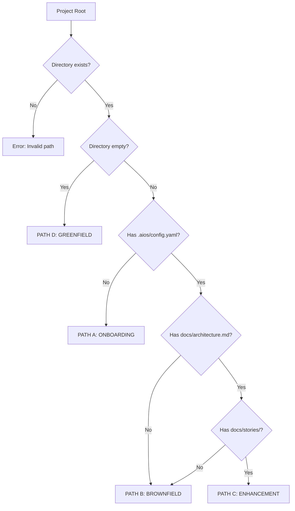

# Project State Detection Checklist

Deterministic decision tree for detecting project state. **NO LLM** - pure if/else logic.

## Decision Tree



---

## Checklist Items

### Pre-Detection Validation

- [ ] **D000**: Project root path provided
- [ ] **D001**: Path exists and is accessible
- [ ] **D002**: Current user has read permissions

---

## PATH A: ONBOARDING (NO_CONFIG)

**Condition:** Project exists but no `.aios/config.yaml`

### Checks

- [ ] **A001**: Directory is not empty
- [ ] **A002**: `.aios/` directory does NOT exist
- [ ] **A003**: OR `.aios/` exists but no `config.yaml` inside

### Validation Code

```javascript
function detectOnboarding(projectRoot) {
  const aiosDir = path.join(projectRoot, '.aios');
  const configPath = path.join(aiosDir, 'config.yaml');

  // Directory not empty
  const files = fs.readdirSync(projectRoot);
  if (files.length === 0) {
    return false; // Empty dir → Greenfield
  }

  // .aios/config.yaml does NOT exist
  if (fs.existsSync(configPath)) {
    return false; // Config exists → check for docs
  }

  return true; // Has files but no AIOS config
}
```

### Output

```javascript
{
  state: ProjectState.NO_CONFIG,
  path: 'PATH A',
  workflow: 'onboarding',
  message: '🔧 AIOS não está configurado. Iniciando setup...',
  nextStep: 'run_aios_init',
  rationale: 'Projeto existe mas sem .aios/config.yaml'
}
```

---

## PATH B: BROWNFIELD (EXISTING_NO_DOCS)

**Condition:** Has AIOS config but NO architecture documentation

### Checks

- [ ] **B001**: `.aios/config.yaml` exists
- [ ] **B002**: `docs/architecture.md` does NOT exist
- [ ] **B003**: OR `docs/stories/` directory does NOT exist
- [ ] **B004**: Project has source code (e.g., `src/`, `lib/`, `app/`)

### Validation Code

```javascript
function detectBrownfield(projectRoot) {
  const configPath = path.join(projectRoot, '.aios', 'config.yaml');
  const archPath = path.join(projectRoot, 'docs', 'architecture.md');
  const storiesDir = path.join(projectRoot, 'docs', 'stories');

  // Must have config
  if (!fs.existsSync(configPath)) {
    return false;
  }

  // Must NOT have architecture docs
  if (fs.existsSync(archPath) && fs.existsSync(storiesDir)) {
    return false; // Has docs → Enhancement
  }

  // Should have source code
  const hasSource = ['src', 'lib', 'app', 'packages'].some(dir =>
    fs.existsSync(path.join(projectRoot, dir))
  );

  return hasSource; // Config exists but no AIOS docs
}
```

### Output

```javascript
{
  state: ProjectState.EXISTING_NO_DOCS,
  path: 'PATH B',
  workflow: 'brownfield-discovery',
  message: '🔍 Detectei projeto Brownfield. Executando discovery...',
  duration: '2-4 horas',
  nextStep: 'run_brownfield_handler',
  rationale: 'Tem .aios/config.yaml mas sem docs/architecture.md'
}
```

---

## PATH C: ENHANCEMENT (EXISTING_WITH_DOCS)

**Condition:** Has AIOS config AND architecture documentation

### Checks

- [ ] **C001**: `.aios/config.yaml` exists
- [ ] **C002**: `docs/architecture.md` exists
- [ ] **C003**: `docs/stories/` directory exists
- [ ] **C004**: At least 1 story file in `docs/stories/active/` or `docs/stories/completed/`

### Validation Code

```javascript
function detectEnhancement(projectRoot) {
  const configPath = path.join(projectRoot, '.aios', 'config.yaml');
  const archPath = path.join(projectRoot, 'docs', 'architecture.md');
  const storiesDir = path.join(projectRoot, 'docs', 'stories');

  // Must have config
  if (!fs.existsSync(configPath)) {
    return false;
  }

  // Must have architecture
  if (!fs.existsSync(archPath)) {
    return false;
  }

  // Must have stories directory
  if (!fs.existsSync(storiesDir)) {
    return false;
  }

  // Check for at least one story
  const activeDir = path.join(storiesDir, 'active');
  const completedDir = path.join(storiesDir, 'completed');

  const hasStories =
    (fs.existsSync(activeDir) && fs.readdirSync(activeDir).length > 0) ||
    (fs.existsSync(completedDir) && fs.readdirSync(completedDir).length > 0);

  return hasStories;
}
```

### Output

```javascript
{
  state: ProjectState.EXISTING_WITH_DOCS,
  path: 'PATH C',
  workflow: 'enhancement',
  message: '✅ Projeto AIOS documentado. Pronto para enhancement.',
  nextStep: 'ask_user_objective',
  rationale: 'Tem config E docs/architecture.md E stories/'
}
```

---

## PATH D: GREENFIELD (GREENFIELD)

**Condition:** Empty directory or new project from scratch

### Checks

- [ ] **D001**: Directory is completely empty
- [ ] **D002**: OR only has `.git/` and no other files
- [ ] **D003**: OR only has README.md and nothing else

### Validation Code

```javascript
function detectGreenfield(projectRoot) {
  const files = fs.readdirSync(projectRoot);

  // Empty directory
  if (files.length === 0) {
    return true;
  }

  // Only .git and/or README
  const allowedFiles = ['.git', 'README.md', '.gitignore'];
  const nonAllowed = files.filter(f => !allowedFiles.includes(f));

  return nonAllowed.length === 0;
}
```

### Output

```javascript
{
  state: ProjectState.GREENFIELD,
  path: 'PATH D',
  workflow: 'greenfield-fullstack',
  message: '🌱 Novo projeto detectado. Iniciando do zero...',
  duration: '4-8 horas',
  nextStep: 'run_greenfield_handler',
  rationale: 'Diretório vazio ou apenas .git/README'
}
```

---

## Edge Cases

### Case 1: Partial AIOS Setup

```
Scenario: .aios/ exists but config.yaml is missing

Detection:
  - .aios/ directory exists
  - .aios/config.yaml does NOT exist

Route: PATH A (Onboarding)
Reason: Config is the source of truth for AIOS setup
```

### Case 2: Architecture Without Stories

```
Scenario: docs/architecture.md exists but docs/stories/ is empty

Detection:
  - Has .aios/config.yaml
  - Has docs/architecture.md
  - docs/stories/ is empty or missing

Route: PATH B (Brownfield)
Reason: Architecture alone is not sufficient, need stories for Enhancement
```

### Case 3: Git Repo Only

```
Scenario: Only .git/ directory exists

Detection:
  - Directory has .git/
  - No other files or folders

Route: PATH D (Greenfield)
Reason: Git init alone doesn't mean project started
```

### Case 4: Config Repair Needed

```
Scenario: AIOS was initialized but config is corrupted

Detection:
  - .aios/ directory exists
  - .aios/config.yaml missing or unreadable
  - docs/architecture.md exists (proof AIOS was working)

Route: PATH A with CONFIG_REPAIR flag
Special: Offer to repair instead of full re-init
```

---

## Implementation

### Complete Detection Function

```javascript
class ProjectStateDetector {
  detectProjectState(projectRoot) {
    // Pre-validation
    if (!fs.existsSync(projectRoot)) {
      throw new Error(`Project root does not exist: ${projectRoot}`);
    }

    // Check in priority order (Greenfield → Onboarding → Brownfield → Enhancement)

    // 1. Greenfield (empty or minimal)
    if (this._isGreenfield(projectRoot)) {
      return {
        state: ProjectState.GREENFIELD,
        path: 'PATH D',
        workflow: 'greenfield-fullstack',
      };
    }

    // 2. Onboarding (no config)
    if (this._isOnboarding(projectRoot)) {
      return {
        state: ProjectState.NO_CONFIG,
        path: 'PATH A',
        workflow: 'onboarding',
      };
    }

    // 3. Enhancement (config + docs)
    if (this._isEnhancement(projectRoot)) {
      return {
        state: ProjectState.EXISTING_WITH_DOCS,
        path: 'PATH C',
        workflow: 'enhancement',
      };
    }

    // 4. Brownfield (config, no docs)
    if (this._isBrownfield(projectRoot)) {
      return {
        state: ProjectState.EXISTING_NO_DOCS,
        path: 'PATH B',
        workflow: 'brownfield-discovery',
      };
    }

    // Should never reach here
    throw new Error('Unable to determine project state');
  }

  _isGreenfield(root) {
    const files = fs.readdirSync(root);
    if (files.length === 0) return true;

    const allowedFiles = ['.git', 'README.md', '.gitignore'];
    return files.every(f => allowedFiles.includes(f));
  }

  _isOnboarding(root) {
    const configPath = path.join(root, '.aios', 'config.yaml');
    return !fs.existsSync(configPath);
  }

  _isEnhancement(root) {
    const configPath = path.join(root, '.aios', 'config.yaml');
    const archPath = path.join(root, 'docs', 'architecture.md');
    const storiesDir = path.join(root, 'docs', 'stories');

    return fs.existsSync(configPath) &&
           fs.existsSync(archPath) &&
           fs.existsSync(storiesDir);
  }

  _isBrownfield(root) {
    const configPath = path.join(root, '.aios', 'config.yaml');
    return fs.existsSync(configPath);
  }
}
```

---

## Testing

### Test Matrix

| Test Case | Files Present | Expected Path | Workflow |
|-----------|---------------|---------------|----------|
| Empty directory | None | PATH D | greenfield-fullstack |
| Only .git | `.git/` | PATH D | greenfield-fullstack |
| Git + README | `.git/`, `README.md` | PATH D | greenfield-fullstack |
| No config | `src/`, `package.json` | PATH A | onboarding |
| Config only | `.aios/config.yaml`, `src/` | PATH B | brownfield-discovery |
| Config + arch | Above + `docs/architecture.md` | PATH B | brownfield-discovery |
| Full AIOS | Above + `docs/stories/` | PATH C | enhancement |

### Verification Script

```bash
# Test all 4 paths
npm run test -- --testNamePattern="ProjectStateDetector"

# Expected output:
✓ Greenfield: empty directory
✓ Greenfield: only .git
✓ Onboarding: no config
✓ Brownfield: config but no docs
✓ Enhancement: config + docs + stories
```

---

## Related

- **Task:** orchestrate-project.md (uses this checklist)
- **Workflows:** All 4 workflows depend on correct routing
- **Module:** project-state-detector.js (implementation)

---

**Principle:** Deterministic routing = predictable, testable, debuggable. No LLM guessing.

**Last Updated:** 2026-02-15
