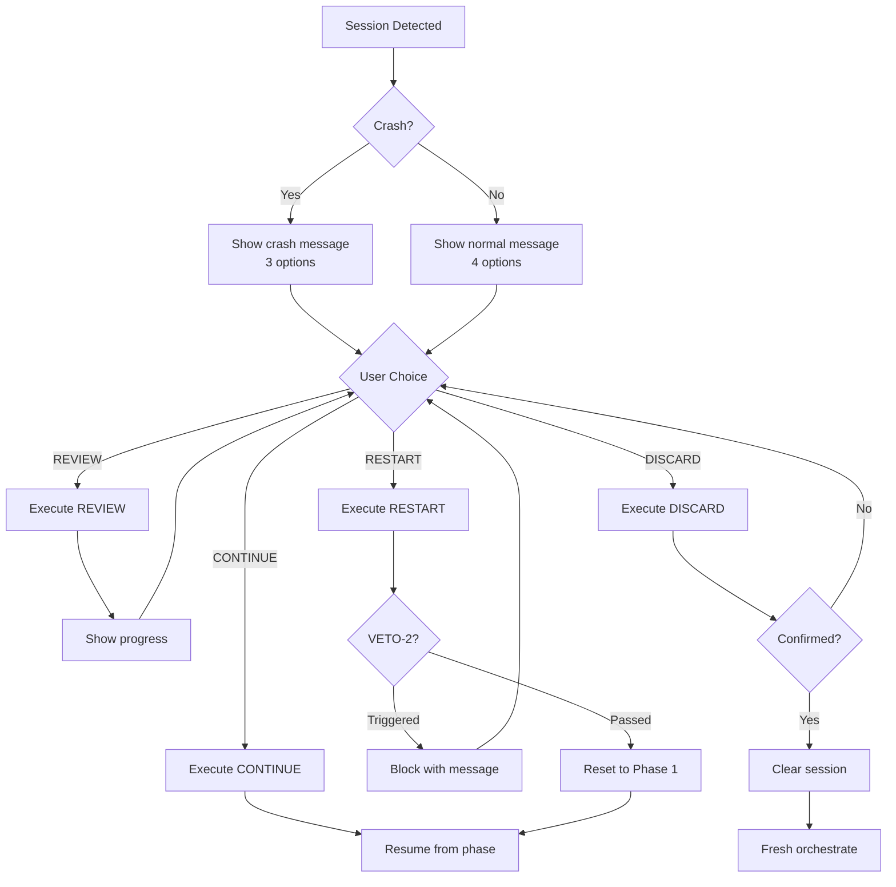

# Session Resume Options Checklist

When user returns to existing BOB session, evaluate options and execute decision safely.

---

## Pre-Resume Checks

- [ ] **R000**: Session state file exists (`.aios/.session-state.yaml`)
- [ ] **R001**: Session state is valid YAML (parseable)
- [ ] **R002**: Required fields present (epic, progress, workflow, last_updated)
- [ ] **R003**: Detect crash condition (last_updated > 30min ago)

### Crash Detection

```javascript
const lastUpdated = new Date(state.last_updated);
const now = new Date();
const minutesSinceUpdate = (now - lastUpdated) / 1000 / 60;

const isCrash = minutesSinceUpdate > 30;

if (isCrash) {
  // Show crash recovery message
  // Remove REVIEW option (3 options instead of 4)
  options = ['CONTINUE', 'RESTART', 'DISCARD'];
}
```

---

## OPTION 1: CONTINUE

**Action:** Resume from last saved phase

### Pre-Execution Checks

- [ ] **C001**: Story file still exists on disk
- [ ] **C002**: Current phase is valid (1-6)
- [ ] **C003**: Epic context is restorable
- [ ] **C004**: Executor agent is available

### Execution Steps

1. Load session state
2. Resolve story path from story ID
3. Restore epic context (epic ID, title)
4. Restore workflow state (current phase, completed phases)
5. Validate executor assignment still valid
6. Resume from `current_phase`

### Implementation

```javascript
async handleContinue(sessionState) {
  // Validate story file exists
  const storyPath = this._resolveStoryPath(sessionState.progress.current_story);

  if (!fs.existsSync(storyPath)) {
    return {
      success: false,
      error: 'story_not_found',
      message: `Story file não encontrado: ${storyPath}`,
      suggestion: 'Escolha RESTART ou DISCARD',
    };
  }

  // Restore context
  const context = {
    epic: sessionState.epic,
    story: sessionState.progress.current_story,
    phase: sessionState.workflow.current_phase,
    completedPhases: sessionState.workflow.completed_phases,
    executor: sessionState.workflow.current_executor,
  };

  this._log(`Resuming story ${context.story} from phase ${context.phase}`, 'info');

  return {
    success: true,
    action: 'execute_story',
    storyPath,
    resumePhase: context.phase,
    context,
  };
}
```

### Validation Checklist

- [ ] **C005**: Story file loaded successfully
- [ ] **C006**: Phase number is between 1-6
- [ ] **C007**: Executor agent file exists
- [ ] **C008**: Git status is clean (no conflicts)

---

## OPTION 2: REVIEW

**Action:** Show detailed progress without resuming

**Note:** Only available if NOT a crash (crash = no review, jump to action)

### Pre-Execution Checks

- [ ] **V001**: Session was NOT a crash (< 30min inactive)
- [ ] **V002**: Progress data is available
- [ ] **V003**: Can access story files for stats

### Execution Steps

1. Load session state
2. Generate progress dashboard
3. Show to user
4. Return to resume prompt (loop back to 4 options)

### Implementation

```javascript
async handleReview(sessionState) {
  const progress = await this._generateProgressReport(sessionState);

  return {
    success: true,
    action: 'show_progress',
    data: progress,
    returnTo: 'resume_prompt', // Loop back
  };
}

_generateProgressReport(state) {
  const epic = state.epic;
  const currentStory = state.progress.current_story;
  const completedStories = state.progress.completed || [];
  const currentPhase = state.workflow.current_phase;
  const completedPhases = state.workflow.completed_phases || [];

  return {
    epic: {
      id: epic.id,
      title: epic.title,
      storiesTotal: epic.stories_total || 'Unknown',
      storiesCompleted: completedStories.length,
    },
    currentStory: {
      id: currentStory,
      phase: currentPhase,
      phasesCompleted: `${completedPhases.length}/6`,
      executor: state.workflow.current_executor,
    },
    session: {
      started: state.created_at,
      lastUpdate: state.last_updated,
      duration: this._calculateDuration(state.created_at, state.last_updated),
    },
    filesChanged: state.metrics?.files_changed || 0,
    testsStatus: state.metrics?.tests_status || 'Unknown',
    prUrl: state.workflow?.pr_url || 'Not created yet',
  };
}
```

### Output Example

```
📊 PROGRESSO DA SESSÃO

Epic: Authentication System
├─ Total stories: 12
├─ Completadas: 2 (12.1, 12.2)
└─ Em progresso: 12.3

Story Atual: 12.3 - Implement JWT handler
├─ Fase: development (2/6 completas)
├─ Executor: @dev
└─ Arquivos modificados: 3

Sessão:
├─ Iniciada: há 3 horas
├─ Última atualização: há 30 minutos
└─ Duração total: 2h 30min

Testes: ✓ Passing
PR: Ainda não criado

Voltar ao menu? [SIM]
```

---

## OPTION 3: RESTART

**Action:** Restart story from Phase 1

**⚠️ VETO-2 ENFORCEMENT:** Block if uncommitted work exists

### Pre-Execution Checks

- [ ] **S001**: Validate git status
- [ ] **S002**: Check for uncommitted changes
- [ ] **S003**: Check for staged but not committed files
- [ ] **S004**: VETO-2: Block if changes exist

### VETO-2: Uncommitted Work Check

```javascript
async checkUncommittedWork() {
  const { stdout } = await this._execGit('status --porcelain');

  if (!stdout || stdout.trim() === '') {
    return {
      hasChanges: false,
      vetoTriggered: false,
    };
  }

  const files = stdout
    .trim()
    .split('\n')
    .map(line => line.substring(3)); // Remove status prefix

  return {
    hasChanges: true,
    vetoTriggered: true,
    count: files.length,
    files,
  };
}
```

### VETO-2 Triggered: Block Restart

```javascript
if (workStatus.vetoTriggered) {
  return {
    success: false,
    action: 'restart_blocked',
    veto: 'BOB-VETO-2',
    data: {
      vetoCondition: 'uncommitted_changes',
      reason: 'Há trabalho não commitado. Restart pode perder contexto.',
      filesAffected: workStatus.files,
      fileCount: workStatus.count,
      message: `
⛔ RESTART BLOQUEADO (BOB-VETO-2)

Há ${workStatus.count} arquivo(s) com mudanças não commitadas:
${workStatus.files.map(f => `  - ${f}`).join('\n')}

Restart reseta o estado do workflow, mas mudanças em disco
permanecem. Há risco de perder contexto de trabalho.

Recomendamos:
1. Commit suas mudanças: git add . && git commit -m "wip"
2. OU stash temporariamente: git stash
3. Depois execute restart novamente

Voltar para menu de resume? [SIM/NÃO]
      `.trim(),
    },
  };
}
```

### Execution Steps (if VETO-2 passed)

1. Validate git status clean
2. Clear workflow state (phases, executor)
3. Keep epic context (do NOT reset epic)
4. Reset story to Phase 1
5. Update session state

### Implementation

```javascript
async handleRestart(sessionState) {
  // VETO-2: Check uncommitted work
  const workStatus = await this.checkUncommittedWork();

  if (workStatus.vetoTriggered) {
    return this._formatVeto2Block(workStatus);
  }

  // Clear story progress
  await this.sessionState.resetStory(sessionState.progress.current_story);

  // Keep epic, reset workflow
  const freshState = {
    epic: sessionState.epic, // Preserve epic context
    progress: {
      current_story: sessionState.progress.current_story,
      completed: sessionState.progress.completed,
    },
    workflow: {
      current_phase: 'validation', // Reset to Phase 1
      completed_phases: [],
      current_executor: null,
    },
    last_updated: new Date().toISOString(),
  };

  await this.sessionState.save(freshState);

  this._log(`Restarting story ${freshState.progress.current_story}`, 'info');

  return {
    success: true,
    action: 'restart',
    storyPath: this._resolveStoryPath(freshState.progress.current_story),
    message: `Recomeçando story ${freshState.progress.current_story} do início`,
  };
}
```

### Validation Checklist

- [ ] **S005**: Git status is clean (no uncommitted files)
- [ ] **S006**: Session state updated with fresh workflow
- [ ] **S007**: Epic context preserved
- [ ] **S008**: Story file is accessible

---

## OPTION 4: DISCARD

**Action:** Clear session and start fresh

### Pre-Execution Checks

- [ ] **D001**: Confirm with user (destructive action)
- [ ] **D002**: Warn about losing progress
- [ ] **D003**: Double confirmation if epic has multiple completed stories

### Execution Steps

1. Show confirmation message
2. Wait for user confirmation
3. If confirmed: delete `.aios/.session-state.yaml`
4. Clear in-memory session state
5. Return to orchestrate fresh

### Implementation

```javascript
async handleDiscard(sessionState) {
  // Count completed work
  const completedCount = sessionState.progress?.completed?.length || 0;

  // Show confirmation
  const confirmed = await this._confirmDiscard(completedCount);

  if (!confirmed) {
    return {
      success: false,
      action: 'discard_cancelled',
      message: 'Discard cancelado. Voltando ao menu.',
      returnTo: 'resume_prompt',
    };
  }

  // Clear session state
  await this.sessionState.clear();

  this._log('Session discarded by user', 'info');

  return {
    success: true,
    action: 'session_discarded',
    message: 'Sessão descartada. Iniciando nova...',
    nextStep: 'detect_project_state',
  };
}

async _confirmDiscard(completedCount) {
  const message = completedCount > 0
    ? `⚠️ Você completou ${completedCount} story(ies). Tem certeza que quer descartar? [SIM para confirmar]`
    : `Descartar sessão e começar nova? [SIM/NÃO]`;

  const response = await this._promptUser(message);

  return response.toUpperCase() === 'SIM';
}
```

### Validation Checklist

- [ ] **D004**: User confirmed action
- [ ] **D005**: Session state file deleted
- [ ] **D006**: In-memory state cleared
- [ ] **D007**: Ready to detect project state again

---

## Decision Flow



---

## Testing

### Test Cases

| Scenario | Session Age | Uncommitted Files | Expected Behavior |
|----------|-------------|-------------------|-------------------|
| Normal resume | 10 min | 0 | 4 options, all work |
| Crash | 2 hours | 0 | 3 options (no REVIEW) |
| Restart attempt | 10 min | 3 | VETO-2 blocks |
| Restart clean | 10 min | 0 | Restart succeeds |
| Discard with progress | 10 min | N/A | Double confirmation |
| Discard no progress | 10 min | N/A | Single confirmation |

### Verification Script

```bash
# Test all resume options
npm run test -- --testNamePattern="SessionResume"

# Expected output:
✓ CONTINUE: story file exists
✓ CONTINUE: invalid story → error
✓ REVIEW: generates dashboard
✓ REVIEW: crash → option not available
✓ RESTART: VETO-2 blocks uncommitted
✓ RESTART: clean git → succeeds
✓ DISCARD: requires confirmation
```

---

## Related

- **Task:** session-resume.md (implements this checklist)
- **Task:** orchestrate-project.md (calls session-resume)
- **Veto:** BOB-VETO-2 (restart protection)
- **Module:** session-state.js (persistence)

---

**Average Decision Time:** 1-2 minutes
**Crash Threshold:** 30 minutes inactive
**VETO-2 Bypass:** ❌ NOT bypassable (protects work)

**Last Updated:** 2026-02-15
