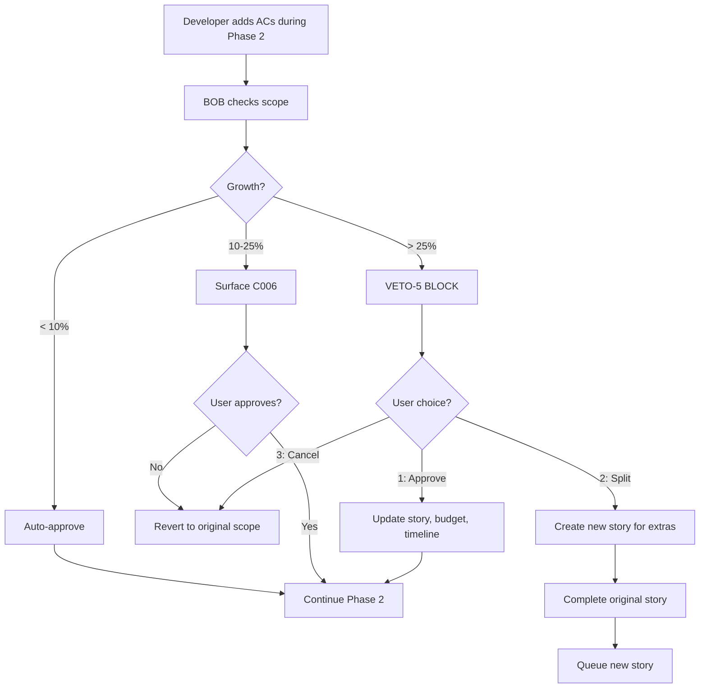

# BOB-VETO-5: Scope Change Prevention

**Status:** VETO Gate (C006 elevated from Surface Criteria)
**Severity:** HIGH
**Bypass:** ❌ NOT bypassable (hard block at 25% growth)
**Related:** C006 Surface Criteria, Pedro's Recommendation #2

---

## Problem Statement

**Scope creep** is one of the most common causes of project failure:
- Stories grow beyond original acceptance criteria
- "Small additions" accumulate into significant work
- Budget and timeline estimates become inaccurate
- Developer frustration increases ("this was supposed to be simple!")
- Quality suffers when rushed to fit original estimate

**Example:**
```
Original Story: "Add login form with email/password"
Scope Creep:
  → "Also add OAuth (Google, GitHub)"
  → "Also add password reset flow"
  → "Also add 2FA"
  → "Also add remember me checkbox"

Original: 2 ACs, 4h estimate
Final: 8 ACs, 16h actual

Result: Budget blown, timeline missed, quality compromised
```

---

## Solution: BOB-VETO-5

BOB monitors scope changes and BLOCKS expansion beyond threshold WITHOUT explicit approval.

### Thresholds

| Scope Growth | Action | Bypassable |
|--------------|--------|------------|
| 0-10% | Auto-approve (normal variance) | N/A |
| 10-25% | Surface for confirmation (C006) | Yes (in `explore` mode) |
| >25% | **HARD BLOCK** (BOB-VETO-5) | **NO** |

### Implementation

```javascript
class BobOrchestrator {
  async _checkScopeChange(storyId, phase) {
    // Load original story at validation (Phase 1)
    const originalStory = await this._loadStory(storyId);
    const approvedScope = this._calculateScope(originalStory.acceptanceCriteria);

    // During development (Phase 2+), check if scope grew
    const currentStory = await this._loadStory(storyId);
    const currentScope = this._calculateScope(currentStory.acceptanceCriteria);

    const growth = (currentScope / approvedScope) - 1;
    const growthPercent = (growth * 100).toFixed(0);

    // VETO-5: Block if growth > 25%
    if (growth > 0.25) {
      this._log(`VETO-5 triggered: ${growthPercent}% scope growth`, 'warn');

      return {
        success: false,
        action: 'scope_veto_triggered',
        veto: 'BOB-VETO-5',
        data: {
          approvedScope,
          currentScope,
          growth: `${growthPercent}%`,
          threshold: '25%',
          message: this._formatVeto5Message(approvedScope, currentScope, growthPercent),
        },
      };
    }

    // Surface for approval if growth 10-25%
    if (growth > 0.10) {
      const surfaceResult = this.surfaceChecker.shouldSurface({
        criterion: 'C006',
        scopeExpansion: true,
        growth: `${growthPercent}%`,
      });

      if (surfaceResult.should_surface) {
        return {
          success: false,
          action: 'scope_approval_needed',
          criterion: 'C006',
          data: surfaceResult,
        };
      }
    }

    // Growth < 10% → auto-approve
    return { success: true };
  }

  _calculateScope(acceptanceCriteria) {
    // Scope calculation heuristic:
    // - Number of ACs
    // - Complexity of each AC (keywords: "integrate", "security", "test")
    // - File count estimate

    const baseScore = acceptanceCriteria.length * 10;

    const complexityMultipliers = {
      'integrate': 1.5,
      'security': 1.5,
      'authentication': 2.0,
      'migration': 2.0,
      'refactor': 1.3,
      'test': 1.2,
    };

    let complexityScore = 0;
    acceptanceCriteria.forEach(ac => {
      const text = ac.toLowerCase();
      Object.entries(complexityMultipliers).forEach(([keyword, mult]) => {
        if (text.includes(keyword)) {
          complexityScore += 10 * (mult - 1);
        }
      });
    });

    return baseScore + complexityScore;
  }

  _formatVeto5Message(approvedScope, currentScope, growthPercent) {
    return `⛔ EXPANSÃO DE ESCOPO BLOQUEADA (BOB-VETO-5)

Escopo aprovado (Phase 1): ${approvedScope} pontos
Escopo solicitado (atual): ${currentScope} pontos
Crescimento: ${growthPercent}%

**Limite:** 25% de expansão sem aprovação explícita.

**Por que bloqueamos:**
Expansão de escopo acima de 25% indica que a story mudou significativamente.
Isso invalida estimativas, afeta planejamento, e pode comprometer qualidade.

**Suas opções:**

[1] 🟢 APROVAR EXPANSÃO
    - Reconhece que escopo cresceu
    - Atualiza estimativa e budget
    - Comunica mudança a stakeholders
    - Continua com escopo expandido

[2] 🔵 CRIAR STORY SEPARADA
    - Mantém escopo original nesta story
    - Cria nova story para features adicionais
    - Preserva estimativa original
    - Recomendado para manter controle

[3] 🔴 CANCELAR MUDANÇAS
    - Reverte para escopo original
    - Remove ACs adicionados
    - Mantém estimativa intacta

Qual sua escolha? [1/2/3]`;
  }
}
```

---

## When VETO-5 Triggers

### Scenario 1: Mid-Development Scope Creep

```
Story 12.3 - Add Login Form
Original ACs (Phase 1):
  1. User can enter email and password
  2. System validates credentials
  3. Successful login redirects to dashboard

During Development (Phase 2), developer adds:
  4. OAuth integration (Google)
  5. Remember me checkbox
  6. Password strength indicator
  7. Rate limiting

Scope calculation:
  Original: 3 ACs × 10 = 30 points
  New: 7 ACs × 10 + complexity(OAuth=2.0, security=1.5) = 70 + 35 = 105 points
  Growth: (105/30 - 1) = 250%

VETO-5 TRIGGERED → BLOCKS Phase 2 → Phase 3 transition
```

### Scenario 2: AC Complexity Expansion

```
Story 5.2 - Implement User Registration
Original ACs (Phase 1):
  1. User submits email, password, name
  2. System creates account
  3. Confirmation email sent

During Development, complexity grows:
  1. User submits email, password, name (UNCHANGED)
  2. System creates account WITH email verification, password strength check,
     duplicate detection, GDPR consent, and age verification
  3. Confirmation email sent WITH magic link, personalized template,
     retry logic, bounce handling, and unsubscribe footer

Scope calculation:
  Original: 3 ACs × 10 = 30 points
  New: 3 ACs × 10 + complexity(security×3, integrate×2) = 30 + 75 = 105 points
  Growth: (105/30 - 1) = 250%

VETO-5 TRIGGERED → BLOCKS advancement
```

---

## User Decision Flow



---

## Integration with Development Cycle

VETO-5 checks run at phase transitions:

| Transition | Check Scope? | Why |
|------------|--------------|-----|
| Phase 1 → 2 | ✅ Yes | Baseline scope established |
| Phase 2 → 3 | ✅ Yes | Detect mid-dev scope creep |
| Phase 3 → 4 | ✅ Yes | Final scope check before QG |
| Phase 4 → 5 | ❌ No | Scope locked after QG approval |
| Phase 5 → 6 | ❌ No | Too late to change |

**Enforcement:** Phase exit criteria (EC2.7, EC3.7) include scope validation.

---

## Benefits

1. **Budget Protection:** Prevents stories from exceeding estimates by >25%
2. **Timeline Accuracy:** Scope creep is #1 cause of missed deadlines
3. **Quality Preservation:** Rushed work to fit original estimate = poor quality
4. **Transparency:** User always aware when scope expands
5. **Discipline:** Forces decision: approve expansion OR split into separate story

---

## Comparison to Other VETOs

| VETO | Severity | Bypass | Frequency |
|------|----------|--------|-----------|
| VETO-1 | Medium | No | Rare (onboarding) |
| VETO-2 | Medium | No | Common (restart attempts) |
| VETO-3 | High | No | Rare (race condition) |
| VETO-4 | Critical | No | Very rare (system bug) |
| **VETO-5** | **High** | **No** | **Medium (scope creep common)** |

VETO-5 is expected to trigger moderately often (5-10% of stories) because scope creep is a natural tendency.

---

## Edge Cases

### Case 1: Scope reduction
```
Original: 5 ACs
Current: 3 ACs (2 removed as unnecessary)

Growth: (3/5 - 1) = -40%

Action: Auto-approve (scope reduction is good!)
```

### Case 2: Refactoring during development
```
Original: 3 ACs
Developer refactors code (no AC changes)
Current: 3 ACs

Growth: 0%

Action: Auto-approve (no scope change)
```

### Case 3: AC clarification (not expansion)
```
Original AC: "User can login"
Clarified AC: "User can login with email and password, redirected to /dashboard"

Scope calculation: Same complexity, just more explicit

Growth: ~0%

Action: Auto-approve (clarification ≠ expansion)
```

---

## Configuration

```yaml
# ~/.aios/user-config.yaml or .aios/config.yaml
bob:
  scope_change_detection:
    enabled: true
    growth_threshold_veto: 0.25  # 25% (default)
    growth_threshold_surface: 0.10  # 10% (default)
    bypass_in_yolo_mode: false  # VETO-5 NOT bypassable
```

---

## Metrics & Telemetry

Track VETO-5 triggers:

```javascript
await this.telemetry.record({
  event: 'veto_5_triggered',
  story: storyId,
  approved_scope: approvedScope,
  requested_scope: currentScope,
  growth_percent: growthPercent,
  user_decision: decision,  // approve | split | cancel
  timestamp: new Date().toISOString(),
});
```

**Dashboard Query:**
```sql
SELECT
  COUNT(*) as total_veto_5,
  AVG(growth_percent) as avg_growth,
  SUM(CASE WHEN user_decision = 'split' THEN 1 ELSE 0 END) as stories_split
FROM veto_events
WHERE veto = 'VETO-5'
  AND timestamp > NOW() - INTERVAL '30 days';
```

---

## References

- **Story:** BOB-VETO-5 (this document)
- **Related:** C006 Surface Criteria
- **Recommendation:** Pedro (@pedro-valerio) - Process Absolutist
- **File:** decision-heuristics.md (line ~387)
- **Implementation:** surface-decision.md (C006 section)

---

**Process Absolutism:** If scope CAN creep without approval → process is broken. BOB-VETO-5 fixes this. ⚖️

**Last Updated:** 2026-02-15
