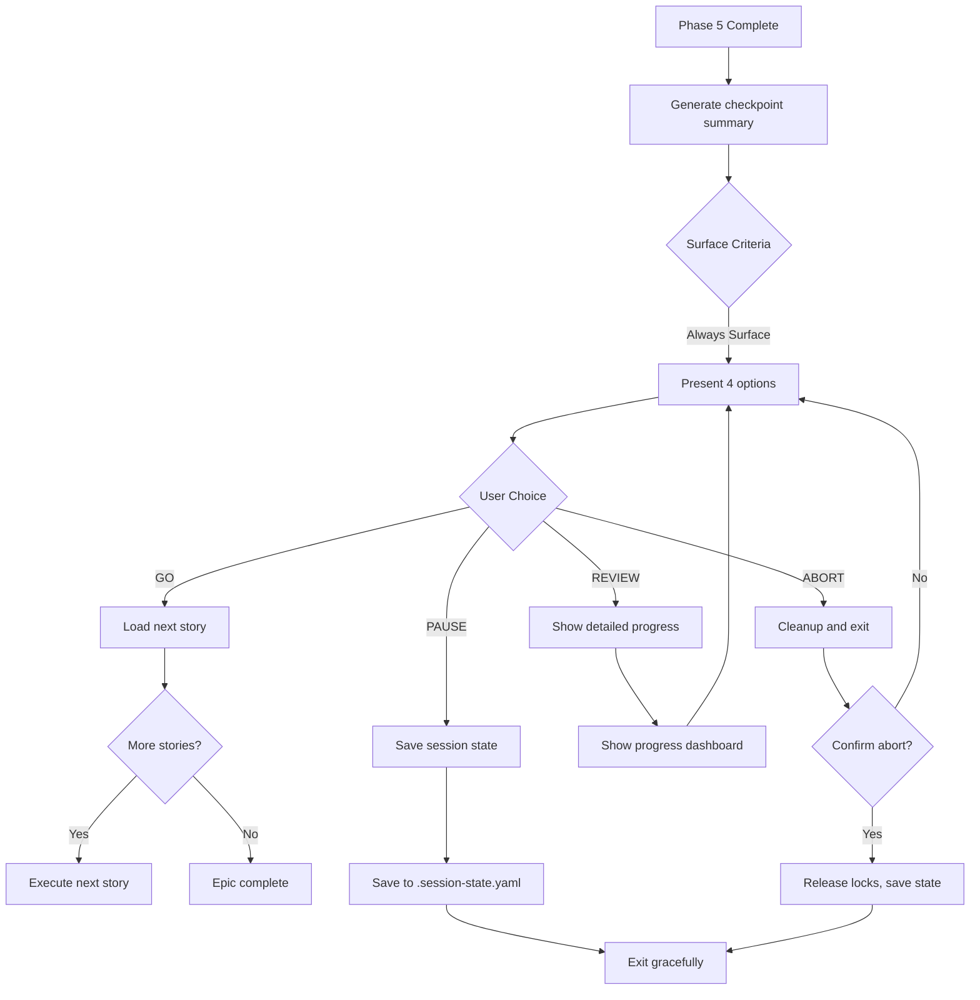

# *checkpoint-story

**Phase 6 of Development Cycle** - Human decision point after story completion. Allows user to control flow: continue, pause, review progress, or abort.

## Usage

```bash
# Called automatically after Phase 5 (Push)
# BOB surfaces checkpoint:

✅ Story 12.3 completa!

Resultados:
- Arquivos modificados: 4
- Testes passando: 12/12
- PR criado: https://github.com/user/repo/pull/42
- Duração: 2h 34min

O que deseja fazer?
1. GO - Continuar para próxima story
2. PAUSE - Pausar e retomar depois
3. REVIEW - Ver progresso detalhado
4. ABORT - Encerrar sessão

Sua escolha (1-4):
```

## Flow



## Implementation

### Generate Checkpoint Summary

```javascript
function generateCheckpointSummary(storyId, phaseResults) {
  const duration = phaseResults.reduce((acc, p) => acc + p.duration, 0);

  return {
    story: storyId,
    filesChanged: phaseResults[1].filesModified.length, // Phase 2: Development
    testsStatus: `${phaseResults[2].testsPassed}/${phaseResults[2].testsTotal}`, // Phase 3
    qualityGate: phaseResults[3].decision, // Phase 4
    prUrl: phaseResults[4].prUrl, // Phase 5
    duration: this._formatDuration(duration),
    cost: this._estimateCost(phaseResults),
  };
}
```

### Surface Checkpoint (Always)

```javascript
const surfaceResult = this.surfaceChecker.checkpoint({
  story: context.storyId,
  summary: checkpointSummary,
  nextStory: await this._getNextStory(),
});

// Checkpoint ALWAYS surfaces (required for human control)
if (!surfaceResult.should_surface) {
  throw new Error('CRITICAL: Checkpoint must always surface to user');
}

return {
  action: 'checkpoint',
  data: {
    message: this._formatCheckpointMessage(checkpointSummary),
    options: ['GO', 'PAUSE', 'REVIEW', 'ABORT'],
    summary: checkpointSummary,
  },
};
```

### Handle User Decision

```javascript
async handleCheckpointDecision(decision, context) {
  switch (decision) {
    case 'GO':
      const nextStory = await this._getNextStory();
      if (!nextStory) {
        return {
          action: 'epic_complete',
          message: '🎉 Epic completo! Todas as stories finalizadas.',
        };
      }
      return {
        action: 'execute_story',
        storyPath: nextStory.path,
      };

    case 'PAUSE':
      await this.sessionState.saveState({
        status: 'paused',
        pausedAt: new Date().toISOString(),
        lastCompletedStory: context.storyId,
      });
      return {
        action: 'session_paused',
        message: 'Sessão pausada. Execute @pm para retomar.',
      };

    case 'REVIEW':
      const progress = await this._generateProgressReport();
      return {
        action: 'show_progress',
        data: progress,
        // After review, surface checkpoint again
        nextAction: 'checkpoint',
      };

    case 'ABORT':
      // Confirm before abort
      const confirmed = await this.surfaceChecker.confirmDestructive({
        action: 'abort_session',
        consequence: 'Session será encerrada. Progresso salvo, mas você não continuará automaticamente.',
      });

      if (!confirmed) {
        // Return to checkpoint
        return { action: 'checkpoint', data: context };
      }

      await this.sessionState.saveState({
        status: 'aborted',
        abortedAt: new Date().toISOString(),
      });

      await this.lockManager.releaseLock('bob-orchestration');

      return {
        action: 'session_aborted',
        message: 'Sessão encerrada. Seu progresso foi salvo.',
      };

    default:
      throw new Error(`Invalid checkpoint decision: ${decision}`);
  }
}
```

## Checkpoint Message Format

### Standard Template

```markdown
✅ Story {{ storyId }} completa!

Resultados:
- Arquivos modificados: {{ filesChanged }}
- Testes passando: {{ testsStatus }}
- Quality Gate: {{ qualityGate }}
- PR criado: {{ prUrl }}
- Duração: {{ duration }}
- Custo: ~${{ cost }}

Próxima story: {{ nextStory.id }} - {{ nextStory.title }}

O que deseja fazer?
1. 🚀 GO - Continuar para próxima story
2. ⏸️  PAUSE - Pausar e retomar depois
3. 📊 REVIEW - Ver progresso detalhado
4. 🛑 ABORT - Encerrar sessão

Sua escolha (1-4):
```

### Educational Mode Template

```markdown
✅ Story {{ storyId }} completa!

💡 O que acabamos de fazer?
BOB executou as 6 fases do development cycle:
1. ✓ Validation (@po validou acceptance criteria)
2. ✓ Development ({{ executor }} implementou código)
3. ✓ Self-Healing (CodeRabbit corrigiu issues)
4. ✓ Quality Gate ({{ qualityGate }} revisou código)
5. ✓ Push (@devops criou PR)
6. → Checkpoint (você decide o próximo passo)

Resultados: [...]

🎯 Checkpoint = Controle Humano
Você decide quando avançar, pausar ou revisar.
BOB não prossegue automaticamente sem sua aprovação.

O que deseja fazer? [...]
```

## Progress Report (REVIEW option)

```javascript
async _generateProgressReport() {
  const session = await this.sessionState.get();
  const epic = await this._loadEpic(session.epicId);

  return {
    epic: {
      id: epic.id,
      title: epic.title,
      progress: `${session.completedStories.length}/${epic.totalStories}`,
    },
    completed: session.completedStories.map(s => ({
      id: s.id,
      duration: s.duration,
      result: s.result,
    })),
    current: {
      story: session.currentStory,
      phase: session.currentPhase,
      startedAt: session.storyStartedAt,
    },
    metrics: {
      totalDuration: this._sumDuration(session.completedStories),
      totalCost: this._sumCost(session.completedStories),
      averageStoryTime: this._averageDuration(session.completedStories),
    },
  };
}
```

## Error Handling

| Error | Cause | Resolution |
|-------|-------|------------|
| `checkpoint_before_complete` | Checkpoint called before Phase 5 | Ensure all 5 phases complete |
| `invalid_decision` | User input not in [GO\|PAUSE\|REVIEW\|ABORT] | Re-prompt with valid options |
| `session_save_failed` | Failed to write session state | Retry or warn user |

## Surface Criteria

**Checkpoint ALWAYS surfaces** - This is a mandatory human control point. BOB never auto-proceeds past checkpoint.

**Reason:** Constitutional principle - "Human approval at critical checkpoints"

## Related

- **Task:** enhancement-workflow.md (calls this as Phase 6)
- **Task:** session-resume.md (restores from PAUSE)
- **Module:** surface-checker.js (checkpoint criteria)
- **Module:** session-state.js (persistence)

---

**Duration:** 1-5 minutes (user decision)
**Frequency:** After every story completion
