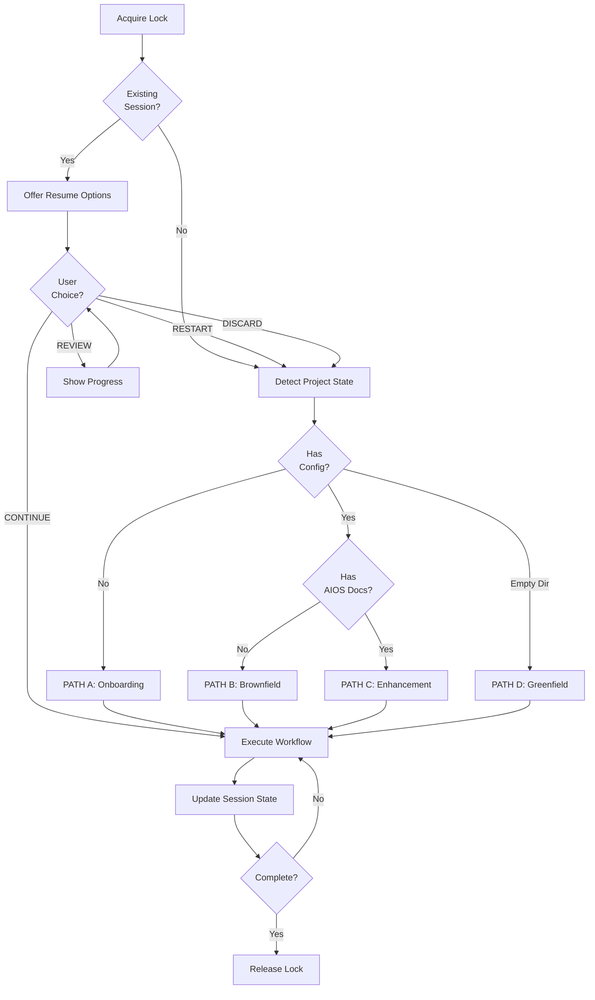

# *orchestrate-project

Main orchestration entry point for Magic BOB. Detects project state automatically and routes to the appropriate workflow (Greenfield, Brownfield, Enhancement, or Onboarding).

## Usage

```bash
@bob-orchestrator

*orchestrate-project
# → Detects state automatically and runs appropriate workflow

*orchestrate-project --goal "Add JWT authentication"
# → Routes to Enhancement workflow with user goal
```

## Parameters

| Parameter | Type | Default | Description |
|-----------|------|---------|-------------|
| `--goal` | string | - | User's stated goal (for Enhancement path) |
| `--story` | path | - | Direct path to story file to execute |
| `--resume` | flag | false | Force resume from existing session |
| `--reset` | flag | false | Discard session and start fresh |

## Flow



## Implementation

### 1. Acquire Orchestration Lock

```javascript
const resource = 'bob-orchestration';
const lockAcquired = await this.lockManager.acquireLock(resource);

if (!lockAcquired) {
  return {
    success: false,
    action: 'lock_failed',
    error: 'Another BOB orchestration is running. Wait or check .aios/locks/'
  };
}
```

### 2. Check Existing Session

```javascript
const sessionExists = await this.sessionState.exists();

if (sessionExists) {
  const sessionCheck = await this._checkExistingSession();

  // Detect crash
  if (sessionCheck.crashInfo.isCrash) {
    return {
      action: 'resume_prompt',
      data: {
        message: '⚠️ Sessão anterior crashou. Recuperar?',
        options: ['CONTINUE', 'RESTART', 'DISCARD']
      }
    };
  }

  // Normal resume
  return {
    action: 'resume_prompt',
    data: {
      message: sessionCheck.formattedMessage,
      options: ['CONTINUE', 'REVIEW', 'RESTART', 'DISCARD']
    }
  };
}
```

### 3. Detect Project State

```javascript
const projectState = this.detectProjectState(this.projectRoot);

// Deterministic decision tree (NO LLM)
switch (projectState) {
  case ProjectState.NO_CONFIG:
    return this._handleOnboarding();

  case ProjectState.EXISTING_NO_DOCS:
    return this._handleBrownfield();

  case ProjectState.EXISTING_WITH_DOCS:
    return this._handleEnhancement();

  case ProjectState.GREENFIELD:
    return this._handleGreenfield();

  default:
    throw new Error(`Unknown project state: ${projectState}`);
}
```

### 4. Route to Workflow

#### PATH A: Onboarding

```javascript
async _handleOnboarding() {
  // Check if AIOS already initialized
  if (this._isAiosInitialized()) {
    return {
      action: 'config_repair',
      message: 'AIOS já foi inicializado mas o config está faltando.'
    };
  }

  return {
    action: 'onboarding',
    message: 'Iniciando setup AIOS...',
    nextStep: 'run_aios_init'
  };
}
```

#### PATH B: Brownfield

```javascript
async _handleBrownfield() {
  // Delegate to BrownfieldHandler
  return this.brownfieldHandler.handle(context);

  // Handler spawns agents in parallel:
  // @architect, @data-engineer, @ux-design, @devops
  // Consolidates analyses → generates architecture.md
}
```

#### PATH C: Enhancement

```javascript
async _handleEnhancement() {
  if (context.storyPath) {
    // Execute specific story
    return this._executeStory(context.storyPath);
  }

  // Ask user what they want to do
  return {
    action: 'ask_objective',
    data: {
      message: 'O que você quer fazer?',
      options: ['feature', 'bug', 'refactor', 'debt']
    }
  };
}
```

#### PATH D: Greenfield

```javascript
async _handleGreenfield() {
  // Delegate to GreenfieldHandler
  return this.greenfieldHandler.handle(context);

  // Handler executes 4 phases:
  // Phase 0: Environment bootstrap
  // Phase 1: Discovery & planning
  // Phase 2: Document sharding (PRD → Epic → Stories)
  // Phase 3: Development cycle
}
```

### 5. Update Session State

At every phase transition:

```javascript
await this.sessionState.recordPhaseChange(
  phase,      // 'validation', 'development', etc.
  storyId,    // '12.3'
  executor    // '@dev'
);
```

### 6. Release Lock

Always release lock, even on error:

```javascript
try {
  const result = await this.orchestrate(context);
  return result;
} catch (error) {
  return { success: false, error: error.message };
} finally {
  await this.lockManager.releaseLock(resource);
}
```

## Output Examples

### Brownfield Detection

```json
{
  "success": true,
  "projectState": "EXISTING_NO_DOCS",
  "action": "brownfield_discovery",
  "data": {
    "message": "🔍 Detectei projeto Brownfield. Executando discovery...",
    "duration": "2-4 horas",
    "phases": [
      "phase_1_analysis",
      "phase_2_consolidation",
      "phase_3_post_discovery"
    ]
  }
}
```

### Enhancement with Story

```json
{
  "success": true,
  "projectState": "EXISTING_WITH_DOCS",
  "action": "story_executed",
  "data": {
    "assignment": {
      "executor": "@dev",
      "quality_gate": "@architect"
    },
    "result": {
      "phases_completed": 6,
      "tests_passed": true,
      "pr_url": "https://github.com/user/repo/pull/42"
    }
  }
}
```

### Session Resume Prompt

```json
{
  "success": true,
  "action": "resume_prompt",
  "data": {
    "message": "Bem-vindo de volta! Você pausou há 2 horas. Epic: Authentication, Story: 12.3, Fase: development",
    "options": ["CONTINUE", "REVIEW", "RESTART", "DISCARD"]
  }
}
```

## Error Handling

| Error | Cause | Resolution |
|-------|-------|------------|
| `lock_failed` | Another BOB running | Wait or check `.aios/locks/` |
| `dependencies_missing` | git/node not found | Install dependencies |
| `insufficient_disk_space` | < 100MB available | Free disk space |
| `session_corrupted` | Invalid session state | Discard and restart |

## Related

- **Agent:** @bob-orchestrator
- **Workflows:** brownfield-discovery.yaml, greenfield-fullstack.yaml, enhancement.yaml
- **Handlers:** brownfield-handler.js, greenfield-handler.js
- **Module:** bob-orchestrator.js (core/)

---

**Reference:** `docs/aios-workflows/bob-orchestrator-workflow.md` for complete workflow specification.
