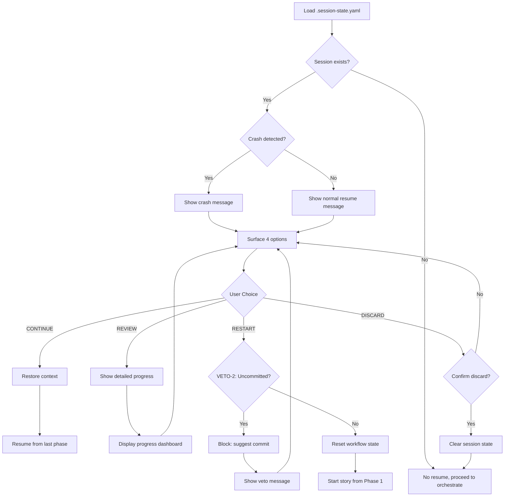

# *session-resume

Handles session recovery when user returns to existing BOB session. Detects crashes, surfaces resume options, and restores workflow context.

## Usage

```bash
# Automatically triggered when user activates @pm with existing session

@pm

# BOB detects session:
Bem-vindo de volta! Você pausou há 2 horas.

Epic: Authentication System
Story: 12.3 - Implement JWT handler
Fase: development (2/6 completas)

O que deseja fazer?
1. 🚀 CONTINUE - Retomar de onde parou
2. 📊 REVIEW - Ver progresso detalhado
3. 🔄 RESTART - Recomeçar story do início
4. 🗑️  DISCARD - Abandonar e começar nova

Sua escolha (1-4):
```

## Flow



## Implementation

### Load and Check Session

```javascript
async _checkExistingSession() {
  const sessionPath = path.join(this.projectRoot, '.aios', '.session-state.yaml');

  if (!fs.existsSync(sessionPath)) {
    return {
      hasSession: false,
    };
  }

  const state = await this.sessionState.load();
  const lastUpdated = new Date(state.last_updated);
  const now = new Date();
  const minutesSinceUpdate = (now - lastUpdated) / 1000 / 60;

  // Crash detection: > 30 minutes inactive
  const isCrash = minutesSinceUpdate > 30;

  return {
    hasSession: true,
    state,
    crashInfo: {
      isCrash,
      minutesSinceUpdate: Math.floor(minutesSinceUpdate),
      lastUpdated: state.last_updated,
    },
    summary: this._formatSessionSummary(state),
  };
}
```

### Format Session Summary

```javascript
_formatSessionSummary(state) {
  const elapsedTime = this._formatElapsedTime(state.last_updated);
  const phasesCompleted = state.workflow?.completed_phases?.length || 0;
  const totalPhases = 6;

  return {
    epic: state.epic?.title || 'Unknown Epic',
    currentStory: state.progress?.current_story || 'Unknown',
    currentPhase: state.workflow?.current_phase || 'Unknown',
    phasesCompleted: `${phasesCompleted}/${totalPhases}`,
    elapsedTime,
    formattedMessage: `
Bem-vindo de volta! Você pausou há ${elapsedTime}.

Epic: ${state.epic?.title}
Story: ${state.progress?.current_story}
Fase: ${state.workflow?.current_phase} (${phasesCompleted}/${totalPhases} completas)

O que deseja fazer?
    `.trim(),
  };
}
```

### Surface Resume Options

```javascript
const surfaceResult = this.surfaceChecker.shouldSurface({
  valid_options_count: 4,
  options_with_tradeoffs: {
    CONTINUE: 'Retomar onde parou (mais rápido)',
    REVIEW: 'Ver progresso detalhado (informação)',
    RESTART: 'Recomeçar story (trabalho perdido se uncommitted)',
    DISCARD: 'Abandonar sessão (novo início)',
  },
});

return {
  action: 'resume_prompt',
  data: {
    message: sessionCheck.summary.formattedMessage,
    options: ['CONTINUE', 'REVIEW', 'RESTART', 'DISCARD'],
    crashInfo: sessionCheck.crashInfo,
  },
};
```

### Handle Resume Option

```javascript
async handleSessionResume(option) {
  const result = await this.sessionState.handleResumeOption(option);

  switch (result.action) {
    case 'continue':
      return {
        success: true,
        action: 'execute_story',
        storyPath: this._resolveStoryPath(result.story),
        resumePhase: result.phase,
        context: result.context,
      };

    case 'review':
      const progress = await this._generateProgressReport();
      return {
        success: true,
        action: 'show_progress',
        data: progress,
      };

    case 'restart':
      // VETO-2: Check for uncommitted work
      const workStatus = await this._checkUncommittedWork(result.story);

      if (workStatus.hasChanges) {
        return {
          success: false,
          action: 'restart_blocked',
          data: {
            vetoCondition: 'uncommitted_changes',
            reason: 'Há trabalho não commitado.',
            filesAffected: workStatus.files,
            fileCount: workStatus.count,
            suggestion: 'Commit ou stash suas mudanças antes de restart.',
          },
        };
      }

      // Clear story progress, keep epic context
      await this.sessionState.resetStory(result.story);

      return {
        success: true,
        action: 'restart',
        storyPath: this._resolveStoryPath(result.story),
        message: `Recomeçando story ${result.story} do início`,
      };

    case 'discard':
      // Confirm before discarding
      const confirmed = await this._confirmDiscard();

      if (!confirmed) {
        // Return to resume prompt
        return { action: 'resume_prompt' };
      }

      await this.sessionState.clear();

      return {
        success: true,
        action: 'session_discarded',
        message: 'Sessão descartada. Iniciando nova...',
      };

    default:
      throw new Error(`Invalid resume option: ${result.action}`);
  }
}
```

### Check Uncommitted Work (VETO-2)

```javascript
async _checkUncommittedWork(storyId) {
  try {
    const { stdout } = await this._execGit('status --porcelain');

    if (!stdout || stdout.trim() === '') {
      return { hasChanges: false };
    }

    const files = stdout
      .trim()
      .split('\n')
      .map(line => line.substring(3)); // Remove status prefix

    return {
      hasChanges: true,
      count: files.length,
      files,
    };
  } catch (error) {
    this._log('Git check failed, assuming no uncommitted work', 'warn');
    return { hasChanges: false };
  }
}
```

## Crash Recovery Messages

### Crash Detected

```
⚠️ Sessão anterior crashou.

Última atualização: há 2 horas
Epic: Authentication System
Story: 12.3 (development)

Seus dados estão seguros. O que deseja fazer?

1. 🚀 CONTINUE - Retomar de onde parou
2. 🔄 RESTART - Recomeçar story do início
3. 🗑️  DISCARD - Abandonar e começar nova

Sua escolha (1-3):
```

### Normal Resume

```
Bem-vindo de volta! Você pausou há 30 minutos.

Epic: Authentication System
Story: 12.3 - Implement JWT handler
Fase: development (2/6 completas)

O que deseja fazer?

1. 🚀 CONTINUE - Retomar de onde parou
2. 📊 REVIEW - Ver progresso detalhado
3. 🔄 RESTART - Recomeçar story do início
4. 🗑️  DISCARD - Abandonar e começar nova

Sua escolha (1-4):
```

## VETO-2: Restart Blocked

```
⚠️ Restart bloqueado

Há 3 arquivo(s) com mudanças não commitadas:
- src/auth/jwt-handler.js
- src/auth/middleware.js
- tests/auth.test.js

Restart reseta o estado do workflow, mas mudanças em disco
permanecem. Há risco de perder contexto de trabalho.

Recomendamos:
1. Commit suas mudanças: git add . && git commit -m "wip"
2. OU stash temporariamente: git stash
3. Depois execute restart novamente

Voltar para menu de resume? [SIM/NÃO]
```

## Error Handling

| Error | Cause | Resolution |
|-------|-------|------------|
| `session_corrupted` | Invalid YAML in .session-state.yaml | Offer DISCARD option |
| `git_check_failed` | Git not available or not a repo | Warn and allow restart anyway |
| `phase_not_found` | Session references invalid phase | Surface error, suggest RESTART |

## Session State Structure

```yaml
# .aios/.session-state.yaml
session_state:
  epic:
    id: epic-12
    title: Authentication System
  progress:
    current_story: 12.3
    completed: [12.1, 12.2]
  workflow:
    current_phase: development
    completed_phases: [validation]
    phase_results:
      validation:
        executor: "@po"
        duration: 10min
        result: approved
  last_updated: "2026-02-15T10:30:00Z"
```

## Related

- **Task:** orchestrate-project.md (calls this when session exists)
- **Task:** checkpoint-story.md (PAUSE creates resumable session)
- **Module:** session-state.js (persistence)
- **Veto:** BOB-VETO-2 (restart protection)

---

**Average Duration:** 1-2 minutes (user decision)
**Crash Detection Threshold:** 30 minutes inactive
