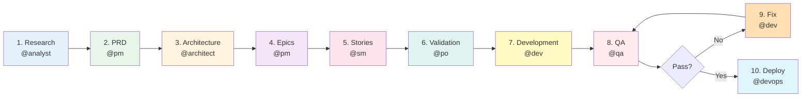
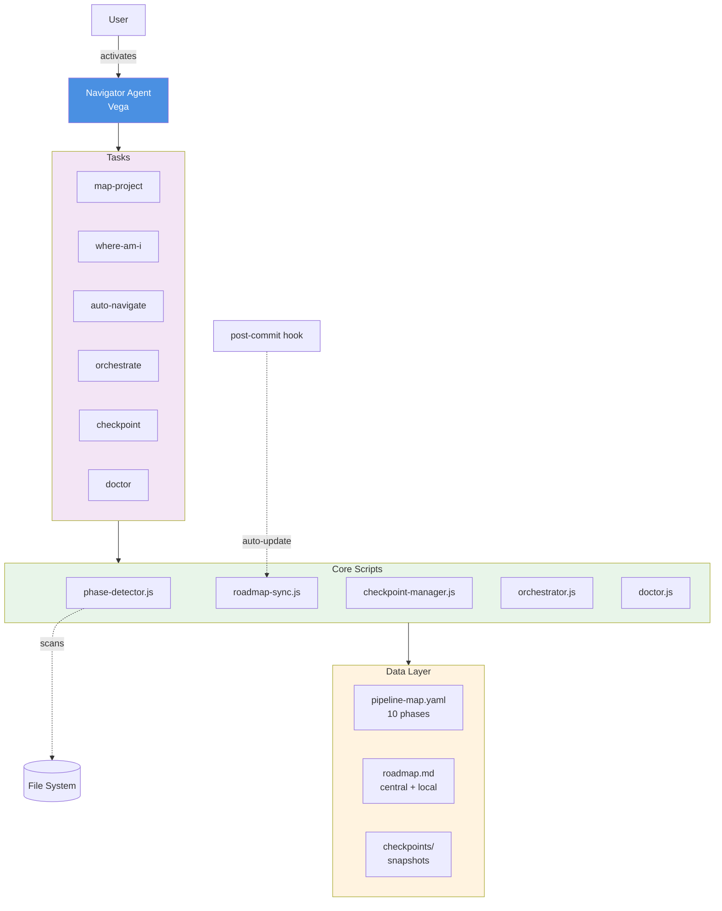
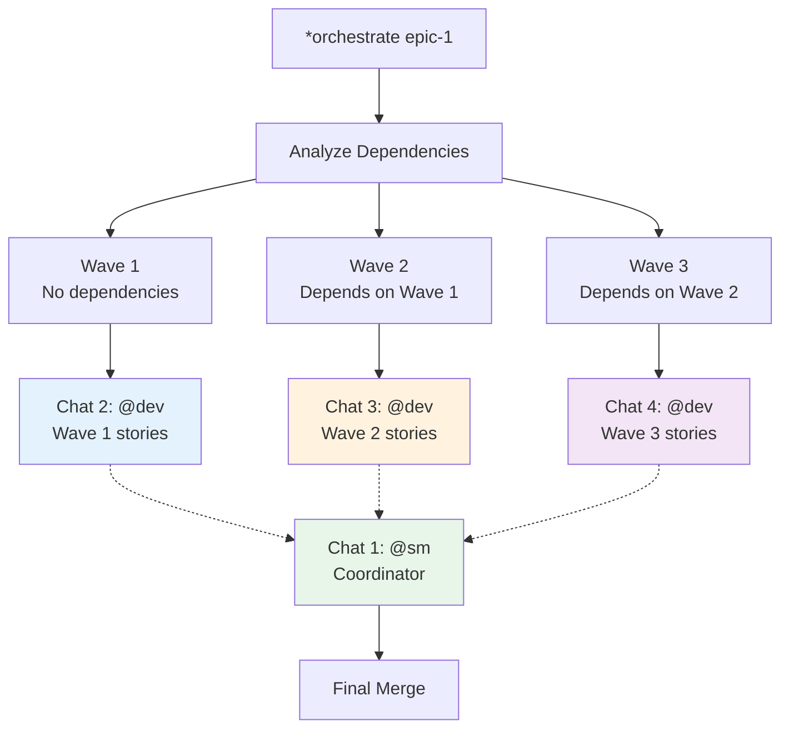

<p align="center">
  
  = 4.0.0" />
  = 18" />
  
</p>

<h1 align="center">🧭 Navigator</h1>

<p align="center">
  <strong>Never lose track of your project again.</strong><br />
  Autonomous project navigation, phase detection, and multi-agent orchestration for AIOS.
</p>

<p align="center">
  <a href="./QUICKSTART.md">Quickstart</a> ·
  <a href="./examples/">Examples</a> ·
  <a href="./FAQ.md">FAQ</a> ·
  <a href="./TROUBLESHOOTING.md">Troubleshooting</a> ·
  <a href="./CONTRIBUTING.md">Contributing</a> ·
  <a href="./CHANGELOG.md">Changelog</a>
</p>

---

## The Problem

Ever returned to a project after a few days and spent **30–60 minutes** figuring out where you left off? Which stories were done, what was in progress, what's blocked?

In multi-agent AI workflows, this gets worse: agents don't share memory across sessions. Context is lost every time you close a chat.

## The Solution

**Navigator** is an autonomous agent that maps your project into a structured roadmap, detects your current phase in real time, creates checkpoints you can restore, and orchestrates multiple agents in parallel — all without you having to manually track anything.

```
You: "Where am I?"

Navigator: 📍 Phase 7 — Development (67% complete)
           ✅ Done: Research, PRD, Architecture, Epics, Stories, Validation
           🔄 Active: Story 7.3 (auth middleware)
           ⏳ Next: Story 7.4 → @dev *develop
           🚫 Blockers: None
```

---

## Key Features

| Feature | What it does |
|---------|-------------|
| **Roadmap Generation** | Describe your project in plain text → get a structured 10-phase roadmap |
| **Phase Detection** | Scans your file system to detect exactly where you are |
| **Autonomous Navigation** | Identifies the next agent + command and delegates automatically |
| **Checkpoints** | Snapshots of project state — restore context in seconds |
| **Multi-Chat Orchestration** | Split an epic across 4 parallel Claude Code chats |
| **Health Diagnostics** | 7-point check to validate your Navigator setup |
| **Git Hook Auto-Update** | Roadmap updates silently on every commit |

---

## How It Works

Navigator follows a **10-phase pipeline** that maps to the AIOS development methodology. Each phase has a designated agent, clear inputs/outputs, and automatic transitions:



Phase detection works by checking which output files exist on disk. No manual tracking needed — Navigator reads the truth directly from your file system.

---

## Quick Start

### 1. Activate Navigator

```bash
@navigator
```

### 2. Check health

```bash
*navigator-doctor
```

```
✓ Node.js v20.x (>= 18.0.0)
✓ Git available
✓ Dependencies installed
✓ Git hooks active
✓ Directory structure valid
✓ Pipeline map valid (10 phases)
✓ Scripts readable

✅ Navigator is healthy! (7/7)
```

### 3. Map a new project

```bash
*map-project
```

Describe your project in free text. Navigator will:
1. Parse entities, workflows, and complexity
2. Ask clarifying questions
3. Generate a dual roadmap (central + local sync)
4. Identify your starting phase

### 4. Navigate

```bash
*where-am-i     # See current phase + progress
*auto-navigate   # Delegate to the next agent automatically
```

That's it. Navigator handles the rest.

> For a complete walkthrough, see the [Quickstart Guide](./QUICKSTART.md).

---

## Commands

| Command | Description | Use when... |
|---------|-------------|-------------|
| `*map-project` | Generate roadmap from project description | Starting a new project |
| `*where-am-i` | Detect current phase, progress %, blockers | Daily check-in or after a break |
| `*show-roadmap` | Display the full roadmap | Need the big picture |
| `*auto-navigate` | Delegate to next agent automatically | Ready to advance |
| `*resume-project` | Restore context from last checkpoint | Returning after days/weeks |
| `*orchestrate {epic}` | Generate multi-chat prompts for parallel work | Large epics (8+ stories) |
| `*checkpoint` | Save a manual snapshot | Before risky operations |
| `*status-report` | Generate a detailed progress report | Team meetings, stakeholder updates |
| `*update-roadmap` | Force roadmap sync | After manual story changes |
| `*navigator-doctor` | Run 7-point health check | Debugging issues |

---

## Architecture



### Core Components

| Component | File | Purpose |
|-----------|------|---------|
| **Phase Detector** | `phase-detector.js` | Scans file system outputs to determine current phase |
| **Roadmap Sync** | `roadmap-sync.js` | Bidirectional sync between central and local roadmap |
| **Checkpoint Manager** | `checkpoint-manager.js` | Creates/loads project state snapshots |
| **Orchestrator** | `orchestrator.js` | Generates multi-chat prompts and delegation commands |
| **Doctor** | `doctor.js` | 7-point health validation |
| **Post-Commit Hook** | `post-commit-hook.js` | Auto-updates roadmap when stories change |

### Data Flow

```
Central Roadmap (.aios/navigator/{project}/roadmap.md)
       ↕  roadmap-sync.js (timestamp-based conflict resolution)
Local Roadmap (docs/roadmap.md)

Triggers:
  - Manual:  *update-roadmap
  - Auto:    post-commit hook (when docs/stories/*.md changes)
```

---

## Examples

### New Fullstack App

Map a project from scratch, navigate through all 10 phases, deploy to production.

```bash
@navigator
*map-project
> "SaaS task manager with real-time collaboration, Kanban board,
   and team analytics. Next.js + Supabase."

# Navigator generates roadmap → start at Phase 1
*auto-navigate
# → Activates @analyst for market research
```

[Full example →](./examples/example-1-new-fullstack-app.md)

### Resume After a Break

Lost context? Get it back in 30 seconds instead of 30 minutes.

```bash
@navigator
*where-am-i

# Output: Phase 5 — Stories (75% complete)
# Last checkpoint: 2026-02-15
# Active: Story 5.8 (payment integration)

*auto-navigate
# → Activates @sm to continue story drafting
```

[Full example →](./examples/example-2-resume-brownfield.md)

### Multi-Chat Parallel Execution

Turn a 36-hour sequential epic into 20 hours of parallel work.

```bash
@navigator
*orchestrate epic-core-features

# Generates 4 prompts:
# Chat 1: @sm coordinator (manages waves)
# Chat 2: @dev Wave 1 (auth + user stories)
# Chat 3: @dev Wave 2 (dashboard stories)
# Chat 4: @dev Wave 3 (API stories)
```

[Full example →](./examples/example-3-multi-chat-epic.md)

---

## Multi-Chat Orchestration

This is Navigator's most powerful feature. It analyzes story dependencies, groups them into parallel waves, and generates ready-to-paste prompts for separate Claude Code sessions:



**Result:** 4 prompts you copy into separate Claude Code windows. Each chat works independently on its wave. The coordinator chat manages handoffs and resolves conflicts.

---

## Checkpoint System

Checkpoints are snapshots of your project state — think of them as "save points" in a game.

```bash
# Create a checkpoint before a risky operation
*checkpoint

# Checkpoint includes:
# - Current phase and completion %
# - All completed stories (with details)
# - Modified files (git diff)
# - Recent commits (last 10)
# - Velocity metrics
```

**Storage:** `.aios/navigator/{project}/checkpoints/`

**Auto-checkpoints:** The post-commit git hook creates checkpoints automatically when a phase transition is detected.

**Restore:** Use `*resume-project` to load the latest checkpoint and restore full context.

---

## Installation

Navigator is included with AIOS Core. After running `npx aios-core install`, it's ready to use.

### Verify

```bash
@navigator
*navigator-doctor
```

### Manual Setup (if health check fails)

```bash
# Install dependencies
npm install js-yaml glob inquirer

# Install git hooks
node squads/navigator/scripts/install-hooks.js

# Verify
*navigator-doctor
```

> For detailed instructions, see [INSTALL.md](./INSTALL.md).

---

## Configuration

### Environment Variables

| Variable | Default | Description |
|----------|---------|-------------|
| `NAVIGATOR_AUTO_MODE` | `false` | Skip interactive confirmations (used by git hooks) |

### Custom Pipeline

Edit `.aios-core/development/data/navigator-pipeline-map.yaml` to customize:

```yaml
phases:
  - id: 1
    name: "Research"
    agent: "analyst"
    icon: "🔍"
    command: "*brainstorm"
    outputs:
      - "docs/research/*.md"
    next_phase: 2
```

You can add, remove, or reorder phases. Navigator adapts automatically.

---

## Project Structure

```
squads/navigator/
├── squad.yaml                    # Squad manifest
├── README.md                     # This file
├── QUICKSTART.md                 # 5-minute setup guide
├── INSTALL.md                    # Detailed installation
├── FAQ.md                        # 40+ answered questions
├── TROUBLESHOOTING.md            # Common problems & fixes
├── CONTRIBUTING.md               # How to contribute
├── CHANGELOG.md                  # Version history
├── agents/
│   └── navigator.md              # Vega persona definition
├── tasks/                        # 10 executable task definitions
│   ├── nav-map-project.md
│   ├── nav-where-am-i.md
│   ├── nav-auto-navigate.md
│   ├── nav-orchestrate.md
│   ├── nav-checkpoint.md
│   ├── nav-resume-project.md
│   ├── nav-status-report.md
│   ├── nav-update-roadmap.md
│   ├── nav-detect-phase.md
│   └── nav-doctor.md
├── scripts/
│   ├── navigator/                # Core engine
│   │   ├── roadmap-sync.js
│   │   ├── phase-detector.js
│   │   ├── checkpoint-manager.js
│   │   ├── orchestrator.js
│   │   ├── doctor.js
│   │   └── post-commit-hook.js
│   └── install-hooks.js
├── templates/                    # Mustache-style templates
│   ├── nav-roadmap-tmpl.md
│   ├── nav-checkpoint-tmpl.md
│   ├── nav-status-report-tmpl.md
│   └── nav-orchestration-tmpl.md
├── checklists/                   # Validation checklists
│   ├── checkpoint-validation.md
│   ├── roadmap-validation.md
│   └── orchestration-validation.md
├── workflows/                    # Multi-step workflows (YAML)
├── data/
│   └── navigator-pipeline-map.yaml
└── examples/                     # Practical tutorials
    ├── example-1-new-fullstack-app.md
    ├── example-2-resume-brownfield.md
    ├── example-3-multi-chat-epic.md
    └── example-roadmap.md
```

---

## When to Use Navigator

| Scenario | Navigator Command |
|----------|------------------|
| Starting a new project | `*map-project` |
| Lost track of where I am | `*where-am-i` |
| Returning after a break | `*resume-project` |
| Ready to advance to next phase | `*auto-navigate` |
| Large epic, want parallel execution | `*orchestrate {epic}` |
| Before a risky refactor | `*checkpoint` |
| Need a progress report | `*status-report` |
| Something seems broken | `*navigator-doctor` |

### When NOT to Use Navigator

| Need | Use Instead |
|------|-------------|
| Write code | `@dev` |
| Create a PRD | `@pm` |
| Design architecture | `@architect` |
| Run tests | `@qa` |
| Push to remote | `@devops` |

Navigator **orchestrates** — it doesn't execute. It tells you (or the right agent) what to do next.

---

## FAQ Highlights

**Q: Does Navigator work with existing projects?**
A: Yes. Run `*where-am-i` and Navigator will detect your current phase by scanning file outputs. No prior setup needed.

**Q: What if my project doesn't follow the 10-phase pipeline?**
A: Edit `navigator-pipeline-map.yaml` to match your workflow. You can add, remove, or reorder phases.

**Q: Can I use Navigator without AIOS agents?**
A: Navigator generates commands for AIOS agents, but the roadmap, checkpoints, and phase detection work standalone.

**Q: Is data stored remotely?**
A: No. Everything is local — `.aios/navigator/` in your project root. Nothing leaves your machine.

> [Full FAQ with 40+ questions →](./FAQ.md)

---

## Contributing

We welcome contributions! Whether it's fixing a bug, adding a feature, or improving docs.

```bash
# 1. Fork and clone
git clone https://github.com/SynkraAI/aios-core.git

# 2. Create a branch
git checkout -b feat/navigator-improvement

# 3. Make changes and test
@navigator
*navigator-doctor

# 4. Submit a PR
```

> [Contributing Guide →](./CONTRIBUTING.md)

---

## Roadmap

### v1.0 (Current)
- [x] 10-phase pipeline with auto-detection
- [x] Bidirectional roadmap sync
- [x] Checkpoint system
- [x] Multi-chat orchestration
- [x] Git hook auto-updates
- [x] Health diagnostics (7 checks)
- [x] 17 passing tests

### v2.0 (Planned)
- [ ] Visual roadmap in AIOS Dashboard
- [ ] Checkpoint restore (full state recovery)
- [ ] Agent spawning (auto-delegate without copy-paste)
- [ ] Multi-project tracking
- [ ] Session persistence across chats
- [ ] Custom pipeline templates marketplace

---

## License

MIT License — See [LICENSE](../../LICENSE) in the aios-core repository.

---

## Support

- **Issues:** [github.com/SynkraAI/aios-core/issues](https://github.com/SynkraAI/aios-core/issues)
- **Discussions:** [github.com/SynkraAI/aios-core/discussions](https://github.com/SynkraAI/aios-core/discussions)
- **Health Check:** `*navigator-doctor`
- **Docs:** [QUICKSTART](./QUICKSTART.md) · [FAQ](./FAQ.md) · [TROUBLESHOOTING](./TROUBLESHOOTING.md)

---

<p align="center">
  <strong>Navigator Squad</strong> — Never lose track of your project again 🧭<br />
  <sub>Crafted with care by the <a href="https://github.com/SynkraAI">AIOS community</a></sub>
</p>
