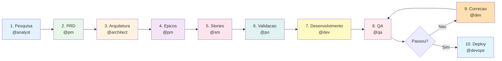
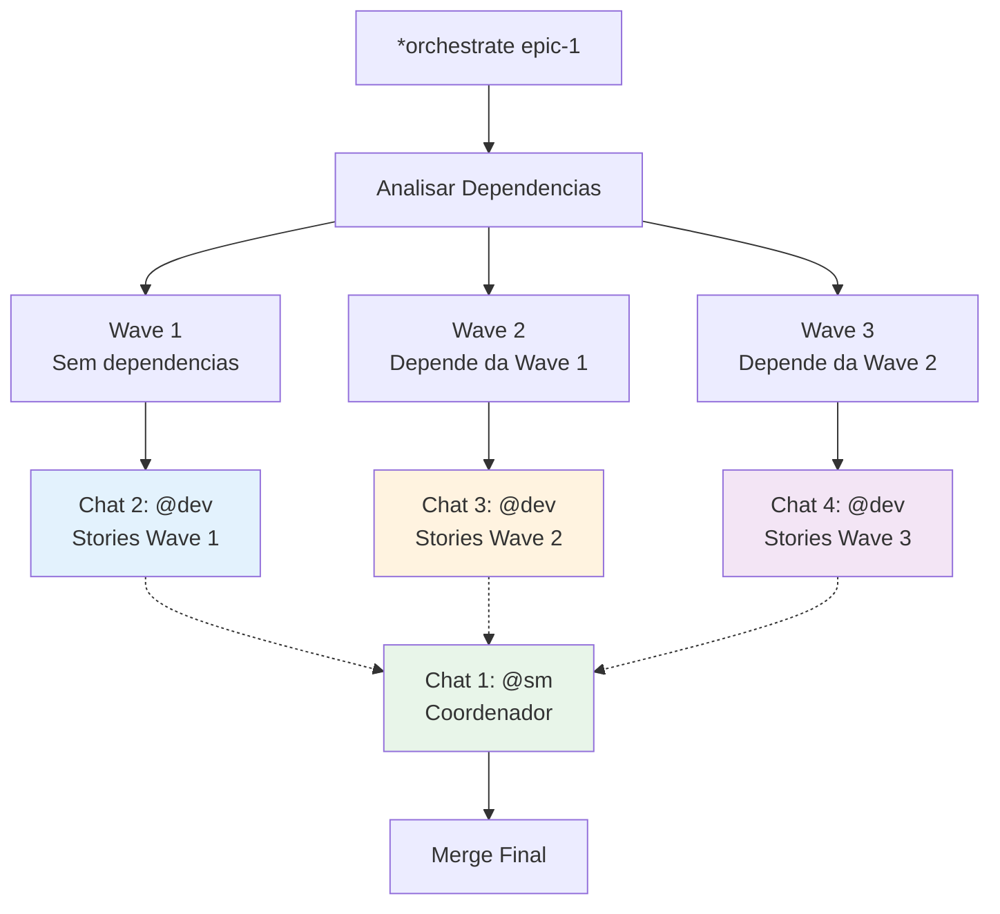

<p align="center">
  
  = 4.0.0" />
  = 18" />
  
</p>

<h1 align="center">🧭 Navigator</h1>

<p align="center">
  <strong>Nunca mais perca o fio do seu projeto.</strong><br />
  Navegacao autonoma, deteccao de fase e orquestracao multi-agente para AIOS.
</p>

<p align="center">
  <em>by <a href="https://github.com/luizfosc">Luiz Fosc</a></em>
</p>

<p align="center">
  <a href="./QUICKSTART.md">Quickstart</a> ·
  <a href="./examples/">Exemplos</a> ·
  <a href="./FAQ.md">FAQ</a> ·
  <a href="./TROUBLESHOOTING.md">Troubleshooting</a> ·
  <a href="./CONTRIBUTING.md">Contributing</a> ·
  <a href="./CHANGELOG.md">Changelog</a>
</p>

---

## O Problema

Tudo que fazemos com agentes de IA depende de uma **janela de contexto finita**. Em projetos pequenos, tudo bem. Mas em projetos reais — com dezenas de stories, tracks paralelos, multiplos agentes — a janela estoura. E quando a sessao acaba, **o contexto morre junto**.

Voce volta no dia seguinte e gasta 30-60 minutos reconstruindo onde parou. Qual story estava em andamento, o que estava bloqueado, qual o proximo passo. Multiplica isso por semanas e o custo e absurdo — em tempo, em tokens, em energia mental.

A gente fala de multi-agent e orquestracao, mas nada disso funciona de verdade se **ninguem lembra o estado do projeto entre sessoes**.

## A Solucao

**Navigator** nao tenta expandir a janela de contexto — ele **elimina a dependencia dela**. O estado do projeto vive no file system, nao na memoria do modelo.

Ele mapeia seu projeto em um roadmap estruturado, detecta sua fase atual em tempo real escaneando o disco, cria checkpoints que voce pode restaurar, e orquestra multiplos agentes em paralelo — tudo sem tracking manual.

```
Voce: "Onde eu estou?"

Navigator: 📍 Fase 7 — Desenvolvimento (67% completo)
           ✅ Feito: Pesquisa, PRD, Arquitetura, Epicos, Stories, Validacao
           🔄 Ativa: Story 7.3 (auth middleware)
           ⏳ Proximo: Story 7.4 → @dev *develop
           🚫 Blockers: Nenhum
```

---

## Funcionalidades

| Funcionalidade | O que faz |
|----------------|-----------|
| **Geracao de Roadmap** | Descreva seu projeto em texto livre → receba um roadmap estruturado de 10 fases |
| **Deteccao de Fase** | Escaneia o file system pra detectar exatamente onde voce esta |
| **Navegacao Autonoma** | Identifica o proximo agente + comando e delega automaticamente |
| **Checkpoints** | Snapshots do estado do projeto — restaure contexto em segundos |
| **Orquestracao Multi-Chat** | Divida um epic em 4 chats paralelos do Claude Code |
| **Diagnostico de Saude** | 7 verificacoes pra validar o setup do Navigator |
| **Auto-Update via Git Hook** | Roadmap atualiza silenciosamente a cada commit |

---

## Como Funciona

O Navigator segue um **pipeline de 10 fases** mapeado para a metodologia AIOS. Cada fase tem um agente designado, inputs/outputs claros, e transicoes automaticas:



A deteccao de fase funciona verificando quais arquivos de output existem no disco. Sem tracking manual — o Navigator le a verdade direto do file system.

---

## Inicio Rapido

### 1. Ativar o Navigator

```bash
@navigator
```

### 2. Verificar saude

```bash
*navigator-doctor
```

```
✓ Node.js v20.x (>= 18.0.0)
✓ Git disponivel
✓ Dependencias instaladas
✓ Git hooks ativos
✓ Estrutura de diretorios valida
✓ Pipeline map valido (10 fases)
✓ Scripts legiveis

✅ Navigator saudavel! (7/7)
```

### 3. Mapear um novo projeto

```bash
*map-project
```

Descreva seu projeto em texto livre. O Navigator vai:
1. Extrair entidades, workflows e complexidade
2. Fazer perguntas de esclarecimento
3. Gerar um roadmap dual (central + local sincronizados)
4. Identificar sua fase inicial

### 4. Navegar

```bash
*where-am-i     # Ver fase atual + progresso
*auto-navigate   # Delegar pro proximo agente automaticamente
```

So isso. O Navigator cuida do resto.

> Para um passo-a-passo completo, veja o [Quickstart Guide](./QUICKSTART.md).

---

## Comandos

| Comando | Descricao | Quando usar |
|---------|-----------|-------------|
| `*map-project` | Gerar roadmap a partir de descricao do projeto | Iniciando um novo projeto |
| `*where-am-i` | Detectar fase atual, progresso %, blockers | Check-in diario ou apos uma pausa |
| `*show-roadmap` | Exibir o roadmap completo | Precisa da visao geral |
| `*auto-navigate` | Delegar pro proximo agente automaticamente | Pronto pra avancar |
| `*resume-project` | Restaurar contexto do ultimo checkpoint | Voltando apos dias/semanas |
| `*orchestrate {epic}` | Gerar prompts multi-chat pra trabalho paralelo | Epics grandes (8+ stories) |
| `*checkpoint` | Salvar snapshot manual | Antes de operacoes arriscadas |
| `*status-report` | Gerar relatorio detalhado de progresso | Reunioes de time, updates pra stakeholders |
| `*update-roadmap` | Forcar sincronizacao do roadmap | Apos mudancas manuais nas stories |
| `*navigator-doctor` | Executar health check de 7 pontos | Debugando problemas |

---

## Arquitetura


### Componentes Core

| Componente | Arquivo | Proposito |
|------------|---------|-----------|
| **Phase Detector** | `phase-detector.js` | Escaneia outputs do file system pra determinar fase atual |
| **Roadmap Sync** | `roadmap-sync.js` | Sincronizacao bidirecional entre roadmap central e local |
| **Checkpoint Manager** | `checkpoint-manager.js` | Cria/carrega snapshots de estado do projeto |
| **Orchestrator** | `orchestrator.js` | Gera prompts multi-chat e comandos de delegacao |
| **Doctor** | `doctor.js` | Validacao de saude em 7 pontos |
| **Post-Commit Hook** | `post-commit-hook.js` | Auto-atualiza roadmap quando stories mudam |

### Fluxo de Dados

```
Roadmap Central (.aios/navigator/{projeto}/roadmap.md)
       ↕  roadmap-sync.js (resolucao de conflito por timestamp)
Roadmap Local (docs/roadmap.md)

Gatilhos:
  - Manual:  *update-roadmap
  - Auto:    post-commit hook (quando docs/stories/*.md muda)
```

---

## Exemplos

### Novo App Fullstack

Mapeie um projeto do zero, navegue pelas 10 fases, faca deploy em producao.

```bash
@navigator
*map-project
> "SaaS de gerenciamento de tarefas com colaboracao em tempo real,
   Kanban board e analytics de time. Next.js + Supabase."

# Navigator gera roadmap → comeca na Fase 1
*auto-navigate
# → Ativa @analyst pra pesquisa de mercado
```

[Exemplo completo →](./examples/example-1-new-fullstack-app.md)

### Retomar Apos Uma Pausa

Perdeu o contexto? Recupere em 30 segundos ao inves de 30 minutos.

```bash
@navigator
*where-am-i

# Output: Fase 5 — Stories (75% completo)
# Ultimo checkpoint: 2026-02-15
# Ativa: Story 5.8 (integracao de pagamento)

*auto-navigate
# → Ativa @sm pra continuar drafting de stories
```

[Exemplo completo →](./examples/example-2-resume-brownfield.md)

### Execucao Paralela Multi-Chat

Transforme um epic de 36 horas sequenciais em 20 horas de trabalho paralelo.

```bash
@navigator
*orchestrate epic-core-features

# Gera 4 prompts:
# Chat 1: @sm coordenador (gerencia waves)
# Chat 2: @dev Wave 1 (stories de auth + usuario)
# Chat 3: @dev Wave 2 (stories de dashboard)
# Chat 4: @dev Wave 3 (stories de API)
```

[Exemplo completo →](./examples/example-3-multi-chat-epic.md)

---

## Orquestracao Multi-Chat

A feature mais poderosa do Navigator. Ele analisa dependencias entre stories, agrupa em waves paralelas, e gera prompts prontos pra colar em sessoes separadas do Claude Code:



**Resultado:** 4 prompts que voce copia em janelas separadas do Claude Code. Cada chat trabalha independentemente na sua wave. O chat coordenador gerencia handoffs e resolve conflitos.

---

## Sistema de Checkpoints

Checkpoints sao snapshots do estado do seu projeto — pense neles como "save points" de um jogo.

```bash
# Criar checkpoint antes de uma operacao arriscada
*checkpoint

# O checkpoint inclui:
# - Fase atual e % de completude
# - Todas stories completadas (com detalhes)
# - Arquivos modificados (git diff)
# - Commits recentes (ultimos 10)
# - Metricas de velocidade
```

**Storage:** `.aios/navigator/{projeto}/checkpoints/`

**Auto-checkpoints:** O git hook post-commit cria checkpoints automaticamente quando detecta transicao de fase.

**Restaurar:** Use `*resume-project` pra carregar o ultimo checkpoint e restaurar contexto completo.

---

## Instalacao

O Navigator ja vem incluso no AIOS Core. Apos rodar `npx aios-core install`, esta pronto pra uso.

### Verificar

```bash
@navigator
*navigator-doctor
```

### Setup Manual (se o health check falhar)

```bash
# Instalar dependencias
npm install js-yaml glob inquirer

# Instalar git hooks
node squads/navigator/scripts/install-hooks.js

# Verificar
*navigator-doctor
```

> Para instrucoes detalhadas, veja [INSTALL.md](./INSTALL.md).

---

## Configuracao

### Variaveis de Ambiente

| Variavel | Padrao | Descricao |
|----------|--------|-----------|
| `NAVIGATOR_AUTO_MODE` | `false` | Pula confirmacoes interativas (usado pelo git hook) |

### Pipeline Customizado

Edite `.aios-core/development/data/navigator-pipeline-map.yaml` pra customizar:

```yaml
phases:
  - id: 1
    name: "Pesquisa"
    agent: "analyst"
    icon: "🔍"
    command: "*brainstorm"
    outputs:
      - "docs/research/*.md"
    next_phase: 2
```

Voce pode adicionar, remover ou reordenar fases. O Navigator se adapta automaticamente.

---

## Estrutura do Projeto

```
squads/navigator/
├── squad.yaml                    # Manifesto do squad
├── README.md                     # Este arquivo
├── QUICKSTART.md                 # Guia de 5 minutos
├── INSTALL.md                    # Instalacao detalhada
├── FAQ.md                        # 40+ perguntas respondidas
├── TROUBLESHOOTING.md            # Problemas comuns e solucoes
├── CONTRIBUTING.md               # Como contribuir
├── CHANGELOG.md                  # Historico de versoes
├── agents/
│   └── navigator.md              # Definicao da persona Vega
├── tasks/                        # 10 definicoes de tasks executaveis
│   ├── nav-map-project.md
│   ├── nav-where-am-i.md
│   ├── nav-auto-navigate.md
│   ├── nav-orchestrate.md
│   ├── nav-checkpoint.md
│   ├── nav-resume-project.md
│   ├── nav-status-report.md
│   ├── nav-update-roadmap.md
│   ├── nav-detect-phase.md
│   └── nav-doctor.md
├── scripts/
│   ├── navigator/                # Engine core
│   │   ├── roadmap-sync.js
│   │   ├── phase-detector.js
│   │   ├── checkpoint-manager.js
│   │   ├── orchestrator.js
│   │   ├── doctor.js
│   │   └── post-commit-hook.js
│   └── install-hooks.js
├── templates/                    # Templates estilo Mustache
│   ├── nav-roadmap-tmpl.md
│   ├── nav-checkpoint-tmpl.md
│   ├── nav-status-report-tmpl.md
│   └── nav-orchestration-tmpl.md
├── checklists/                   # Checklists de validacao
│   ├── checkpoint-validation.md
│   ├── roadmap-validation.md
│   └── orchestration-validation.md
├── workflows/                    # Workflows multi-step (YAML)
├── data/
│   └── navigator-pipeline-map.yaml
└── examples/                     # Tutoriais praticos
    ├── example-1-new-fullstack-app.md
    ├── example-2-resume-brownfield.md
    ├── example-3-multi-chat-epic.md
    └── example-roadmap.md
```

---

## Quando Usar o Navigator

| Cenario | Comando |
|---------|---------|
| Iniciando um novo projeto | `*map-project` |
| Perdi a nocao de onde estou | `*where-am-i` |
| Voltando apos uma pausa | `*resume-project` |
| Pronto pra avancar de fase | `*auto-navigate` |
| Epic grande, quero paralelizar | `*orchestrate {epic}` |
| Antes de um refactor arriscado | `*checkpoint` |
| Preciso de um relatorio de progresso | `*status-report` |
| Algo parece quebrado | `*navigator-doctor` |

### Quando NAO Usar o Navigator

| Necessidade | Use |
|-------------|-----|
| Escrever codigo | `@dev` |
| Criar um PRD | `@pm` |
| Projetar arquitetura | `@architect` |
| Rodar testes | `@qa` |
| Push pro remote | `@devops` |

O Navigator **orquestra** — ele nao executa. Ele diz pra voce (ou pro agente certo) qual o proximo passo.

---

## FAQ - Destaques

**P: O Navigator funciona com projetos existentes?**
R: Sim. Rode `*where-am-i` e o Navigator detecta sua fase atual escaneando os outputs dos arquivos. Nenhum setup previo necessario.

**P: E se meu projeto nao segue o pipeline de 10 fases?**
R: Edite `navigator-pipeline-map.yaml` pra encaixar no seu workflow. Voce pode adicionar, remover ou reordenar fases.

**P: Posso usar o Navigator sem os agentes AIOS?**
R: O Navigator gera comandos pra agentes AIOS, mas o roadmap, checkpoints e deteccao de fase funcionam standalone.

**P: Os dados sao armazenados remotamente?**
R: Nao. Tudo e local — `.aios/navigator/` na raiz do seu projeto. Nada sai da sua maquina.

> [FAQ completo com 40+ perguntas →](./FAQ.md)

---

## Contribuindo

Contribuicoes sao bem-vindas! Seja corrigindo um bug, adicionando uma feature, ou melhorando a documentacao.

```bash
# 1. Fork e clone
git clone https://github.com/SynkraAI/aios-core.git

# 2. Crie uma branch
git checkout -b feat/navigator-melhoria

# 3. Faca suas mudancas e teste
@navigator
*navigator-doctor

# 4. Envie um PR
```

> [Guia de Contribuicao →](./CONTRIBUTING.md)

---

## Roadmap

### v1.0 (Atual)
- [x] Pipeline de 10 fases com auto-deteccao
- [x] Sincronizacao bidirecional de roadmap
- [x] Sistema de checkpoints
- [x] Orquestracao multi-chat
- [x] Auto-update via git hook
- [x] Diagnostico de saude (7 checks)
- [x] 17 testes passando

### v2.0 (Planejado)
- [ ] Roadmap visual no AIOS Dashboard
- [ ] Restore de checkpoint (recuperacao completa de estado)
- [ ] Agent spawning (delegacao automatica sem copy-paste)
- [ ] Tracking multi-projeto
- [ ] Persistencia de sessao entre chats
- [ ] Marketplace de templates de pipeline customizados

---

## Licenca

MIT License — Veja [LICENSE](../../LICENSE) no repositorio aios-core.

---

## Suporte

- **Issues:** [github.com/SynkraAI/aios-core/issues](https://github.com/SynkraAI/aios-core/issues)
- **Discussoes:** [github.com/SynkraAI/aios-core/discussions](https://github.com/SynkraAI/aios-core/discussions)
- **Health Check:** `*navigator-doctor`
- **Docs:** [QUICKSTART](./QUICKSTART.md) · [FAQ](./FAQ.md) · [TROUBLESHOOTING](./TROUBLESHOOTING.md)

---

<p align="center">
  <strong>Navigator Squad</strong> — Nunca mais perca o fio do seu projeto 🧭<br />
  <sub>by <a href="https://github.com/luizfosc">Luiz Fosc</a></sub>
</p>
