# 🧭 Navigator Squad


**Version:** 1.0.0
**Author:** Craft (@squad-creator) + Luiz Fosc
**License:** MIT
**AIOS Min Version:** 4.0.0

---

## 📚 Quick Links

- [🚀 Quickstart Guide](./QUICKSTART.md) - Get started in 5 minutes
- [❓ FAQ](./FAQ.md) - Common questions answered
- [🔧 Troubleshooting](./TROUBLESHOOTING.md) - Solutions to common problems
- [💡 Examples](./examples/) - Practical tutorials
- [🤝 Contributing](./CONTRIBUTING.md) - How to contribute
- [📝 Changelog](./CHANGELOG.md) - Version history

---

## Overview

Navigator is an autonomous project navigation and orchestration squad for AIOS. It prevents losing track in complex projects by automatically mapping roadmaps, detecting current phase, and orchestrating multi-agent workflows.

**Key Features:**
- 🗺️ Automatic roadmap generation from project descriptions
- 📍 Real-time phase detection based on file outputs
- 🤖 Autonomous navigation with agent delegation
- 📊 Progress tracking and checkpoint snapshots
- 🎭 Multi-chat orchestration for parallel execution
- 🏥 Health diagnostics with `*navigator-doctor`

---

## When to Use

Use Navigator when:
- Starting a new project and need a roadmap
- Lost track of where you are in development
- Resuming work after a break (context lost)
- Need to orchestrate multiple agents in parallel
- Generate progress reports for stakeholders

**Not for:**
- Code implementation → Use @dev
- PRD creation → Use @pm
- Architecture definition → Use @architect

---

## Quick Start

### 1. Activate Navigator

```bash
@navigator
```

### 2. Map Your Project

```bash
*map-project
```

Describe your project in free-form text, and Navigator will:
- Ask clarifying questions
- Generate a customized 10-phase roadmap
- Identify starting point

### 3. Check Your Position

```bash
*where-am-i
```

Navigator shows:
- Current phase and progress %
- Completed phases
- Active stories
- Next steps and blockers

### 4. Auto-Navigate

```bash
*auto-navigate
```

Navigator automatically:
- Detects next agent to delegate
- Creates checkpoint before major transitions
- Provides activation command

---

## Components

### Agents (1)
- **navigator** (Vega) - Cartógrafo persona, systematic guide

### Tasks (10)
- `*map-project` - Map new project (hybrid input)
- `*where-am-i` - Detect current phase
- `*show-roadmap` - Visualize complete roadmap
- `*resume-project` - Resume existing project
- `*auto-navigate` - Autonomous navigation
- `*orchestrate` - Multi-chat orchestration setup
- `*checkpoint` - Create manual checkpoint
- `*status-report` - Generate status report
- `*update-roadmap` - Update roadmap manually
- `*navigator-doctor` - Health check & diagnostics

### Scripts (6)
- `roadmap-sync.js` - Bidirectional roadmap synchronization
- `phase-detector.js` - Phase detection from file outputs
- `checkpoint-manager.js` - Checkpoint creation and restoration
- `orchestrator.js` - Multi-agent orchestration
- `post-commit-hook.js` - Git hook for auto-updates
- `doctor.js` - Health check with 7 validations

### Templates (4)
- `nav-roadmap-tmpl.md` - Roadmap template with Mustache vars
- `nav-checkpoint-tmpl.md` - Checkpoint snapshot template
- `nav-status-report-tmpl.md` - Status report template
- `nav-orchestration-tmpl.md` - Multi-chat orchestration prompts

### Data (1)
- `navigator-pipeline-map.yaml` - 10-phase AIOS pipeline definition

---

## Architecture

### Pipeline Phases

Navigator uses a 10-phase pipeline based on AIOS methodology:

1. **Pesquisa** (@analyst) - Market research, competitive analysis
2. **PRD** (@pm) - Product Requirements Document
3. **Arquitetura** (@architect) - Technical architecture
4. **Épicos** (@pm) - Epic creation and breakdown
5. **Stories** (@sm) - User story creation
6. **Validação** (@po) - Story validation
7. **Desenvolvimento** (@dev) - Code implementation
8. **QA & Testes** (@qa) - Quality assurance
9. **Fix Loop** (@dev) - Fix QA issues
10. **Deploy** (@devops) - Git push and deployment

### Phase Detection

Navigator detects the current phase by:
1. Checking output files for each phase (glob patterns)
2. Parsing story status from front-matter YAML
3. Calculating completion % based on outputs
4. Identifying blockers (missing inputs)

### Roadmap Sync

Bidirectional synchronization between:
- **Central:** `.aios/navigator/{project}/roadmap.md`
- **Local:** `docs/roadmap.md`

Conflict resolution:
- Timestamp comparison (newer wins)
- Interactive confirmation in manual mode
- Auto-mode for git hooks

---

## Visual Architecture

### Navigator Component Diagram

```mermaid
graph TB
    User[👤 User] -->|activates| Agent[🧭 Navigator Agent]
    Agent -->|executes| Tasks[📋 Tasks]

    Tasks --> MapProject[*map-project]
    Tasks --> WhereAmI[*where-am-i]
    Tasks --> AutoNav[*auto-navigate]
    Tasks --> Orchestrate[*orchestrate]
    Tasks --> Doctor[*navigator-doctor]

    MapProject --> Scripts
    WhereAmI --> Scripts
    AutoNav --> Scripts
    Orchestrate --> Scripts

    subgraph Scripts [🔧 Core Scripts]
        PhaseDetect[phase-detector.js]
        RoadmapSync[roadmap-sync.js]
        CheckpointMgr[checkpoint-manager.js]
        Orchestrator[orchestrator.js]
        DoctorScript[doctor.js]
    end

    Scripts --> Data[📊 Data Layer]

    subgraph Data [📊 Data Layer]
        Pipeline[navigator-pipeline-map.yaml]
        Roadmap[.aios/navigator/{project}/roadmap.md]
        Checkpoints[.aios/navigator/{project}/checkpoints/]
    end

    Scripts --> Templates[📄 Templates]

    subgraph Templates [📄 Templates]
        RoadmapTmpl[nav-roadmap-tmpl.md]
        CheckpointTmpl[nav-checkpoint-tmpl.md]
        StatusTmpl[nav-status-report-tmpl.md]
        OrchTmpl[nav-orchestration-tmpl.md]
    end

    PhaseDetect -.->|reads| Roadmap
    PhaseDetect -.->|checks| FileSystem[(File System)]
    CheckpointMgr -.->|writes| Checkpoints
    RoadmapSync -.->|syncs| LocalRoadmap[docs/roadmap.md]

    style Agent fill:#4A90E2
    style Scripts fill:#E8F5E9
    style Data fill:#FFF3E0
    style Templates fill:#F3E5F5
```

### AIOS 10-Phase Pipeline

```mermaid
graph LR
    Start([🚀 Start]) --> P1

    P1[1️⃣ Pesquisa<br/>@analyst] --> P2[2️⃣ PRD<br/>@pm]
    P2 --> P3[3️⃣ Arquitetura<br/>@architect]
    P3 --> P4[4️⃣ Épicos<br/>@pm]
    P4 --> P5[5️⃣ Stories<br/>@sm]
    P5 --> P6[6️⃣ Validação<br/>@po]
    P6 --> P7[7️⃣ Desenvolvimento<br/>@dev]
    P7 --> P8[8️⃣ QA & Testes<br/>@qa]
    P8 --> P9{Tests Pass?}

    P9 -->|❌ No| P9Loop[9️⃣ Fix Loop<br/>@dev]
    P9Loop --> P8

    P9 -->|✅ Yes| P10[🔟 Deploy<br/>@devops]
    P10 --> End([🎉 Complete])

    style P1 fill:#E3F2FD
    style P2 fill:#E8F5E9
    style P3 fill:#FFF3E0
    style P4 fill:#F3E5F5
    style P5 fill:#FCE4EC
    style P6 fill:#E0F2F1
    style P7 fill:#FFF9C4
    style P8 fill:#FFEBEE
    style P9Loop fill:#FFE0B2
    style P10 fill:#E1F5FE
```



### Phase Detection Algorithm


### Checkpoint Workflow


### Multi-Chat Orchestration Flow

```mermaid
graph TB
    User[👤 User] -->|runs| Orchestrate[*orchestrate epic-1]

    Orchestrate --> LoadEpic[Load epic file<br/>with stories]
    LoadEpic --> AnalyzeDeps[Analyze story<br/>dependencies]

    AnalyzeDeps --> Wave1[🌊 Wave 1<br/>No dependencies]
    AnalyzeDeps --> Wave2[🌊 Wave 2<br/>Depends on Wave 1]
    AnalyzeDeps --> Wave3[🌊 Wave 3<br/>Depends on Wave 2]

    Wave1 --> GenPrompts[Generate 4 prompts]
    Wave2 --> GenPrompts
    Wave3 --> GenPrompts

    GenPrompts --> Chat1[💬 Chat 1: Coordinator<br/>@sm manages waves]
    GenPrompts --> Chat2[💬 Chat 2: Dev Wave 1<br/>@dev executes stories]
    GenPrompts --> Chat3[💬 Chat 3: Dev Wave 2<br/>@dev executes stories]
    GenPrompts --> Chat4[💬 Chat 4: Dev Wave 3<br/>@dev executes stories]

    Chat2 -.->|Wave 1 complete| Chat1
    Chat1 -.->|Approve Wave 2| Chat3
    Chat3 -.->|Wave 2 complete| Chat1
    Chat1 -.->|Approve Wave 3| Chat4
    Chat4 -.->|Wave 3 complete| Chat1

    Chat1 --> FinalMerge[🔀 Final merge<br/>& conflict resolution]
    FinalMerge --> Complete([✅ Epic complete])

    style Chat1 fill:#E8F5E9
    style Chat2 fill:#E3F2FD
    style Chat3 fill:#FFF3E0
    style Chat4 fill:#F3E5F5
    style Wave1 fill:#C8E6C9
    style Wave2 fill:#FFECB3
    style Wave3 fill:#FFCCBC
```



---

## Installation

### Prerequisites

- AIOS project initialized (`.aios-core/` exists)
- Node.js >= 18.0.0
- Git
- NPM packages: `js-yaml`, `glob`, `inquirer`

### Install Squad

```bash
# Option 1: From local squads/
# (Already available if you cloned aios-core)

# Option 2: Download from aios-squads repository (future)
# npx aios-core download-squad navigator

# Option 3: Install from Synkra API (future)
# npx aios-core install-squad navigator --source synkra
```

### Verify Installation

```bash
@navigator
*navigator-doctor
```

Should show:
```
✅ Navigator is healthy!
7/7 checks passed
```

---

## Usage Examples

### Example 1: New E-commerce Project

```bash
@navigator
*map-project

# Describe: "E-commerce platform with order management,
# inventory tracking, and payment integration"

# Navigator generates roadmap and saves to:
# .aios/navigator/ecommerce-platform/roadmap.md
```

### Example 2: Resume After Break

```bash
@navigator
*where-am-i

# Output:
# Fase Atual: 5 — Stories (67% completo)
# Próximo: @sm *draft
# Blockers: Nenhum
```

### Example 3: Multi-Chat Orchestration

```bash
@navigator
*orchestrate epic-1

# Generates prompts for:
# - Chat 1: @sm (coordinator)
# - Chat 2: @dev (Wave 1 stories)
# - Chat 3: @dev (Wave 2 stories)
# - Chat 4: @dev (Wave 3 stories)
```

---

## Health Check

Run diagnostics to validate installation:

```bash
*navigator-doctor
```

**Checks:**
1. Node.js version (>= 18.0.0)
2. Git availability
3. NPM dependencies (js-yaml, glob, inquirer)
4. Git hooks installation
5. Directory structure
6. Pipeline map validity
7. Scripts executable

**Fixes:**
- Missing dependencies → `npm install <package>`
- Git hook not installed → Add to `.husky/post-commit`
- Invalid pipeline → Fix YAML syntax

---

## Configuration

### Environment Variables

- `NAVIGATOR_AUTO_MODE=true` - Skip confirmations in git hooks

### Custom Pipeline

Edit `squads/navigator/data/navigator-pipeline-map.yaml` to customize:
- Phase names and icons
- Agent assignments
- Input/output patterns
- Transition rules

---

## Troubleshooting

### Issue: Phase detection returns wrong phase

**Cause:** Output files don't match glob patterns in pipeline map

**Fix:**
1. Check `navigator-pipeline-map.yaml` output patterns
2. Verify files exist: `ls docs/stories/story-*.md`
3. Run `*navigator-doctor` to validate

### Issue: Roadmap sync conflicts

**Cause:** Both central and local modified simultaneously

**Fix:**
1. Review changes in both files
2. Choose which version to keep
3. Run `*update-roadmap` to force sync

### Issue: Git hook not triggering

**Cause:** Husky not configured or Navigator hook missing

**Fix:**
1. Run `npm run prepare` to install Husky
2. Verify `.husky/post-commit` contains Navigator hook
3. Test: `git commit --allow-empty -m "test"`

---

## Sprint History

### Sprint 1: Quick Wins ✅
- Quality gates via ESLint (0 warnings)
- Safety confirmations for destructive operations
- `*navigator-doctor` health check (7 checks)
- Documentation with output examples

### Sprint 2: Structure Migration ✅
- Migrated to squad structure (21 components)
- Created squad.yaml manifest (validated)
- Auto-install git hooks script
- Passed validation with *validate-squad

### Sprint 3: Testing & Quality ✅
- Unit tests for scripts (17 passing tests)
- TypeScript migration guide (400+ lines)
- Multi-step workflows (3 YAML workflows)
- Validation checklists (3 comprehensive checklists)

### Sprint 4: Documentation & Polish (In Progress)
- Mermaid diagrams ✅
- Usage examples (in progress)
- Publish preparation (in progress)
- Quickstart & FAQ (in progress)

---

## Contributing

This squad is part of AIOS Core. To contribute:

1. Fork `SynkraAI/aios-core`
2. Create feature branch: `git checkout -b feat/navigator-improvement`
3. Make changes and test with `*validate-squad navigator`
4. Commit with Conventional Commits format
5. Submit PR to main repository

---

## License

MIT License - See LICENSE file in aios-core repository

---

## Support

### Documentation

- **Quickstart:** [QUICKSTART.md](./QUICKSTART.md) - 5-minute setup guide
- **FAQ:** [FAQ.md](./FAQ.md) - Frequently asked questions
- **Troubleshooting:** [TROUBLESHOOTING.md](./TROUBLESHOOTING.md) - Common problems & solutions
- **Examples:** [examples/](./examples/) - Practical tutorials
- **Contributing:** [CONTRIBUTING.md](./CONTRIBUTING.md) - Contribution guide
- **Changelog:** [CHANGELOG.md](./CHANGELOG.md) - Version history

### Community

- **Issues:** https://github.com/SynkraAI/aios-core/issues
- **Discussions:** https://github.com/SynkraAI/aios-core/discussions
- **Discord:** AIOS Discord (coming soon)

---

**Navigator Squad** - Never lose track of your project again 🧭

*Crafted with ❤️ by the AIOS community*
